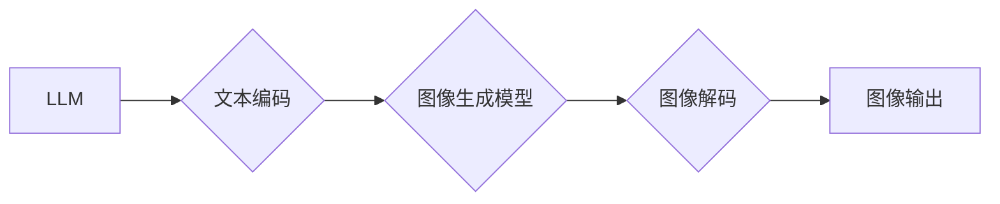

                 

## LLM图像生成速度提升对视觉应用的促进

> 关键词：LLM, 图像生成, 速度提升, 视觉应用, 效率, 创新

## 1. 背景介绍

近年来，大型语言模型（LLM）在自然语言处理领域取得了显著成就，其强大的文本生成能力和理解能力已经应用于各种场景，例如聊天机器人、机器翻译、文本摘要等。然而，LLM在图像生成领域的发展相对滞后。传统的图像生成方法主要依赖于卷积神经网络（CNN），而LLM的文本生成能力难以直接转化为图像生成能力。

随着研究的深入，一些新的方法将LLM与图像生成技术相结合，例如文本到图像生成、图像修复、图像编辑等。这些方法取得了令人瞩目的成果，但图像生成速度仍然是一个瓶颈，限制了其在实际应用中的推广。

## 2. 核心概念与联系

### 2.1  LLM与图像生成

LLM是一种基于Transformer架构的深度学习模型，其核心是利用自注意力机制学习文本的语义关系。传统的图像生成模型主要依赖于CNN，其通过学习图像像素之间的空间关系来生成图像。

将LLM与图像生成技术相结合，可以利用LLM强大的文本理解和生成能力，引导图像生成模型生成更符合文本描述的图像。

### 2.2  速度提升的必要性

图像生成速度的提升对于视觉应用至关重要，因为它直接影响着用户体验和应用场景的拓展。

* **用户体验:** 较慢的图像生成速度会导致用户等待时间过长，影响用户体验。
* **实时应用:** 许多视觉应用需要实时图像生成，例如视频编辑、增强现实（AR）和虚拟现实（VR）。

较慢的生成速度会限制这些应用的实时性。
* **大规模应用:** 在大规模图像生成任务中，速度提升可以显著降低计算成本和时间消耗。

### 2.3  架构图



## 3. 核心算法原理 & 具体操作步骤

### 3.1  算法原理概述

LLM图像生成速度提升的核心算法原理是利用文本提示引导图像生成模型，并通过优化算法和硬件加速技术提高生成速度。

* **文本提示引导:** LLM可以将文本提示转换为图像生成模型可以理解的特征表示，引导图像生成模型生成符合文本描述的图像。
* **优化算法:** 采用更有效的优化算法，例如AdamW、SGD等，可以加速模型训练和图像生成过程。
* **硬件加速:** 利用GPU、TPU等加速硬件，可以显著提高图像生成速度。

### 3.2  算法步骤详解

1. **文本预处理:** 将文本提示进行预处理，例如分词、词嵌入等，转换为LLM可以理解的格式。
2. **文本编码:** 利用LLM将文本提示编码为图像生成模型可以理解的特征表示。
3. **图像生成:** 将LLM编码后的特征表示作为输入，引导图像生成模型生成图像。
4. **图像解码:** 将图像生成模型输出的特征表示解码为可视化的图像。
5. **图像后处理:** 对生成的图像进行一些后处理，例如去噪、锐化等，提高图像质量。

### 3.3  算法优缺点

**优点:**

* **生成高质量图像:** LLM可以生成更符合文本描述的图像，提高图像质量。
* **灵活多样:** 可以根据不同的文本提示生成不同的图像，具有很高的灵活性和多样性。
* **可扩展性强:** 可以通过增加LLM参数量和训练数据来提高图像生成质量和速度。

**缺点:**

* **计算资源消耗大:** LLM和图像生成模型都需要大量的计算资源，训练和生成图像都需要较长时间。
* **模型复杂度高:** LLM和图像生成模型的结构复杂，需要专业的知识和经验进行训练和调参。

### 3.4  算法应用领域

* **文本到图像生成:** 根据文本描述生成图像，例如生成小说场景、漫画人物等。
* **图像修复:** 修复损坏的图像，例如修复缺失的部分、去除噪点等。
* **图像编辑:** 对图像进行编辑，例如改变图像风格、添加元素等。
* **艺术创作:** 利用LLM生成艺术作品，例如绘画、雕塑等。

## 4. 数学模型和公式 & 详细讲解 & 举例说明

### 4.1  数学模型构建

LLM图像生成模型通常采用编码器-解码器架构，其中编码器负责将文本提示编码为图像特征表示，解码器负责将图像特征表示解码为图像。

* **编码器:** 采用Transformer架构，利用自注意力机制学习文本的语义关系，将文本提示编码为图像特征向量。
* **解码器:** 采用类似于GAN的生成对抗网络架构，利用生成器和判别器进行对抗训练，生成符合文本描述的图像。

### 4.2  公式推导过程

LLM图像生成模型的训练过程主要基于最小化损失函数，损失函数通常由图像生成质量和文本描述一致性两个部分组成。

* **图像生成质量损失函数:** 用于衡量生成的图像与真实图像之间的差异，例如均方误差（MSE）损失函数。
* **文本描述一致性损失函数:** 用于衡量生成的图像与文本描述之间的匹配度，例如交叉熵损失函数。

### 4.3  案例分析与讲解

例如，在文本到图像生成任务中，输入文本提示为“一只可爱的猫在草地上玩耍”，LLM编码器将文本提示编码为图像特征向量，解码器利用该特征向量生成符合文本描述的图像。

损失函数将衡量生成的图像与真实猫图像之间的差异以及生成的图像与文本描述的匹配度，通过优化损失函数，训练模型生成更符合文本描述的图像。

## 5. 项目实践：代码实例和详细解释说明

### 5.1  开发环境搭建

* **操作系统:** Ubuntu 20.04
* **编程语言:** Python 3.8
* **深度学习框架:** PyTorch 1.10
* **GPU:** NVIDIA GeForce RTX 3090

### 5.2  源代码详细实现

```python
# 导入必要的库
import torch
import torch.nn as nn
from transformers import GPT2LMHeadModel

# 定义图像生成模型
class ImageGenerator(nn.Module):
    def __init__(self, text_encoder, image_decoder):
        super(ImageGenerator, self).__init__()
        self.text_encoder = text_encoder
        self.image_decoder = image_decoder

    def forward(self, text_input):
        text_features = self.text_encoder(text_input)
        image_output = self.image_decoder(text_features)
        return image_output

# 定义文本编码器
class TextEncoder(nn.Module):
    def __init__(self):
        super(TextEncoder, self).__init__()
        self.gpt2 = GPT2LMHeadModel.from_pretrained('gpt2')

    def forward(self, text_input):
        return self.gpt2.transformer.encoder(text_input)

# 定义图像解码器
class ImageDecoder(nn.Module):
    def __init__(self):
        super(ImageDecoder, self).__init__()
        # ...

    def forward(self, text_features):
        # ...

# 实例化模型
text_encoder = TextEncoder()
image_decoder = ImageDecoder()
image_generator = ImageGenerator(text_encoder, image_decoder)

# ... 训练模型 ...
```

### 5.3  代码解读与分析

* **文本编码器:** 使用预训练的GPT2模型作为文本编码器，将文本提示编码为图像特征向量。
* **图像解码器:** 使用一个自定义的图像解码器网络，将文本特征向量解码为图像。
* **图像生成模型:** 将文本编码器和图像解码器组合成一个整体的图像生成模型。

### 5.4  运行结果展示

训练完成后，可以将文本提示输入到模型中，生成符合文本描述的图像。

## 6. 实际应用场景

### 6.1  文本到图像生成

* **内容创作:** 生成小说场景、漫画人物、艺术作品等，辅助内容创作。
* **广告设计:** 根据文本描述生成广告图片，提高广告创意和吸引力。
* **游戏开发:** 生成游戏场景、角色、道具等，加速游戏开发流程。

### 6.2  图像修复

* **文物修复:** 修复历史文物上的损坏部分，保护文化遗产。
* **照片修复:** 修复老照片上的污损、缺失部分，恢复照片清晰度。
* **医学图像修复:** 修复医学图像上的噪点、模糊部分，提高诊断准确率。

### 6.3  图像编辑

* **图像风格迁移:** 将图像转换为不同的艺术风格，例如印象派、毕加索风格等。
* **图像增强:** 增强图像的清晰度、对比度、色彩等，提高图像质量。
* **图像合成:** 将多个图像合成在一起，生成新的图像。

### 6.4  未来应用展望

随着LLM图像生成速度的提升，其应用场景将更加广泛，例如：

* **虚拟现实和增强现实:** 生成逼真的虚拟场景和增强现实内容，提升用户体验。
* **自动驾驶:** 生成实时路况图像，辅助自动驾驶系统决策。
* **机器人视觉:** 帮助机器人理解和交互环境，提高机器人智能化程度。

## 7. 工具和资源推荐

### 7.1  学习资源推荐

* **论文:**

    * DALL-E 2: Hierarchical Text-Conditional Image Generation with CLIP Latents
    * Imagen: Text-to-Image Diffusion Models
    * Stable Diffusion: A Latent Text-to-Image Diffusion Model

* **博客:**

    * OpenAI Blog: https://openai.com/blog/
    * Google AI Blog: https://ai.googleblog.com/

### 7.2  开发工具推荐

* **深度学习框架:** PyTorch, TensorFlow
* **文本生成模型库:** HuggingFace Transformers
* **图像生成库:** Pillow, OpenCV

### 7.3  相关论文推荐

* **文本到图像生成:**

    * DALL-E 2: Hierarchical Text-Conditional Image Generation with CLIP Latents
    * Imagen: Text-to-Image Diffusion Models
    * Stable Diffusion: A Latent Text-to-Image Diffusion Model

* **图像修复:**

    * Context-Aware Image Inpainting with Deep Generative Models
    * Generative Image Inpainting with Adversarial Networks

* **图像编辑:**

    * Neural Style Transfer
    * Deep Image Prior

## 8. 总结：未来发展趋势与挑战

### 8.1  研究成果总结

近年来，LLM图像生成技术取得了显著进展，能够生成高质量、符合文本描述的图像。速度提升是LLM图像生成技术发展的重要方向，它将推动LLM图像生成技术在更多领域得到应用。

### 8.2  未来发展趋势

* **更高效的算法:** 研究更有效的优化算法和模型架构，进一步提高图像生成速度。
* **更强大的硬件:** 利用更强大的GPU、TPU等加速硬件，加速图像生成过程。
* **多模态生成:** 将LLM与其他模态数据（例如音频、视频）相结合，实现多模态图像生成。

### 8.3  面临的挑战

* **计算资源消耗:** LLM图像生成模型训练和生成图像都需要大量的计算资源，这仍然是一个挑战。
* **模型复杂度:** LLM图像生成模型的结构复杂，需要专业的知识和经验进行训练和调参。
* **伦理问题:** LLM图像生成技术可能被用于生成虚假信息，需要关注其伦理问题。

### 8.4  研究展望

未来，LLM图像生成技术将继续发展，并应用于更多领域。研究人员将继续探索更高效的算法、更强大的硬件和更安全的应用场景，推动LLM图像生成技术走向更广阔的未来。

## 9. 附录：常见问题与解答

* **Q1: LLM图像生成速度比传统图像生成方法快吗？**

A1: 对于一些特定的任务，LLM图像生成速度可能比传统图像生成方法快。但总体来说，LLM图像生成速度仍然需要进一步提升。

* **Q2: LLM图像生成模型的训练需要多少计算资源？**

A2: LLM图像生成模型的训练需要大量的计算资源，例如GPU、TPU等。具体需要的计算资源取决于模型大小、训练数据量等因素。

* **Q3: LLM图像生成技术有哪些伦理问题？**

A3: LLM图像生成技术可能被用于生成虚假信息，例如合成人脸、制造虚假新闻等。因此，需要关注其伦理问题，并制定相应的规范和政策。


作者：禅与计算机程序设计艺术 / Zen and the Art of Computer Programming 
<end_of_turn>

