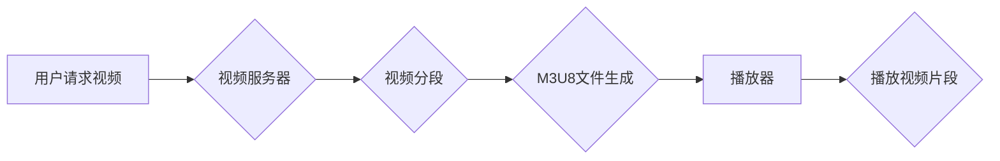

                 

## M3U8 播放列表格式：分段视频的索引和加载

> 关键词：M3U8, 分段视频, 播放列表, HTTP Live Streaming, HLS, 视频分段, 索引文件, 媒体流, 网络视频

## 1. 背景介绍

随着互联网带宽的不断提升和移动设备的普及，在线视频的观看需求日益增长。为了满足用户对高品质、流畅视频体验的需求，视频分段技术应运而生。视频分段技术将视频文件分割成多个小的片段，并通过HTTP协议进行传输，从而实现更灵活的视频播放和更低的网络延迟。M3U8文件作为一种常用的视频播放列表格式，在视频分段技术中扮演着至关重要的角色。

M3U8文件本质上是一个文本文件，它包含了视频片段的URL地址以及其他播放信息，例如视频码率、分辨率等。播放器通过解析M3U8文件，获取视频片段的URL地址，并依次下载和播放这些片段，从而实现流畅的视频播放体验。

## 2. 核心概念与联系

### 2.1  HTTP Live Streaming (HLS)

HLS是一种基于HTTP协议的直播和点播视频流传输技术，由苹果公司开发。HLS通过将视频文件分割成多个小的片段，并使用M3U8文件作为播放列表，实现视频的动态分段和传输。

### 2.2  M3U8 文件

M3U8文件是一种文本文件，它包含了视频片段的URL地址以及其他播放信息，例如视频码率、分辨率等。播放器通过解析M3U8文件，获取视频片段的URL地址，并依次下载和播放这些片段，从而实现流畅的视频播放体验。

### 2.3  视频分段

视频分段技术将视频文件分割成多个小的片段，并通过HTTP协议进行传输。视频分段技术可以提高视频播放的流畅度，降低网络延迟，并支持多种设备的视频播放。

**Mermaid 流程图**



## 3. 核心算法原理 & 具体操作步骤

### 3.1  算法原理概述

M3U8文件生成算法的核心原理是将视频文件分割成多个小的片段，并生成一个包含视频片段URL地址的索引文件。

**步骤：**

1. **视频编码和分段：** 将视频文件进行编码，并根据预设的片段大小分割成多个小的片段。
2. **片段信息存储：** 将每个片段的URL地址、时长、码率、分辨率等信息存储到M3U8文件中。
3. **M3U8文件生成：** 将存储的片段信息按照一定的格式组织成M3U8文件。

### 3.2  算法步骤详解

1. **视频文件预处理：** 首先需要将视频文件进行预处理，例如解码、格式转换等。
2. **视频分段：** 根据预设的片段大小，将视频文件分割成多个小的片段。片段大小可以根据网络带宽、设备性能等因素进行调整。
3. **片段信息提取：** 对于每个片段，提取其URL地址、时长、码率、分辨率等信息。
4. **M3U8文件格式化：** 将提取的片段信息按照M3U8文件格式进行组织。M3U8文件格式是一种文本格式，包含了以下信息：
    * **#EXTM3U:** 标识M3U8文件格式。
    * **#EXT-X-STREAM-INF:** 描述视频流的属性，例如码率、分辨率等。
    * **#EXTINF:** 描述视频片段的时长和属性。
    * **视频片段URL地址:** 指向每个视频片段的URL地址。
5. **M3U8文件生成：** 将格式化的片段信息写入到M3U8文件中。

### 3.3  算法优缺点

**优点：**

* **灵活性和适应性强：** 可以根据网络带宽、设备性能等因素动态调整视频片段大小和码率，实现更流畅的视频播放体验。
* **低延迟：** 视频片段的下载和播放可以并行进行，从而降低视频播放的延迟。
* **支持断点续传：** 如果视频播放中断，可以从中断点继续播放，无需重新下载整个视频文件。

**缺点：**

* **文件格式复杂：** M3U8文件格式相对复杂，需要播放器支持才能解析和播放。
* **网络带宽消耗：** 视频分段需要下载多个小的片段，可能会增加网络带宽消耗。

### 3.4  算法应用领域

M3U8文件和HLS技术广泛应用于以下领域：

* **直播视频：** 直播平台使用HLS技术将直播视频分段传输，实现流畅的直播体验。
* **点播视频：** 视频网站使用HLS技术将视频文件分段存储，支持多种设备的视频播放。
* **移动视频：** 移动设备使用HLS技术播放视频，可以根据网络带宽动态调整视频质量，实现流畅的视频播放体验。

## 4. 数学模型和公式 & 详细讲解 & 举例说明

### 4.1  数学模型构建

M3U8文件生成算法可以抽象为一个数学模型，其中视频文件被视为一个连续的信号，需要被分割成多个离散的片段。

**模型定义：**

* **V:** 视频文件
* **S:** 视频片段
* **n:** 视频片段数量
* **t:** 视频片段时长
* **f(t):** 视频片段分割函数

**模型描述：**

V = ⋃(i=1 to n) S(i)

其中，V表示视频文件，S(i)表示第i个视频片段。

### 4.2  公式推导过程

视频片段分割函数f(t)可以根据以下公式进行推导：

```
f(t) = floor(V.length / n)
```

其中，V.length表示视频文件的总长度，n表示视频片段数量。

**公式解释：**

* floor()函数表示向下取整。
* 该公式将视频文件的总长度除以视频片段数量，并向下取整，得到每个视频片段的长度。

### 4.3  案例分析与讲解

假设一个视频文件长度为100秒，需要分割成5个片段，则每个片段的长度为：

```
f(t) = floor(100 / 5) = 20
```

因此，视频文件将被分割成5个长度为20秒的片段。

## 5. 项目实践：代码实例和详细解释说明

### 5.1  开发环境搭建

* 操作系统：Windows/macOS/Linux
* 编程语言：Python
* 开发工具：VS Code/Sublime Text

### 5.2  源代码详细实现

```python
import os
import subprocess

def generate_m3u8(video_file, output_file, segment_duration=10):
    """
    生成M3U8播放列表文件。

    Args:
        video_file: 视频文件路径。
        output_file: M3U8文件路径。
        segment_duration: 视频片段时长，单位秒。
    """

    # 使用ffmpeg命令将视频文件分割成片段
    segment_command = f"ffmpeg -i {video_file} -f segment -segment_time {segment_duration} -c copy -reset_timestamps 1 {os.path.splitext(video_file)[0]}/%03d.ts"
    subprocess.run(segment_command, shell=True)

    # 生成M3U8文件
    with open(output_file, "w") as f:
        f.write("#EXTM3U\n")
        for i in range(1, 100):  # 遍历片段
            segment_url = f"{os.path.splitext(video_file)[0]}/{i:03d}.ts"
            if os.path.exists(segment_url):
                f.write(f"#EXTINF:{segment_duration},segment {i}\n{segment_url}\n")

# 示例用法
video_file = "input.mp4"
output_file = "output.m3u8"
generate_m3u8(video_file, output_file)
```

### 5.3  代码解读与分析

* 该代码使用Python语言实现M3U8文件生成功能。
* 首先使用ffmpeg命令将视频文件分割成多个片段，每个片段的时长由`segment_duration`参数控制。
* 然后，代码打开M3U8文件，并写入片段信息，包括片段时长和URL地址。

### 5.4  运行结果展示

运行该代码后，将生成一个名为`output.m3u8`的M3U8文件，该文件包含了视频片段的URL地址和播放信息。

## 6. 实际应用场景

### 6.1  直播平台

直播平台使用HLS技术将直播视频分段传输，实现流畅的直播体验。

### 6.2  视频网站

视频网站使用HLS技术将视频文件分段存储，支持多种设备的视频播放。

### 6.3  移动视频

移动设备使用HLS技术播放视频，可以根据网络带宽动态调整视频质量，实现流畅的视频播放体验。

### 6.4  未来应用展望

随着5G网络的普及和视频分辨率的提升，M3U8文件和HLS技术将在未来得到更广泛的应用，例如：

* **VR/AR视频直播：** HLS技术可以支持VR/AR视频的实时传输，实现沉浸式的虚拟现实体验。
* **超高清视频点播：** HLS技术可以支持超高清视频的点播播放，提供更清晰的视频画质。
* **智能视频分析：** M3U8文件可以包含视频片段的元数据信息，例如人物识别、场景分析等，为智能视频分析提供数据支持。

## 7. 工具和资源推荐

### 7.1  学习资源推荐

* **苹果官方文档：** https://developer.apple.com/streaming/
* **HLS技术博客文章：** https://blog.cloudflare.com/hls-streaming-explained/

### 7.2  开发工具推荐

* **ffmpeg：** https://ffmpeg.org/
* **VLC Media Player：** https://www.videolan.org/vlc/

### 7.3  相关论文推荐

* **HTTP Live Streaming：** https://www.usenix.org/system/files/conference/hotos2010/hotos10-paper-mcdonald.pdf

## 8. 总结：未来发展趋势与挑战

### 8.1  研究成果总结

M3U8文件和HLS技术已经成为视频分段和传输的标准方案，在直播、点播、移动视频等领域得到了广泛应用。

### 8.2  未来发展趋势

* **更低延迟：** 研究更先进的视频分段和传输算法，降低视频播放的延迟。
* **更高质量：** 支持更高分辨率和更丰富的视频格式，提供更优质的视频体验。
* **更智能：** 将人工智能技术融入视频分段和传输，实现更智能的视频分析和个性化推荐。

### 8.3  面临的挑战

* **网络带宽限制：** 视频分段需要下载多个小的片段，可能会增加网络带宽消耗。
* **设备性能差异：** 不同设备的性能差异可能会影响视频播放的流畅度。
* **安全性和隐私性：** 视频分段和传输过程中需要考虑安全性和隐私性问题。

### 8.4  研究展望

未来，M3U8文件和HLS技术将继续朝着更低延迟、更高质量、更智能的方向发展，为用户提供更流畅、更优质的视频体验。


## 9. 附录：常见问题与解答

### 9.1  Q1：M3U8文件和MP4文件有什么区别？

**A1：** M3U8文件是一种文本文件，它包含了视频片段的URL地址和播放信息，而MP4文件是一种视频容器格式，包含了视频和音频数据。

### 9.2  Q2：如何播放M3U8文件？

**A2：** 播放M3U8文件需要使用支持HLS技术的播放器，例如VLC Media Player、Safari浏览器等。

### 9.3  Q3：M3U8文件可以用于直播吗？

**A3：** 是的，M3U8文件和HLS技术可以用于直播视频的传输。

### 9.4  Q4：如何选择合适的视频片段时长？

**A4：** 视频片段时长需要根据网络带宽、设备性能等因素进行调整。一般来说，片段时长越短，网络延迟越低，但文件数量也会越多。


作者：禅与计算机程序设计艺术 / Zen and the Art of Computer Programming 
<end_of_turn>

