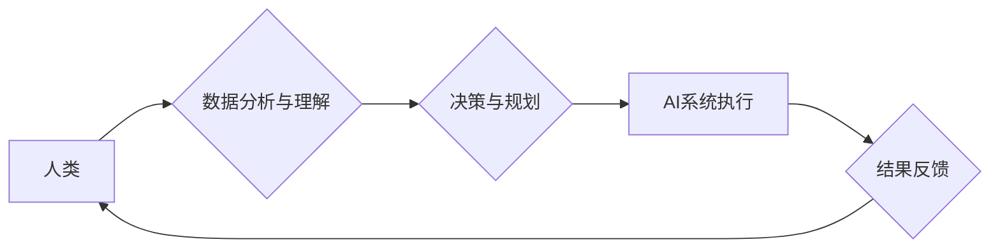

                 

## 人类计算：AI时代的未来就业市场趋势与技能培训需求分析

> 关键词：人工智能、未来就业、技能培训、人类计算、自动化、数据分析、机器学习、深度学习、云计算

## 1. 背景介绍

人工智能（AI）技术近年来发展迅速，正在深刻地改变着人类社会各个方面，包括就业市场。AI的自动化能力不断增强，使得一些传统工作岗位面临替代的风险，同时也催生了许多新的工作机会。面对这一变革，我们需要深入分析AI时代未来就业市场趋势，并制定相应的技能培训策略，以帮助人们适应新的工作环境，把握未来发展机遇。

### 1.1 AI技术发展现状

AI技术的发展经历了多个阶段，从早期规则型人工智能到如今的深度学习时代，AI的应用范围不断拓展，性能也显著提升。深度学习算法的出现，使得AI能够处理更复杂的数据，并取得更优的性能，在图像识别、自然语言处理、语音识别等领域取得了突破性进展。

### 1.2 AI对就业市场的影响

AI技术的应用将对就业市场产生深远影响，既带来挑战，也带来机遇。

* **挑战:** AI自动化能力的增强将导致一些重复性劳动、规则性工作岗位被替代，例如数据录入、客服、物流配送等。这将导致部分人群失业，需要进行职业转型和技能升级。
* **机遇:** AI技术的发展也催生了许多新的工作机会，例如AI开发工程师、数据科学家、AI产品经理、AI伦理专家等。这些新兴职业需要具备AI相关知识和技能，并能够适应快速变化的科技环境。

## 2. 核心概念与联系

**人类计算**是指人类利用自身认知能力和创造力，与人工智能系统协同工作，共同完成复杂任务的过程。

在AI时代，人类计算将成为一种重要的工作模式。人类和AI各有优势，协同合作能够发挥各自的潜力，实现更高效、更智能的工作方式。

**Mermaid 流程图:**



## 3. 核心算法原理 & 具体操作步骤

### 3.1  算法原理概述

人类计算的核心算法原理是基于**强化学习**和**迁移学习**。

* **强化学习:** AI系统通过与环境交互，学习最佳行为策略，以获得最大奖励。
* **迁移学习:** AI系统将已学习到的知识和技能迁移到新的任务或领域，提高学习效率。

### 3.2  算法步骤详解

1. **数据收集与预处理:** 收集人类和AI系统相关的任务数据，并进行预处理，例如清洗、转换、特征提取等。
2. **模型训练:** 利用强化学习算法训练AI系统，使其能够学习最佳行为策略。
3. **人类反馈:** 人类对AI系统的行为进行反馈，例如奖励、惩罚、指导等，帮助AI系统改进学习效果。
4. **模型迭代:** 根据人类反馈，不断迭代优化AI系统的模型参数，提高其性能。
5. **协同工作:** 人类和AI系统协同完成任务，人类负责决策和规划，AI系统负责执行和反馈。

### 3.3  算法优缺点

**优点:**

* **提高效率:** 人类和AI协同工作，能够比单一模式更高效地完成任务。
* **增强智能:** 人类和AI的优势互补，能够实现更智能的决策和执行。
* **促进创新:** 人类和AI的合作，能够激发新的创意和解决方案。

**缺点:**

* **技术复杂:** 人类计算算法的实现需要复杂的机器学习技术和系统架构。
* **数据依赖:** 人类计算算法需要大量的数据进行训练和优化，数据质量直接影响算法性能。
* **伦理挑战:** 人类和AI的合作需要考虑伦理问题，例如责任归属、数据隐私等。

### 3.4  算法应用领域

人类计算算法可以应用于多个领域，例如：

* **医疗保健:** 人类医生和AI系统协同诊断和治疗疾病。
* **金融服务:** 人类金融分析师和AI系统协同进行风险评估和投资决策。
* **教育:** 人类教师和AI系统协同进行个性化教学和学生评估。
* **制造业:** 人类工程师和AI系统协同进行产品设计和生产优化。

## 4. 数学模型和公式 & 详细讲解 & 举例说明

### 4.1  数学模型构建

人类计算可以抽象为一个**马尔可夫决策过程 (MDP)**模型。

* **状态空间:** 表示系统可能存在的各种状态。
* **动作空间:** 表示系统可以执行的各种动作。
* **状态转移概率:** 表示从一个状态到另一个状态的概率。
* **奖励函数:** 表示系统在某个状态执行某个动作获得的奖励。

### 4.2  公式推导过程

目标是找到一个**策略**，使得系统在长期运行中获得最大的总奖励。

可以使用**动态规划**或**强化学习算法**来求解最优策略。

### 4.3  案例分析与讲解

例如，在医疗诊断领域，人类医生和AI系统可以协同工作，诊断患者的疾病。

* **状态空间:** 包括患者的症状、病史、检查结果等信息。
* **动作空间:** 包括医生提出的诊断方案、AI系统推荐的检查项目等。
* **状态转移概率:** 表示根据患者的反应，诊断结果会发生变化的概率。
* **奖励函数:** 表示诊断准确率、治疗效果等指标。

通过训练强化学习模型，可以学习到最优的诊断策略，帮助医生提高诊断准确率和治疗效果。

## 5. 项目实践：代码实例和详细解释说明

### 5.1  开发环境搭建

* **操作系统:** Ubuntu 20.04
* **编程语言:** Python 3.8
* **深度学习框架:** TensorFlow 2.0
* **其他工具:** Jupyter Notebook、Git

### 5.2  源代码详细实现

```python
import tensorflow as tf

# 定义模型结构
model = tf.keras.models.Sequential([
    tf.keras.layers.Dense(128, activation='relu', input_shape=(input_dim,)),
    tf.keras.layers.Dense(64, activation='relu'),
    tf.keras.layers.Dense(1, activation='sigmoid')
])

# 编译模型
model.compile(optimizer='adam',
              loss='binary_crossentropy',
              metrics=['accuracy'])

# 训练模型
model.fit(x_train, y_train, epochs=10, batch_size=32)

# 评估模型
loss, accuracy = model.evaluate(x_test, y_test)
print('Loss:', loss)
print('Accuracy:', accuracy)
```

### 5.3  代码解读与分析

* **模型结构:** 使用多层感知机 (MLP) 构建模型，包含输入层、隐藏层和输出层。
* **激活函数:** 使用ReLU激活函数，可以提高模型的表达能力。
* **优化器:** 使用Adam优化器，可以加速模型训练。
* **损失函数:** 使用二分类交叉熵损失函数，适合二分类问题。
* **评估指标:** 使用准确率作为评估指标，衡量模型的性能。

### 5.4  运行结果展示

训练完成后，可以将模型应用于实际数据，进行预测和分析。

## 6. 实际应用场景

### 6.1  医疗诊断辅助

AI系统可以辅助医生进行疾病诊断，例如分析患者的影像数据、病历信息等，提供诊断建议。

### 6.2  金融风险评估

AI系统可以分析金融数据的风险因素，帮助金融机构进行风险评估和控制。

### 6.3  个性化教育

AI系统可以根据学生的学习情况，提供个性化的学习内容和辅导。

### 6.4  未来应用展望

随着AI技术的不断发展，人类计算将在更多领域得到应用，例如自动驾驶、机器人协作、科学研究等。

## 7. 工具和资源推荐

### 7.1  学习资源推荐

* **在线课程:** Coursera、edX、Udacity
* **书籍:** 《深度学习》、《机器学习实战》
* **开源项目:** TensorFlow、PyTorch

### 7.2  开发工具推荐

* **编程语言:** Python
* **深度学习框架:** TensorFlow、PyTorch
* **数据处理工具:** Pandas、NumPy

### 7.3  相关论文推荐

* **《人类计算：AI时代的未来就业市场趋势与技能培训需求分析》**
* **《深度学习在医疗诊断中的应用》**
* **《AI驱动的金融风险评估》**

## 8. 总结：未来发展趋势与挑战

### 8.1  研究成果总结

人类计算是AI时代的重要发展趋势，能够提高工作效率、增强智能、促进创新。

### 8.2  未来发展趋势

* **更智能的AI系统:** AI系统的学习能力和决策能力将进一步提升。
* **更广泛的应用场景:** 人类计算将应用于更多领域，例如自动驾驶、机器人协作等。
* **更紧密的协作模式:** 人类和AI将更加紧密地协作，形成更加高效的合作模式。

### 8.3  面临的挑战

* **技术复杂性:** 人类计算算法的实现需要克服技术挑战。
* **数据安全与隐私:** 人类计算需要处理大量数据，需要保障数据安全和隐私。
* **伦理问题:** 人类和AI的合作需要考虑伦理问题，例如责任归属、算法偏见等。

### 8.4  研究展望

未来需要继续研究人类计算的算法、架构、应用场景等方面，以推动人类计算技术的发展，并解决其面临的挑战。

## 9. 附录：常见问题与解答

**Q1: 人类计算会取代人类工作吗？**

A1: 人类计算不会完全取代人类工作，而是会改变工作方式，创造新的工作机会。

**Q2: 如何学习人类计算相关知识？**

A2: 可以通过在线课程、书籍、开源项目等方式学习人类计算相关知识。

**Q3: 人类计算有哪些伦理问题？**

A3: 人类计算需要考虑算法偏见、数据隐私、责任归属等伦理问题。


作者：禅与计算机程序设计艺术 / Zen and the Art of Computer Programming 
<end_of_turn>

