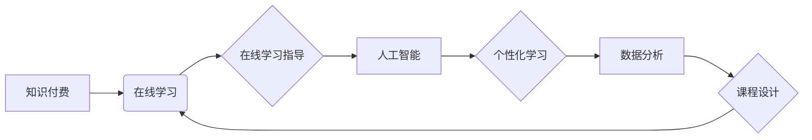

                 

## 如何利用知识付费实现在线学习与在线学习指导？

> 关键词：知识付费、在线学习、学习指导、人工智能、个性化学习、数据分析、课程设计

## 1. 背景介绍

在线教育的蓬勃发展为人们提供了便捷、灵活的学习方式。然而，传统的在线学习模式往往缺乏个性化指导和互动性，难以满足不同学习者个性化的需求。知识付费模式的兴起为在线学习注入新的活力，它通过付费获取优质课程和学习资源，并提供更深入的学习指导和互动交流，有效提升了在线学习的效率和效果。

近年来，人工智能技术的发展为知识付费在线学习提供了强大的技术支撑。人工智能可以帮助构建个性化学习路径、提供智能化的学习指导、分析学习者的学习状态，并根据数据反馈不断优化课程内容和学习体验。

## 2. 核心概念与联系

**2.1 知识付费**

知识付费是指通过付费获取知识、技能和服务的商业模式。它打破了传统知识传播的壁垒，让知识生产者和知识消费者能够直接连接，实现知识的价值交换。

**2.2 在线学习**

在线学习是指利用互联网技术进行的远程教育，不受时间和空间限制，可以随时随地学习。它包括各种形式的在线课程、学习平台、在线辅导等。

**2.3 在线学习指导**

在线学习指导是指在在线学习过程中，为学习者提供个性化的学习建议、答疑解惑、学习进度跟踪等服务，帮助学习者更好地理解知识、掌握技能，提高学习效率。

**2.4 人工智能**

人工智能是指模拟人类智能行为的计算机系统，包括机器学习、深度学习、自然语言处理等技术。

**2.5 个性化学习**

个性化学习是指根据每个学习者的学习目标、学习风格、知识水平等特点，定制化的学习路径和学习内容。

**2.6 数据分析**

数据分析是指通过收集、整理、分析学习者的学习数据，例如学习进度、学习行为、学习效果等，以发现学习规律、优化学习策略。

**2.7 课程设计**

课程设计是指根据学习目标、学习内容、学习方式等因素，精心设计课程结构、学习内容、学习活动等，以提高课程的教学效果。

**核心概念与联系流程图**



## 3. 核心算法原理 & 具体操作步骤

**3.1 算法原理概述**

知识付费在线学习平台的核心算法主要包括：

* **推荐算法:** 根据用户的学习历史、兴趣偏好、学习目标等信息，推荐个性化的课程和学习资源。
* **学习进度跟踪算法:** 跟踪用户的学习进度，识别学习瓶颈，并提供相应的学习建议和支持。
* **智能化答疑算法:** 利用自然语言处理技术，自动识别用户的学习问题，并提供智能化的解答和指导。
* **个性化学习路径算法:** 根据用户的学习能力、学习风格、学习目标等特点，构建个性化的学习路径，帮助用户高效地掌握知识和技能。

**3.2 算法步骤详解**

**推荐算法:**

1. **数据收集:** 收集用户的学习历史、兴趣偏好、学习目标等信息。
2. **特征提取:** 从用户的学习数据中提取特征，例如学习科目、学习时长、学习成绩等。
3. **模型训练:** 利用机器学习算法，训练推荐模型，例如协同过滤算法、内容基准算法等。
4. **推荐结果:** 根据用户的特征和模型预测，推荐个性化的课程和学习资源。

**学习进度跟踪算法:**

1. **学习行为记录:** 记录用户的学习行为，例如学习时间、学习内容、学习进度等。
2. **学习状态分析:** 分析用户的学习行为数据，识别学习瓶颈和学习趋势。
3. **学习建议提供:** 根据用户的学习状态，提供相应的学习建议和支持，例如推荐相关学习资源、提供学习指导等。

**智能化答疑算法:**

1. **问题识别:** 利用自然语言处理技术，识别用户的学习问题。
2. **知识库查询:** 查询知识库，寻找与用户问题相关的答案。
3. **答案生成:** 根据知识库查询结果，生成智能化的答案和指导。

**个性化学习路径算法:**

1. **学习能力评估:** 通过测试和分析用户的学习能力，例如学习速度、学习理解能力等。
2. **学习风格分析:** 通过观察用户的学习行为，识别用户的学习风格，例如视觉学习、听觉学习等。
3. **学习目标设定:** 与用户沟通，确定用户的学习目标和期望。
4. **学习路径构建:** 根据用户的学习能力、学习风格、学习目标等特点，构建个性化的学习路径。

**3.3 算法优缺点**

**优点:**

* **个性化:** 可以根据用户的特点，提供个性化的学习建议和支持。
* **效率:** 可以帮助用户更高效地学习，节省学习时间和精力。
* **互动性:** 可以增加用户的学习兴趣和参与度。

**缺点:**

* **数据依赖:** 需要大量的学习数据来训练算法，数据质量直接影响算法效果。
* **算法复杂:** 算法的开发和维护需要专业的技术人员。
* **伦理问题:** 需要关注算法的公平性、透明性和可解释性等伦理问题。

**3.4 算法应用领域**

* 在线教育平台
* 在线学习指导平台
* 个人学习工具
* 企业培训系统

## 4. 数学模型和公式 & 详细讲解 & 举例说明

**4.1 数学模型构建**

推荐算法通常使用协同过滤算法，其核心思想是基于用户的相似度或物品的相似度进行推荐。

**协同过滤算法模型:**

$$
R(u, i) = \mu + b_u + b_i + \epsilon_{u, i}
$$

其中:

* $R(u, i)$ 表示用户 $u$ 对物品 $i$ 的评分。
* $\mu$ 表示全局平均评分。
* $b_u$ 表示用户 $u$ 的偏差。
* $b_i$ 表示物品 $i$ 的偏差。
* $\epsilon_{u, i}$ 表示评分误差。

**4.2 公式推导过程**

协同过滤算法的目标是预测用户对物品的评分，可以通过最小化评分误差来训练模型。

**损失函数:**

$$
L = \sum_{u, i} (R(u, i) - \hat{R}(u, i))^2
$$

其中:

* $\hat{R}(u, i)$ 表示模型预测的用户对物品的评分。

**优化算法:**

可以使用梯度下降算法来优化模型参数，例如用户偏差 $b_u$ 和物品偏差 $b_i$。

**4.3 案例分析与讲解**

假设有一个电影推荐系统，用户 $u$ 对电影 $i$ 的评分为 4 分，而模型预测的用户对电影 $i$ 的评分为 3.5 分。则评分误差为 0.5，损失函数会根据这个误差更新模型参数，使得模型预测的评分更接近用户的真实评分。

## 5. 项目实践：代码实例和详细解释说明

**5.1 开发环境搭建**

* Python 3.x
* TensorFlow 或 PyTorch
* Jupyter Notebook

**5.2 源代码详细实现**

```python
# 导入必要的库
import tensorflow as tf

# 定义模型
model = tf.keras.Sequential([
    tf.keras.layers.Dense(64, activation='relu', input_shape=(n_features,)),
    tf.keras.layers.Dense(1)
])

# 编译模型
model.compile(optimizer='adam', loss='mse')

# 训练模型
model.fit(X_train, y_train, epochs=10)

# 预测
predictions = model.predict(X_test)
```

**5.3 代码解读与分析**

* 首先，导入必要的库，例如 TensorFlow。
* 然后，定义一个简单的深度学习模型，包含一个全连接层和一个输出层。
* 接着，编译模型，选择优化器和损失函数。
* 接下来，训练模型，使用训练数据进行模型训练。
* 最后，使用训练好的模型对测试数据进行预测。

**5.4 运行结果展示**

运行代码后，可以得到模型的训练结果和预测结果，例如模型的损失函数值、准确率等指标。

## 6. 实际应用场景

**6.1 在线教育平台**

知识付费在线学习平台可以利用人工智能技术，为用户提供个性化的学习建议、智能化的答疑服务、个性化的学习路径等，提升用户学习体验和学习效果。

**6.2 在线学习指导平台**

在线学习指导平台可以利用人工智能技术，为用户提供一对一或小班制的在线学习指导，帮助用户更好地理解知识、掌握技能。

**6.3 个人学习工具**

个人学习工具可以利用人工智能技术，根据用户的学习习惯和学习目标，推荐个性化的学习资源，帮助用户更高效地学习。

**6.4 未来应用展望**

未来，人工智能技术将更加深入地融入知识付费在线学习，例如：

* 更智能化的学习推荐系统，能够根据用户的学习状态、学习目标、学习风格等多方面因素，提供更精准的学习建议。
* 更个性化的学习内容，能够根据用户的学习进度、学习能力、学习偏好等特点，定制化的学习内容。
* 更丰富的学习互动方式，例如虚拟现实、增强现实等技术，可以为用户提供更沉浸式的学习体验。

## 7. 工具和资源推荐

**7.1 学习资源推荐**

* **在线学习平台:** Coursera, edX, Udemy, Khan Academy
* **人工智能学习资源:** TensorFlow 官方文档, PyTorch 官方文档, fast.ai

**7.2 开发工具推荐**

* **Python:** Python 是一种流行的编程语言，广泛应用于人工智能领域。
* **TensorFlow:** TensorFlow 是一个开源的机器学习框架，提供丰富的机器学习算法和工具。
* **PyTorch:** PyTorch 是另一个开源的机器学习框架，以其灵活性和易用性而闻名。

**7.3 相关论文推荐**

* **Collaborative Filtering for Recommender Systems**
* **Deep Learning for Recommender Systems**
* **Personalized Learning with Artificial Intelligence**

## 8. 总结：未来发展趋势与挑战

**8.1 研究成果总结**

知识付费在线学习与人工智能技术的结合，为在线教育带来了新的发展机遇。人工智能技术可以帮助构建个性化学习路径、提供智能化的学习指导、分析学习者的学习状态，并根据数据反馈不断优化课程内容和学习体验。

**8.2 未来发展趋势**

未来，知识付费在线学习将朝着更加个性化、智能化、互动化的方向发展。人工智能技术将更加深入地融入在线学习，例如：

* 更智能化的学习推荐系统
* 更个性化的学习内容
* 更丰富的学习互动方式

**8.3 面临的挑战**

知识付费在线学习也面临一些挑战，例如：

* 数据隐私保护
* 算法公平性
* 人工智能伦理问题

**8.4 研究展望**

未来研究方向包括：

* 开发更精准、更智能的学习推荐算法
* 设计更个性化、更有效的学习内容
* 探索人工智能在在线学习中的更多应用场景
* 关注人工智能在在线学习中的伦理问题，确保其公平、透明、可解释

## 9. 附录：常见问题与解答

**9.1 如何选择合适的知识付费课程？**

* 确定自己的学习目标和需求
* 阅读课程介绍和评论
* 了解课程老师的背景和教学经验
* 尝试课程的免费试听

**9.2 如何提高在线学习的效率？**

* 制定学习计划，并坚持执行
* 营造良好的学习环境
* 积极参与学习互动
* 定期回顾学习内容，巩固知识


作者：禅与计算机程序设计艺术 / Zen and the Art of Computer Programming 
<end_of_turn>

