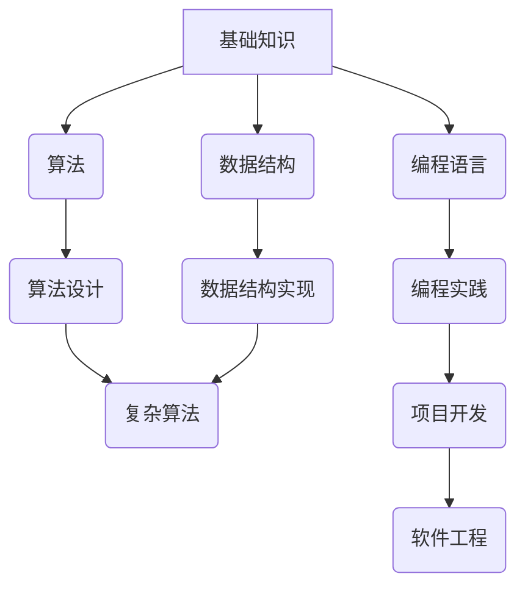

                 

## 如何打造高效的程序员知识课程

> 关键词：程序员培训，知识课程，编程教学，学习效率，实践项目，代码阅读，算法设计，数据结构，软件工程

### 1. 背景介绍

在当今科技飞速发展的时代，程序员的需求量持续增长，而高效的程序员知识课程显得尤为重要。传统的编程教学模式往往注重理论知识的灌输，缺乏实践操作和项目实战的环节，导致学习效果不佳，难以培养出具备实际应用能力的优秀程序员。

高效的程序员知识课程应注重以下几个方面：

* **实践导向:** 将理论知识与实际项目相结合，让学员在动手实践中学习和理解编程知识。
* **循序渐进:** 从基础知识开始，逐步深入，避免学员学习过程中出现知识断层和理解障碍。
* **个性化定制:** 针对不同学员的学习水平和兴趣爱好，提供个性化的学习路径和内容。
* **互动交流:** 鼓励学员之间进行交流学习，共同解决问题，提升学习兴趣和效果。

### 2. 核心概念与联系

高效的程序员知识课程需要构建一个清晰的知识体系，将各个编程概念和技术联系起来，形成一个完整的学习框架。

**核心概念:**

* **算法:** 解决特定问题的一系列步骤或指令。
* **数据结构:** 用于存储和组织数据的结构，例如数组、链表、树、图等。
* **编程语言:** 用于编写程序的符号系统，例如Python、Java、C++等。
* **软件工程:** 软件开发的系统化方法论，包括需求分析、设计、编码、测试、维护等环节。

**知识体系架构:**



### 3. 核心算法原理 & 具体操作步骤

**3.1 算法原理概述**

算法是解决特定问题的一系列步骤或指令。一个好的算法应具有以下特点：

* **确定性:** 对于给定的输入，算法必须产生唯一的输出。
* **有限性:** 算法必须在有限的时间内完成执行。
* **有效性:** 算法的每一步操作都必须是可执行的。

**3.2 算法步骤详解**

以**冒泡排序**算法为例，详细说明其步骤：

1. 比较相邻的两个元素，如果顺序错误，则交换它们的位置。
2. 重复步骤1，直到整个数组排序完成。

**3.3 算法优缺点**

**冒泡排序**算法的优点：

* 实现简单，易于理解。
* 稳定排序，相等元素的相对顺序不会改变。

**冒泡排序**算法的缺点：

* 时间复杂度较高，效率较低。
* 不适合处理大规模数据。

**3.4 算法应用领域**

**冒泡排序**算法应用于需要简单易实现的排序场景，例如：

* 对小型数据进行排序。
* 用于教学演示排序算法原理。

### 4. 数学模型和公式 & 详细讲解 & 举例说明

**4.1 数学模型构建**

**冒泡排序**算法的时间复杂度可以用数学模型表示：

* 最坏情况和平均情况的时间复杂度为 O(n^2)，其中n为数组长度。

**4.2 公式推导过程**

时间复杂度 O(n^2) 的推导过程如下：

* 算法需要进行 n-1 轮比较。
* 每轮比较需要进行 n-i 次交换 (i 为当前轮数)，其中 i 从 1 到 n-1。
* 因此，总共需要进行 (n-1) * (n-1) = O(n^2) 次比较和交换操作。

**4.3 案例分析与讲解**

对于一个长度为 5 的数组 [5, 1, 4, 2, 8]，**冒泡排序**算法需要进行 4 轮比较，每轮比较需要进行 4、3、2、1 次交换操作，总共需要进行 4 * 4 + 3 * 3 + 2 * 2 + 1 * 1 = 30 次比较和交换操作。

### 5. 项目实践：代码实例和详细解释说明

**5.1 开发环境搭建**

使用 Python 语言进行 **冒泡排序** 算法的实现，需要搭建 Python 开发环境。

* 安装 Python 解释器：https://www.python.org/downloads/

* 安装代码编辑器：例如 VS Code、PyCharm 等。

**5.2 源代码详细实现**

```python
def bubble_sort(arr):
    n = len(arr)
    for i in range(n):
        for j in range(0, n-i-1):
            if arr[j] > arr[j+1]:
                arr[j], arr[j+1] = arr[j+1], arr[j]
    return arr

# 测试代码
arr = [5, 1, 4, 2, 8]
sorted_arr = bubble_sort(arr)
print(f"排序后的数组: {sorted_arr}")
```

**5.3 代码解读与分析**

* 函数 `bubble_sort(arr)` 接受一个数组 `arr` 作为输入参数。
* 外层循环 `for i in range(n)` 控制排序轮数，每次循环将最大的元素“冒泡”到数组末尾。
* 内层循环 `for j in range(0, n-i-1)` 比较相邻元素，如果顺序错误，则交换它们的位置。
* 函数返回排序后的数组 `sorted_arr`。

**5.4 运行结果展示**

```
排序后的数组: [1, 2, 4, 5, 8]
```

### 6. 实际应用场景

**6.1 数据排序**

**冒泡排序**算法可以用于对数据进行排序，例如：

* 对学生成绩进行升序或降序排序。
* 对商品价格进行排序，方便用户筛选。

**6.2 算法学习**

**冒泡排序**算法是一种简单的排序算法，常用于教学演示排序算法的基本原理。

**6.3 其他应用场景**

**冒泡排序**算法还可以应用于其他场景，例如：

* 对链表进行排序。
* 对图形数据进行排序。

**6.4 未来应用展望**

随着人工智能和机器学习的发展，**冒泡排序**算法可能会被更先进的排序算法所取代，但在某些特定场景下，它仍然具有应用价值。

### 7. 工具和资源推荐

**7.1 学习资源推荐**

* **书籍:** 《算法导论》
* **在线课程:** Coursera、edX 等平台上的算法课程
* **网站:** GeeksforGeeks、LeetCode 等网站提供算法练习和学习资源

**7.2 开发工具推荐**

* **代码编辑器:** VS Code、PyCharm、Sublime Text 等
* **调试工具:** pdb、GDB 等

**7.3 相关论文推荐**

* **冒泡排序算法的改进与优化**
* **算法复杂度分析与比较**

### 8. 总结：未来发展趋势与挑战

**8.1 研究成果总结**

高效的程序员知识课程需要注重实践导向、循序渐进、个性化定制和互动交流。

**8.2 未来发展趋势**

未来程序员知识课程将更加注重以下方面：

* **人工智能辅助学习:** 利用人工智能技术个性化推荐学习内容、自动评估学习效果。
* **虚拟现实和增强现实技术:** 通过虚拟现实和增强现实技术，提供沉浸式的编程学习体验。
* **云计算和在线学习:** 利用云计算平台，提供随时随地学习的在线课程。

**8.3 面临的挑战**

* 如何有效地将理论知识与实践操作相结合。
* 如何根据不同学员的学习水平和兴趣爱好提供个性化的学习路径。
* 如何提高课程的互动性和趣味性，激发学员的学习兴趣。

**8.4 研究展望**

未来研究将继续探索新的编程教学方法和技术，以培养出更加优秀的程序员人才。

### 9. 附录：常见问题与解答

**常见问题:**

* 如何选择合适的编程语言学习？
* 如何提高编程效率？
* 如何解决编程中的常见问题？

**解答:**

* 选择编程语言时，应考虑自身兴趣、学习目标和行业需求。
* 提高编程效率可以通过学习算法设计、数据结构和代码优化技巧。
* 解决编程问题可以通过查阅文档、搜索网络、寻求他人帮助等方式。


作者：禅与计算机程序设计艺术 / Zen and the Art of Computer Programming 
<end_of_turn>

