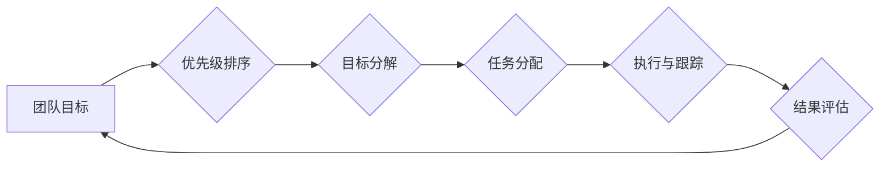

                 

## 巴菲特目标管理法则的团队应用

> 关键词：巴菲特目标管理法则、团队目标管理、OKR、优先级排序、执行力提升、团队协作、绩效管理

## 1. 背景介绍

在当今瞬息万变的科技时代，团队协作和高效执行力已成为企业成功的关键因素。如何有效地制定目标、分配任务、衡量成果，并激发团队成员的积极性和创造力，是每个科技团队面临的共同挑战。

巴菲特目标管理法则，源于著名投资大师沃伦·巴菲特的投资理念，强调长期价值、聚焦核心竞争力、并通过明确的目标和严格的执行力来实现卓越的成果。近年来，巴菲特目标管理法则逐渐被应用于团队管理领域，并取得了显著的成功。

## 2. 核心概念与联系

巴菲特目标管理法则的核心概念包括：

* **长期价值:** 团队目标应以长期价值为导向，而非短期利益。
* **聚焦核心竞争力:** 团队应专注于自身的核心优势，并围绕核心竞争力制定目标。
* **明确目标:** 目标应清晰、具体、可衡量、可实现和有时间限制。
* **严格执行力:** 团队成员应严格执行目标，并不断优化执行流程。

**Mermaid 流程图:**



## 3. 核心算法原理 & 具体操作步骤

### 3.1  算法原理概述

巴菲特目标管理法则的核心算法原理是基于“优先级排序”和“目标分解”的迭代执行流程。

* **优先级排序:** 团队首先要对所有目标进行优先级排序，确定哪些目标是最重要的，哪些目标可以暂时搁置。
* **目标分解:** 将高优先级目标分解成更小的、可执行的任务。
* **任务分配:** 将任务分配给合适的团队成员，并明确每个成员的责任和目标。
* **执行与跟踪:** 团队成员严格执行任务，并定期跟踪进度，及时调整计划。
* **结果评估:** 定期评估目标的完成情况，并根据结果进行调整和优化。

### 3.2  算法步骤详解

1. **团队目标设定:** 团队成员共同参与，制定团队的长期目标和短期目标。
2. **优先级排序:** 使用“重要性-紧急性矩阵”等方法，对目标进行优先级排序。
3. **目标分解:** 将高优先级目标分解成更小的、可执行的任务。
4. **任务分配:** 根据成员的技能和经验，将任务分配给合适的成员。
5. **执行与跟踪:** 团队成员严格执行任务，并使用项目管理工具跟踪进度。
6. **定期评估:** 定期评估目标的完成情况，并根据结果进行调整和优化。

### 3.3  算法优缺点

**优点:**

* 能够帮助团队聚焦核心目标，提高执行力。
* 能够促进团队成员之间的协作和沟通。
* 能够帮助团队成员更好地理解自己的角色和责任。

**缺点:**

* 需要团队成员投入大量的时间和精力进行目标设定和执行。
* 如果目标设定不当，可能会导致团队成员的士气低落。
* 需要定期评估目标的完成情况，并进行调整，这可能会增加团队的工作量。

### 3.4  算法应用领域

巴菲特目标管理法则适用于各种类型的团队，包括：

* 软件开发团队
* 产品设计团队
* 市场营销团队
* 销售团队
* 管理团队

## 4. 数学模型和公式 & 详细讲解 & 举例说明

巴菲特目标管理法则本身并不依赖于复杂的数学模型，但我们可以使用一些数学工具来辅助目标设定和评估。

### 4.1  数学模型构建

我们可以使用“重要性-紧急性矩阵”来构建目标优先级排序的数学模型。

**矩阵定义:**

* **重要性:** 指目标对团队长期目标的贡献程度。
* **紧急性:** 指目标需要在短期内完成的程度。

**矩阵划分:**

* **第一象限 (重要且紧急):** 需要立即处理的目标。
* **第二象限 (重要但不紧急):** 需要计划和安排的时间。
* **第三象限 (紧急但不重要):** 可以委托他人处理。
* **第四象限 (不重要也不紧急):** 可以忽略的目标。

### 4.2  公式推导过程

我们可以使用以下公式来计算目标的优先级:

**优先级 = 重要性 * 紧急性**

其中，

* 重要性取值范围为0-1，紧急性取值范围为0-1。

### 4.3  案例分析与讲解

假设一个软件开发团队需要完成以下任务:

* **任务A:** 修复一个严重漏洞，影响用户数据安全。
* **任务B:** 开发一个新的功能，提升用户体验。
* **任务C:** 整理代码文档，提高代码可读性。

根据“重要性-紧急性矩阵”，我们可以分析任务的优先级:

* **任务A:** 重要性=1，紧急性=1，优先级=1
* **任务B:** 重要性=1，紧急性=0，优先级=0
* **任务C:** 重要性=0，紧急性=0，优先级=0

因此，团队应该优先完成任务A，其次是任务B，最后是任务C。

## 5. 项目实践：代码实例和详细解释说明

### 5.1  开发环境搭建

为了演示巴菲特目标管理法则的应用，我们可以使用以下开发环境:

* 操作系统: Windows/macOS/Linux
* 编程语言: Python
* 项目管理工具: Trello/Asana/Jira

### 5.2  源代码详细实现

```python
# 目标管理工具示例代码

class Goal:
    def __init__(self, name, importance, urgency):
        self.name = name
        self.importance = importance
        self.urgency = urgency

    def calculate_priority(self):
        return self.importance * self.urgency

# 创建目标实例
goal_a = Goal("修复漏洞", 1, 1)
goal_b = Goal("开发新功能", 1, 0)
goal_c = Goal("整理代码", 0, 0)

# 计算目标优先级
priority_a = goal_a.calculate_priority()
priority_b = goal_b.calculate_priority()
priority_c = goal_c.calculate_priority()

# 打印目标优先级
print(f"{goal_a.name}: 优先级 = {priority_a}")
print(f"{goal_b.name}: 优先级 = {priority_b}")
print(f"{goal_c.name}: 优先级 = {priority_c}")
```

### 5.3  代码解读与分析

这段代码定义了一个 `Goal` 类，用于表示一个目标。每个目标都有一个名称、重要性和紧急性。

`calculate_priority()` 方法计算目标的优先级，并返回优先级值。

代码示例演示了如何创建目标实例，并计算目标的优先级。

### 5.4  运行结果展示

```
修复漏洞: 优先级 = 1
开发新功能: 优先级 = 0
整理代码: 优先级 = 0
```

运行结果表明，修复漏洞的优先级最高，其次是开发新功能，最后是整理代码。

## 6. 实际应用场景

巴菲特目标管理法则在软件开发团队的实际应用场景中非常广泛。

* **产品开发:** 团队可以使用巴菲特目标管理法则来制定产品开发路线图，并优先开发具有核心竞争力的功能。
* **项目管理:** 团队可以使用巴菲特目标管理法则来分解项目任务，并分配给合适的成员，确保项目按计划顺利完成。
* **团队协作:** 巴菲特目标管理法则可以促进团队成员之间的协作和沟通，帮助团队成员更好地理解自己的角色和责任。

### 6.4  未来应用展望

随着科技发展和团队管理模式的不断演进，巴菲特目标管理法则的应用场景将会更加广泛。

* **人工智能辅助:** 可以利用人工智能技术，自动分析目标重要性和紧急性，并提供更精准的优先级排序建议。
* **个性化目标管理:** 可以根据团队成员的个人能力和目标，制定个性化的目标管理方案。
* **跨团队协作:** 可以将巴菲特目标管理法则应用于跨团队协作，帮助不同团队更好地协调和合作。

## 7. 工具和资源推荐

### 7.1  学习资源推荐

* **巴菲特投资理念书籍:** 《聪明的投资者》、《巴菲特传》
* **目标管理书籍:** 《OKR: 目标与关键成果》
* **在线课程:** Coursera、Udemy等平台提供目标管理相关的在线课程。

### 7.2  开发工具推荐

* **项目管理工具:** Trello、Asana、Jira
* **协作工具:** Slack、Microsoft Teams
* **代码管理工具:** Git、GitHub

### 7.3  相关论文推荐

* **目标管理与绩效:** “The Impact of Goal Setting on Performance”
* **巴菲特投资理念:** “The Psychology of Warren Buffett”

## 8. 总结：未来发展趋势与挑战

### 8.1  研究成果总结

巴菲特目标管理法则在团队管理领域取得了显著的成功，能够帮助团队聚焦核心目标，提高执行力，并促进团队成员之间的协作和沟通。

### 8.2  未来发展趋势

未来，巴菲特目标管理法则将会更加智能化、个性化和协作化。

* **人工智能辅助:** 人工智能技术将被用于自动分析目标重要性和紧急性，并提供更精准的优先级排序建议。
* **个性化目标管理:** 将根据团队成员的个人能力和目标，制定个性化的目标管理方案。
* **跨团队协作:** 将巴菲特目标管理法则应用于跨团队协作，帮助不同团队更好地协调和合作。

### 8.3  面临的挑战

* **目标设定难度:** 如何设定清晰、具体、可衡量、可实现和有时间限制的目标仍然是一个挑战。
* **执行力不足:** 即使设定了明确的目标，也需要团队成员严格执行，这需要克服惰性和拖延的倾向。
* **团队文化建设:** 需要建立一种以目标为导向的团队文化，鼓励团队成员积极参与目标设定和执行。

### 8.4  研究展望

未来研究方向包括:

* **人工智能辅助目标管理:** 开发更智能的算法，能够自动分析目标重要性和紧急性，并提供更精准的优先级排序建议。
* **个性化目标管理系统:** 开发能够根据团队成员的个人能力和目标，制定个性化的目标管理方案的系统。
* **跨团队协作目标管理:** 研究如何将巴菲特目标管理法则应用于跨团队协作，帮助不同团队更好地协调和合作。

## 9. 附录：常见问题与解答

**Q1: 如何设定明确的目标？**

**A1:** 目标应该遵循 SMART 原则：

* **Specific (具体):** 目标应该明确具体，避免模糊不清。
* **Measurable (可衡量):** 目标应该能够量化，以便于评估进度和成果。
* **Achievable (可实现):** 目标应该具有可实现性，不要设定过高的目标。
* **Relevant (相关):** 目标应该与团队的长期目标相关，并有助于实现团队目标。
* **Time-bound (有时间限制):** 目标应该设定一个明确的完成时间，以便于督促执行。

**Q2: 如何提高团队执行力？**

**A2:** 提高团队执行力需要从以下几个方面入手:

* **明确责任:** 每个成员都应该清楚自己的职责和目标。
* **定期跟踪进度:** 定期跟踪目标的完成进度，并及时调整计划。
* **建立激励机制:** 为完成目标的成员提供奖励和认可。
* **营造良好的工作氛围:** 鼓励团队成员之间的沟通和协作，营造积极向上的工作氛围。


作者：禅与计算机程序设计艺术 / Zen and the Art of Computer Programming 
<end_of_turn>

