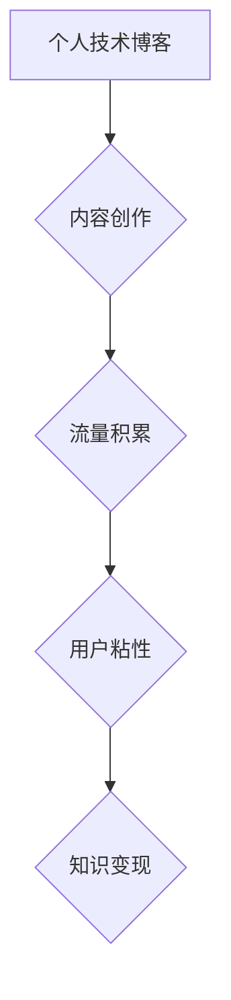

                 

## 打造个人技术博客:知识变现的基础

> 关键词：技术博客,知识变现,内容创作,个人品牌,技术分享,编程,软件开发,技术文章

## 1. 背景介绍

在当今数字时代，技术知识日新月异，信息爆炸式增长。作为技术从业者，我们积累了丰富的经验和见解，但如何将这些知识有效地传播出去，并从中获得回报，成为了一个重要的课题。个人技术博客应运而生，它为技术人员提供了一个平台，可以分享自己的技术经验、观点和见解，并与其他技术爱好者和专业人士进行交流互动。

随着互联网的发展，个人技术博客已经成为技术人员展示自我、建立个人品牌、拓展人脉和获取收入的重要途径。许多技术博客作者通过撰写高质量的技术文章、视频教程、开源项目等内容，吸引了大量的读者和关注者，并获得了丰厚的收益。

## 2. 核心概念与联系

### 2.1 技术博客的核心概念

技术博客是一个由个人或团队创建和维护的网站，主要内容围绕技术领域展开，包括编程语言、软件开发、网络安全、人工智能等。

### 2.2 技术博客与知识变现的联系

技术博客可以成为知识变现的重要平台，通过以下几种方式实现：

* **广告收入:** 在博客上嵌入广告，通过广告点击或展示获得收益。
* **赞助合作:** 与技术公司或产品合作，撰写赞助文章或推广产品，获得报酬。
* **电子书和课程销售:** 将博客文章整理成电子书或课程，在线销售。
* **咨询服务:** 利用博客平台积累的专业知识和经验，为企业或个人提供技术咨询服务。
* **开源项目赞助:** 开发开源项目，通过平台或社区获得赞助。

### 2.3 技术博客知识变现架构

## 3. 核心算法原理 & 具体操作步骤

### 3.1 算法原理概述

技术博客的知识变现本质上是一个内容生产和传播的算法，需要不断优化内容质量、传播渠道和用户互动，才能实现可持续的收益。

### 3.2 算法步骤详解

1. **内容策划:** 确定博客的主题方向，并根据目标受众的需求进行内容策划。
2. **内容创作:** 撰写高质量的技术文章、视频教程、开源项目等内容，并进行排版和优化。
3. **内容推广:** 利用社交媒体、搜索引擎优化等渠道，推广博客内容，吸引流量。
4. **用户互动:** 积极回复评论、参与论坛讨论，与读者建立互动关系，提高用户粘性。
5. **数据分析:** 利用博客平台提供的统计数据，分析用户行为和内容表现，不断优化内容策略。

### 3.3 算法优缺点

* **优点:** 
    * 灵活性和可控性强，可以根据自身情况进行调整。
    * 成本相对较低，可以利用自身的技术优势进行内容创作。
    * 能够建立个人品牌，提升行业影响力。
* **缺点:** 
    * 需要投入大量时间和精力进行内容创作和推广。
    * 收益增长需要时间积累，初期可能收益较低。
    * 需要不断学习和更新知识，才能保持内容的竞争力。

### 3.4 算法应用领域

技术博客的知识变现算法适用于所有技术领域，包括：

* 软件开发
* 网络安全
* 数据科学
* 人工智能
* 云计算
* 区块链

## 4. 数学模型和公式 & 详细讲解 & 举例说明

### 4.1 数学模型构建

我们可以用一个简单的数学模型来描述技术博客的知识变现过程：

**收益 = 内容质量 * 流量 * 转化率**

其中：

* **内容质量:** 指的是博客文章、视频教程等内容的质量，包括准确性、原创性、实用性等因素。
* **流量:** 指的是博客的访问量，可以通过搜索引擎优化、社交媒体推广等方式获得。
* **转化率:** 指的是访问者转化为付费用户的比例，例如点击广告、购买电子书等。

### 4.2 公式推导过程

这个模型的推导过程基于以下假设：

* 高质量的内容能够吸引更多的读者。
* 更多的流量能够带来更多的潜在付费用户。
* 高的转化率能够将更多的潜在付费用户转化为实际付费用户。

### 4.3 案例分析与讲解

假设一个技术博客的：

* 内容质量为 8 分
* 流量为 1000 人/天
* 转化率为 1%

那么，该博客的每日收益为：

**收益 = 8 * 1000 * 0.01 = 8 元**

如果该博客能够提高内容质量、流量和转化率，那么收益将会相应增加。

## 5. 项目实践：代码实例和详细解释说明

### 5.1 开发环境搭建

搭建一个技术博客，需要选择合适的平台和工具。

* **平台选择:** 可以选择 WordPress、Ghost、Medium 等平台，根据自身需求选择合适的平台。
* **工具选择:** 需要选择合适的代码编辑器、版本控制工具、网站部署工具等。

### 5.2 源代码详细实现

由于博客平台和工具的选择多种多样，这里不再给出具体的源代码实现。

### 5.3 代码解读与分析

博客平台和工具的代码实现通常比较复杂，需要对相关技术进行深入了解才能进行解读和分析。

### 5.4 运行结果展示

博客平台和工具的运行结果展示通常包括博客首页、文章页面、用户注册登录页面等。

## 6. 实际应用场景

### 6.1 技术博客的应用场景

技术博客可以应用于以下场景：

* **个人品牌建设:** 展示个人技术能力和经验，建立个人品牌。
* **技术交流:** 与其他技术爱好者和专业人士进行交流互动，分享技术经验。
* **知识传播:** 将技术知识传播给更广泛的受众，提高技术普及率。
* **职业发展:** 提升个人职业竞争力，寻找新的工作机会。

### 6.2 技术博客的成功案例

许多技术博客作者已经取得了成功，例如：

* **Linus Torvalds:** Linux 操作系统的创始人，他的博客是开源社区的重要平台。
* **Jeff Atwood:** Stack Overflow 的创始人，他的博客分享了编程经验和技术见解。
* **Scott Hanselman:** Microsoft 的技术专家，他的博客涵盖了各种技术领域。

### 6.4 未来应用展望

随着互联网的发展和技术进步，技术博客的应用场景将会更加广泛，例如：

* **虚拟现实和增强现实:** 技术博客可以利用虚拟现实和增强现实技术，提供更沉浸式的技术体验。
* **人工智能:** 人工智能可以帮助技术博客作者自动生成内容、推荐相关文章、分析用户行为等。
* **区块链:** 区块链技术可以帮助技术博客作者实现去中心化内容创作和知识分享。

## 7. 工具和资源推荐

### 7.1 学习资源推荐

* **在线课程:** Coursera、Udemy、edX 等平台提供各种技术相关的在线课程。
* **技术博客:** 阅读其他技术博客作者的文章，学习他们的写作技巧和内容策略。
* **技术论坛:** 参加技术论坛，与其他技术爱好者和专业人士进行交流互动。

### 7.2 开发工具推荐

* **代码编辑器:** Sublime Text、VS Code、Atom 等代码编辑器可以帮助你编写和调试代码。
* **版本控制工具:** Git 是一个常用的版本控制工具，可以帮助你管理代码版本。
* **网站部署工具:** Netlify、Heroku、AWS 等平台可以帮助你部署网站。

### 7.3 相关论文推荐

* **The Impact of Blogging on Knowledge Sharing and Collaboration**
* **Building a Successful Technical Blog: A Guide for Developers**
* **The Role of Social Media in Technical Blogging**

## 8. 总结：未来发展趋势与挑战

### 8.1 研究成果总结

技术博客已经成为技术人员展示自我、建立个人品牌、拓展人脉和获取收入的重要途径。通过内容创作、流量积累、用户互动和数据分析等环节，技术博客可以实现知识变现。

### 8.2 未来发展趋势

未来，技术博客的发展趋势包括：

* **内容形式的多样化:** 视频、音频、直播等内容形式将会更加丰富。
* **人工智能的应用:** 人工智能可以帮助技术博客作者自动生成内容、推荐相关文章、分析用户行为等。
* **区块链技术的应用:** 区块链技术可以帮助技术博客作者实现去中心化内容创作和知识分享。

### 8.3 面临的挑战

技术博客的发展也面临着一些挑战：

* **内容竞争日益激烈:** 需要不断创作高质量的内容，才能吸引读者。
* **流量获取越来越困难:** 需要不断优化内容策略和推广渠道，才能获得足够的流量。
* **知识变现模式的创新:** 需要探索新的知识变现模式，才能实现可持续的收益。

### 8.4 研究展望

未来，我们需要继续研究技术博客的知识变现机制，探索新的内容形式、推广渠道和变现模式，推动技术博客的发展。

## 9. 附录：常见问题与解答

### 9.1 如何提高博客内容质量？

* **深入研究主题:** 确保对博客主题有深入的了解，并能够提供独到的见解。
* **原创性:** 避免抄袭或过度引用他人作品，要保证内容的原创性。
* **实用性:** 内容要实用，能够解决读者实际问题。
* **易读性:** 内容要清晰易懂，语言简洁明了。

### 9.2 如何获得博客流量？

* **搜索引擎优化:** 优化博客内容和网站结构，提高搜索引擎排名。
* **社交媒体推广:** 利用社交媒体平台推广博客内容，吸引读者关注。
* **邮件营销:** 收集读者邮箱地址，定期发送博客更新和推广信息。
* **付费广告:** 在搜索引擎或社交媒体平台投放广告，吸引目标用户。

### 9.3 如何实现博客知识变现？

* **广告收入:** 在博客上嵌入广告，通过广告点击或展示获得收益。
* **赞助合作:** 与技术公司或产品合作，撰写赞助文章或推广产品，获得报酬。
* **电子书和课程销售:** 将博客文章整理成电子书或课程，在线销售。
* **咨询服务:** 利用博客平台积累的专业知识和经验，为企业或个人提供技术咨询服务。

作者：禅与计算机程序设计艺术 / Zen and the Art of Computer Programming 
<end_of_turn>

