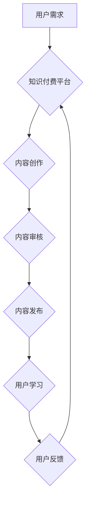

                 

## 打造知识付费爆款产品的核心要素

> 关键词：知识付费、爆款产品、用户需求、内容价值、营销策略、技术平台、社区运营

### 1. 背景介绍

知识付费市场近年来蓬勃发展，从线上课程、付费咨询到电子书、会员体系，各种知识付费模式层出不穷。然而，在激烈的市场竞争中，真正能够成为爆款产品的寥寥无几。打造爆款知识付费产品并非易事，需要深入了解用户需求、打造优质内容、制定有效的营销策略，并依托强大的技术平台和社区运营。

### 2. 核心概念与联系

**2.1 知识付费的核心概念**

知识付费是指以知识、技能、经验等为核心资源，通过付费的方式向用户提供价值。它本质上是一种价值交换，用户通过支付获得知识和技能的提升，而知识提供者则通过知识的传播获得收益。

**2.2 爆款产品的核心要素**

爆款产品是指在特定市场或领域内，拥有极高用户粘性、口碑传播力和市场占有率的产品。其核心要素包括：

* **独特价值:** 提供独特的知识、技能或服务，满足用户无法从其他渠道获得的需求。
* **高品质内容:** 内容深度、实用性、趣味性、可读性等方面都达到较高水平。
* **精准定位:** 明确目标用户群体，针对其痛点和需求进行内容创作和营销。
* **高效传播:** 利用多种渠道和方式进行推广，扩大产品影响力。
* **良好的用户体验:** 提供便捷、流畅、安全的学习体验，提升用户满意度。

**2.3 知识付费爆款产品的联系**

知识付费爆款产品是将知识付费的核心概念与爆款产品的核心要素相结合的结果。它需要提供独特的价值，并通过高品质内容、精准定位、高效传播和良好的用户体验，吸引用户付费，最终实现市场爆款。

**2.4 知识付费爆款产品架构**



### 3. 核心算法原理 & 具体操作步骤

**3.1 算法原理概述**

知识付费爆款产品的核心算法原理在于用户需求分析、内容推荐和用户画像构建。通过大数据分析和机器学习算法，平台可以精准识别用户需求，推荐符合用户兴趣和学习目标的内容，并构建用户画像，为个性化学习提供支持。

**3.2 算法步骤详解**

1. **用户需求分析:** 收集用户行为数据，如浏览记录、学习进度、评价反馈等，分析用户兴趣、学习目标和知识痛点。
2. **内容推荐:** 基于用户需求和内容标签、分类等信息，利用协同过滤、内容过滤等算法推荐个性化内容。
3. **用户画像构建:** 将用户行为数据、学习记录、兴趣偏好等信息进行整合，构建用户画像，包括用户基本信息、学习习惯、知识结构等。
4. **个性化学习:** 根据用户画像，提供个性化学习路径、学习计划和学习资源推荐，提升用户学习效率和体验。

**3.3 算法优缺点**

* **优点:** 能够精准识别用户需求，推荐个性化内容，提升用户学习体验和学习效率。
* **缺点:** 需要大量的数据支持，算法模型需要不断优化和更新，才能保持推荐效果的准确性和有效性。

**3.4 算法应用领域**

* 在线教育平台
* 知识付费平台
* 内容推荐系统
* 个性化学习系统

### 4. 数学模型和公式 & 详细讲解 & 举例说明

**4.1 数学模型构建**

知识推荐系统通常采用基于用户的协同过滤算法，其核心数学模型是用户-物品评分矩阵。

* **用户-物品评分矩阵:**  一个n x m的矩阵，其中n代表用户数量，m代表物品数量。矩阵中的每个元素代表用户对物品的评分，评分可以是整数或浮点数。

**4.2 公式推导过程**

协同过滤算法的核心思想是：如果用户A和用户B对相似的物品有相似的评分，那么用户A可能也喜欢用户B喜欢的物品。

* **相似度计算:** 使用余弦相似度或皮尔逊相关系数等方法计算用户之间的相似度。
* **推荐算法:** 根据用户A的评分和与用户B的相似度，预测用户A对物品B的评分，并推荐评分较高的物品。

**4.3 案例分析与讲解**

假设有一个用户-物品评分矩阵，其中用户1对电影A评分为5，用户2对电影A评分为4，用户1对电影B评分为3，用户2对电影B评分为5。

* **相似度计算:** 使用余弦相似度计算用户1和用户2的相似度，得到相似度为0.6。
* **推荐算法:** 根据用户1的评分和与用户2的相似度，预测用户1对电影B的评分为4.2，并推荐电影B给用户1。

### 5. 项目实践：代码实例和详细解释说明

**5.1 开发环境搭建**

* Python 3.x
* Pandas
* Scikit-learn
* Flask

**5.2 源代码详细实现**

```python
import pandas as pd
from sklearn.metrics.pairwise import cosine_similarity

# 加载用户-物品评分矩阵
ratings_data = pd.read_csv('ratings.csv')

# 计算用户之间的相似度
user_similarity = cosine_similarity(ratings_data.T)

# 获取用户1的相似用户
similar_users = user_similarity[0].argsort()[:-6:-1]  # 排序获取相似度最高的5个用户

# 获取用户1喜欢的电影
user1_liked_movies = ratings_data.loc[0][ratings_data.loc[0] > 3].index

# 推荐给用户1的电影
recommendations = []
for user_id in similar_users:
    for movie_id in ratings_data.loc[user_id][ratings_data.loc[user_id] > 3].index:
        if movie_id not in user1_liked_movies:
            recommendations.append(movie_id)

# 输出推荐结果
print(f'推荐给用户1的电影: {recommendations}')
```

**5.3 代码解读与分析**

* 代码首先加载用户-物品评分矩阵。
* 然后使用余弦相似度计算用户之间的相似度。
* 获取用户1的相似用户，并获取用户1喜欢的电影。
* 最后，根据相似用户的评分推荐给用户1的电影。

**5.4 运行结果展示**

运行代码后，会输出一个包含推荐电影ID的列表。

### 6. 实际应用场景

**6.1 在线教育平台**

* 推荐个性化课程和学习路径
* 提供智能化的学习辅导和答疑服务

**6.2 知识付费平台**

* 推荐符合用户兴趣和需求的付费课程和资源
* 提供个性化的学习计划和学习进度跟踪

**6.3 内容推荐系统**

* 推荐用户感兴趣的文章、视频、音频等内容
* 提供个性化的内容订阅和推送服务

**6.4 个性化学习系统**

* 根据用户的学习能力和学习目标，提供个性化的学习内容和学习方式
* 提供智能化的学习评估和反馈

**6.5 未来应用展望**

随着人工智能技术的不断发展，知识付费爆款产品的应用场景将更加广泛，例如：

* 基于虚拟现实和增强现实技术的沉浸式学习体验
* 基于区块链技术的知识版权保护和激励机制
* 基于大数据分析的个性化学习评估和反馈

### 7. 工具和资源推荐

**7.1 学习资源推荐**

* **书籍:**
    * 《推荐系统实践》
    * 《机器学习》
    * 《深度学习》
* **在线课程:**
    * Coursera
    * edX
    * Udemy

**7.2 开发工具推荐**

* **Python:**
    * Pandas
    * Scikit-learn
    * TensorFlow
    * PyTorch
* **框架:**
    * Flask
    * Django

**7.3 相关论文推荐**

* **协同过滤算法:**
    * "Collaborative Filtering: A User-Based Approach"
    * "Memory-Based Collaborative Filtering"
* **内容推荐算法:**
    * "Content-Based Recommendation Systems"
    * "Hybrid Recommender Systems"

### 8. 总结：未来发展趋势与挑战

**8.1 研究成果总结**

知识付费爆款产品的核心要素包括用户需求分析、内容推荐和用户画像构建。通过大数据分析和机器学习算法，平台可以精准识别用户需求，推荐个性化内容，并构建用户画像，为个性化学习提供支持。

**8.2 未来发展趋势**

* **更精准的用户需求分析:** 利用自然语言处理、情感分析等技术，更深入地理解用户的学习需求和痛点。
* **更个性化的内容推荐:** 基于用户的学习习惯、知识结构和学习目标，提供更精准的个性化推荐。
* **更智能化的学习体验:** 利用人工智能技术，提供更智能化的学习辅导、答疑服务和学习评估。

**8.3 面临的挑战**

* **数据质量和隐私保护:** 知识付费平台需要大量的数据支持，如何保证数据质量和用户隐私保护是一个重要的挑战。
* **算法模型的优化和更新:** 算法模型需要不断优化和更新，才能保持推荐效果的准确性和有效性。
* **内容质量和知识更新:** 知识付费平台需要提供高质量的内容，并及时更新知识，才能满足用户的学习需求。

**8.4 研究展望**

未来，知识付费爆款产品的研究将更加注重用户体验、个性化学习和人工智能技术的应用，并探索新的知识付费模式和商业模式。


### 9. 附录：常见问题与解答

**9.1 如何提高知识付费产品的爆款率？**

* **精准定位目标用户:** 深入了解用户的痛点和需求，提供针对性的知识和服务。
* **打造高品质内容:** 内容深度、实用性、趣味性和可读性都达到较高水平。
* **制定有效的营销策略:** 利用多种渠道和方式进行推广，扩大产品影响力。
* **提供良好的用户体验:** 提供便捷、流畅、安全的学习体验，提升用户满意度。

**9.2 如何保证知识付费平台的数据质量和用户隐私保护？**

* **建立完善的数据采集和处理流程:** 确保数据准确、完整、可靠。
* **采用加密技术和匿名化技术保护用户隐私:** 避免用户个人信息泄露。
* **制定严格的数据使用和共享政策:** 明确数据的使用范围和共享方式。

**9.3 如何应对知识付费平台面临的算法模型优化和更新挑战？**

* **持续收集用户反馈和数据:** 了解算法模型的优缺点，并及时进行调整和优化。
* **探索新的算法模型和技术:** 采用更先进的算法模型和技术，提升算法效果。
* **建立完善的算法模型测试和评估体系:** 确保算法模型的准确性和有效性。


作者：禅与计算机程序设计艺术 / Zen and the Art of Computer Programming 
<end_of_turn>

