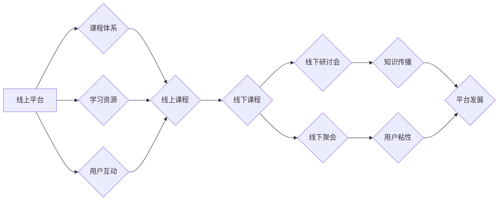

                 

## 打造知识付费的线上线下混合模式

> 关键词：知识付费、线上线下融合、混合模式、课程体系、社区运营、用户体验、技术架构、数据分析

## 1. 背景介绍

知识付费已成为近年来备受关注的商业模式，其核心在于将知识、技能和经验转化为有价值的商品，通过线上平台或线下活动向付费用户提供。随着互联网技术的快速发展和用户对知识的需求不断增长，知识付费市场呈现出蓬勃发展的态势。

然而，传统的线上知识付费模式存在一些局限性，例如：

* **用户互动性不足:** 线上课程往往缺乏面对面的交流和互动，难以满足用户对深度学习和个性化指导的需求。
* **内容更新迭代慢:** 线上课程更新周期较长，难以及时跟上知识更新和市场变化。
* **用户粘性较低:** 线上课程的学习体验相对单一，难以形成持续的学习动力和用户粘性。

为了克服这些局限性，越来越多的知识付费平台开始探索线上线下混合模式，将线上课程和线下活动相结合，打造更加丰富、互动性和粘性的学习体验。

## 2. 核心概念与联系

线上线下混合模式的核心在于将线上平台和线下活动有机结合，形成一个完整的知识付费生态系统。

**2.1 线上平台**

线上平台是知识付费的核心载体，负责提供课程内容、学习资源、用户互动等功能。

* **课程体系:** 建立完善的课程体系，涵盖不同领域、不同层次的知识内容，满足不同用户需求。
* **学习资源:** 提供丰富的学习资源，例如视频、音频、文档、练习题等，帮助用户更好地理解和掌握知识。
* **用户互动:** 提供在线论坛、直播互动、答疑等功能，促进用户之间的交流和互动。

**2.2 线下活动**

线下活动是线上平台的补充和延伸，可以增强用户体验、提升用户粘性，并为平台带来新的收入来源。

* **线下课程:** 定期举办线下课程，邀请专家学者进行授课，提供面对面的互动和交流机会。
* **线下研讨会:** 组织线下研讨会，邀请行业专家和用户分享经验、探讨热点话题，促进知识传播和交流。
* **线下聚会:** 举办线下聚会，让用户结识新朋友、建立学习社区，增强用户粘性。

**2.3 融合机制**

线上线下混合模式的关键在于建立有效的融合机制，将线上平台和线下活动有机结合。

* **课程预热:** 线上平台可以发布课程预告、专家介绍等内容，提前预热线下课程。
* **线下课程直播:** 线下课程可以进行直播，让线上用户也能参与学习。
* **线上线下互动:** 线上平台可以利用线下活动的数据，为用户提供个性化的学习推荐和服务。

**Mermaid 流程图**



## 3. 核心算法原理 & 具体操作步骤

**3.1 算法原理概述**

知识付费平台的线上线下混合模式需要结合多种算法原理，例如推荐算法、用户画像算法、内容分发算法等，以实现个性化推荐、用户精准运营和内容优化。

* **推荐算法:** 基于用户行为数据、兴趣偏好、学习历史等信息，推荐用户感兴趣的课程和活动。
* **用户画像算法:** 通过分析用户数据，构建用户画像，了解用户的学习习惯、兴趣爱好、职业背景等信息，为用户提供个性化的学习体验。
* **内容分发算法:** 根据用户画像、课程内容、活动时间等因素，优化内容分发策略，确保用户能够及时获取到感兴趣的内容。

**3.2 算法步骤详解**

**3.2.1 推荐算法步骤**

1. **数据收集:** 收集用户行为数据，例如课程浏览记录、学习进度、评价反馈、互动参与等。
2. **特征提取:** 从用户行为数据中提取特征，例如用户兴趣、学习偏好、学习时间等。
3. **模型训练:** 利用机器学习算法，训练推荐模型，例如协同过滤、内容过滤、深度学习等。
4. **推荐结果生成:** 根据用户特征和模型预测，生成个性化的课程推荐列表。
5. **结果评估:** 通过A/B测试等方式，评估推荐算法的准确性和有效性，不断优化模型参数。

**3.2.2 用户画像算法步骤**

1. **数据收集:** 收集用户基本信息、学习行为数据、兴趣爱好数据等。
2. **数据清洗:** 对收集到的数据进行清洗和预处理，去除无效数据和噪声数据。
3. **特征工程:** 从用户数据中提取特征，例如年龄、性别、职业、学习时间、课程偏好等。
4. **模型训练:** 利用聚类算法、深度学习算法等，构建用户画像模型，将用户分为不同的群体。
5. **用户画像分析:** 分析不同用户群体的特征，了解用户的学习习惯、兴趣爱好、需求特点等。

**3.3 算法优缺点**

**推荐算法:**

* **优点:** 可以根据用户兴趣和行为推荐个性化的课程，提高用户学习体验和满意度。
* **缺点:** 需要大量的用户数据进行训练，算法模型需要不断更新和优化，才能保持推荐效果。

**用户画像算法:**

* **优点:** 可以帮助平台了解用户的学习习惯和需求，提供更精准的营销和服务。
* **缺点:** 需要收集和分析大量的用户数据，存在用户隐私保护的风险。

**3.4 算法应用领域**

推荐算法和用户画像算法广泛应用于知识付费平台、电商平台、社交媒体平台等领域，帮助平台提高用户粘性、提升转化率、促进商业发展。

## 4. 数学模型和公式 & 详细讲解 & 举例说明

**4.1 数学模型构建**

知识付费平台的线上线下混合模式可以构建一个数学模型，来描述用户学习行为、平台运营策略和商业收益之间的关系。

**4.1.1 用户学习行为模型**

用户学习行为可以表示为一个马尔可夫链，其中每个状态代表用户的学习阶段，例如注册、浏览课程、购买课程、学习课程、完成课程等。

**4.1.2 平台运营策略模型**

平台运营策略可以表示为一个决策树，其中每个节点代表一个决策，例如课程推荐、活动策划、用户运营等。

**4.1.3 商业收益模型**

平台的商业收益可以表示为一个函数，其中输入变量包括用户数量、付费用户数量、平均付费金额等，输出变量为平台的总收入。

**4.2 公式推导过程**

**4.2.1 用户学习行为概率**

用户从一个状态转移到另一个状态的概率可以根据马尔可夫链的性质进行推导。

**4.2.2 平台运营策略收益**

平台运营策略的收益可以根据决策树的结构和每个节点的决策结果进行计算。

**4.2.3 商业收益最大化**

可以通过优化平台运营策略模型，最大化平台的商业收益。

**4.3 案例分析与讲解**

**4.3.1 用户学习行为分析**

通过分析用户学习行为模型，可以发现用户学习的路径和习惯，例如哪些课程用户最感兴趣，哪些阶段用户容易流失等。

**4.3.2 平台运营策略优化**

通过优化平台运营策略模型，可以提高用户转化率、延长用户生命周期，从而增加平台的商业收益。

**4.3.3 商业收益预测**

通过构建商业收益模型，可以预测平台未来的商业收益，为平台决策提供参考。

## 5. 项目实践：代码实例和详细解释说明

**5.1 开发环境搭建**

* **操作系统:** Linux/macOS/Windows
* **编程语言:** Python
* **框架:** Django/Flask
* **数据库:** MySQL/PostgreSQL
* **云服务:** AWS/Azure/GCP

**5.2 源代码详细实现**

```python
# 用户模型
class User(models.Model):
    username = models.CharField(max_length=255)
    email = models.EmailField()
    # ... 其他用户属性

# 课程模型
class Course(models.Model):
    title = models.CharField(max_length=255)
    description = models.TextField()
    # ... 其他课程属性

# 推荐算法
def recommend_courses(user):
    # 根据用户行为数据和课程特征，使用协同过滤算法推荐课程
    # ... 算法实现代码
    return recommended_courses

# 用户画像算法
def create_user_profile(user):
    # 分析用户行为数据，构建用户画像
    # ... 算法实现代码
    return user_profile

```

**5.3 代码解读与分析**

* 用户模型和课程模型定义了知识付费平台的数据结构。
* 推荐算法和用户画像算法提供了个性化推荐和用户运营的解决方案。

**5.4 运行结果展示**

* 用户登录平台后，可以根据其兴趣和学习历史，推荐相关课程。
* 平台可以根据用户画像，进行精准的营销和服务。

## 6. 实际应用场景

**6.1 在线教育平台**

在线教育平台可以利用线上线下混合模式，提供更加丰富的学习体验，例如：

* 线上课程：提供视频、音频、文档等学习资源。
* 线下课程：邀请专家学者进行授课，提供面对面的互动和交流机会。
* 线下研讨会：组织行业专家和用户分享经验、探讨热点话题。

**6.2 培训机构**

培训机构可以利用线上线下混合模式，提升培训效率和学员满意度，例如：

* 线上课程：提供预习和复习材料，方便学员随时随地学习。
* 线下课程：进行实操练习和案例分析，帮助学员更好地掌握技能。
* 线下交流会：促进学员之间交流学习，建立学习社区。

**6.3 企业内部培训**

企业可以利用线上线下混合模式，进行内部培训，例如：

* 线上课程：提供员工培训资料，方便员工随时学习。
* 线下培训：进行团队建设和沟通交流，提升员工凝聚力和协作能力。
* 线下沙龙：邀请行业专家进行分享，帮助员工提升专业技能。

**6.4 未来应用展望**

随着技术的不断发展，线上线下混合模式将更加深入地融入到知识付费领域，例如：

* **虚拟现实/增强现实技术:** 将虚拟现实和增强现实技术应用于线上线下混合模式，提供更加沉浸式的学习体验。
* **人工智能技术:** 利用人工智能技术，实现更加个性化的课程推荐、更加智能化的用户运营。
* **区块链技术:** 利用区块链技术，保障知识产权，提高知识付费平台的信任度。

## 7. 工具和资源推荐

**7.1 学习资源推荐**

* **书籍:**
    * 《知识付费的商业模式》
    * 《在线教育的未来》
    * 《用户体验设计》
* **课程:**
    * Coursera: 在线教育平台
    * Udemy: 在线学习平台
    * edX: 开放式在线课程平台

**7.2 开发工具推荐**

* **编程语言:** Python
* **框架:** Django/Flask
* **数据库:** MySQL/PostgreSQL
* **云服务:** AWS/Azure/GCP

**7.3 相关论文推荐**

* 《线上线下混合模式下的知识付费平台研究》
* 《基于用户画像的知识付费推荐算法研究》
* 《人工智能技术在知识付费领域的应用研究》

## 8. 总结：未来发展趋势与挑战

**8.1 研究成果总结**

线上线下混合模式为知识付费平台提供了新的发展方向，可以提升用户体验、提高平台运营效率，促进知识传播和商业发展。

**8.2 未来发展趋势**

未来，线上线下混合模式将更加深入地融入到知识付费领域，例如：

* **更加个性化的学习体验:** 利用人工智能技术，提供更加个性化的课程推荐、学习路径和学习内容。
* **更加丰富的学习场景:** 利用虚拟现实/增强现实技术，打造更加沉浸式的学习场景。
* **更加完善的社区运营:** 建立更加活跃的学习社区，促进用户之间的交流和互动。

**8.3 面临的挑战**

线上线下混合模式的实施也面临一些挑战，例如：

* **技术难度:** 需要整合线上线下多种技术，实现数据互通和系统协同。
* **成本投入:** 线下活动需要投入一定的成本，例如场地租赁、人员招聘等。
* **用户习惯:** 用户需要适应线上线下混合模式的学习方式，需要一定的学习成本。

**8.4 研究展望**

未来，需要进一步研究线上线下混合模式的最佳实践，探索更加有效的融合机制，降低成本投入，提升用户体验，推动知识付费平台的健康发展。

## 9. 附录：常见问题与解答

**9.1 如何选择合适的线上线下混合模式？**

选择合适的线上线下混合模式需要根据平台的实际情况，例如目标用户、课程内容、运营资源等进行综合考虑。

**9.2 如何提高线上线下融合的效率？**

提高线上线下融合的效率需要建立有效的沟通机制，实现数据互通和系统协同。

**9.3 如何提升用户体验？**

提升用户体验需要提供更加个性化的学习内容、更加丰富的学习场景、更加便捷的学习服务。


作者：禅与计算机程序设计艺术 / Zen and the Art of Computer Programming 
<end_of_turn>

