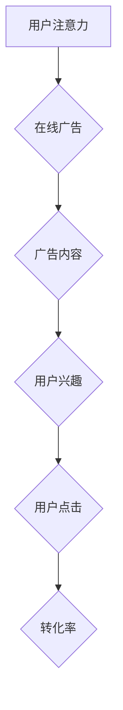

                 

## 1. 背景介绍

在当今数字时代，信息爆炸式增长，用户注意力成为稀缺资源。人们每天接触着海量信息，难以集中精力于任何单一内容。在这种情况下，如何有效地吸引用户注意力，并将其转化为商业价值，成为企业和广告主面临的重大挑战。

在线广告作为数字经济的重要组成部分，也面临着用户注意力流失的困境。传统的广告投放方式，例如横幅广告和弹窗广告，往往过于 intrusive，容易打断用户体验，甚至被用户屏蔽。因此，如何设计更精准、更有效的在线广告策略，在不牺牲用户体验的情况下吸引受众，成为业界关注的焦点。

## 2. 核心概念与联系

### 2.1 注意力经济

注意力经济是指在信息过载的时代，注意力成为一种稀缺资源，而能够有效获取和利用用户注意力的企业和产品将占据优势的经济模式。

### 2.2 在线广告

在线广告是指在互联网平台上投放广告，以吸引用户关注并实现商业目标的营销方式。

### 2.3 用户体验

用户体验是指用户使用产品或服务时所感受到的整体感受，包括易用性、可用性、美观度、效率等方面。

**Mermaid 流程图**



## 3. 核心算法原理 & 具体操作步骤

### 3.1 算法原理概述

在注意力经济背景下，在线广告的目标是精准地将广告内容展示给有兴趣的用户，并最大化广告点击率和转化率。为此，需要利用机器学习算法分析用户行为数据，预测用户对广告的兴趣，并根据预测结果进行广告投放优化。

常见的在线广告算法包括：

* **协同过滤算法:** 基于用户历史行为数据，推荐与用户兴趣相似的广告。
* **深度学习算法:** 利用神经网络模型，学习用户特征和广告特征之间的关系，进行更精准的广告推荐。
* **强化学习算法:** 通过奖励机制，训练广告投放模型，使其不断优化广告展示策略。

### 3.2 算法步骤详解

以深度学习算法为例，其具体操作步骤如下：

1. **数据收集:** 收集用户行为数据，例如浏览历史、点击记录、购买行为等，以及广告特征数据，例如广告标题、描述、图片等。
2. **数据预处理:** 对收集到的数据进行清洗、转换和特征工程，使其适合深度学习模型的训练。
3. **模型构建:** 选择合适的深度学习模型，例如多层感知机 (MLP)、卷积神经网络 (CNN) 或循环神经网络 (RNN)，并根据具体任务进行模型设计和参数设置。
4. **模型训练:** 利用训练数据，训练深度学习模型，使其能够学习用户特征和广告特征之间的关系。
5. **模型评估:** 使用测试数据评估模型的性能，例如点击率、转化率等指标。
6. **模型优化:** 根据评估结果，调整模型参数或架构，进一步优化模型性能。
7. **模型部署:** 将训练好的模型部署到线上环境，用于实时广告推荐。

### 3.3 算法优缺点

**优点:**

* 精准度高: 深度学习算法能够学习用户和广告之间的复杂关系，实现更精准的广告推荐。
* 可扩展性强: 深度学习模型能够处理海量数据，并随着数据量的增加不断提升性能。
* 自适应性强: 深度学习模型能够根据用户行为数据进行动态调整，适应用户的变化需求。

**缺点:**

* 数据依赖性强: 深度学习算法需要大量的训练数据才能达到较好的效果。
* 计算资源消耗大: 训练深度学习模型需要大量的计算资源，成本较高。
* 黑盒效应: 深度学习模型的决策过程较为复杂，难以解释其背后的逻辑。

### 3.4 算法应用领域

深度学习算法在在线广告领域有着广泛的应用，例如：

* **广告推荐:** 根据用户的兴趣和行为，推荐相关的广告。
* **广告点击预测:** 预测用户点击广告的概率，优化广告投放策略。
* **广告转化预测:** 预测用户点击广告后转化为客户的概率，提高广告投资回报率。
* **广告创意优化:** 根据用户反馈数据，优化广告创意，提高广告效果。

## 4. 数学模型和公式 & 详细讲解 & 举例说明

### 4.1 数学模型构建

在线广告的目标是最大化广告收益，而广告收益取决于广告点击率 (CTR) 和广告转化率 (CVR)。

**CTR** 表示用户点击广告的概率，**CVR** 表示用户点击广告后转化为客户的概率。

假设广告投放量为 **N**，点击量为 **C**，转化量为 **T**，则：

* **CTR = C / N**
* **CVR = T / C**

广告收益可以表示为：

**广告收益 = CVR * 广告单价 * 点击量**

### 4.2 公式推导过程

为了最大化广告收益，需要优化 **CTR** 和 **CVR**。

**CTR** 可以通过以下公式进行优化：

**CTR = sigmoid(w * x)**

其中：

* **w** 是模型参数，通过训练得到。
* **x** 是用户特征向量。
* **sigmoid** 是 sigmoid 函数，将输入值映射到 0 到 1 之间。

**CVR** 可以通过以下公式进行优化：

**CVR = sigmoid(w * x)**

其中：

* **w** 是模型参数，通过训练得到。
* **x** 是用户特征向量。
* **sigmoid** 是 sigmoid 函数，将输入值映射到 0 到 1 之间。

### 4.3 案例分析与讲解

假设我们有一个在线广告平台，需要推荐商品广告给用户。

我们可以收集用户浏览历史、购买记录、年龄、性别等特征数据，以及商品标题、描述、价格等特征数据。

然后，我们可以利用深度学习算法，构建一个广告推荐模型，并根据用户的特征向量预测其点击商品广告的概率 (CTR)。

通过不断训练和优化模型，我们可以提高广告推荐的精准度，并最终实现最大化广告收益的目标。

## 5. 项目实践：代码实例和详细解释说明

### 5.1 开发环境搭建

为了实现在线广告目标与策略，我们需要搭建一个开发环境。

* **操作系统:** Linux 或 macOS
* **编程语言:** Python
* **深度学习框架:** TensorFlow 或 PyTorch
* **数据存储:** MySQL 或 MongoDB

### 5.2 源代码详细实现

以下是一个使用 TensorFlow 实现广告推荐模型的简单代码示例：

```python
import tensorflow as tf

# 定义模型结构
model = tf.keras.Sequential([
    tf.keras.layers.Dense(64, activation='relu'),
    tf.keras.layers.Dense(32, activation='relu'),
    tf.keras.layers.Dense(1, activation='sigmoid')
])

# 编译模型
model.compile(optimizer='adam',
              loss='binary_crossentropy',
              metrics=['accuracy'])

# 训练模型
model.fit(x_train, y_train, epochs=10)

# 评估模型
loss, accuracy = model.evaluate(x_test, y_test)
print('Loss:', loss)
print('Accuracy:', accuracy)
```

### 5.3 代码解读与分析

* **模型结构:** 该代码定义了一个简单的多层感知机 (MLP) 模型，包含三个全连接层和一个 sigmoid 激活函数的输出层。
* **模型编译:** 使用 Adam 优化器、二元交叉熵损失函数和准确率作为评估指标编译模型。
* **模型训练:** 使用训练数据训练模型 10 个 epochs。
* **模型评估:** 使用测试数据评估模型的性能，并打印损失和准确率。

### 5.4 运行结果展示

训练完成后，我们可以使用测试数据预测广告点击概率，并根据预测结果进行广告投放优化。

## 6. 实际应用场景

### 6.1 搜索引擎广告

搜索引擎广告是利用用户搜索关键词，精准推荐相关广告的一种方式。

例如，当用户搜索 "智能手机" 时，搜索引擎会根据用户的搜索历史、地理位置等信息，推荐相关的智能手机广告。

### 6.2 社交媒体广告

社交媒体广告是指在社交媒体平台上投放广告，例如 Facebook、Twitter、Instagram 等。

社交媒体广告可以根据用户的兴趣爱好、年龄、性别等信息，精准推荐广告。

### 6.3 内容平台广告

内容平台广告是指在新闻网站、视频网站、博客等内容平台上投放广告。

内容平台广告可以根据用户的阅读习惯、观看习惯等信息，推荐相关的广告。

### 6.4 未来应用展望

随着人工智能技术的不断发展，在线广告的精准度和效率将不断提高。

未来，在线广告将更加个性化、智能化，能够更好地满足用户的需求，并为企业带来更大的商业价值。

## 7. 工具和资源推荐

### 7.1 学习资源推荐

* **在线课程:** Coursera、edX、Udacity 等平台提供深度学习和机器学习相关的在线课程。
* **书籍:** 《深度学习》、《机器学习实战》等书籍可以帮助你深入了解深度学习和机器学习的原理和应用。
* **博客和论坛:** TensorFlow、PyTorch 等深度学习框架的官方博客和论坛可以提供最新的技术资讯和社区支持。

### 7.2 开发工具推荐

* **TensorFlow:** Google 开发的开源深度学习框架。
* **PyTorch:** Facebook 开发的开源深度学习框架。
* **Keras:** TensorFlow 上的深度学习 API，易于使用。

### 7.3 相关论文推荐

* **Attention Is All You Need:** https://arxiv.org/abs/1706.03762
* **BERT: Pre-training of Deep Bidirectional Transformers for Language Understanding:** https://arxiv.org/abs/1810.04805

## 8. 总结：未来发展趋势与挑战

### 8.1 研究成果总结

近年来，在注意力经济背景下，在线广告领域取得了显著的进展。

深度学习算法的应用使得广告推荐更加精准，广告效果更加显著。

### 8.2 未来发展趋势

未来，在线广告将朝着以下方向发展：

* **更加个性化:** 广告将更加精准地针对用户的兴趣爱好和需求进行定制。
* **更加智能化:** 广告投放策略将更加智能化，能够根据用户的实时行为进行动态调整。
* **更加私密化:** 广告将更加注重用户隐私保护，避免过度收集和利用用户数据。

### 8.3 面临的挑战

在线广告领域也面临着一些挑战：

* **数据安全和隐私保护:** 如何保护用户数据安全和隐私，避免数据泄露和滥用，是需要认真考虑的问题。
* **算法公平性:** 如何避免算法歧视和偏见，确保广告公平公正地展示给所有用户，也是一个重要的挑战。
* **用户体验:** 如何在不牺牲用户体验的情况下，实现精准的广告投放，也是需要不断探索的方向。

### 8.4 研究展望

未来，在线广告领域的研究将更加注重以下几个方面：

* **隐私保护技术:** 开发更加安全的隐私保护技术，保护用户数据安全和隐私。
* **公平性算法:** 研究公平性算法，避免算法歧视和偏见。
* **用户体验优化:** 研究如何优化用户体验，实现更加精准和有效的广告投放。

## 9. 附录：常见问题与解答

### 9.1 如何提高广告点击率？

* **精准定位目标用户:** 通过分析用户数据，精准定位目标用户群体。
* **优化广告创意:** 设计吸引眼球、与用户需求相符的广告创意。
* **选择合适的广告平台:** 选择与目标用户群体匹配的广告平台。
* **进行A/B测试:** 通过A/B测试，不断优化广告文案、图片、布局等。

### 9.2 如何提高广告转化率？

* **优化广告落地页:** 确保广告落地页与广告内容一致，并提供用户所需的价值。
* **简化用户操作流程:** 减少用户操作步骤，提高用户转化率。
* **提供优惠和促销活动:** 通过优惠和促销活动，刺激用户购买行为。
* **收集用户反馈:** 收集用户反馈，不断优化广告和落地页。


作者：禅与计算机程序设计艺术 / Zen and the Art of Computer Programming 
<end_of_turn>

