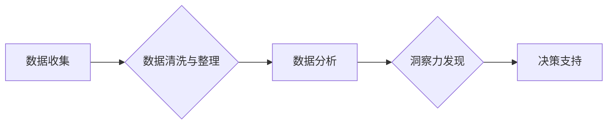

                 

## 理解洞察力的价值：在不确定性中的优势

> 关键词：洞察力、人工智能、机器学习、数据分析、预测模型、不确定性、决策支持、未来趋势

### 1. 背景介绍

在当今数据爆炸的时代，我们被海量信息所包围。然而，仅仅拥有数据并不能带来真正的价值。真正重要的在于如何从这些数据中提取有意义的洞察力，并将其转化为可操作的知识，从而做出更明智的决策。

洞察力，指的是对复杂现象的深入理解，能够识别出隐藏的模式、趋势和关系。它不仅是数据分析的结果，更是一种思考和判断的能力，能够帮助我们洞悉事物的本质，预测未来的发展趋势，并制定相应的策略。

然而，在充满不确定性的世界中，洞察力的价值尤为突出。面对不断变化的环境、复杂的系统和不可预测的事件，我们更需要洞察力来帮助我们导航未知领域，做出更明智的决策。

### 2. 核心概念与联系

**2.1 洞察力与人工智能**

人工智能（AI）作为一种模拟人类智能的计算机科学领域，在提取洞察力方面发挥着越来越重要的作用。通过机器学习、深度学习等算法，AI能够从海量数据中识别出人类难以察觉的模式和关系，从而提供更深入的洞察力。

**2.2 洞察力与数据分析**

数据分析是提取洞察力的基础。通过收集、清洗、整理和分析数据，我们可以发现隐藏在数据背后的规律和趋势。数据分析方法包括统计分析、数据挖掘、机器学习等，它们为洞察力的发现提供了工具和技术支持。

**2.3 洞察力与决策支持**

洞察力是决策支持的关键要素。通过洞察力，我们可以更好地理解问题、评估风险、识别机会，从而做出更明智的决策。洞察力可以帮助我们制定更有效的策略、优化资源配置、降低风险，最终实现目标。

**Mermaid 流程图**



### 3. 核心算法原理 & 具体操作步骤

**3.1 算法原理概述**

在提取洞察力的过程中，常用的算法包括：

* **聚类算法:** 将数据点根据相似性进行分组，发现数据中的潜在结构和类别。
* **关联规则挖掘算法:** 发现数据中频繁出现的项集之间的关联关系，揭示出隐藏的市场趋势和客户需求。
* **预测模型算法:** 基于历史数据，建立预测模型，预测未来的趋势和事件。

**3.2 算法步骤详解**

以聚类算法为例，其具体操作步骤如下：

1. **数据预处理:** 对数据进行清洗、转换和特征工程，使其适合聚类算法的处理。
2. **选择聚类算法:** 根据数据的特点和分析目标，选择合适的聚类算法，例如K-means、层次聚类等。
3. **设置聚类参数:** 确定聚类算法的参数，例如聚类数、距离度量等。
4. **执行聚类:** 使用选定的算法对数据进行聚类，将数据点划分为不同的类别。
5. **评估聚类结果:** 使用聚类评估指标，例如Silhouette score、Dunn index等，评估聚类结果的质量。
6. **可视化结果:** 使用图表等方式可视化聚类结果，帮助理解数据结构和类别特征。

**3.3 算法优缺点**

* **优点:** 聚类算法能够自动发现数据中的潜在结构，无需事先定义类别，能够处理高维数据。
* **缺点:** 聚类算法对数据分布和参数设置较为敏感，难以确定最佳聚类数，结果的可解释性较差。

**3.4 算法应用领域**

聚类算法广泛应用于以下领域：

* **市场营销:** 识别客户群体，进行精准营销。
* **金融:** 风险评估、欺诈检测。
* **医疗:** 疾病诊断、患者分层。
* **图像识别:** 图像分割、目标检测。

### 4. 数学模型和公式 & 详细讲解 & 举例说明

**4.1 数学模型构建**

聚类算法的数学模型通常基于距离度量和相似性计算。常用的距离度量包括欧氏距离、曼哈顿距离、余弦相似度等。

**4.2 公式推导过程**

以K-means算法为例，其目标是将数据点划分为K个簇，使得每个簇内的点与其簇中心距离最小。

K-means算法的迭代过程如下：

1. **初始化:** 随机选择K个数据点作为初始簇中心。
2. **分配:** 将每个数据点分配到距离其最近的簇中心。
3. **更新:** 计算每个簇的中心点，并更新簇中心的位置。
4. **重复:** 重复步骤2和3，直到簇中心不再变化或达到最大迭代次数。

**4.3 案例分析与讲解**

假设我们有一组数据点，需要将其聚类为两个簇。我们可以使用K-means算法，选择初始簇中心，并根据距离度量将数据点分配到相应的簇。然后，计算每个簇的中心点，并更新簇中心的位置。重复此过程，直到簇中心不再变化。最终，我们将得到两个簇，每个簇包含相似的点。

### 5. 项目实践：代码实例和详细解释说明

**5.1 开发环境搭建**

可以使用Python语言和scikit-learn库进行K-means聚类算法的实现。

**5.2 源代码详细实现**

```python
from sklearn.cluster import KMeans
import numpy as np

# 生成示例数据
data = np.random.rand(100, 2)

# 创建KMeans聚类器，设置聚类数为2
kmeans = KMeans(n_clusters=2)

# 训练模型
kmeans.fit(data)

# 获取聚类结果
labels = kmeans.labels_

# 可视化结果
import matplotlib.pyplot as plt
plt.scatter(data[:, 0], data[:, 1], c=labels)
plt.show()
```

**5.3 代码解读与分析**

* `from sklearn.cluster import KMeans`: 导入KMeans聚类算法。
* `import numpy as np`: 导入NumPy库，用于数据处理。
* `data = np.random.rand(100, 2)`: 生成100个2维数据点。
* `kmeans = KMeans(n_clusters=2)`: 创建KMeans聚类器，设置聚类数为2。
* `kmeans.fit(data)`: 训练模型，将数据点聚类为2个簇。
* `labels = kmeans.labels_`: 获取每个数据点的聚类标签。
* `plt.scatter(data[:, 0], data[:, 1], c=labels)`: 使用matplotlib库绘制散点图，根据聚类标签进行颜色区分。
* `plt.show()`: 显示图形。

**5.4 运行结果展示**

运行代码后，将生成一个散点图，其中每个数据点用不同的颜色表示，颜色代表其所属的簇。

### 6. 实际应用场景

**6.1 客户画像分析**

通过对客户购买行为、浏览记录等数据的聚类分析，可以构建客户画像，识别不同类型的客户群体，从而进行精准营销。

**6.2 产品推荐系统**

根据用户的购买历史和浏览记录，使用聚类算法将用户分为不同的兴趣群体，并推荐与用户兴趣相符的产品。

**6.3 异常检测**

通过对网络流量、系统日志等数据的聚类分析，可以识别出异常行为，例如网络攻击、系统故障等。

**6.4 未来应用展望**

随着人工智能技术的不断发展，洞察力的价值将更加突出。未来，洞察力将应用于更广泛的领域，例如：

* **个性化教育:** 根据学生的学习风格和能力，提供个性化的学习方案。
* **医疗诊断:** 基于患者的症状、病史等数据，辅助医生进行诊断。
* **城市规划:** 分析城市人口流动、交通状况等数据，优化城市规划。

### 7. 工具和资源推荐

**7.1 学习资源推荐**

* **书籍:**
    * 《Python数据科学手册》
    * 《机器学习实战》
* **在线课程:**
    * Coursera上的机器学习课程
    * edX上的数据科学课程

**7.2 开发工具推荐**

* **Python:** 广泛应用于数据分析和机器学习。
* **scikit-learn:** Python机器学习库，提供各种聚类算法和评估指标。
* **TensorFlow:** 深度学习框架，可以用于构建更复杂的预测模型。

**7.3 相关论文推荐**

* K-means聚类算法的论文
* 关联规则挖掘算法的论文
* 深度学习在洞察力发现中的应用论文

### 8. 总结：未来发展趋势与挑战

**8.1 研究成果总结**

在数据分析和人工智能领域取得了显著的进展，洞察力提取技术不断成熟，能够帮助我们更好地理解复杂系统和预测未来趋势。

**8.2 未来发展趋势**

* **更强大的算法:** 研究更强大的聚类算法、关联规则挖掘算法和预测模型算法，提高洞察力的准确性和效率。
* **更丰富的应用场景:** 将洞察力应用于更多领域，例如医疗、教育、城市规划等，解决更实际的问题。
* **更智能的交互:** 开发更智能的交互方式，让用户能够更直观地理解和利用洞察力。

**8.3 面临的挑战**

* **数据质量:** 提取洞察力的关键是数据质量，如何处理不完整、不准确的数据仍然是一个挑战。
* **解释性:** 许多机器学习算法的决策过程难以解释，如何提高洞察力的可解释性是一个重要的研究方向。
* **伦理问题:** 洞察力的应用可能会带来伦理问题，例如数据隐私、算法偏见等，需要谨慎考虑和解决。

**8.4 研究展望**

未来，我们将继续致力于研究更强大的洞察力提取技术，并将其应用于更广泛的领域，为人类社会带来更多价值。

### 9. 附录：常见问题与解答

**9.1 如何选择合适的聚类算法？**

选择合适的聚类算法取决于数据的特点和分析目标。

* **数据分布:** 如果数据分布较为均匀，可以使用K-means算法。
* **数据结构:** 如果数据结构较为复杂，可以使用层次聚类算法。
* **分析目标:** 如果需要发现数据中的潜在类别，可以使用聚类算法。如果需要发现数据中的关联关系，可以使用关联规则挖掘算法。

**9.2 如何评估聚类结果的质量？**

常用的聚类评估指标包括Silhouette score、Dunn index等。

* **Silhouette score:** 衡量每个数据点与其所属簇的相似度，以及与其他簇的相似度。
* **Dunn index:** 衡量簇之间的分离度和簇内紧密度。

**9.3 如何处理不完整或不准确的数据？**

可以使用数据清洗和预处理技术来处理不完整或不准确的数据。例如，可以使用缺失值填充、异常值剔除等方法。


作者：禅与计算机程序设计艺术 / Zen and the Art of Computer Programming 
<end_of_turn>

