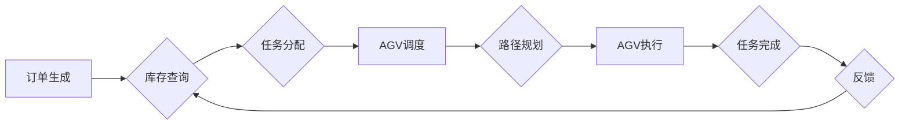

                 

## 电商仓储中的AGV调度与路径规划算法

> 关键词：AGV, 自动导引车, 调度算法, 路径规划, 仓储物流, 优化算法,  人工智能

## 1. 背景介绍

随着电商行业的蓬勃发展，仓储物流的效率和自动化程度成为企业竞争力的关键因素之一。传统的人工搬运方式面临着效率低下、成本高昂、劳动强度大等问题。自动导引车（AGV）作为一种智能化物流解决方案，逐渐被广泛应用于电商仓储场景。AGV能够自动完成货物搬运任务，提高仓储效率，降低运营成本，提升工作环境。

然而，AGV的有效应用依赖于高效的调度和路径规划算法。AGV调度算法负责分配任务给AGV，并协调AGV之间的协作，确保货物按时送达目的地。路径规划算法则负责为AGV规划最优的移动路径，避免冲突，提高搬运效率。

## 2. 核心概念与联系

### 2.1  AGV调度

AGV调度是指根据实时库存信息、订单需求和AGV状态，分配任务给AGV，并协调AGV之间的协作，确保货物按时送达目的地。

### 2.2  路径规划

路径规划是指为AGV规划最优的移动路径，避免碰撞、阻塞，并考虑时间、距离等因素，以达到最优的搬运效率。

**核心概念与联系流程图:**



## 3. 核心算法原理 & 具体操作步骤

### 3.1  算法原理概述

AGV调度与路径规划算法通常采用启发式搜索算法、模拟退火算法、遗传算法等优化算法，通过不断迭代和优化，找到最优的调度方案和路径。

### 3.2  算法步骤详解

**3.2.1  AGV调度算法步骤:**

1. **任务接收:** 收集订单信息和仓储库存数据。
2. **任务分配:** 根据任务优先级、AGV负载能力、距离等因素，将任务分配给合适的AGV。
3. **路径规划:** 为每个AGV规划最优的搬运路径。
4. **协同控制:** 协调AGV之间的运动，避免碰撞和冲突。
5. **任务完成:** AGV完成任务后，更新库存数据和订单状态。

**3.2.2  路径规划算法步骤:**

1. **地图构建:** 建立仓库环境的拓扑地图，包括障碍物、货架位置、AGV起始点和目标点等信息。
2. **路径搜索:** 使用启发式搜索算法、模拟退火算法等，在拓扑地图上搜索最优路径。
3. **路径优化:** 对搜索到的路径进行优化，例如避免拐角过多、缩短路径长度等。
4. **路径发布:** 将优化后的路径发送给AGV，指导其运动。

### 3.3  算法优缺点

**3.3.1  AGV调度算法:**

* **优点:** 提高任务分配效率，优化资源利用率，减少搬运时间。
* **缺点:** 算法复杂度高，需要考虑多因素的影响，实时性要求高。

**3.3.2  路径规划算法:**

* **优点:** 避免碰撞和冲突，缩短搬运路径，提高搬运效率。
* **缺点:** 算法精度受地图构建质量影响，动态环境变化难以适应。

### 3.4  算法应用领域

AGV调度与路径规划算法广泛应用于电商仓储、制造业、医院、机场等领域，提高物流效率、降低运营成本，提升工作效率。

## 4. 数学模型和公式 & 详细讲解 & 举例说明

### 4.1  数学模型构建

**4.1.1  AGV调度模型:**

可以将AGV调度问题建模为一个资源分配问题，其中资源为AGV，任务为搬运货物。

**4.1.2  路径规划模型:**

可以将路径规划问题建模为一个最短路径问题，目标是找到从起点到终点的最短路径。

### 4.2  公式推导过程

**4.2.1  任务分配模型:**

可以使用线性规划模型来解决任务分配问题，目标函数为最小化总搬运时间，约束条件为AGV负载能力、任务优先级等。

**4.2.2  最短路径算法:**

常用的最短路径算法包括Dijkstra算法、A*算法等。这些算法利用图论知识，通过迭代搜索，找到最短路径。

### 4.3  案例分析与讲解

**4.3.1  任务分配案例:**

假设有3个AGV和5个任务，每个任务需要搬运一定数量的货物，每个AGV的负载能力不同。可以使用线性规划模型来分配任务，找到最短的总搬运时间。

**4.3.2  路径规划案例:**

假设AGV需要从仓库入口到货架A，货架A到货架B，最后到仓库出口。可以使用Dijkstra算法或A*算法来规划最短路径，避免碰撞和冲突。

## 5. 项目实践：代码实例和详细解释说明

### 5.1  开发环境搭建

* 操作系统: Ubuntu 20.04 LTS
* 编程语言: Python 3.8
* 库依赖:

    * NetworkX: 图论库
    * matplotlib: 数据可视化库
    * numpy: 数值计算库

### 5.2  源代码详细实现

```python
import networkx as nx
import matplotlib.pyplot as plt
import numpy as np

# 建立仓库地图
graph = nx.Graph()
graph.add_nodes_from(['A', 'B', 'C', 'D', 'E', 'F', 'G', 'H'])
graph.add_edges_from([('A', 'B'), ('A', 'C'), ('B', 'D'), ('C', 'E'), ('D', 'F'), ('E', 'G'), ('F', 'H')])

# 设置障碍物
obstacles = ['C', 'F']
for obstacle in obstacles:
    graph.remove_node(obstacle)

# 使用Dijkstra算法规划路径
start_node = 'A'
end_node = 'H'
path = nx.shortest_path(graph, source=start_node, target=end_node)

# 可视化路径
pos = nx.spring_layout(graph)
nx.draw(graph, pos, with_labels=True, node_color='lightblue', edge_color='black')
nx.draw_networkx_nodes(graph, pos, nodelist=path, node_color='red')
plt.show()
```

### 5.3  代码解读与分析

* 代码首先使用NetworkX库构建仓库地图，并添加障碍物。
* 然后使用Dijkstra算法规划从起点到终点的最短路径。
* 最后使用matplotlib库可视化路径。

### 5.4  运行结果展示

运行代码后，会显示一个仓库地图的图形，其中规划好的路径用红色标记。

## 6. 实际应用场景

### 6.1  电商仓储场景

AGV调度与路径规划算法在电商仓储场景中应用广泛，例如：

* **订单拣选:** AGV根据订单信息，自动前往货架拣选货物。
* **货物搬运:** AGV将货物从一个区域搬运到另一个区域。
* **货物分拣:** AGV将货物按照不同的分类进行分拣。

### 6.2  制造业场景

AGV调度与路径规划算法在制造业场景中也发挥着重要作用，例如：

* **零部件运输:** AGV将零部件从仓库运输到生产线。
* **成品搬运:** AGV将成品从生产线运输到仓库。
* **材料搬运:** AGV将原材料从仓库运输到生产线。

### 6.3  未来应用展望

随着人工智能、机器学习等技术的不断发展，AGV调度与路径规划算法将更加智能化、自动化，应用场景也将更加广泛。例如：

* **自主学习:** AGV能够根据自身运行数据，自动学习最优的调度方案和路径。
* **协同工作:** 多个AGV能够协同工作，完成更复杂的搬运任务。
* **环境适应:** AGV能够适应动态变化的环境，例如人员流動、障碍物移动等。

## 7. 工具和资源推荐

### 7.1  学习资源推荐

* **书籍:**

    * 《机器人操作系统》
    * 《人工智能：现代方法》
    * 《算法导论》

* **在线课程:**

    * Coursera: 机器人学
    * edX: 人工智能
    * Udacity: 自动驾驶

### 7.2  开发工具推荐

* **ROS (Robot Operating System):** 一个开源机器人软件框架。
* **Gazebo:** 一个机器人仿真软件。
* **Python:** 一个常用的编程语言。

### 7.3  相关论文推荐

* **A Survey of Path Planning Algorithms for Autonomous Mobile Robots**
* **AGV Path Planning Based on Improved A* Algorithm**
* **A Hybrid Approach for AGV Path Planning in Dynamic Environments**

## 8. 总结：未来发展趋势与挑战

### 8.1  研究成果总结

AGV调度与路径规划算法取得了显著的成果，提高了仓储物流效率，降低了运营成本。

### 8.2  未来发展趋势

* **智能化:** AGV调度与路径规划算法将更加智能化，能够自主学习、适应动态环境。
* **协同化:** 多个AGV将能够协同工作，完成更复杂的搬运任务。
* **融合化:** AGV调度与路径规划算法将与其他技术融合，例如人工智能、机器学习、物联网等。

### 8.3  面临的挑战

* **复杂环境:** 现实世界环境复杂多变，AGV调度与路径规划算法需要能够应对各种挑战，例如人员流動、障碍物移动等。
* **安全可靠性:** AGV需要保证安全可靠的运行，避免碰撞、事故发生。
* **成本效益:** AGV的部署和维护成本较高，需要找到合适的成本效益平衡点。

### 8.4  研究展望

未来，AGV调度与路径规划算法的研究将继续深入，探索更智能、更安全、更可靠的解决方案，推动仓储物流行业的发展。

## 9. 附录：常见问题与解答

**9.1  AGV调度与路径规划算法的效率如何？**

AGV调度与路径规划算法的效率取决于算法的复杂度、地图的构建质量、环境的复杂度等因素。

**9.2  AGV调度与路径规划算法的安全性如何？**

AGV调度与路径规划算法需要考虑安全因素，例如碰撞检测、障碍物避让等，以确保AGV的安全运行。

**9.3  AGV调度与路径规划算法的成本如何？**

AGV调度与路径规划算法的成本包括硬件成本、软件成本、维护成本等。


作者：禅与计算机程序设计艺术 / Zen and the Art of Computer Programming 
<end_of_turn>

