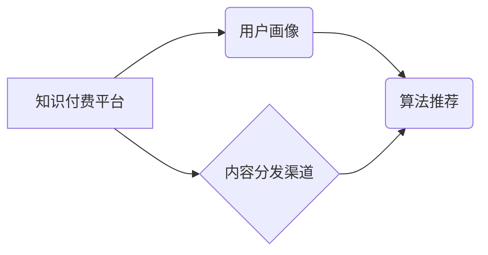

                 

## 知识付费创业中的内容分发渠道优化

> 关键词：知识付费、内容分发、渠道优化、算法推荐、用户画像、数据分析、机器学习

## 1. 背景介绍

知识付费行业近年来发展迅速，从在线课程、直播带货到付费订阅，各种模式层出不穷。然而，在竞争日益激烈的市场环境下，如何有效地将优质内容分发给目标用户，成为了知识付费创业者面临的重大挑战。

传统的营销方式，例如广告投放和社交媒体推广，成本高昂且精准度有限。而内容分发渠道的优化，则可以帮助知识付费平台更精准地触达目标用户，提高内容曝光率和转化率，从而实现可持续发展。

## 2. 核心概念与联系

### 2.1 内容分发渠道

内容分发渠道是指将知识付费内容传递给目标用户的路径和平台。常见的渠道包括：

* **自有平台:**  知识付费平台自身的网站、APP等。
* **第三方平台:**  微信公众号、抖音、B站、知乎等。
* **社交媒体:**  微博、Facebook、Twitter等。
* **搜索引擎:**  百度、谷歌等。

### 2.2 用户画像

用户画像是指对目标用户的行为、兴趣、需求等进行分析和总结，形成的描述性模型。

### 2.3 算法推荐

算法推荐是指利用机器学习等技术，根据用户的历史行为、偏好等信息，推荐他们可能感兴趣的内容。

**核心概念关系图:**



## 3. 核心算法原理 & 具体操作步骤

### 3.1 算法原理概述

内容分发渠道优化的核心算法原理是基于用户画像和内容特征进行精准匹配，并通过算法推荐机制，将最合适的知识付费内容推荐给目标用户。

常见的算法推荐模型包括：

* **协同过滤:**  根据用户的历史行为和相似用户的信息，推荐用户可能感兴趣的内容。
* **内容基准:**  根据内容的主题、标签、作者等特征，推荐与用户兴趣相符的内容。
* **混合推荐:**  结合协同过滤和内容基准两种算法，提高推荐的准确性和多样性。

### 3.2 算法步骤详解

1. **数据收集:** 收集用户行为数据、内容特征数据等。
2. **数据预处理:** 对数据进行清洗、转换、特征提取等处理。
3. **模型训练:**  选择合适的算法模型，并利用训练数据进行模型训练。
4. **模型评估:**  利用测试数据评估模型的性能，并进行模型调优。
5. **推荐系统部署:** 将训练好的模型部署到生产环境中，实现内容推荐功能。

### 3.3 算法优缺点

**优点:**

* 精准匹配:  根据用户画像和内容特征进行精准匹配，提高推荐的准确率。
* 个性化推荐:  为每个用户提供个性化的内容推荐，提升用户体验。
* 数据驱动:  基于数据分析和算法模型，实现科学化的内容分发。

**缺点:**

* 数据依赖:  算法推荐模型依赖于海量数据，数据质量直接影响推荐效果。
* 冷启动问题:  对于新用户和新内容，算法难以进行准确推荐。
* 算法黑盒:  一些算法模型的内部机制较为复杂，难以解释推荐结果。

### 3.4 算法应用领域

算法推荐技术广泛应用于：

* **电商平台:**  商品推荐、用户画像分析。
* **社交媒体:**  内容推荐、用户匹配。
* **音乐平台:**  歌曲推荐、用户喜好分析。
* **视频平台:**  视频推荐、用户行为分析。

## 4. 数学模型和公式 & 详细讲解 & 举例说明

### 4.1 数学模型构建

协同过滤算法的数学模型可以表示为用户-物品评分矩阵，其中每个元素代表用户对物品的评分。

**用户-物品评分矩阵:**

```
| 用户 | 物品1 | 物品2 | 物品3 |
|---|---|---|---|
| 用户1 | 5 | 3 | 4 |
| 用户2 | 4 | 5 | 2 |
| 用户3 | 3 | 4 | 5 |
```

### 4.2 公式推导过程

协同过滤算法的核心是计算用户之间的相似度和物品之间的相似度。

**用户相似度计算公式:**

```
相似度(用户1, 用户2) = ∑(物品i) (评分(用户1, 物品i) - 平均评分(用户1)) * (评分(用户2, 物品i) - 平均评分(用户2)) / (√(∑(物品i) (评分(用户1, 物品i) - 平均评分(用户1))^2) * √(∑(物品i) (评分(用户2, 物品i) - 平均评分(用户2))^2))
```

**物品相似度计算公式:**

```
相似度(物品1, 物品2) = ∑(用户i) (评分(用户i, 物品1) - 平均评分(物品1)) * (评分(用户i, 物品2) - 平均评分(物品2)) / (√(∑(用户i) (评分(用户i, 物品1) - 平均评分(物品1))^2) * √(∑(用户i) (评分(用户i, 物品2) - 平均评分(物品2))^2))
```

### 4.3 案例分析与讲解

假设用户A喜欢电影类型A和B，用户B喜欢电影类型B和C，则根据协同过滤算法，可以推断出用户A可能也喜欢电影类型C。

## 5. 项目实践：代码实例和详细解释说明

### 5.1 开发环境搭建

* Python 3.x
* scikit-learn
* pandas
* numpy

### 5.2 源代码详细实现

```python
from sklearn.metrics.pairwise import cosine_similarity

# 用户-物品评分矩阵
ratings_matrix = [
    [5, 3, 4],
    [4, 5, 2],
    [3, 4, 5]
]

# 计算用户相似度
user_similarity = cosine_similarity(ratings_matrix)

# 打印用户相似度矩阵
print(user_similarity)

# 计算物品相似度
item_similarity = cosine_similarity(ratings_matrix.T)

# 打印物品相似度矩阵
print(item_similarity)
```

### 5.3 代码解读与分析

* `cosine_similarity()` 函数用于计算两个向量的余弦相似度。
* `ratings_matrix` 是用户-物品评分矩阵，其中每个元素代表用户对物品的评分。
* `user_similarity` 是用户之间的相似度矩阵，其中每个元素代表两个用户之间的相似度。
* `item_similarity` 是物品之间的相似度矩阵，其中每个元素代表两个物品之间的相似度。

### 5.4 运行结果展示

运行代码后，会输出用户相似度矩阵和物品相似度矩阵。

## 6. 实际应用场景

### 6.1 知识付费平台内容推荐

知识付费平台可以利用用户画像和内容特征，通过算法推荐机制，将最合适的课程、直播、文章等内容推荐给目标用户，提高用户粘性和转化率。

### 6.2 社交媒体内容分发

社交媒体平台可以利用用户行为数据和内容标签，通过算法推荐机制，将用户感兴趣的内容推荐给其好友或关注的用户，提高内容曝光率和用户互动。

### 6.3 个性化学习路径

教育机构可以利用用户学习数据和课程内容，通过算法推荐机制，为每个学生定制个性化的学习路径，提高学习效率和效果。

### 6.4 未来应用展望

随着人工智能技术的不断发展，内容分发渠道优化将更加智能化、个性化和精准化。未来，我们可以期待：

* 更强大的算法模型，能够更准确地预测用户需求。
* 更丰富的用户数据，能够更全面地刻画用户画像。
* 更个性化的内容推荐，能够满足用户的个性化需求。

## 7. 工具和资源推荐

### 7.1 学习资源推荐

* **机器学习课程:**  Coursera、edX、Udacity 等平台提供丰富的机器学习课程。
* **算法推荐书籍:**  《推荐系统实践》、《算法导论》等书籍对算法推荐技术进行了深入讲解。
* **开源项目:**  TensorFlow、PyTorch 等开源项目提供了丰富的算法模型和工具。

### 7.2 开发工具推荐

* **Python:**  Python 是机器学习和数据分析的常用语言。
* **scikit-learn:**  scikit-learn 是 Python 的机器学习库，提供了丰富的算法模型和工具。
* **pandas:**  pandas 是 Python 的数据分析库，提供了高效的数据处理和分析功能。

### 7.3 相关论文推荐

* **Collaborative Filtering for Implicit Feedback Datasets**
* **Matrix Factorization Techniques for Recommender Systems**
* **Hybrid Recommender Systems: A Survey**

## 8. 总结：未来发展趋势与挑战

### 8.1 研究成果总结

知识付费创业中的内容分发渠道优化已经取得了显著成果，算法推荐技术能够有效地提高内容曝光率和转化率。

### 8.2 未来发展趋势

未来，内容分发渠道优化将更加智能化、个性化和精准化。

* **深度学习:**  深度学习算法能够更好地理解用户需求和内容特征，提高推荐的准确率。
* **多模态推荐:**  结合文本、图像、音频等多模态数据，实现更全面的内容推荐。
* **实时推荐:**  利用实时数据流，实现更动态和精准的推荐。

### 8.3 面临的挑战

* **数据隐私:**  用户数据隐私保护是一个重要的挑战。
* **算法公平性:**  算法推荐结果可能存在偏见，需要保证算法公平性。
* **用户信任:**  用户需要信任算法推荐的结果，需要建立用户对算法的信任机制。

### 8.4 研究展望

未来，我们需要继续探索更先进的算法模型、更丰富的用户数据和更有效的信任机制，以实现更智能、更个性化、更精准的内容分发渠道优化。

## 9. 附录：常见问题与解答

**Q1: 算法推荐的准确率如何保证？**

**A1:** 算法推荐的准确率取决于训练数据的质量、算法模型的选择和模型调优。

**Q2: 如何解决冷启动问题？**

**A2:**  可以使用基于内容的推荐、基于用户的协同过滤等方法，结合用户行为数据和内容特征，进行冷启动推荐。

**Q3: 如何保证算法推荐的公平性？**

**A3:**  需要对算法模型进行公平性评估，并采取措施避免算法偏见。

**作者：禅与计算机程序设计艺术 / Zen and the Art of Computer Programming**


<end_of_turn>

