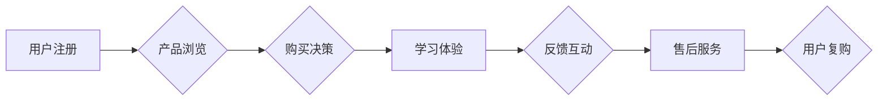

                 

## 知识付费创业中的用户服务体系搭建

> 关键词：知识付费、用户服务、体系搭建、用户体验、运营策略、数据分析、技术架构

### 1. 背景介绍

知识付费行业近年来发展迅速，从在线课程、直播带货到付费咨询，各种知识付费模式层出不穷。然而，随着市场竞争的加剧，用户对知识付费产品的质量和服务体验要求也越来越高。如何构建完善的用户服务体系，提升用户粘性和复购率，成为知识付费创业者面临的重要挑战。

传统的电商模式以商品销售为核心，而知识付费则更注重用户价值的传递和持续服务。用户购买知识付费产品不仅是为了获取知识，更期望获得专业的指导、互动交流和持续学习支持。因此，知识付费创业者需要构建一个以用户为中心的、全方位服务的体系，才能在激烈的市场竞争中脱颖而出。

### 2. 核心概念与联系

#### 2.1 用户服务体系

用户服务体系是指知识付费平台为用户提供的一系列服务，涵盖用户注册、产品购买、学习体验、售后服务等各个环节。其目标是提升用户满意度、增强用户粘性和促进用户复购。

#### 2.2 用户服务流程

用户服务流程是指用户与平台交互的完整路径，包括用户注册、产品浏览、购买决策、学习体验、反馈互动、售后服务等环节。

#### 2.3 用户服务架构

用户服务架构是指知识付费平台用户服务体系的组织结构和技术支撑，包括用户数据管理、服务接口、服务流程自动化、服务质量监控等方面。

**Mermaid 流程图**



### 3. 核心算法原理 & 具体操作步骤

#### 3.1 算法原理概述

用户服务体系的构建需要结合多种算法和技术，例如：

* **推荐算法:** 根据用户的学习历史、兴趣偏好等数据，推荐合适的知识付费产品。
* **个性化学习算法:** 根据用户的学习进度、理解能力等数据，提供个性化的学习路径和内容。
* **用户行为分析算法:** 分析用户的学习行为、反馈信息等数据，洞察用户需求和痛点。
* **客服机器人算法:** 利用自然语言处理技术，构建智能客服机器人，提供快速、高效的客户服务。

#### 3.2 算法步骤详解

以推荐算法为例，其具体步骤如下：

1. **数据收集:** 收集用户的学习历史、浏览记录、评价反馈等数据。
2. **数据预处理:** 对收集到的数据进行清洗、转换、特征提取等处理，构建用户画像和产品特征向量。
3. **模型训练:** 选择合适的推荐算法模型，例如协同过滤、内容过滤、深度学习等，利用训练数据训练模型。
4. **模型评估:** 使用测试数据评估模型的推荐效果，例如准确率、召回率、覆盖率等指标。
5. **模型部署:** 将训练好的模型部署到线上环境，为用户提供个性化的产品推荐。

#### 3.3 算法优缺点

推荐算法的优缺点取决于选择的算法模型和数据质量。

* **优点:** 可以根据用户的兴趣偏好，推荐更符合用户需求的产品，提升用户体验和转化率。
* **缺点:** 需要大量的用户数据进行训练，算法模型的复杂度较高，需要专业的技术人员进行维护和优化。

#### 3.4 算法应用领域

推荐算法广泛应用于电商、社交媒体、视频平台等领域，在知识付费行业，可以用于推荐课程、直播、付费咨询等产品。

### 4. 数学模型和公式 & 详细讲解 & 举例说明

#### 4.1 数学模型构建

推荐算法的数学模型通常基于用户-物品交互矩阵，该矩阵表示用户对不同物品的评分或行为。

假设用户集合为U，物品集合为I，则用户-物品交互矩阵为一个m×n的矩阵，其中m=|U|，n=|I|。矩阵元素表示用户u对物品i的评分或行为，例如1表示用户u购买了物品i，0表示用户u没有购买物品i。

#### 4.2 公式推导过程

协同过滤算法是一种常用的推荐算法，其核心思想是基于用户的相似度或物品的相似度进行推荐。

**用户协同过滤:**

* 计算用户之间的相似度，例如余弦相似度。
* 根据用户的相似度，推荐用户喜欢的物品。

**物品协同过滤:**

* 计算物品之间的相似度，例如余弦相似度。
* 根据物品的相似度，推荐用户可能喜欢的物品。

#### 4.3 案例分析与讲解

假设有一个用户-物品交互矩阵，其中用户集合为U={u1, u2, u3}, 物品集合为I={i1, i2, i3}, 矩阵元素表示用户对物品的评分。

```
用户-物品交互矩阵
| 用户 | i1 | i2 | i3 |
|---|---|---|---|
| u1 | 5 | 3 | 4 |
| u2 | 4 | 5 | 2 |
| u3 | 3 | 4 | 5 |
```

我们可以使用余弦相似度计算用户之间的相似度，例如计算u1和u2的相似度:

```
相似度(u1, u2) = (u1.i1 * u2.i1 + u1.i2 * u2.i2 + u1.i3 * u2.i3) / (||u1|| * ||u2||)
```

其中，u1.i1表示用户u1对物品i1的评分，||u1||表示用户u1评分的向量长度。

通过计算用户之间的相似度，我们可以推荐用户可能喜欢的物品。

### 5. 项目实践：代码实例和详细解释说明

#### 5.1 开发环境搭建

* 操作系统: Ubuntu 20.04 LTS
* 编程语言: Python 3.8
* 框架: Flask
* 数据库: MySQL

#### 5.2 源代码详细实现

```python
from flask import Flask, request, jsonify
from sklearn.metrics.pairwise import cosine_similarity

app = Flask(__name__)

# 用户-物品交互矩阵
user_item_matrix = {
    'u1': {'i1': 5, 'i2': 3, 'i3': 4},
    'u2': {'i1': 4, 'i2': 5, 'i3': 2},
    'u3': {'i1': 3, 'i2': 4, 'i3': 5}
}

# 计算用户之间的余弦相似度
def calculate_similarity(user1, user2):
    # ...

# 推荐算法
def recommend_items(user_id, top_n=3):
    # ...

# API接口
@app.route('/recommend', methods=['POST'])
def recommend():
    data = request.get_json()
    user_id = data['user_id']
    # 调用推荐算法
    recommendations = recommend_items(user_id)
    return jsonify({'recommendations': recommendations})

if __name__ == '__main__':
    app.run(debug=True)
```

#### 5.3 代码解读与分析

* 代码首先定义了用户-物品交互矩阵，该矩阵存储了用户对不同物品的评分信息。
* 然后定义了计算用户之间余弦相似度的函数 `calculate_similarity`。
* `recommend_items` 函数调用 `calculate_similarity` 计算用户与其他用户的相似度，并根据相似度推荐用户可能喜欢的物品。
* 最后定义了一个 `/recommend` 接口，接收用户ID作为参数，返回推荐的物品列表。

#### 5.4 运行结果展示

当用户发送 POST 请求到 `/recommend` 接口，并提供用户ID，服务器会返回一个 JSON 格式的响应，包含推荐的物品列表。

### 6. 实际应用场景

#### 6.1 在线课程平台

知识付费平台可以利用用户服务体系，为用户提供个性化的学习推荐、学习进度跟踪、在线答疑等服务，提升用户学习体验和学习效率。

#### 6.2 直播带货平台

直播带货平台可以利用用户服务体系，为用户提供直播预告、互动问答、售后服务等服务，提升用户参与度和购买转化率。

#### 6.3 付费咨询平台

付费咨询平台可以利用用户服务体系，为用户提供咨询预约、咨询记录、咨询师评价等服务，提升用户信任度和咨询体验。

#### 6.4 未来应用展望

随着人工智能技术的不断发展，用户服务体系将更加智能化、个性化和自动化。例如，利用自然语言处理技术，构建智能客服机器人，为用户提供24小时在线服务；利用机器学习技术，预测用户的学习需求和行为，提供更精准的个性化推荐。

### 7. 工具和资源推荐

#### 7.1 学习资源推荐

* **书籍:**

    * 《推荐系统实践》
    * 《机器学习》
    * 《深度学习》

* **在线课程:**

    * Coursera: 机器学习
    * Udacity: 深度学习
    * edX: 数据科学

#### 7.2 开发工具推荐

* **Python:** 

    * Flask: Web 框架
    * Scikit-learn: 机器学习库
    * TensorFlow: 深度学习库

* **数据库:**

    * MySQL
    * PostgreSQL

#### 7.3 相关论文推荐

* **协同过滤算法:**

    * "Collaborative Filtering for Implicit Feedback Datasets"
    * "Matrix Factorization Techniques for Recommender Systems"

* **深度学习推荐算法:**

    * "Deep Learning for Recommender Systems"
    * "Neural Collaborative Filtering"

### 8. 总结：未来发展趋势与挑战

#### 8.1 研究成果总结

知识付费创业中的用户服务体系搭建是一个不断发展和完善的过程。通过结合多种算法和技术，可以为用户提供更智能化、个性化和全面的服务体验。

#### 8.2 未来发展趋势

* **更智能化的服务:** 利用人工智能技术，构建更智能的客服机器人、个性化学习推荐系统等。
* **更个性化的服务:** 根据用户的学习习惯、兴趣偏好等数据，提供更精准的个性化服务。
* **更全面的服务:** 除了学习服务，还可以提供社区互动、职业规划等全面的服务。

#### 8.3 面临的挑战

* **数据质量:** 用户服务体系的构建需要大量高质量的数据，而数据收集、清洗和处理是一个复杂的过程。
* **算法模型:** 算法模型的复杂度较高，需要专业的技术人员进行维护和优化。
* **用户隐私:** 用户数据安全和隐私保护是一个重要的挑战。

#### 8.4 研究展望

未来，知识付费创业中的用户服务体系将更加智能化、个性化和自动化，为用户提供更优质的学习体验和服务。

### 9. 附录：常见问题与解答

* **Q1: 如何收集用户数据？**

    * A1: 可以通过用户注册、学习行为记录、反馈调查等方式收集用户数据。

* **Q2: 如何保证用户数据安全？**

    * A2: 需要采取相应的安全措施，例如加密传输、数据脱敏等，保护用户数据安全。

* **Q3: 如何评估用户服务体系的有效性？**

    * A3: 可以通过用户满意度调查、复购率、用户留存率等指标评估用户服务体系的有效性。


作者：禅与计算机程序设计艺术 / Zen and the Art of Computer Programming 
<end_of_turn>

