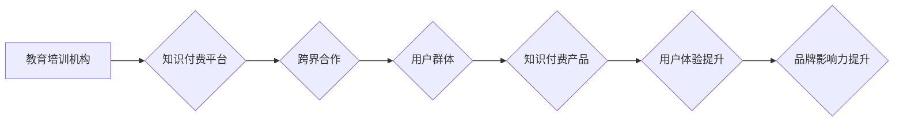

                 

## 关键词：知识付费、跨界营销、教育培训机构、跨界合作、在线教育、内容营销、用户体验

## 1. 背景介绍

知识付费作为一种新型的商业模式，近年来发展迅速，其核心在于将知识和技能转化为有价值的商品，通过线上平台进行销售。随着互联网技术的普及和用户对知识的需求不断增长，知识付费市场呈现出蓬勃发展的态势。

教育培训机构作为传统教育领域的佼佼者，拥有丰富的教学资源和经验，但传统线下模式面临着受地域限制、成本高昂等问题。而知识付费模式的出现为教育培训机构提供了新的发展机遇，可以帮助他们突破地域限制，扩大用户群体，提升盈利能力。

然而，知识付费市场竞争激烈，如何实现跨界营销，与其他行业进行合作，拓展新的用户群体，成为教育培训机构面临的重要挑战。

## 2. 核心概念与联系

### 2.1 知识付费

知识付费是指将知识、技能、经验等转化为有价值的商品，通过线上平台进行销售的商业模式。其核心价值在于为用户提供有价值的知识和技能，帮助他们提升自我价值和解决实际问题。

### 2.2 跨界营销

跨界营销是指企业与其他行业或品牌合作，共同推广产品或服务，以达到扩大市场影响力、提升品牌知名度和用户粘性的目的。其核心在于打破行业壁垒，寻找新的合作机会，创造新的价值。

### 2.3 教育培训机构

教育培训机构是指提供教育培训服务的组织机构，其主要业务包括课程开发、教学服务、学员管理等。其核心价值在于为用户提供专业的教育培训服务，帮助他们提升知识水平和技能水平。

**跨界营销与知识付费的连接**

教育培训机构可以通过与其他行业或品牌进行跨界合作，将知识付费模式融入到营销策略中，实现跨界营销。例如，与科技公司合作开发线上课程，与生活方式品牌合作推出主题课程，与媒体平台合作进行内容推广等。

**Mermaid 流程图**



## 3. 核心算法原理 & 具体操作步骤

### 3.1 算法原理概述

跨界营销与知识付费的结合，本质上是一种数据驱动和用户体验优化算法。

**数据驱动:** 通过收集用户数据，分析用户兴趣、需求和行为，精准定位目标用户群体，并根据用户画像进行个性化推荐和内容定制。

**用户体验优化:** 通过优化用户体验，提高用户粘性和转化率。例如，提供便捷的学习平台、丰富的课程内容、互动式的学习方式等。

### 3.2 算法步骤详解

1. **数据收集:** 收集用户数据，包括用户基本信息、学习行为、兴趣爱好、消费习惯等。
2. **数据分析:** 利用数据分析技术，分析用户数据，构建用户画像，识别用户需求和兴趣。
3. **目标用户定位:** 根据用户画像，精准定位目标用户群体。
4. **内容定制:** 根据目标用户群体，定制个性化的知识付费产品，包括课程内容、学习方式、价格策略等。
5. **跨界合作:** 与其他行业或品牌进行跨界合作，扩大用户群体，提升品牌影响力。
6. **用户体验优化:** 提供便捷的学习平台、丰富的课程内容、互动式的学习方式等，提升用户体验。
7. **效果评估:** 定期评估跨界营销和知识付费的效果，并根据评估结果进行调整和优化。

### 3.3 算法优缺点

**优点:**

* 精准定位目标用户群体，提高营销效率。
* 提供个性化知识付费产品，满足用户需求。
* 扩大用户群体，提升品牌影响力。
* 提升用户体验，提高用户粘性和转化率。

**缺点:**

* 数据收集和分析需要投入大量时间和资源。
* 需要与其他行业或品牌进行合作，协调难度较大。
* 需要不断优化算法和策略，才能保持竞争优势。

### 3.4 算法应用领域

* 教育培训机构
* 科技公司
* 生活方式品牌
* 媒体平台
* 其他行业或品牌

## 4. 数学模型和公式 & 详细讲解 & 举例说明

### 4.1 数学模型构建

我们可以用一个简单的数学模型来描述跨界营销和知识付费的相互作用：

**用户价值 = 知识价值 * 营销价值 * 用户体验价值**

其中：

* **知识价值:** 指知识付费产品本身的价值，例如课程内容的深度、实用性、师资力量等。
* **营销价值:** 指跨界营销带来的用户流量和品牌影响力，例如合作平台的规模、用户群体、品牌知名度等。
* **用户体验价值:** 指用户在学习过程中获得的体验，例如学习平台的便捷性、课程内容的趣味性、互动学习的参与度等。

### 4.2 公式推导过程

这个模型的推导过程基于以下假设：

* 用户选择购买知识付费产品的主要因素是其价值。
* 知识付费产品的价值由知识价值、营销价值和用户体验价值三个方面决定。
* 三个方面相互影响，共同决定了用户价值。

### 4.3 案例分析与讲解

例如，一家教育培训机构与一家科技公司合作开发线上课程，可以利用科技公司的用户流量和品牌影响力，提升知识付费产品的营销价值。同时，教育培训机构可以利用其专业的教学经验和丰富的课程资源，提升知识付费产品的知识价值。

通过优化用户体验，例如提供互动式的学习方式、个性化的学习计划等，可以进一步提升用户价值，提高用户粘性和转化率。

## 5. 项目实践：代码实例和详细解释说明

### 5.1 开发环境搭建

* 操作系统：Windows/macOS/Linux
* 编程语言：Python
* 开发工具：VS Code/PyCharm
* 框架：Flask/Django

### 5.2 源代码详细实现

```python
from flask import Flask, render_template

app = Flask(__name__)

@app.route('/')
def index():
    return render_template('index.html')

if __name__ == '__main__':
    app.run(debug=True)
```

**代码解读与分析:**

* 该代码是一个简单的Flask web应用，用于展示跨界营销和知识付费的案例。
* `app = Flask(__name__)` 创建了一个Flask应用实例。
* `@app.route('/')` 定义了根路径的路由规则，当访问根路径时，会执行`index()`函数。
* `index()`函数渲染`index.html`模板文件，展示案例内容。

### 5.3 代码运行结果展示

运行该代码后，访问`http://127.0.0.1:5000/`，即可看到跨界营销和知识付费案例的展示页面。

## 6. 实际应用场景

### 6.1 教育培训机构与科技公司合作

教育培训机构可以与科技公司合作，开发线上课程，利用科技公司的用户流量和技术优势，提升知识付费产品的营销价值和用户体验价值。

### 6.2 教育培训机构与生活方式品牌合作

教育培训机构可以与生活方式品牌合作，推出主题课程，例如与健身品牌合作推出健康生活课程，与旅行品牌合作推出旅行文化课程等，吸引目标用户群体。

### 6.3 教育培训机构与媒体平台合作

教育培训机构可以与媒体平台合作，进行内容推广，例如与视频平台合作推出知识付费课程，与社交媒体平台合作进行用户互动推广等，扩大用户群体。

### 6.4 未来应用展望

随着人工智能、大数据、云计算等技术的不断发展，跨界营销和知识付费将更加深入融合，呈现出更加多元化的应用场景。例如，利用人工智能技术进行个性化推荐，利用大数据技术进行用户画像分析，利用云计算技术提供更加便捷的学习平台等。

## 7. 工具和资源推荐

### 7.1 学习资源推荐

* **在线课程平台:** Coursera、edX、Udemy
* **技术博客:** Hacker News、Medium、Stack Overflow
* **书籍:** 《Python编程：从入门到实践》、《机器学习实战》

### 7.2 开发工具推荐

* **编程语言:** Python、Java、C++
* **开发框架:** Flask、Django、Spring Boot
* **数据库:** MySQL、MongoDB、PostgreSQL

### 7.3 相关论文推荐

* **跨界营销:** "Cross-Brand Marketing: A Literature Review and Future Research Directions"
* **知识付费:** "The Rise of Knowledge as a Commodity: A Review of the Literature on Knowledge-Based Markets"

## 8. 总结：未来发展趋势与挑战

### 8.1 研究成果总结

跨界营销与知识付费的结合，为教育培训机构提供了新的发展机遇，可以帮助他们突破地域限制，扩大用户群体，提升盈利能力。

### 8.2 未来发展趋势

未来，跨界营销和知识付费将更加深入融合，呈现出更加多元化的应用场景。例如，利用人工智能技术进行个性化推荐，利用大数据技术进行用户画像分析，利用云计算技术提供更加便捷的学习平台等。

### 8.3 面临的挑战

* 数据安全和隐私保护
* 跨界合作的协调难度
* 算法的不断优化和迭代

### 8.4 研究展望

未来，我们需要进一步研究跨界营销和知识付费的机制，开发更加智能化、个性化的算法，并探索新的应用场景，推动跨界营销和知识付费的健康发展。

## 9. 附录：常见问题与解答

**常见问题:**

* 如何进行跨界合作？
* 如何收集和分析用户数据？
* 如何优化用户体验？

**解答:**

* 跨界合作需要双方进行充分沟通，明确合作目标、合作模式、资源共享等事宜。
* 用户数据收集可以利用网站、APP、社交媒体等平台，数据分析可以使用数据挖掘、机器学习等技术。
* 用户体验优化可以从学习平台的便捷性、课程内容的趣味性、互动学习的参与度等方面入手。


作者：禅与计算机程序设计艺术 / Zen and the Art of Computer Programming 
<end_of_turn>

