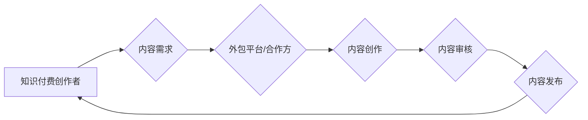

                 

## 知识付费赚钱的内容生产外包与合作策略

> 关键词：知识付费、内容生产、外包、合作、策略、效率、质量、风险

## 1. 背景介绍

知识付费已成为当今互联网经济的重要组成部分，其蓬勃发展得益于互联网技术的进步、知识经济的兴起以及人们对自我提升和技能学习的日益重视。在这个市场中，优质的内容是核心竞争力，而内容生产的效率和质量直接影响着知识付费平台的成功。

然而，对于许多知识付费创作者来说，内容生产是一个耗时耗力的过程，需要投入大量的时间和精力进行研究、撰写、编辑和排版。为了提高效率，降低成本，许多创作者开始寻求外包和合作的方式来完成内容生产任务。

## 2. 核心概念与联系

### 2.1 内容生产外包

内容生产外包是指知识付费创作者将内容创作任务委托给第三方专业机构或个人完成。

### 2.2 内容生产合作

内容生产合作是指知识付费创作者与其他创作者、专家或机构建立合作关系，共同完成内容创作任务。

**Mermaid 流程图**



## 3. 核心算法原理 & 具体操作步骤

### 3.1 算法原理概述

内容生产外包和合作的成功关键在于高效匹配内容需求和创作能力。这需要基于以下算法原理：

* **内容分类与标签化:** 对知识付费内容进行细致分类和标签化，以便精准匹配合适的创作团队。
* **创作能力评估:** 对潜在的创作团队进行能力评估，包括写作水平、专业知识、经验积累等。
* **需求匹配算法:** 基于内容分类、标签化和创作能力评估，采用算法匹配内容需求和创作团队。

### 3.2 算法步骤详解

1. **内容需求采集:** 知识付费创作者明确内容主题、目标受众、风格要求、字数要求等。
2. **内容分类与标签化:** 根据内容主题、领域、类型等进行分类，并添加相应的标签。
3. **创作团队库构建:** 建立一个包含多个创作团队的库，并对每个团队进行能力评估和信息录入。
4. **需求匹配算法:** 利用算法对内容需求和创作团队库进行匹配，推荐最合适的创作团队。
5. **团队选择与沟通:** 知识付费创作者根据算法推荐选择合适的创作团队，并进行沟通协商。
6. **内容创作与审核:** 创作团队根据需求进行内容创作，并经过知识付费创作者的审核。
7. **内容发布与推广:** 完成审核的优质内容进行发布和推广。

### 3.3 算法优缺点

**优点:**

* **提高效率:** 自动化匹配过程，节省创作者时间和精力。
* **提升质量:** 精准匹配内容需求和创作能力，提高内容质量。
* **降低成本:** 利用外包和合作模式，降低内容生产成本。

**缺点:**

* **算法准确性:** 算法匹配的准确性取决于数据质量和算法模型的完善程度。
* **沟通成本:** 跨团队沟通需要投入时间和精力，可能存在理解偏差。
* **质量控制:** 需要建立完善的质量控制机制，确保内容质量符合预期。

### 3.4 算法应用领域

* **知识付费平台:** 为创作者提供内容生产外包和合作服务。
* **内容创作机构:** 利用算法匹配内容需求和创作团队，提高创作效率。
* **教育培训机构:** 利用算法匹配专家和学员，提供个性化学习服务。

## 4. 数学模型和公式 & 详细讲解 & 举例说明

### 4.1 数学模型构建

为了评估创作团队的匹配度，可以构建一个基于内容需求和创作能力的评分模型。

**评分模型:**

```
匹配度 = (内容相似度 * 能力匹配度) / 总分
```

其中:

* 内容相似度:  衡量内容主题、风格、目标受众等方面的相似度。
* 能力匹配度: 衡量创作团队的写作水平、专业知识、经验积累等方面的匹配度。
* 总分:  预设的最高评分值。

### 4.2 公式推导过程

* 内容相似度可以通过余弦相似度等算法计算。
* 能力匹配度可以通过专家评分、作品评价等方式评估。

### 4.3 案例分析与讲解

假设一个知识付费创作者需要创作一篇关于人工智能的博客文章，目标受众是初学者。

* 内容相似度:  文章主题为人工智能，目标受众为初学者，可以设定一个高分。
* 能力匹配度:  如果一个创作团队拥有丰富的写作经验、对人工智能有一定的了解，可以设定一个较高分。

根据评分模型，该创作团队的匹配度较高，因此更适合完成该任务。

## 5. 项目实践：代码实例和详细解释说明

### 5.1 开发环境搭建

* Python 3.x 环境
* 必要的库依赖: pandas, scikit-learn, nltk 等

### 5.2 源代码详细实现

```python
import pandas as pd
from sklearn.metrics.pairwise import cosine_similarity

# 数据加载
content_data = pd.read_csv("content_data.csv")
team_data = pd.read_csv("team_data.csv")

# 内容相似度计算
def calculate_content_similarity(content1, content2):
    # 使用 TF-IDF 或其他方法计算内容相似度
    # ...

# 能力匹配度计算
def calculate_ability_match(team, content):
    # 根据团队技能和内容需求计算匹配度
    # ...

# 匹配度计算
def calculate_match_score(content, team):
    content_similarity = calculate_content_similarity(content, team)
    ability_match = calculate_ability_match(team, content)
    return (content_similarity * ability_match) / 100

# 匹配推荐
def recommend_teams(content):
    scores = []
    for team in team_data:
        score = calculate_match_score(content, team)
        scores.append((team, score))
    return sorted(scores, key=lambda x: x[1], reverse=True)

# 示例使用
content = content_data.iloc[0]
recommended_teams = recommend_teams(content)
print(recommended_teams)
```

### 5.3 代码解读与分析

* 代码首先加载内容和团队数据。
* 然后定义了计算内容相似度和能力匹配度的函数。
* 核心函数 `calculate_match_score` 根据内容相似度和能力匹配度计算匹配度得分。
* `recommend_teams` 函数根据内容需求推荐最合适的创作团队。

### 5.4 运行结果展示

运行代码后，将输出一个包含推荐团队及其匹配度得分列表。

## 6. 实际应用场景

### 6.1 知识付费平台

知识付费平台可以利用外包和合作模式，降低内容生产成本，提高平台内容丰富度和更新频率。

### 6.2 内容创作机构

内容创作机构可以利用算法匹配内容需求和创作团队，提高创作效率和内容质量。

### 6.3 教育培训机构

教育培训机构可以利用外包和合作模式，提供个性化学习内容，满足不同学员的需求。

### 6.4 未来应用展望

随着人工智能技术的进步，内容生产外包和合作模式将更加智能化、高效化。未来，我们可以看到：

* 更精准的匹配算法: 基于深度学习等技术，实现更精准的内容需求和创作能力匹配。
* 更智能化的内容创作: 利用人工智能辅助创作，提高内容质量和效率。
* 更丰富的合作模式: 出现更多灵活的合作模式，例如分工合作、联合创作等。

## 7. 工具和资源推荐

### 7.1 学习资源推荐

* **书籍:** 《知识付费商业模式》、《内容营销实战》
* **课程:**  Coursera 上的“内容营销”课程
* **博客:**  内容营销相关的博客，例如 Copyblogger, Content Marketing Institute

### 7.2 开发工具推荐

* **内容管理系统 (CMS):** WordPress, Drupal, Joomla
* **协作工具:**  Slack, Trello, Asana
* **人工智能工具:**  GPT-3, BERT

### 7.3 相关论文推荐

* **内容推荐算法:**  “Collaborative Filtering for Implicit Feedback Datasets”
* **内容生成模型:**  “Generative Pre-trained Transformer 3”

## 8. 总结：未来发展趋势与挑战

### 8.1 研究成果总结

知识付费内容生产外包和合作模式已成为一种有效的模式，可以提高效率、降低成本、提升内容质量。

### 8.2 未来发展趋势

未来，内容生产外包和合作模式将更加智能化、高效化，人工智能技术将发挥越来越重要的作用。

### 8.3 面临的挑战

* **算法准确性:** 算法匹配的准确性仍然是一个挑战，需要不断改进算法模型和数据质量。
* **质量控制:** 需要建立完善的质量控制机制，确保内容质量符合预期。
* **版权和知识产权:** 需要解决内容版权和知识产权问题。

### 8.4 研究展望

未来研究方向包括：

* 开发更精准的匹配算法，例如基于深度学习的算法。
* 研究人工智能辅助内容创作的应用，提高内容质量和效率。
* 建立完善的知识付费内容生产外包和合作生态系统。

## 9. 附录：常见问题与解答

### 9.1 如何选择合适的创作团队？

* 了解团队的写作水平、专业知识、经验积累等。
* 查看团队的作品案例，评估作品质量和风格。
* 与团队进行沟通，了解他们的工作流程和合作方式。

### 9.2 如何确保内容质量？

* 建立完善的质量控制机制，包括内容审核、编辑校对等环节。
* 与创作团队签订合同，明确内容质量要求和责任划分。
* 定期与创作团队沟通，及时反馈意见和建议。


作者：禅与计算机程序设计艺术 / Zen and the Art of Computer Programming 
<end_of_turn>

