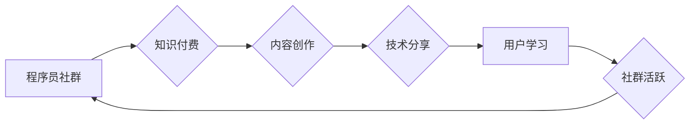

                 

## 知识付费：程序员的社群运营方案

> 关键词：知识付费、程序员、社群运营、内容创作、社区建设、技术分享、在线教育、商业模式

## 1. 背景介绍

在当今数字化时代，技术人才的需求日益增长，程序员作为科技发展的重要力量，其技能和知识也变得越来越宝贵。传统的学习方式，如线下培训课程和书籍阅读，逐渐难以满足程序员不断学习和提升的需求。知识付费模式的兴起，为程序员提供了新的学习途径和收入来源。

知识付费是指通过提供有价值的知识和技能，向用户收取费用的一种商业模式。对于程序员而言，知识付费可以帮助他们将自己的技术经验和技能转化为收益，同时也能为其他程序员提供学习和提升的机会。

## 2. 核心概念与联系

**2.1 知识付费模式**

知识付费模式的核心是提供有价值的知识和技能，并通过付费的方式获取收益。它打破了传统的知识传播模式，赋予了知识创造者更多的自主性和控制权。

**2.2 程序员社群**

程序员社群是指由程序员组成的网络或线下社区，通过分享技术经验、交流学习心得、解决技术难题等方式，促进彼此的成长和发展。

**2.3 社群运营**

社群运营是指通过一系列的策略和活动，维护和发展社群，提升社群活跃度和粘性，最终实现社群目标。

**2.4 知识付费与程序员社群的结合**

知识付费模式与程序员社群的结合，可以形成一个良性循环：

* 社群运营可以帮助知识付费者建立和维护用户群体，扩大知识传播范围。
* 知识付费可以为社群运营提供资金支持，提升社群运营的质量和效率。
* 社群成员可以通过知识付费获得更深入的学习和提升机会，提升自身的技术水平。

**Mermaid 流程图**



## 3. 核心算法原理 & 具体操作步骤

**3.1 算法原理概述**

知识付费模式的成功关键在于提供有价值的知识和技能，并将其转化为用户愿意付费的内容。这需要程序员具备以下核心能力：

* **技术深度:** 掌握扎实的技术基础和专业技能，能够解决实际问题。
* **内容创作能力:** 将技术知识转化为易于理解和吸收的内容，例如文章、视频、课程等。
* **社群运营能力:** 建立和维护活跃的社群，与用户互动交流，收集反馈意见。

**3.2 算法步骤详解**

1. **确定目标用户:** 了解目标用户的技术水平、学习需求和付费意愿。
2. **选择知识领域:** 根据自身技术优势和市场需求，选择合适的知识领域进行创作。
3. **内容创作:** 制定内容计划，创作高质量的知识付费内容，例如在线课程、技术文档、代码示例等。
4. **平台选择:** 选择合适的知识付费平台，例如 Udemy、Coursera、知识星球等。
5. **社群运营:** 建立和维护社群，与用户互动交流，收集反馈意见，提升用户粘性。
6. **推广营销:** 利用各种渠道推广知识付费内容，例如社交媒体、博客、论坛等。
7. **数据分析:** 分析用户行为数据，优化内容和运营策略。

**3.3 算法优缺点**

**优点:**

* **高收益潜力:** 知识付费模式可以为程序员带来可观的收入。
* **知识传播:** 帮助程序员将自己的技术经验和技能传播给更多人。
* **个人品牌建设:** 通过知识付费，程序员可以建立自己的个人品牌，提升行业影响力。

**缺点:**

* **内容创作成本:** 创作高质量的知识付费内容需要投入大量的时间和精力。
* **市场竞争:** 知识付费市场竞争激烈，需要不断创新和提升内容质量。
* **用户粘性:** 需要持续运营和维护社群，提升用户粘性。

**3.4 算法应用领域**

* **在线课程:** 提供编程语言、框架、工具等方面的在线课程。
* **技术文档:**  撰写技术文档，例如 API 文档、开发指南等。
* **代码示例:** 提供代码示例，帮助用户解决实际问题。
* **技术博客:** 分享技术经验和学习心得，建立个人品牌。
* **技术咨询:** 提供技术咨询服务，帮助用户解决技术难题。

## 4. 数学模型和公式 & 详细讲解 & 举例说明

**4.1 数学模型构建**

知识付费模式的成功可以看作是一个优化问题，目标是最大化收益，同时满足用户需求。我们可以构建一个数学模型来描述这个过程：

* **收益函数:**  R(C, P) =  N * P
    * R: 收益
    * C: 内容成本
    * P: 单价
    * N: 用户数量

* **用户数量函数:** N(M, A) =  α * M * A
    * N: 用户数量
    * M: 内容质量
    * A: 营销力度
    * α: 影响系数

**4.2 公式推导过程**

根据以上模型，我们可以推导出收益函数的表达式：

R(C, P) = α * M * A * P

**4.3 案例分析与讲解**

假设一个程序员想要开发一个关于 Python 编程的在线课程。

* 内容成本 C = 1000 元
* 单价 P = 100 元
* 内容质量 M = 8
* 营销力度 A = 5

根据公式，我们可以计算出该课程的潜在收益：

R(1000, 100) = α * 8 * 5 * 100 = 4000α

其中 α 代表影响系数，取决于课程的受欢迎程度、平台的流量等因素。

## 5. 项目实践：代码实例和详细解释说明

**5.1 开发环境搭建**

* 操作系统: Windows/macOS/Linux
* 编程语言: Python
* 开发工具: VS Code/PyCharm
* 知识付费平台: Udemy/Coursera/知识星球

**5.2 源代码详细实现**

以下是一个简单的 Python 课程示例代码：

```python
def hello_world():
  print("Hello, world!")

hello_world()
```

**5.3 代码解读与分析**

* `def hello_world():` 定义了一个名为 `hello_world` 的函数。
* `print("Hello, world!")` 在函数内部打印 "Hello, world!" 字符串。
* `hello_world()` 调用函数，执行代码。

**5.4 运行结果展示**

运行以上代码，输出结果为：

```
Hello, world!
```

## 6. 实际应用场景

**6.1 在线课程平台**

程序员可以将自己的技术知识和技能录制成在线课程，上传到 Udemy、Coursera 等平台，为其他程序员提供学习机会。

**6.2 技术博客**

程序员可以开设技术博客，分享技术经验和学习心得，吸引读者关注，并通过广告、赞助等方式获得收益。

**6.3 社群运营**

程序员可以建立自己的技术社群，提供技术交流、学习支持等服务，并通过会员制度、付费咨询等方式获得收益。

**6.4 未来应用展望**

随着人工智能、大数据等技术的不断发展，知识付费模式将更加深入地融入程序员的学习和工作生活。未来，我们将看到更多创新型的知识付费模式和应用场景出现。

## 7. 工具和资源推荐

**7.1 学习资源推荐**

* **在线学习平台:** Udemy、Coursera、知识星球
* **技术博客:** CSDN、博客园、Medium
* **开源社区:** GitHub、Stack Overflow

**7.2 开发工具推荐**

* **代码编辑器:** VS Code、PyCharm、Sublime Text
* **版本控制系统:** Git
* **云平台:** AWS、Azure、GCP

**7.3 相关论文推荐**

* **The Economics of Online Education**
* **The Sharing Economy: Peer-to-Peer Accommodation and the Future of Hospitality**
* **The Impact of Social Media on Knowledge Sharing**

## 8. 总结：未来发展趋势与挑战

**8.1 研究成果总结**

知识付费模式为程序员提供了新的学习和收入途径，并促进了技术知识的传播和共享。

**8.2 未来发展趋势**

* **个性化学习:** 知识付费内容将更加个性化，满足不同用户需求。
* **沉浸式体验:** 虚拟现实、增强现实等技术将被应用于知识付费内容，提供更沉浸式的学习体验。
* **社区化学习:** 社群将成为知识付费的重要组成部分，用户可以互相学习、交流和协作。

**8.3 面临的挑战**

* **内容质量:** 知识付费内容质量参差不齐，需要加强监管和引导。
* **用户信任:** 用户对知识付费平台和内容创作者的信任度需要提升。
* **商业模式创新:** 需要探索新的商业模式，实现知识付费的可持续发展。

**8.4 研究展望**

未来研究可以关注以下方面:

* **知识付费模式的优化:** 如何提高知识付费内容的质量和吸引力，提升用户体验。
* **知识付费平台的建设:** 如何构建安全、可靠、高效的知识付费平台。
* **知识付费的社会影响:** 知识付费模式对社会发展和人才培养的影响。

## 9. 附录：常见问题与解答

**9.1 如何选择合适的知识付费平台？**

选择知识付费平台需要考虑以下因素:

* 平台用户规模
* 平台收费标准
* 平台运营模式
* 平台技术支持

**9.2 如何创作高质量的知识付费内容？**

创作高质量的知识付费内容需要:

* 掌握扎实的技术基础
* 具备良好的表达能力
* 了解用户需求
* 持续更新内容

**9.3 如何推广自己的知识付费内容？**

推广知识付费内容可以通过以下方式:

* 社交媒体营销
* 博客推广
* 线下活动
* 合作推广

作者：禅与计算机程序设计艺术 / Zen and the Art of Computer Programming 


<end_of_turn>

