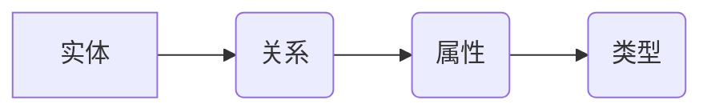

                 

## 知识图谱：构建和应用语义网络

> 关键词：知识图谱、语义网络、知识表示、推理、机器学习、自然语言处理

### 1. 背景介绍

随着互联网的蓬勃发展，海量的结构化和非结构化数据涌现，如何有效地组织、存储和利用这些数据成为了一个重大挑战。传统的关系数据库难以处理复杂的关系和语义信息，而知识图谱作为一种新型的数据模型，凭借其强大的语义表达能力和推理能力，逐渐成为解决这一问题的关键技术。

知识图谱是一种基于实体和关系的知识表示形式，它将世界中的事物（实体）及其相互关系（关系）以图的形式进行表示。每个实体都对应一个唯一的标识符，而关系则描述了实体之间的连接。通过构建知识图谱，我们可以将分散的知识点进行整合，形成一个统一的知识体系，并利用图结构的特性进行高效的知识查询、推理和分析。

### 2. 核心概念与联系

#### 2.1 实体和关系

知识图谱的核心是实体和关系。实体代表着现实世界中的事物，例如人、地点、事件等，而关系则描述了实体之间的联系，例如“出生于”、“位于”、“创作”等。

#### 2.2 节点和边

在知识图谱的图模型中，实体用节点表示，关系用边表示。节点之间通过边连接，形成一个复杂的网络结构。

#### 2.3 属性和类型

每个实体可以拥有多个属性，例如姓名、年龄、性别等。属性可以进一步分类为实例属性和类型属性。实例属性描述实体的具体特征，而类型属性则描述实体所属的类别。

#### 2.4 语义网络

知识图谱可以看作是一种语义网络，它通过实体和关系来表达知识的语义关系。语义网络能够捕捉到知识之间的隐含关系，并支持复杂的推理和查询。

**Mermaid 流程图**



### 3. 核心算法原理 & 具体操作步骤

#### 3.1 算法原理概述

知识图谱的构建和应用涉及多种算法，包括知识抽取、关系推理、知识融合等。

* **知识抽取:** 从文本数据中提取实体和关系，构建知识图谱的基本单元。
* **关系推理:** 基于已有的知识关系，推断出新的知识关系。
* **知识融合:** 将来自不同来源的知识图谱进行整合，构建更完整的知识体系。

#### 3.2 算法步骤详解

**知识抽取算法步骤:**

1. **文本预处理:** 对文本进行清洗、分词、词性标注等预处理操作，以便于后续的实体和关系识别。
2. **实体识别:** 利用自然语言处理技术，识别文本中的实体，例如人名、地名、机构名等。
3. **关系识别:** 分析文本中的句子结构和词语语义，识别实体之间的关系，例如“出生于”、“位于”、“创作”等。
4. **知识表示:** 将提取的实体和关系转换为知识图谱的节点和边，构建知识图谱的结构。

**关系推理算法步骤:**

1. **知识表示转换:** 将知识图谱转换为适合推理的逻辑形式，例如描述逻辑或规则语言。
2. **推理规则定义:** 定义一组推理规则，用于从已有的知识关系推断出新的知识关系。
3. **推理执行:** 利用推理引擎执行推理规则，推断出新的知识关系。

#### 3.3 算法优缺点

**知识抽取算法:**

* **优点:** 可以自动从文本数据中提取知识，提高知识获取效率。
* **缺点:** 识别精度和覆盖率有限，需要不断改进算法和训练数据。

**关系推理算法:**

* **优点:** 可以推断出隐含的知识关系，扩展知识图谱的规模和深度。
* **缺点:** 推理规则的定义需要专业知识，推理过程可能存在逻辑错误。

#### 3.4 算法应用领域

知识图谱的算法应用广泛，包括：

* **搜索引擎:** 提升搜索结果的准确性和相关性。
* **问答系统:** 提供更智能和精准的答案。
* **推荐系统:** 提供个性化推荐服务。
* **医疗诊断:** 辅助医生进行诊断和治疗。
* **金融风险管理:** 识别和评估金融风险。

### 4. 数学模型和公式 & 详细讲解 & 举例说明

#### 4.1 数学模型构建

知识图谱可以用图论模型来表示，其中实体为节点，关系为边。

* **节点:**  每个实体用一个唯一的标识符表示，例如：

```
实体1:  John Doe
实体2:  New York City
```

* **边:** 每个关系用一条连接两个节点的边表示，例如：

```
实体1(John Doe) --(出生于)--> 实体2(New York City)
```

#### 4.2 公式推导过程

知识图谱推理可以使用逻辑推理规则进行推导。例如，如果我们知道“所有美国人都是公民”，并且知道“John Doe是美国人”，那么我们可以推断出“John Doe是公民”。

* **前提1:** ∀x (美国人(x) → 公民(x))
* **前提2:** 美国人(John Doe)
* **结论:** 公民(John Doe)

#### 4.3 案例分析与讲解

**案例:** 知识图谱中包含以下实体和关系：

* 实体1:  张三
* 实体2:  李四
* 关系1:  朋友(张三, 李四)

**推理:**

* 如果我们知道“朋友关系是互惠的”，那么我们可以推断出“李四是张三的朋友”。

**公式:**

* ∀x ∀y (朋友(x, y) → 朋友(y, x))

**结论:** 朋友(李四, 张三)

### 5. 项目实践：代码实例和详细解释说明

#### 5.1 开发环境搭建

* **操作系统:** Ubuntu 20.04
* **编程语言:** Python 3.8
* **库依赖:**

```
pip install rdflib networkx
```

#### 5.2 源代码详细实现

```python
from rdflib import Graph, Literal, Namespace
from networkx import Graph

# 定义命名空间
RDF = Namespace("http://www.w3.org/1999/02/22-rdf-syntax-ns#")
RDFS = Namespace("http://www.w3.org/2000/01/rdf-schema#")
FOAF = Namespace("http://xmlns.com/foaf/0.1/")

# 创建知识图谱图
g = Graph()

# 添加实体
g.add((FOAF.Person("张三"), RDF.type, FOAF.Person))
g.add((FOAF.Person("李四"), RDF.type, FOAF.Person))

# 添加关系
g.add((FOAF.Person("张三"), FOAF.knows, FOAF.Person("李四")))

# 创建网络图
nx_graph = Graph()
for s, p, o in g.triples((None, None, None)):
    nx_graph.add_edge(s, o, relation=p)

# 打印网络图
print(nx_graph.nodes())
print(nx_graph.edges(data=True))
```

#### 5.3 代码解读与分析

* 代码首先定义了命名空间，用于标识不同的知识图谱本体。
* 然后创建了一个 RDFlib 图对象，用于存储知识图谱数据。
* 代码添加了两个实体和一个关系，并将其存储在知识图谱图中。
* 接着，代码将知识图谱数据转换为 NetworkX 图对象，以便于进行网络分析。
* 最后，代码打印了网络图的节点和边信息。

#### 5.4 运行结果展示

运行代码后，将输出以下结果：

```
['http://xmlns.com/foaf/0.1/Person/张三', 'http://xmlns.com/foaf/0.1/Person/李四']
[('http://xmlns.com/foaf/0.1/Person/张三', 'http://xmlns.com/foaf/0.1/Person/李四', {'relation': 'http://xmlns.com/foaf/0.1/knows'})]
```

### 6. 实际应用场景

#### 6.1 搜索引擎

知识图谱可以帮助搜索引擎更好地理解用户查询意图，并提供更准确、更相关的搜索结果。例如，如果用户搜索“苹果公司”，搜索引擎可以利用知识图谱中的信息，返回苹果公司的相关信息，例如公司简介、产品列表、创始人等。

#### 6.2 问答系统

知识图谱可以为问答系统提供丰富的知识库，使问答系统能够回答更复杂、更深入的问题。例如，如果用户问“中国首都是哪里？”，问答系统可以利用知识图谱中的信息，准确地回答“北京”。

#### 6.3 推荐系统

知识图谱可以帮助推荐系统更好地理解用户的兴趣和偏好，并提供更个性化的推荐服务。例如，如果用户购买了某款手机，推荐系统可以利用知识图谱中的信息，推荐与该手机相关的配件、软件或其他用户购买的手机。

#### 6.4 未来应用展望

知识图谱的应用前景广阔，未来将应用于更多领域，例如：

* **医疗保健:** 辅助医生进行诊断、治疗和药物研发。
* **教育:** 提供个性化学习体验和智能辅导。
* **金融:** 识别和评估金融风险、提供个性化理财服务。
* **智能家居:** 理解用户的需求，提供更智能的家居服务。

### 7. 工具和资源推荐

#### 7.1 学习资源推荐

* **书籍:**
    * 《知识图谱：构建和应用语义网络》
    * 《知识表示与推理》
* **在线课程:**
    * Coursera: Knowledge Graphs
    * edX: Introduction to Knowledge Graphs

#### 7.2 开发工具推荐

* **RDFlib:** Python 库，用于处理 RDF 数据。
* **NetworkX:** Python 库，用于构建和分析网络图。
* **Neo4j:** 基于图数据库的知识图谱平台。

#### 7.3 相关论文推荐

* **《A Survey of Knowledge Graph Embedding Techniques》**
* **《Knowledge Graph Completion via TransE》**

### 8. 总结：未来发展趋势与挑战

#### 8.1 研究成果总结

近年来，知识图谱技术取得了显著进展，在知识表示、推理、融合等方面取得了突破性成果。

#### 8.2 未来发展趋势

* **知识图谱规模和复杂度不断提升:** 未来知识图谱将包含更多实体和关系，并涵盖更广泛的领域。
* **知识图谱推理能力不断增强:** 研究者将开发更强大的推理算法，使知识图谱能够进行更复杂的推理和分析。
* **知识图谱与人工智能的深度融合:** 知识图谱将与机器学习、深度学习等人工智能技术深度融合，构建更智能的应用系统。

#### 8.3 面临的挑战

* **知识图谱数据质量问题:** 知识图谱数据往往存在不完整、不一致、不准确等问题，需要开发更有效的质量控制和维护机制。
* **知识图谱推理能力的局限性:** 现有的推理算法仍然难以处理复杂、多层次的知识关系。
* **知识图谱的可解释性和可信任性:** 知识图谱推理的结果往往难以解释，需要提高知识图谱的可解释性和可信任性。

#### 8.4 研究展望

未来，知识图谱技术将继续朝着更智能、更强大、更可信的方向发展，并将应用于更多领域，为人类社会带来更多价值。

### 9. 附录：常见问题与解答

* **什么是知识图谱？**

知识图谱是一种基于实体和关系的知识表示形式，它将世界中的事物及其相互关系以图的形式进行表示。

* **知识图谱有什么应用场景？**

知识图谱的应用场景非常广泛，包括搜索引擎、问答系统、推荐系统、医疗保健、教育、金融等领域。

* **如何构建知识图谱？**

知识图谱的构建需要多种技术，包括知识抽取、关系推理、知识融合等。

* **知识图谱的未来发展趋势是什么？**

未来知识图谱将朝着更智能、更强大、更可信的方向发展，并将应用于更多领域。


作者：禅与计算机程序设计艺术 / Zen and the Art of Computer Programming 
<end_of_turn>

