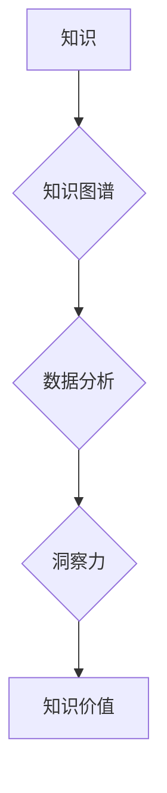

                 

## 知识的价值：洞察力赋予知识以生命力

> 关键词：知识图谱、洞察力、机器学习、数据分析、人工智能、知识管理、数据可视化、商业智能

### 1. 背景介绍

在当今数据爆炸的时代，我们被海量信息所包围。然而，仅仅拥有庞大的数据量并不能带来真正的价值。真正重要的，是能够从这些数据中提取有意义的洞察力，将其转化为可操作的知识，从而驱动决策和创新。

知识，是信息的加工和理解后的产物。它具有内在的价值，能够帮助我们理解世界，解决问题，并做出明智的判断。然而，知识的价值并非静态的，它与洞察力的结合才赋予了知识生命力。

洞察力，是指从数据中发现隐藏的模式、趋势和关系的能力。它需要我们具备批判性思维、逻辑推理和创造力，才能将数据点串联起来，形成完整的认知图景。

### 2. 核心概念与联系

**2.1 知识图谱**

知识图谱是一种数据结构，它以实体和关系的形式表示知识。实体代表现实世界中的事物，关系则描述实体之间的联系。知识图谱能够有效地组织和存储知识，并支持复杂的知识推理和查询。

**2.2 洞察力**

洞察力是通过分析数据、识别模式和趋势，并将其转化为有价值的见解的能力。它需要结合领域知识、数据分析技术和批判性思维。

**2.3 知识的价值**

知识的价值在于其能够帮助我们理解世界、解决问题和做出明智的决策。洞察力赋予了知识生命力，使其能够被应用于实际场景中。

**2.4  关联关系**

知识图谱为存储和组织知识提供了结构化框架，而洞察力则能够从知识图谱中挖掘出隐藏的价值。两者相互补充，共同构成了知识价值的实现路径。



### 3. 核心算法原理 & 具体操作步骤

**3.1 算法原理概述**

知识图谱构建和洞察力挖掘通常涉及多种算法，包括：

* **知识抽取:** 从文本数据中提取实体和关系。
* **关系推理:** 基于已有的知识关系，推断出新的知识。
* **聚类分析:** 将数据点根据相似性进行分组。
* **关联规则挖掘:** 从数据中发现频繁出现的模式和关系。

**3.2 算法步骤详解**

**3.2.1 知识抽取**

1. **文本预处理:** 清洗文本数据，去除停用词、标点符号等。
2. **实体识别:** 使用命名实体识别模型识别文本中的实体。
3. **关系抽取:** 使用关系抽取模型识别实体之间的关系。

**3.2.2 关系推理**

1. **知识表示:** 将知识表示为知识图谱的形式。
2. **推理规则:** 定义推理规则，用于推断新的知识关系。
3. **推理引擎:** 使用推理引擎执行推理规则，推断出新的知识。

**3.2.3 聚类分析**

1. **数据预处理:** 对数据进行标准化或归一化处理。
2. **距离计算:** 计算数据点之间的距离。
3. **聚类算法:** 使用聚类算法将数据点进行分组。

**3.2.4 关联规则挖掘**

1. **频繁项集挖掘:** 找出频繁出现的项集。
2. **关联规则生成:** 从频繁项集生成关联规则。

**3.3 算法优缺点**

* **知识抽取:** 优点是能够自动提取大量知识，缺点是准确率可能较低。
* **关系推理:** 优点是能够推断出新的知识，缺点是推理规则的定义需要专业知识。
* **聚类分析:** 优点是能够发现数据中的隐含结构，缺点是聚类结果的解释性较弱。
* **关联规则挖掘:** 优点是能够发现数据中的关联模式，缺点是容易产生冗余规则。

**3.4 算法应用领域**

* **搜索引擎:** 知识图谱可以帮助搜索引擎理解用户查询意图，并提供更精准的搜索结果。
* **推荐系统:** 知识图谱可以帮助推荐系统理解用户的兴趣偏好，并推荐更相关的商品或服务。
* **医疗诊断:** 知识图谱可以帮助医生诊断疾病，并提供个性化的治疗方案。
* **金融风险管理:** 知识图谱可以帮助金融机构识别和管理风险。

### 4. 数学模型和公式 & 详细讲解 & 举例说明

**4.1 数学模型构建**

知识图谱可以表示为一个三元组的集合： (实体1, 关系, 实体2)。 

其中：

* 实体1 和 实体2 是知识图谱中的实体。
* 关系 是实体之间的一种连接方式。

**4.2 公式推导过程**

假设我们有一个知识图谱，其中包含以下三元组：

* (张三, 工作在, 公司A)
* (李四, 工作在, 公司B)
* (公司A, 位于, 北京)

我们可以使用以下公式推断出新的知识：

* 张三 工作在 北京

**4.3 案例分析与讲解**

在医疗领域，知识图谱可以用于构建疾病知识图谱。

例如，我们可以将疾病、症状、治疗方法等信息表示为知识图谱中的实体和关系。

通过关系推理，我们可以推断出新的知识，例如：

* 患者A 患有感冒，感冒的症状包括发烧和咳嗽，感冒的治疗方法包括服用退烧药和休息。

**4.4 数学公式举例**

假设我们有一个知识图谱，其中包含以下三元组：

* (A, 喜欢, B)
* (B, 喜欢, C)

我们可以使用以下公式推断出新的知识：

* (A, 喜欢, C)

这个公式可以表示为：

如果 A 喜欢 B，并且 B 喜欢 C，那么 A 也喜欢 C。

### 5. 项目实践：代码实例和详细解释说明

**5.1 开发环境搭建**

* Python 3.x
* Jupyter Notebook
* 相关库：

    * NetworkX: 用于构建和操作知识图谱
    * rdflib: 用于处理 RDF 数据格式
    * spaCy: 用于自然语言处理

**5.2 源代码详细实现**

```python
import networkx as nx

# 创建知识图谱
graph = nx.DiGraph()

# 添加实体和关系
graph.add_edge('张三', '工作在', '公司A')
graph.add_edge('李四', '工作在', '公司B')
graph.add_edge('公司A', '位于', '北京')

# 打印知识图谱
print(graph.nodes())
print(graph.edges(data=True))

# 推断新的知识
for u, v, data in graph.edges(data=True):
    if data['relation'] == '工作在':
        print(f'{u} 工作在 {v}')
```

**5.3 代码解读与分析**

* 使用 NetworkX 库构建知识图谱。
* 添加实体和关系，并使用字典存储关系信息。
* 打印知识图谱的节点和边信息。
* 使用循环遍历知识图谱，推断出新的知识。

**5.4 运行结果展示**

```
['张三', '李四', '公司A', '公司B', '北京']
[('张三', '工作在', {'relation': '工作在'}), ('李四', '工作在', {'relation': '工作在'}), ('公司A', '位于', {'relation': '位于'})]
张三 工作在 公司A
李四 工作在 公司B
```

### 6. 实际应用场景

**6.1 商业智能**

知识图谱可以帮助企业分析客户行为、市场趋势和竞争对手信息，从而做出更明智的商业决策。

**6.2 个性化推荐**

知识图谱可以帮助电商平台和流媒体平台提供更个性化的商品和内容推荐。

**6.3 医疗诊断**

知识图谱可以帮助医生更快、更准确地诊断疾病，并制定个性化的治疗方案。

**6.4 未来应用展望**

随着人工智能技术的不断发展，知识图谱将在更多领域得到应用，例如：

* 自动驾驶
* 语音助手
* 教育

### 7. 工具和资源推荐

**7.1 学习资源推荐**

* **书籍:**

    * 《知识图谱》
    * 《深度学习》

* **在线课程:**

    * Coursera: 知识图谱课程
    * edX: 深度学习课程

**7.2 开发工具推荐**

* **Protégé:** 知识图谱编辑器
* **Neo4j:** 图数据库

**7.3 相关论文推荐**

* **《知识图谱的构建与应用》**
* **《深度学习在知识图谱构建中的应用》**

### 8. 总结：未来发展趋势与挑战

**8.1 研究成果总结**

知识图谱和洞察力挖掘技术取得了显著的进展，并在多个领域得到了应用。

**8.2 未来发展趋势**

* **知识图谱规模和复杂度将不断提升。**
* **知识图谱的构建和维护将更加自动化。**
* **知识图谱将与其他人工智能技术更加紧密地结合。**

**8.3 面临的挑战**

* **知识图谱的构建和维护成本较高。**
* **知识图谱的准确性和可靠性需要进一步提升。**
* **如何将知识图谱中的知识有效地应用于实际场景中是一个挑战。**

**8.4 研究展望**

未来，我们将继续致力于知识图谱和洞察力挖掘技术的研发，并将其应用于更多领域，为人类社会创造更大的价值。

### 9. 附录：常见问题与解答

**9.1 如何构建知识图谱？**

知识图谱的构建需要以下步骤：

1. **数据收集:** 收集相关领域的数据，例如文本、图像、音频等。
2. **数据预处理:** 对数据进行清洗、标准化和格式转换。
3. **实体识别:** 使用命名实体识别模型识别文本中的实体。
4. **关系抽取:** 使用关系抽取模型识别实体之间的关系。
5. **知识表示:** 将实体和关系表示为知识图谱的形式。

**9.2 如何挖掘知识图谱中的洞察力？**

可以使用多种算法挖掘知识图谱中的洞察力，例如：

* **聚类分析:** 将数据点根据相似性进行分组。
* **关联规则挖掘:** 从数据中发现频繁出现的模式和关系。
* **关系推理:** 基于已有的知识关系，推断出新的知识。


作者：禅与计算机程序设计艺术 / Zen and the Art of Computer Programming 
<end_of_turn>

