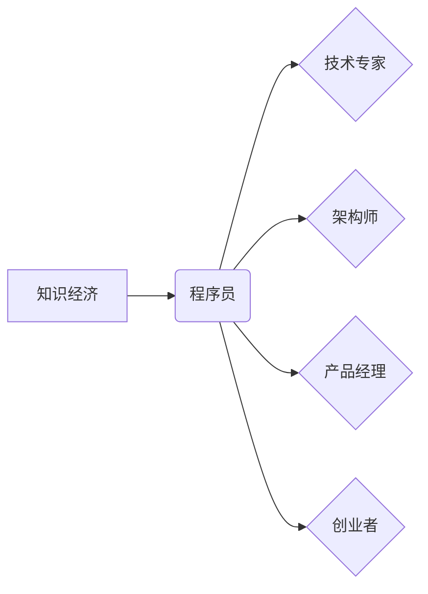

                 

## 知识经济下程序员的发展之路

> 关键词：知识经济、程序员、职业发展、技术趋势、学习方法、软技能、创新能力、跨领域合作

### 1. 背景介绍

21世纪已进入知识经济时代，知识成为生产和发展的核心要素。在这个时代，程序员作为掌握技术、创造价值的关键人才，面临着前所未有的机遇和挑战。传统编程技能不再是唯一的竞争优势，程序员需要不断学习新技术、提升自身能力，才能在激烈的竞争中脱颖而出。

随着人工智能、大数据、云计算等技术的快速发展，软件开发领域也发生了深刻变革。传统的瀑布式开发模式逐渐被敏捷开发、DevOps等新模式所取代，程序员需要具备更强的协作能力、适应能力和解决问题的能力。

### 2. 核心概念与联系

**2.1 知识经济与程序员**

知识经济的核心是知识的创造、传播和应用。程序员作为软件开发的执行者，需要不断学习和掌握新的技术知识，才能将知识转化为实际的产品和服务。

**2.2 程序员职业发展路径**

程序员的职业发展路径不再是单一的线性模式，而是更加多元化和灵活化的。程序员可以根据自身兴趣和能力，选择不同的发展方向，例如：

* **技术专家:** 深入研究某一特定领域的技术，成为技术领域的专家。
* **架构师:** 设计和构建大型软件系统，负责系统的整体架构和设计。
* **产品经理:** 负责软件产品的规划、设计和开发，将用户的需求转化为产品的功能。
* **创业者:** 利用自身的技术能力，创办自己的软件公司。

**2.3 核心概念关系图**



### 3. 核心算法原理 & 具体操作步骤

**3.1 算法原理概述**

算法是解决特定问题的步骤或规则，是程序员的核心技能之一。掌握常用的算法和数据结构，可以提高程序的效率和可读性。

**3.2 算法步骤详解**

* **排序算法:** 将数据按照特定顺序排列，例如冒泡排序、插入排序、快速排序等。
* **搜索算法:** 在数据集合中查找特定元素，例如线性搜索、二分搜索等。
* **图算法:** 处理图结构的数据，例如深度优先搜索、广度优先搜索等。

**3.3 算法优缺点**

不同的算法具有不同的优缺点，需要根据实际情况选择合适的算法。例如，快速排序的平均时间复杂度较低，但最坏情况下的时间复杂度较高，而冒泡排序的时间复杂度较高，但最坏情况下的时间复杂度较低。

**3.4 算法应用领域**

算法广泛应用于各个领域，例如：

* **人工智能:** 机器学习、深度学习等算法用于图像识别、自然语言处理等任务。
* **大数据:** 分布式算法用于处理海量数据，例如MapReduce、Spark等。
* **网络安全:** 加密算法、哈希算法等用于保护数据安全。

### 4. 数学模型和公式 & 详细讲解 & 举例说明

**4.1 数学模型构建**

数学模型可以用来描述和分析算法的性能，例如时间复杂度、空间复杂度等。

**4.2 公式推导过程**

时间复杂度是指算法执行时间随输入数据规模变化的趋势。例如，线性搜索的时间复杂度为O(n)，表示算法执行时间与输入数据规模成正比。

**4.3 案例分析与讲解**

例如，冒泡排序算法的时间复杂度为O(n^2)，表示算法执行时间与输入数据规模的平方成正比。当输入数据规模较大时，冒泡排序算法的执行时间会变得非常长。

### 5. 项目实践：代码实例和详细解释说明

**5.1 开发环境搭建**

使用常用的编程语言和开发工具，例如Python、Java、C++等。

**5.2 源代码详细实现**

提供具体的代码示例，例如实现冒泡排序算法的代码。

```python
def bubble_sort(arr):
  n = len(arr)
  for i in range(n):
    for j in range(0, n-i-1):
      if arr[j] > arr[j+1]:
        arr[j], arr[j+1] = arr[j+1], arr[j]
  return arr

# 测试代码
arr = [64, 34, 25, 12, 22, 11, 90]
sorted_arr = bubble_sort(arr)
print("排序后的数组:", sorted_arr)
```

**5.3 代码解读与分析**

解释代码的逻辑和功能，例如冒泡排序算法的原理和步骤。

**5.4 运行结果展示**

展示代码运行的结果，例如排序后的数组。

### 6. 实际应用场景

**6.1 数据排序:**

在数据库、搜索引擎等领域，需要对数据进行排序，例如按时间、按价格、按字母顺序等。

**6.2 算法优化:**

通过分析算法的时间复杂度和空间复杂度，可以优化算法的性能，提高程序的效率。

**6.3 机器学习:**

许多机器学习算法依赖于排序算法，例如支持向量机、决策树等。

**6.4 未来应用展望**

随着人工智能、大数据等技术的不断发展，算法在各个领域的应用将会更加广泛。

### 7. 工具和资源推荐

**7.1 学习资源推荐**

* **书籍:** 《算法导论》、《数据结构与算法分析》等
* **在线课程:** Coursera、edX等平台上的算法课程
* **网站:** LeetCode、HackerRank等算法练习网站

**7.2 开发工具推荐**

* **IDE:** Eclipse、IntelliJ IDEA等
* **版本控制系统:** Git

**7.3 相关论文推荐**

* **时间复杂度和空间复杂度分析:** 《Introduction to Algorithms》
* **排序算法:** 《Sorting Algorithms》

### 8. 总结：未来发展趋势与挑战

**8.1 研究成果总结**

程序员在知识经济时代面临着前所未有的机遇和挑战。掌握新的技术知识、提升自身能力、不断学习和创新，是程序员职业发展的关键。

**8.2 未来发展趋势**

* **人工智能:** 人工智能技术将对软件开发领域产生深远影响，程序员需要学习人工智能相关的知识和技能。
* **云计算:** 云计算技术将推动软件开发模式的变革，程序员需要掌握云计算相关的技术和工具。
* **大数据:** 大数据技术将产生海量数据，程序员需要学习大数据处理和分析相关的技术。

**8.3 面临的挑战**

* **技术更新迭代速度快:** 程序员需要不断学习新技术，才能跟上技术发展步伐。
* **竞争激烈:** 软件开发领域竞争激烈，程序员需要不断提升自身能力，才能脱颖而出。
* **跨领域合作:** 软件开发越来越需要跨领域合作，程序员需要具备良好的沟通和协作能力。

**8.4 研究展望**

未来，程序员的发展方向将更加多元化和灵活化，需要不断探索新的技术和领域，才能在知识经济时代取得成功。

### 9. 附录：常见问题与解答

* **Q1: 如何学习新的编程语言和技术？**

* **A1:** 可以通过在线课程、书籍、实践项目等方式学习新的编程语言和技术。

* **Q2: 如何提升自己的算法能力？**

* **A2:** 可以通过练习算法题、阅读算法书籍、参加算法竞赛等方式提升自己的算法能力。

* **Q3: 如何应对技术更新迭代速度快？**

* **A3:** 可以通过关注行业动态、参加技术研讨会、阅读技术博客等方式了解最新的技术趋势。


作者：禅与计算机程序设计艺术 / Zen and the Art of Computer Programming 
<end_of_turn>

