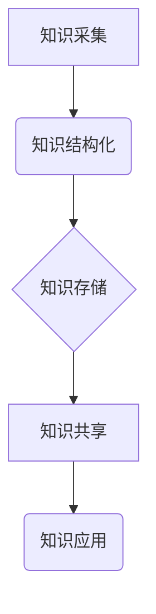

                 

## 知识输出与管理经验的系统化

> 关键词：知识管理、知识输出、系统化、经验提取、知识图谱、人工智能、知识共享

## 1. 背景介绍

在当今信息爆炸的时代，知识已成为企业和个人竞争的核心要素。如何有效地获取、存储、整理、分享和利用知识，成为各行各业面临的共同挑战。知识输出是指将知识以可理解、可应用的形式呈现出来，使其能够被他人获取和利用的过程。而知识管理则是围绕知识的获取、存储、整理、分享和利用构建的系统化体系。

传统的知识管理方法往往依赖于人工整理和文档存储，效率低下，难以应对海量知识的涌现。随着人工智能技术的快速发展，知识输出和管理迎来了新的机遇。人工智能可以帮助我们自动化知识提取、结构化知识表示、智能知识搜索和个性化知识推荐等，从而提高知识的利用效率。

## 2. 核心概念与联系

**2.1 知识输出与知识管理的关系**

知识输出是知识管理的重要环节，它将知识管理的理论和实践相结合，将知识转化为可利用的资源。

**2.2 系统化知识管理的架构**

系统化知识管理的架构通常包括以下几个模块：

* **知识采集:** 从各种来源收集知识，包括内部文档、外部数据、专家经验等。
* **知识结构化:** 将采集到的知识进行分类、组织和结构化，使其能够被机器理解和检索。
* **知识存储:** 将结构化的知识存储在知识库中，方便知识的查找和利用。
* **知识共享:** 提供知识共享平台，方便用户之间进行知识交流和协作。
* **知识应用:** 将知识应用于实际业务场景，例如决策支持、产品开发、客户服务等。



## 3. 核心算法原理 & 具体操作步骤

**3.1 算法原理概述**

知识输出和管理的核心算法主要包括：

* **自然语言处理 (NLP):** 用于理解和处理自然语言文本，例如文本分类、文本摘要、情感分析等。
* **机器学习 (ML):** 用于从数据中学习知识，例如知识图谱构建、推荐系统、异常检测等。
* **深度学习 (DL):** 用于处理复杂的数据模式，例如图像识别、语音识别、机器翻译等。

**3.2 算法步骤详解**

以知识图谱构建为例，其具体操作步骤如下：

1. **数据收集:** 从各种来源收集相关数据，例如文本、图像、数据库等。
2. **数据预处理:** 对收集到的数据进行清洗、格式化和转换，使其能够被算法处理。
3. **实体识别:** 使用NLP算法识别数据中的实体，例如人物、地点、事件等。
4. **关系抽取:** 使用ML算法识别实体之间的关系，例如“张三”和“李四”是“朋友”。
5. **知识图谱构建:** 将识别出的实体和关系构建成知识图谱，例如一个包含人物、地点、事件等实体以及它们之间关系的图。

**3.3 算法优缺点**

* **优点:** 能够自动提取知识，提高知识管理效率；能够构建知识网络，促进知识发现和推理。
* **缺点:** 算法需要大量的训练数据，训练成本较高；算法对数据质量要求较高，数据不准确会导致知识图谱质量下降。

**3.4 算法应用领域**

* **搜索引擎:** 构建知识图谱可以帮助搜索引擎理解用户查询意图，提供更精准的搜索结果。
* **问答系统:** 知识图谱可以作为问答系统的知识库，帮助用户快速找到答案。
* **推荐系统:** 知识图谱可以帮助推荐系统理解用户的兴趣，提供个性化的推荐。
* **医疗诊断:** 知识图谱可以帮助医生诊断疾病，提供更精准的治疗方案。

## 4. 数学模型和公式 & 详细讲解 & 举例说明

**4.1 数学模型构建**

知识图谱可以表示为一个三元组的集合，每个三元组由一个实体、一个关系和另一个实体组成。

* **实体 (Entity):** 表示知识图谱中的对象，例如人物、地点、事件等。
* **关系 (Relation):** 表示实体之间的连接，例如“朋友”、“工作于”、“出生于”等。
* **属性 (Property):** 描述实体的特征，例如“姓名”、“年龄”、“职业”等。

**4.2 公式推导过程**

知识图谱的构建可以利用图论和机器学习算法。

* **图论:** 可以用于分析知识图谱的结构，例如度分布、连接性等。
* **机器学习:** 可以用于预测实体之间的关系，例如基于文本语义的关联分析、基于图结构的嵌入学习等。

**4.3 案例分析与讲解**

例如，我们可以构建一个包含人物、书籍和作者关系的知识图谱。

* 实体: 张三、李四、《红楼梦》
* 关系: 作者、阅读
* 属性: 姓名、出生日期、出版日期

我们可以利用机器学习算法从书籍评论数据中学习到“张三”是《红楼梦》的作者，并将其添加到知识图谱中。

## 5. 项目实践：代码实例和详细解释说明

**5.1 开发环境搭建**

* Python 3.x
* TensorFlow 或 PyTorch
* NetworkX 或 DGL

**5.2 源代码详细实现**

```python
import networkx as nx

# 创建知识图谱
graph = nx.Graph()

# 添加实体
graph.add_node("张三")
graph.add_node("李四")
graph.add_node("《红楼梦》")

# 添加关系
graph.add_edge("张三", "《红楼梦》", relation="作者")

# 打印知识图谱
print(graph.nodes())
print(graph.edges(data=True))
```

**5.3 代码解读与分析**

* 使用 NetworkX 库创建知识图谱。
* 添加实体和关系，并指定关系类型。
* 打印知识图谱中的节点和边信息。

**5.4 运行结果展示**

```
['张三', '李四', '《红楼梦》']
[('张三', '《红楼梦》', {'relation': '作者'})]
```

## 6. 实际应用场景

**6.1 企业知识管理**

* 建立企业知识库，存储和管理企业内部知识。
* 帮助员工快速查找和利用知识，提高工作效率。
* 促进知识共享和协作，提升企业创新能力。

**6.2 教育领域**

* 建立知识图谱辅助学习平台，帮助学生理解知识之间的关系。
* 提供个性化学习路径，根据学生的学习进度和兴趣推荐相关知识。
* 辅助教师进行教学设计和知识评估。

**6.3 科学研究**

* 建立领域知识图谱，帮助研究人员发现新的知识和趋势。
* 辅助文献综述和知识挖掘，提高研究效率。
* 促进跨学科研究和知识共享。

**6.4 未来应用展望**

* 人工智能驱动的知识图谱构建和管理。
* 基于知识图谱的智能问答系统和推荐系统。
* 知识图谱与虚拟现实和增强现实技术的融合。

## 7. 工具和资源推荐

**7.1 学习资源推荐**

* **书籍:**
    * 《知识图谱》
    * 《深度学习》
    * 《自然语言处理》
* **在线课程:**
    * Coursera: 知识图谱构建与应用
    * edX: 深度学习
    * Udacity: 自然语言处理

**7.2 开发工具推荐**

* **NetworkX:** Python 图论库
* **DGL:** 深度图学习库
* **Neo4j:** 图数据库

**7.3 相关论文推荐**

* 《知识图谱：概念、构建和应用》
* 《深度学习方法在知识图谱构建中的应用》
* 《基于知识图谱的智能问答系统》

## 8. 总结：未来发展趋势与挑战

**8.1 研究成果总结**

知识输出和管理已取得了显著进展，人工智能技术为知识管理提供了新的机遇。

**8.2 未来发展趋势**

* 人工智能驱动的知识图谱构建和管理将更加智能化和自动化。
* 基于知识图谱的应用场景将更加广泛，例如智能医疗、智能教育、智能城市等。
* 知识图谱与其他技术，例如区块链、物联网等将融合发展。

**8.3 面临的挑战**

* 知识图谱的构建和维护需要大量的资源和人力投入。
* 知识图谱的质量取决于数据质量，数据不准确会导致知识图谱质量下降。
* 如何将知识图谱应用于实际业务场景，提高其实用价值是一个挑战。

**8.4 研究展望**

未来研究将重点关注以下几个方面：

* 开发更加高效、智能的知识图谱构建和管理算法。
* 探索新的知识表示形式和推理方法。
* 将知识图谱应用于更多实际领域，提高其社会价值。

## 9. 附录：常见问题与解答

* **什么是知识图谱？**

知识图谱是一种结构化的知识表示形式，它将知识表示为实体、关系和属性的网络。

* **知识图谱有什么用？**

知识图谱可以用于知识管理、搜索引擎、问答系统、推荐系统等多个领域。

* **如何构建知识图谱？**

知识图谱的构建需要使用图论和机器学习算法，从文本、图像、数据库等数据源中提取知识。


作者：禅与计算机程序设计艺术 / Zen and the Art of Computer Programming 
<end_of_turn>

