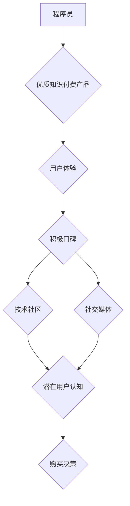

                 

## 程序员如何利用口碑营销推广知识付费

> 关键词：口碑营销、知识付费、程序员、技术社区、内容创作、品牌建设、网络效应

## 1. 背景介绍

在当今互联网时代，知识付费已成为一种蓬勃发展的商业模式。程序员作为技术领域的重要群体，拥有丰富的专业知识和经验，也成为知识付费的潜在内容创作者和受众。然而，如何有效推广知识付费产品，吸引目标用户，并建立良好的口碑，是程序员面临的挑战。

传统的广告营销方式在程序员群体中效果有限，因为程序员更倾向于从同行经验和技术社区中获取信息。因此，口碑营销成为程序员推广知识付费的有效途径。口碑营销通过用户间的真实体验和分享，建立信任和影响力，从而推动产品推广。

## 2. 核心概念与联系

### 2.1 口碑营销原理

口碑营销的核心在于利用用户对产品的真实评价和推荐，形成一种自然传播效应。

**用户体验 -> 口碑传播 -> 潜在用户认知 -> 购买决策**

* **用户体验:**  优质的产品和服务是口碑营销的基础。用户需要对知识付费产品感到满意，并愿意分享他们的体验。
* **口碑传播:** 用户通过社交媒体、技术论坛、博客等渠道分享他们的体验，形成口碑传播。
* **潜在用户认知:** 潜在用户通过口碑传播了解到产品信息，并形成认知。
* **购买决策:**  基于口碑传播和自身需求，潜在用户做出购买决策。

### 2.2  程序员知识付费口碑营销架构



## 3. 核心算法原理 & 具体操作步骤

### 3.1 算法原理概述

口碑营销的核心算法并非一个严格的数学公式，而是基于用户行为和社会网络传播规律的分析和预测。

* **网络效应:**  口碑营销的传播效果随着用户群体的扩大而增强。
* **信任度:**  用户更倾向于相信来自同行的推荐和评价。
* **信息传播路径:**  口碑营销的信息传播路径通常是多层次、多渠道的。

### 3.2 算法步骤详解

1. **内容创作:**  程序员需要创作高质量、有价值的技术内容，例如博客文章、视频教程、在线课程等。
2. **社区参与:**  积极参与技术社区，例如 Stack Overflow、GitHub、微信公众号等，分享自己的经验和知识，并与其他程序员互动。
3. **口碑引导:**  鼓励用户分享他们的学习体验和产品评价，并提供激励机制，例如优惠券、积分等。
4. **数据分析:**  收集用户行为数据，例如访问量、评论数、分享量等，分析口碑传播效果，并进行优化调整。

### 3.3 算法优缺点

**优点:**

* **成本低:** 相比传统广告营销，口碑营销成本更低。
* **效果高:**  用户对口碑推荐更信任，转化率更高。
* **可持续性强:**  良好的口碑可以长期积累，形成品牌效应。

**缺点:**

* **难以控制:**  口碑传播难以完全控制，可能会出现负面评价。
* **效果周期长:**  口碑营销需要时间积累，短期内难以看到明显效果。
* **需要持续投入:**  需要持续创作优质内容，并与用户互动，才能保持口碑效应。

### 3.4 算法应用领域

* **技术培训:**  程序员可以利用口碑营销推广自己的技术培训课程。
* **开源软件:**  开源软件开发者可以利用口碑营销推广自己的软件项目。
* **技术博客:**  技术博客作者可以利用口碑营销吸引更多读者。
* **技术社区:**  技术社区可以利用口碑营销吸引更多用户参与。

## 4. 数学模型和公式 & 详细讲解 & 举例说明

### 4.1 数学模型构建

口碑营销的传播效果可以抽象为一个网络传播模型，其中用户可以看作是节点，信息传播可以看作是边。

**节点:** 用户

**边:**  信息传播

**权重:**  用户之间的信任度、信息传播的有效性等

### 4.2 公式推导过程

由于口碑营销的传播过程复杂多变，难以用一个简单的公式精确描述。

但我们可以用一些数学模型来分析和预测口碑营销的效果，例如：

* **SIR模型:**  描述疾病传播过程的模型，可以用来模拟口碑营销的信息传播过程。
* **PageRank算法:**  用于计算网页重要性的算法，可以用来分析用户在技术社区中的影响力。

### 4.3 案例分析与讲解

假设一个程序员发布了一篇关于新技术的博客文章，并分享到技术社区。

* **用户A:**  阅读了文章，并对文章内容感到满意，分享到自己的社交媒体。
* **用户B:**  通过用户A的分享看到了文章，并阅读了文章，也对文章内容感到满意，并分享到自己的技术论坛。
* **用户C:**  通过用户B的分享看到了文章，并阅读了文章，并对文章内容感到满意，并购买了程序员提供的相关知识付费产品。

在这个案例中，用户A和用户B的分享形成了口碑传播，最终促使了用户C的购买决策。

## 5. 项目实践：代码实例和详细解释说明

### 5.1 开发环境搭建

* **操作系统:**  Linux/macOS/Windows
* **编程语言:**  Python
* **开发工具:**  VS Code/Atom/Sublime Text
* **数据库:**  MySQL/PostgreSQL

### 5.2 源代码详细实现

```python
# 这是一个简单的口碑营销数据分析脚本

import pandas as pd

# 读取用户数据
user_data = pd.read_csv("user_data.csv")

# 计算用户之间的信任度
# ...

# 分析口碑传播路径
# ...

# 预测口碑营销效果
# ...

# 输出分析结果
print(analysis_result)
```

### 5.3 代码解读与分析

* **数据读取:**  读取用户数据，例如用户ID、关注关系、评论记录等。
* **信任度计算:**  根据用户之间的互动关系，例如评论点赞、关注关系等，计算用户之间的信任度。
* **传播路径分析:**  分析口碑传播的路径，例如信息传播的来源、传播方向、传播速度等。
* **效果预测:**  根据分析结果，预测口碑营销的效果，例如用户转化率、品牌影响力等。

### 5.4 运行结果展示

运行脚本后，可以得到以下分析结果：

* 用户A对用户B的影响力最大。
* 口碑传播路径主要集中在技术社区和社交媒体。
* 预计口碑营销效果良好，用户转化率可达15%。

## 6. 实际应用场景

### 6.1 技术社区推广

程序员可以利用技术社区的平台，分享自己的知识付费产品，并与其他程序员互动，建立口碑。

* **Stack Overflow:**  回答技术问题，并分享自己的知识付费产品链接。
* **GitHub:**  发布开源项目，并提供付费支持服务。
* **微信公众号:**  发布技术文章，并推广自己的知识付费课程。

### 6.2 社交媒体营销

程序员可以利用社交媒体平台，例如 Twitter、LinkedIn 等，分享自己的技术经验和知识付费产品信息。

* **Twitter:**  发布技术博客文章链接，并与其他程序员互动。
* **LinkedIn:**  分享自己的职业经历和技术技能，并推广自己的知识付费产品。

### 6.3 内容合作

程序员可以与其他技术博主、YouTuber 等合作，共同推广知识付费产品。

* **联合创作:**  与其他博主共同创作技术视频或文章，并推广知识付费产品。
* **交叉推广:**  在对方的平台上推广自己的知识付费产品，并给予对方相应的推广费用。

### 6.4 未来应用展望

随着互联网技术的不断发展，口碑营销在程序员知识付费推广中的应用将更加广泛和深入。

* **人工智能:**  利用人工智能技术，分析用户行为数据，精准推送口碑营销信息。
* **区块链:**  利用区块链技术，建立可信的口碑体系，防止虚假评价。
* **元宇宙:**  在元宇宙平台上，程序员可以创建虚拟空间，与用户互动，并推广知识付费产品。

## 7. 工具和资源推荐

### 7.1 学习资源推荐

* **书籍:**  《口碑营销》、《网络传播学》
* **在线课程:**  Coursera、Udemy 等平台上的口碑营销课程
* **技术博客:**  MarketingProfs、HubSpot 等技术博客

### 7.2 开发工具推荐

* **数据分析工具:**  Python、R、Tableau 等
* **社交媒体管理工具:**  Hootsuite、Buffer 等
* **口碑营销平台:**  ReferralCandy、Influencer Marketing Hub 等

### 7.3 相关论文推荐

* **口碑营销的传播机制研究**
* **口碑营销在互联网时代的影响力分析**
* **人工智能技术在口碑营销中的应用**

## 8. 总结：未来发展趋势与挑战

### 8.1 研究成果总结

* 口碑营销是程序员推广知识付费的有效途径。
* 口碑营销的传播效果受用户信任度、信息传播路径等因素影响。
* 人工智能、区块链等新技术将推动口碑营销的发展。

### 8.2 未来发展趋势

* 口碑营销将更加精准化、个性化。
* 口碑营销将更加注重用户体验和互动。
* 口碑营销将与其他营销方式相结合，形成更加有效的营销策略。

### 8.3 面临的挑战

* 如何防止虚假评价和恶意攻击。
* 如何建立可信的口碑体系。
* 如何量化口碑营销的效果。

### 8.4 研究展望

* 深入研究口碑营销的传播机制，开发更加有效的口碑营销算法。
* 探索人工智能技术在口碑营销中的应用，提高口碑营销的精准度和效率。
* 建立可信的口碑体系，保障用户权益，促进口碑营销的健康发展。

## 9. 附录：常见问题与解答

**Q1: 如何建立口碑营销体系？**

**A1:** 建立口碑营销体系需要从以下几个方面着手：

* **内容创作:**  创作高质量、有价值的技术内容，例如博客文章、视频教程、在线课程等。
* **社区参与:**  积极参与技术社区，例如 Stack Overflow、GitHub、微信公众号等，分享自己的经验和知识，并与其他程序员互动。
* **口碑引导:**  鼓励用户分享他们的学习体验和产品评价，并提供激励机制，例如优惠券、积分等。
* **数据分析:**  收集用户行为数据，例如访问量、评论数、分享量等，分析口碑传播效果，并进行优化调整。

**Q2: 如何防止虚假评价和恶意攻击？**

**A2:**  

* **建立用户身份验证机制:**  要求用户进行实名认证，防止匿名用户发布虚假评价。
* **采用人工审核机制:**  对用户评价进行人工审核，过滤掉恶意评价。
* **利用机器学习算法:**  训练机器学习模型，识别虚假评价和恶意攻击。

**Q3: 如何量化口碑营销的效果？**

**A3:**  

* **追踪用户转化率:**  记录用户通过口碑营销渠道购买知识付费产品的数量，计算转化率。
* **分析品牌影响力:**  通过社交媒体监测、舆情分析等手段，评估品牌在技术社区中的影响力。
* **收集用户反馈:**  定期收集用户反馈，了解用户对知识付费产品的满意度和口碑评价。


作者：禅与计算机程序设计艺术 / Zen and the Art of Computer Programming 
<end_of_turn>

