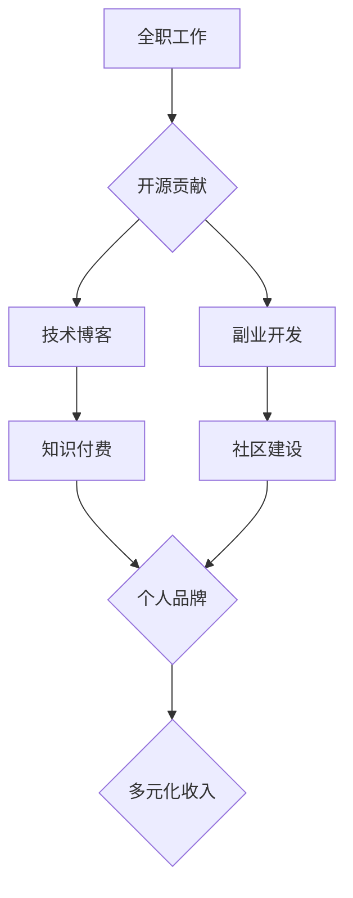

                 

## 程序员如何构建多元化收入来源的生态系统

> 关键词：多元化收入、程序员、生态系统、开源、副业、技术博客、知识付费、社区建设

### 1. 背景介绍

在当今科技飞速发展的时代，程序员作为数字时代的核心力量，拥有着巨大的发展潜力。然而，传统的单一收入模式，如全职工作，已经难以满足程序员日益增长的需求。越来越多的程序员开始寻求多元化收入来源，构建更加稳健、可持续的个人经济生态系统。

### 2. 核心概念与联系

**2.1 多元化收入生态系统**

多元化收入生态系统是指程序员通过多种途径获取收入的综合体系，包括但不限于：

* **全职工作：** 这是程序员最传统的收入来源，通过为公司提供编程服务获取稳定的薪资。
* **开源贡献：** 开发开源软件，通过社区赞助、企业支持、捐赠等方式获得收入。
* **副业开发：** 利用业余时间开发自己的应用程序、网站或工具，通过广告、订阅、付费下载等方式盈利。
* **技术博客和知识付费：** 分享技术经验和知识，通过博客广告、付费课程、电子书等方式获得收入。
* **社区建设：** 参与或创建技术社区，通过会员订阅、赞助、活动举办等方式获得收入。

**2.2 核心概念联系**

这些收入来源之间并非孤立存在，而是相互关联、相互促进的。例如，开源贡献可以提升个人知名度，吸引更多读者关注技术博客，进而促进知识付费的销售。

**Mermaid 流程图**



### 3. 核心算法原理 & 具体操作步骤

**3.1 算法原理概述**

构建多元化收入生态系统本质上是一种资源整合和价值创造的算法。程序员需要根据自身优势和兴趣，选择合适的收入来源，并通过高效的运营和推广，将资源转化为价值，最终实现收入的多元化。

**3.2 算法步骤详解**

1. **自我评估:** 分析自身技术能力、兴趣爱好、时间精力等资源，确定适合的收入来源方向。
2. **市场调研:** 研究目标市场的需求，了解竞争对手的情况，找到自身差异化优势。
3. **资源整合:** 积累相关知识和技能，建立个人品牌，构建社交网络，收集和整合资源。
4. **价值创造:** 开发高质量的开源软件、技术博客文章、付费课程等，为用户提供有价值的服务。
5. **运营推广:** 利用社交媒体、技术社区等平台，推广自身作品和服务，吸引目标用户。
6. **数据分析:** 跟踪收入数据，分析用户行为，不断优化运营策略，提高收入效率。

**3.3 算法优缺点**

* **优点:** 降低收入风险，提高收入稳定性，实现个人价值最大化。
* **缺点:** 需要投入更多时间和精力，需要不断学习和适应市场变化。

**3.4 算法应用领域**

该算法适用于所有程序员，无论其经验水平、技术领域或职业目标。

### 4. 数学模型和公式 & 详细讲解 & 举例说明

**4.1 数学模型构建**

多元化收入生态系统的构建可以抽象为一个资源分配和价值转化模型。

* **资源:** 包括时间、精力、技术能力、资金等。
* **分配:** 将资源分配到不同的收入来源，例如全职工作、开源贡献、副业开发等。
* **转化:** 将投入的资源转化为价值，例如代码、文章、课程等，最终获得收入。

**4.2 公式推导过程**

假设程序员有 **T** 个时间单位， **E** 个精力单位， **C** 个技术能力单位， **F** 个资金单位。

* **收入 = f(T, E, C, F)**

其中， **f** 是一个复杂的函数，代表资源分配和价值转化效率。

**4.3 案例分析与讲解**

例如，一个程序员拥有 **T = 168** 个时间单位（一周）， **E = 100** 个精力单位， **C = 80** 个技术能力单位， **F = 10000** 个资金单位。

如果他将 **T = 40** 个时间单位分配给全职工作， **T = 20** 个时间单位分配给开源贡献， **T = 20** 个时间单位分配给副业开发，那么他的收入将取决于 **f(40, 100, 80, 10000)** 的结果。

### 5. 项目实践：代码实例和详细解释说明

**5.1 开发环境搭建**

* **操作系统:** Linux/macOS/Windows
* **编程语言:** Python/JavaScript/Java等
* **开发工具:** VS Code/IntelliJ IDEA/Eclipse等
* **版本控制:** Git

**5.2 源代码详细实现**

以下是一个简单的技术博客网站的代码示例，使用 Python 和 Flask 框架开发：

```python
from flask import Flask, render_template

app = Flask(__name__)

@app.route('/')
def index():
    return render_template('index.html')

if __name__ == '__main__':
    app.run(debug=True)
```

**5.3 代码解读与分析**

* **Flask:** 一个轻量级的 Python Web 框架，用于构建 Web 应用程序。
* **render_template():** 用于渲染 HTML 模板文件。
* **index.html:** 网站的主页模板文件。

**5.4 运行结果展示**

运行上述代码，访问 `http://127.0.0.1:5000/`，即可看到一个简单的技术博客网站。

### 6. 实际应用场景

**6.1 全职工作**

程序员可以通过全职工作获得稳定的收入，积累工作经验，提升技术能力。

**6.2 开源贡献**

程序员可以通过开源贡献提升个人知名度，获得社区支持，吸引潜在雇主或客户。

**6.3 副业开发**

程序员可以通过副业开发创造自己的产品或服务，获得额外收入，实现个人价值。

**6.4 未来应用展望**

随着科技发展，程序员的收入来源将更加多元化，例如：

* **元宇宙开发:** 开发元宇宙游戏、虚拟世界、数字资产等。
* **人工智能应用:** 开发人工智能算法、模型、应用等。
* **区块链技术:** 开发区块链应用、智能合约、去中心化金融等。

### 7. 工具和资源推荐

**7.1 学习资源推荐**

* **在线学习平台:** Coursera、Udemy、edX等
* **技术博客:** Hacker News、Medium、Dev.to等
* **开源社区:** GitHub、GitLab、Bitbucket等

**7.2 开发工具推荐**

* **代码编辑器:** VS Code、Sublime Text、Atom等
* **版本控制工具:** Git、GitHub Desktop等
* **云平台:** AWS、Azure、GCP等

**7.3 相关论文推荐**

* **The Economics of Open Source Software**
* **The Future of Work: How Technology Will Transform the Workplace**
* **The Sharing Economy: A New Paradigm for Business and Society**

### 8. 总结：未来发展趋势与挑战

**8.1 研究成果总结**

构建多元化收入生态系统是程序员未来发展的重要趋势，可以帮助程序员降低收入风险，提高收入稳定性，实现个人价值最大化。

**8.2 未来发展趋势**

未来，程序员的收入来源将更加多元化，技术领域将更加细分，竞争将更加激烈。程序员需要不断学习和适应市场变化，才能保持竞争力。

**8.3 面临的挑战**

* **时间管理:** 需要合理分配时间，平衡不同收入来源的运营。
* **技能提升:** 需要不断学习新技术，提升自身竞争力。
* **市场变化:** 需要关注市场趋势，及时调整运营策略。

**8.4 研究展望**

未来研究可以进一步探讨多元化收入生态系统的构建方法、运营策略、风险管理等方面，为程序员提供更全面的指导和支持。

### 9. 附录：常见问题与解答

**9.1 如何选择合适的收入来源？**

选择合适的收入来源需要根据自身优势、兴趣爱好、时间精力等因素进行综合考虑。

**9.2 如何运营技术博客？**

运营技术博客需要坚持原创内容，积极推广，与读者互动，建立个人品牌。

**9.3 如何进行开源贡献？**

开源贡献可以从参与社区项目、修复bug、撰写文档等方面开始。

**9.4 如何避免收入风险？**

多元化收入来源可以降低收入风险，同时还需要做好风险管理，例如储蓄、投资等。


作者：禅与计算机程序设计艺术 / Zen and the Art of Computer Programming 
<end_of_turn>

