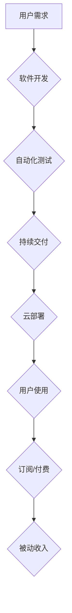

                 

## 程序员的被动收入：构建与维护

> 关键词：被动收入、软件开发、自动化、云计算、持续交付、API、微服务、云函数

## 1. 背景介绍

在当今科技飞速发展的时代，程序员作为数字时代的核心力量，拥有着创造价值和获取财富的巨大潜力。然而，传统的编程工作模式往往以项目为单位，收入波动较大，难以实现持续稳定的收益。因此，越来越多的程序员开始探索新的工作模式，寻求实现“被动收入”的途径。

被动收入是指无需持续投入时间和精力就能获得持续收益的一种收入模式。对于程序员来说，构建和维护软件产品可以成为实现被动收入的理想选择。通过开发具有市场价值的软件产品，程序员可以将产品授权给用户，收取订阅费用、广告收入或其他形式的收益，从而实现持续的被动收入流。

## 2. 核心概念与联系

**2.1 核心概念**

* **被动收入:** 指无需持续投入时间和精力就能获得持续收益的一种收入模式。
* **软件产品:** 指通过编程开发并提供给用户使用的软件应用程序或工具。
* **自动化:** 通过脚本、工具或平台自动执行重复性任务，提高效率并降低人工成本。
* **云计算:** 利用互联网访问和共享计算资源，降低硬件成本和维护成本。
* **持续交付:** 通过自动化构建、测试和部署流程，快速将软件更新交付给用户。

**2.2 架构流程图**



**2.3 联系分析**

构建和维护软件产品实现被动收入，需要将上述核心概念有机结合。首先，需要明确用户需求，开发具有市场价值的软件产品。然后，通过自动化测试和持续交付流程，确保软件质量和快速迭代。最后，将软件部署到云平台，降低成本并提高可扩展性。用户通过订阅或付费的方式使用软件，从而为开发者带来持续的被动收入。

## 3. 核心算法原理 & 具体操作步骤

**3.1 算法原理概述**

实现被动收入的软件产品通常需要涉及一些核心算法，例如：

* **推荐算法:** 根据用户行为和偏好，推荐相关产品或内容。
* **搜索算法:** 帮助用户快速找到所需信息。
* **机器学习算法:** 自动化分析数据，提高软件功能和用户体验。

这些算法的原理通常基于统计学、数学模型和数据挖掘技术。

**3.2 算法步骤详解**

具体算法的步骤详解取决于具体的算法类型和应用场景。例如，推荐算法通常包括以下步骤：

1. **数据收集:** 收集用户行为数据，例如浏览记录、购买历史、评分等。
2. **数据预处理:** 对收集到的数据进行清洗、转换和特征提取。
3. **模型训练:** 使用机器学习算法训练推荐模型，例如协同过滤、内容过滤或混合推荐。
4. **模型评估:** 使用测试数据评估模型的性能，例如准确率、召回率和覆盖率。
5. **模型部署:** 将训练好的模型部署到生产环境，实时推荐产品或内容。

**3.3 算法优缺点**

不同的算法具有不同的优缺点，需要根据具体的应用场景选择合适的算法。例如，协同过滤算法能够推荐用户可能感兴趣的相似用户购买的产品，但需要大量用户数据才能训练出准确的模型。内容过滤算法则可以根据用户偏好的内容类型推荐相关产品，但可能存在冷启动问题，即对于新用户或新产品难以给出准确的推荐。

**3.4 算法应用领域**

推荐算法广泛应用于电商、社交媒体、视频平台等领域，帮助用户发现感兴趣的产品或内容，提高用户体验和商业转化率。

## 4. 数学模型和公式 & 详细讲解 & 举例说明

**4.1 数学模型构建**

推荐算法通常使用数学模型来量化用户和物品之间的关系。例如，协同过滤算法使用用户评分矩阵来表示用户对物品的喜好程度。

**4.2 公式推导过程**

协同过滤算法的推荐公式通常基于矩阵分解技术，例如奇异值分解 (SVD)。SVD 可以将用户评分矩阵分解成三个矩阵，分别表示用户特征、物品特征和评分因子。

**4.3 案例分析与讲解**

假设有一个用户评分矩阵，其中用户和物品分别用数字表示。可以使用 SVD 将这个矩阵分解成三个矩阵，例如：

* U: 用户特征矩阵
* V: 物品特征矩阵
* S: 评分因子矩阵

通过计算 U 和 V 的乘积，可以得到预测的用户对物品的评分。

## 5. 项目实践：代码实例和详细解释说明

**5.1 开发环境搭建**

实现被动收入的软件产品开发环境通常包括以下组件：

* **代码编辑器:** 用于编写代码，例如 VS Code、Sublime Text 或 Atom。
* **版本控制系统:** 用于管理代码版本，例如 Git 或 SVN。
* **云平台:** 用于部署和运行软件，例如 AWS、Azure 或 Google Cloud。
* **数据库:** 用于存储用户数据和软件状态，例如 MySQL、PostgreSQL 或 MongoDB。

**5.2 源代码详细实现**

具体源代码实现取决于软件产品的类型和功能。例如，开发一个简单的 API 应用程序，可以使用 Python 和 Flask 框架。

```python
from flask import Flask, jsonify

app = Flask(__name__)

@app.route('/api/data')
def get_data():
    data = {'message': 'Hello, world!'}
    return jsonify(data)

if __name__ == '__main__':
    app.run(debug=True)
```

**5.3 代码解读与分析**

这段代码定义了一个简单的 Flask 应用程序，提供一个 `/api/data` 路由，返回一个 JSON 数据包。

**5.4 运行结果展示**

运行该应用程序后，访问 `http://localhost:5000/api/data` 可以获取 JSON 数据包。

## 6. 实际应用场景

**6.1 订阅型软件**

例如，开发一个办公协作软件，用户可以通过订阅的方式获得软件的使用权限。

**6.2 广告收入**

例如，开发一个新闻聚合网站，通过展示广告来获取收入。

**6.3 数据服务**

例如，开发一个数据分析平台，提供数据分析服务并收取费用。

**6.4 未来应用展望**

随着人工智能、云计算和物联网技术的不断发展，被动收入的软件产品将更加多样化和智能化。例如，可以开发基于人工智能的个性化推荐系统、自动化的任务管理工具、以及连接物联网设备的智能家居平台。

## 7. 工具和资源推荐

**7.1 学习资源推荐**

* **书籍:** 《程序员的自我提升》、《软件工程实践》
* **在线课程:** Coursera、Udemy、edX
* **博客和论坛:** Stack Overflow、Hacker News

**7.2 开发工具推荐**

* **代码编辑器:** VS Code、Sublime Text、Atom
* **版本控制系统:** Git、SVN
* **云平台:** AWS、Azure、Google Cloud
* **数据库:** MySQL、PostgreSQL、MongoDB

**7.3 相关论文推荐**

* **推荐算法:** 《Collaborative Filtering: Memory-Based and Model-Based Approaches》
* **机器学习:** 《The Elements of Statistical Learning》
* **云计算:** 《Cloud Computing: Concepts, Technology & Architecture》

## 8. 总结：未来发展趋势与挑战

**8.1 研究成果总结**

构建和维护软件产品实现被动收入是一种可行的商业模式，可以为程序员带来持续的收益。

**8.2 未来发展趋势**

未来，被动收入的软件产品将更加智能化、个性化和自动化。

**8.3 面临的挑战**

* **技术复杂性:** 开发高质量的软件产品需要掌握丰富的技术知识和技能。
* **市场竞争:** 软件市场竞争激烈，需要不断创新和迭代才能保持竞争力。
* **用户获取:** 需要有效地推广和营销软件产品，吸引用户使用。

**8.4 研究展望**

未来研究方向包括：

* 开发更智能、更个性化的推荐算法。
* 探索新的被动收入模式，例如游戏化和社区化。
* 研究如何提高软件产品的可维护性和可扩展性。

## 9. 附录：常见问题与解答

**9.1 如何选择合适的软件产品类型？**

需要根据自身的技术能力、市场需求和个人兴趣选择合适的软件产品类型。

**9.2 如何保证软件产品的质量？**

需要采用严格的测试流程和持续交付机制，确保软件产品的稳定性和可靠性。

**9.3 如何推广和营销软件产品？**

可以通过线上线下推广渠道，例如社交媒体、博客、论坛和展会，推广和营销软件产品。


作者：禅与计算机程序设计艺术 / Zen and the Art of Computer Programming 
<end_of_turn>

