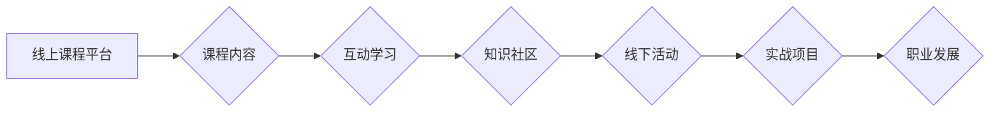

                 

## 程序员知识付费：打造线上线下融合课程

> 关键词：程序员知识付费、线上线下融合、课程设计、技术社区、实战项目、职业发展

### 1. 背景介绍

随着科技发展日新月异，程序员的需求量持续增长，编程技能也成为炙手可热的职业技能。与此同时，程序员的学习需求也日益多样化，从基础入门到专业进阶，从理论知识到实战应用，都需要更有效的学习途径。知识付费作为一种新型的教育模式，在满足程序员学习需求的同时，也为技术人才的培养和职业发展提供了新的机遇。

然而，传统的线上线下课程模式存在着一些局限性。线上课程缺乏互动性，线下课程成本高昂，难以满足程序员个性化学习的需求。因此，如何打造一种线上线下融合的程序员知识付费模式，成为行业内亟待解决的问题。

### 2. 核心概念与联系

**2.1 核心概念**

* **线上课程:** 利用互联网平台，通过视频、音频、文档等形式，提供程序员学习内容。
* **线下课程:** 通过线下讲座、研讨会、实践活动等形式，提供程序员学习机会。
* **融合课程:** 将线上课程和线下课程有机结合，形成一个完整的学习体系。

**2.2 架构图**



**2.3 联系**

线上线下融合课程模式将线上课程的便捷性和线下课程的互动性相结合，形成一个完整的学习体系。

* 线上课程提供基础知识和理论讲解，线下课程则通过互动交流和实践活动，加深学习理解，促进知识应用。
* 知识社区作为线上线下课程的桥梁，提供学习交流平台，促进学员之间的互动和学习。
* 实战项目作为课程的实践环节，帮助学员将所学知识应用到实际项目中，提升实战能力。
* 职业发展作为课程的最终目标，帮助学员提升职业技能，实现职业发展。

### 3. 核心算法原理 & 具体操作步骤

**3.1 算法原理概述**

融合课程模式的核心算法原理是基于用户学习行为和需求进行个性化推荐和学习路径规划。通过分析用户的学习记录、兴趣偏好和职业目标，算法可以推荐合适的线上线下课程资源，并根据用户的学习进度和反馈，动态调整学习路径，实现个性化学习体验。

**3.2 算法步骤详解**

1. **数据收集:** 收集用户的学习行为数据，包括学习时间、学习内容、学习进度、学习反馈等。
2. **用户画像构建:** 基于用户的学习行为数据，构建用户画像，包括用户的学习兴趣、学习能力、职业目标等。
3. **课程资源推荐:** 根据用户的学习画像，推荐合适的线上线下课程资源。
4. **学习路径规划:** 根据用户的学习进度和反馈，动态调整学习路径，确保用户能够高效地完成学习目标。
5. **个性化学习体验:** 提供个性化的学习体验，包括学习进度跟踪、学习反馈、学习社区互动等。

**3.3 算法优缺点**

* **优点:**

    * 个性化学习体验
    * 提高学习效率
    * 促进知识应用
    * 提升职业技能

* **缺点:**

    * 数据收集和分析难度较大
    * 算法模型需要不断优化
    * 个性化推荐需要考虑用户的隐私保护

**3.4 算法应用领域**

* 程序员知识付费平台
* 在线教育平台
* 企业培训系统
* 个人学习管理工具

### 4. 数学模型和公式 & 详细讲解 & 举例说明

**4.1 数学模型构建**

为了实现个性化学习推荐，可以构建一个基于用户行为和课程特征的推荐模型。

* **用户行为特征:** 学习时间、学习内容、学习进度、学习反馈等。
* **课程特征:** 课程主题、课程难度、课程时长、课程评价等。

**4.2 公式推导过程**

可以使用协同过滤算法或内容过滤算法构建推荐模型。

* **协同过滤算法:** 基于用户的历史行为数据，预测用户对特定课程的兴趣。
* **内容过滤算法:** 基于课程特征和用户的兴趣偏好，推荐匹配的课程。

**4.3 案例分析与讲解**

假设有一个程序员知识付费平台，平台上有 N 个用户和 M 个课程。

* **用户行为数据:** 可以记录每个用户对每个课程的学习时间、学习进度、学习反馈等信息。
* **课程特征数据:** 可以记录每个课程的主题、难度、时长、评价等信息。

可以使用协同过滤算法，计算每个用户与其他用户的相似度，并根据相似用户的学习行为，预测用户对特定课程的兴趣。

### 5. 项目实践：代码实例和详细解释说明

**5.1 开发环境搭建**

* 操作系统: Ubuntu 20.04
* 编程语言: Python 3.8
* 框架: Flask
* 数据库: MySQL

**5.2 源代码详细实现**

```python
from flask import Flask, render_template

app = Flask(__name__)

@app.route('/')
def index():
    return render_template('index.html')

if __name__ == '__main__':
    app.run(debug=True)
```

**5.3 代码解读与分析**

* `Flask` 是一个轻量级的 Python Web 框架，用于构建 Web 应用。
* `render_template()` 函数用于渲染 HTML 模板。
* `index.html` 是应用程序的主页模板。

**5.4 运行结果展示**

运行代码后，访问 `http://127.0.0.1:5000/`，即可看到应用程序的主页。

### 6. 实际应用场景

**6.1 线上课程平台**

* 提供程序员学习的线上课程，涵盖基础入门、专业进阶、实战项目等多个领域。
* 利用算法模型，根据用户的学习行为和需求，推荐合适的课程资源。
* 提供在线学习社区，促进学员之间的互动和学习。

**6.2 线下课程活动**

* 定期举办线下课程活动，例如讲座、研讨会、技术分享会等。
* 邀请行业专家和技术领袖，分享最新的技术趋势和实践经验。
* 提供线下实践活动，例如代码竞赛、项目合作等，帮助学员提升实战能力。

**6.3 知识社区**

* 建立一个程序员知识社区，提供学习交流平台。
* 鼓励学员分享学习经验、技术心得和项目成果。
* 提供在线答疑服务，帮助学员解决学习难题。

**6.4 未来应用展望**

* 利用人工智能技术，实现更智能化的课程推荐和学习路径规划。
* 打造更丰富的线上线下融合课程体系，满足程序员多样化的学习需求。
* 推广程序员知识付费模式，促进技术人才的培养和职业发展。

### 7. 工具和资源推荐

**7.1 学习资源推荐**

* **在线学习平台:** Coursera, Udemy, edX
* **技术博客:** Hacker News, Stack Overflow, Medium
* **开源项目:** GitHub, GitLab

**7.2 开发工具推荐**

* **代码编辑器:** VS Code, Sublime Text, Atom
* **版本控制系统:** Git
* **云平台:** AWS, Azure, GCP

**7.3 相关论文推荐**

* **协同过滤算法:** "Collaborative Filtering: A User-Based Approach"
* **内容过滤算法:** "Content-Based Recommendation Systems"
* **个性化学习推荐:** "Personalized Learning Recommendations"

### 8. 总结：未来发展趋势与挑战

**8.1 研究成果总结**

* 线上线下融合课程模式为程序员知识付费提供了新的思路和方法。
* 算法模型可以有效地实现个性化学习推荐和学习路径规划。
* 知识社区和实战项目可以促进学员之间的互动和学习。

**8.2 未来发展趋势**

* 利用人工智能技术，实现更智能化的课程推荐和学习路径规划。
* 打造更丰富的线上线下融合课程体系，满足程序员多样化的学习需求。
* 推广程序员知识付费模式，促进技术人才的培养和职业发展。

**8.3 面临的挑战**

* 数据收集和分析难度较大
* 算法模型需要不断优化
* 个性化推荐需要考虑用户的隐私保护

**8.4 研究展望**

* 研究更有效的算法模型，实现更精准的学习推荐。
* 打造更完善的线上线下融合课程体系，提供更丰富的学习体验。
* 探索新的知识付费模式，促进技术人才的培养和职业发展。

### 9. 附录：常见问题与解答

**9.1 如何选择合适的课程？**

* 结合自己的学习目标和职业规划，选择合适的课程领域。
* 阅读课程介绍和学员评价，了解课程内容和教学质量。
* 尝试免费课程或试听课程，体验课程风格和教学方法。

**9.2 如何参与线上线下活动？**

* 关注平台的官方网站和社交媒体账号，了解活动信息。
* 注册平台账号，报名参加活动。
* 积极参与活动，与其他学员交流学习。

**9.3 如何保护个人隐私？**

* 仔细阅读平台的隐私政策，了解个人信息的使用方式。
* 设置合理的隐私设置，控制个人信息的公开范围。
* 不要随意泄露个人信息，避免信息泄露风险。


作者：禅与计算机程序设计艺术 / Zen and the Art of Computer Programming 
<end_of_turn>

