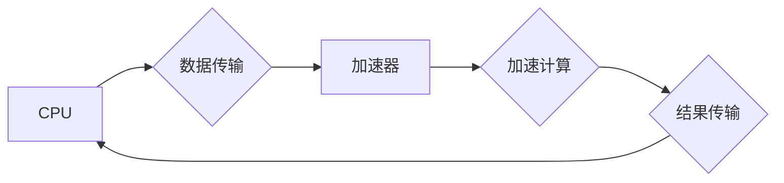

                 

## 第八章：设备加速：CPU、GPU 和更多

> 关键词：CPU、GPU、加速器、并行计算、深度学习、高性能计算、CUDA、OpenCL、TPU

### 1. 背景介绍

随着人工智能、大数据分析和科学计算等领域的蓬勃发展，对计算性能的需求不断攀升。传统的CPU架构在处理海量数据和复杂计算任务时逐渐显露出瓶颈。为了应对这一挑战，人们开始探索各种设备加速技术，以提高计算效率和处理速度。

### 2. 核心概念与联系

设备加速的核心概念是将计算任务分担到专门设计的硬件加速器上，以充分利用其并行计算能力。

**2.1 CPU、GPU 和加速器的关系**

* **CPU (中央处理器)**：传统通用处理器，擅长执行顺序性任务，但并行计算能力有限。
* **GPU (图形处理器)**：最初用于处理图形渲染，拥有大量并行计算单元，适合处理大量数据并行计算。
* **加速器**：专门用于加速特定类型计算任务的硬件，例如FPGA、ASIC、TPU等。

**2.2 设备加速的架构**

设备加速通常采用以下架构：



* CPU负责接收数据、启动加速器和接收计算结果。
* 加速器负责执行特定类型计算任务。
* 数据传输和结果传输通常通过高速接口进行。

### 3. 核心算法原理 & 具体操作步骤

**3.1 算法原理概述**

设备加速的核心算法原理是将大型计算任务分解成多个小型子任务，并行地分配给加速器执行。

**3.2 算法步骤详解**

1. **任务分解**: 将大型计算任务分解成多个小型子任务。
2. **数据分配**: 将数据分配给各个加速器执行子任务。
3. **并行计算**: 加速器并行执行子任务。
4. **结果合并**: 将各个加速器计算的结果合并成最终结果。

**3.3 算法优缺点**

* **优点**: 
    * 显著提高计算速度。
    * 能够处理海量数据和复杂计算任务。
* **缺点**: 
    * 需要专门的编程模型和开发工具。
    * 加速器成本较高。

**3.4 算法应用领域**

* **深度学习**: 加速器可以显著提高深度学习模型的训练速度和推理速度。
* **科学计算**: 加速器可以加速科学计算中的数值模拟、数据分析等任务。
* **图形渲染**: GPU可以加速图形渲染、视频处理等任务。

### 4. 数学模型和公式 & 详细讲解 & 举例说明

**4.1 数学模型构建**

假设一个大型计算任务可以分解成N个子任务，每个子任务的计算时间为T。

* **CPU执行时间**: N * T
* **加速器执行时间**: T / P (P为加速器数量)

**4.2 公式推导过程**

加速比 = CPU执行时间 / 加速器执行时间 = (N * T) / (T / P) = N * P

**4.3 案例分析与讲解**

假设一个深度学习模型的训练任务可以分解成1000个子任务，每个子任务的计算时间为1秒。

* 如果使用CPU执行，则需要1000秒。
* 如果使用拥有10个加速器的GPU执行，则只需要100秒。

因此，加速比为1000 / 100 = 10。

### 5. 项目实践：代码实例和详细解释说明

**5.1 开发环境搭建**

* 操作系统：Linux
* 编程语言：C++
* CUDA Toolkit：用于开发GPU加速程序的工具包

**5.2 源代码详细实现**

```cpp
#include <iostream>
#include <cuda_runtime.h>

__global__ void vectorAdd(float *a, float *b, float *c, int n) {
  int i = blockIdx.x * blockDim.x + threadIdx.x;
  if (i < n) {
    c[i] = a[i] + b[i];
  }
}

int main() {
  int n = 1024;
  float *a, *b, *c;
  float *d_a, *d_b, *d_c;

  // 申请主机内存
  a = new float[n];
  b = new float[n];
  c = new float[n];

  // 初始化数据
  for (int i = 0; i < n; i++) {
    a[i] = i;
    b[i] = i * 2;
  }

  // 申请设备内存
  cudaMalloc(&d_a, n * sizeof(float));
  cudaMalloc(&d_b, n * sizeof(float));
  cudaMalloc(&d_c, n * sizeof(float));

  // 将数据拷贝到设备内存
  cudaMemcpy(d_a, a, n * sizeof(float), cudaMemcpyHostToDevice);
  cudaMemcpy(d_b, b, n * sizeof(float), cudaMemcpyHostToDevice);

  // 设置线程块大小和线程数量
  int threadsPerBlock = 256;
  int blocksPerGrid = (n + threadsPerBlock - 1) / threadsPerBlock;

  // 启动内核函数
  vectorAdd<<<blocksPerGrid, threadsPerBlock>>>(d_a, d_b, d_c, n);

  // 将结果拷贝回主机内存
  cudaMemcpy(c, d_c, n * sizeof(float), cudaMemcpyDeviceToHost);

  // 打印结果
  for (int i = 0; i < n; i++) {
    std::cout << c[i] << " ";
  }
  std::cout << std::endl;

  // 释放内存
  delete[] a;
  delete[] b;
  delete[] c;
  cudaFree(d_a);
  cudaFree(d_b);
  cudaFree(d_c);

  return 0;
}
```

**5.3 代码解读与分析**

* 该代码实现了一个简单的向量加法运算，使用CUDA编程模型在GPU上加速执行。
* `vectorAdd`函数是GPU内核函数，定义了每个线程执行的计算逻辑。
* `main`函数负责数据初始化、内存分配、数据传输、内核函数启动和结果处理。

**5.4 运行结果展示**

运行该代码后，将输出加完后的向量结果。

### 6. 实际应用场景

**6.1 深度学习**

* **卷积神经网络 (CNN)**：GPU可以加速CNN中的卷积和池化操作，显著提高训练速度和推理速度。
* **循环神经网络 (RNN)**：GPU可以加速RNN中的循环计算，提高处理序列数据的效率。

**6.2 科学计算**

* **数值模拟**: GPU可以加速科学计算中的数值模拟，例如流体动力学、天气预报等。
* **数据分析**: GPU可以加速大规模数据分析，例如基因组测序、图像处理等。

**6.3 图形渲染**

* **游戏渲染**: GPU可以加速游戏中的图形渲染，提高画面质量和流畅度。
* **动画制作**: GPU可以加速动画制作中的渲染和特效处理。

**6.4 未来应用展望**

* **边缘计算**: 将加速器部署在边缘设备上，实现更快速的本地计算。
* **量子计算**: 加速器可以与量子计算器协同工作，加速量子算法的执行。

### 7. 工具和资源推荐

**7.1 学习资源推荐**

* **CUDA**: https://developer.nvidia.com/cuda-zone
* **OpenCL**: https://www.khronos.org/opencl/
* **TensorFlow**: https://www.tensorflow.org/

**7.2 开发工具推荐**

* **Visual Studio Code**: https://code.visualstudio.com/
* **CLion**: https://www.jetbrains.com/clion/

**7.3 相关论文推荐**

* **CUDA Programming Guide**: https://docs.nvidia.com/cuda/cuda-c-programming-guide/index.html
* **OpenCL Programming Guide**: https://www.khronos.org/registry/cl/specs/opencl-2.2.spec.html

### 8. 总结：未来发展趋势与挑战

**8.1 研究成果总结**

设备加速技术取得了显著进展，为人工智能、科学计算和图形渲染等领域带来了革命性的变化。

**8.2 未来发展趋势**

* **更强大的加速器**: 继续提高加速器的计算能力和效率。
* **更灵活的编程模型**: 开发更易于使用的编程模型，降低开发门槛。
* **更广泛的应用**: 将设备加速技术应用到更多领域，例如自动驾驶、医疗诊断等。

**8.3 面临的挑战**

* **成本**: 加速器成本仍然较高，需要进一步降低成本。
* **编程复杂度**: 加速器编程相对复杂，需要专门的知识和技能。
* **软件生态**: 加速器软件生态系统仍需进一步完善。

**8.4 研究展望**

未来研究将集中在以下几个方面：

* 开发更高效、更易于使用的加速器编程模型。
* 探索新的加速器架构，例如量子加速器、光子加速器等。
* 将设备加速技术与其他先进技术结合，例如云计算、边缘计算等。

### 9. 附录：常见问题与解答

**9.1 如何选择合适的加速器？**

选择合适的加速器需要考虑以下因素：

* 计算任务类型
* 数据规模
* 预算

**9.2 如何学习加速器编程？**

可以参考以下资源学习加速器编程：

* 官方文档
* 在线教程
* 书籍

**9.3 加速器编程有什么难点？**

加速器编程的难点包括：

* 并行编程模型
* 硬件架构
* 性能优化


作者：禅与计算机程序设计艺术 / Zen and the Art of Computer Programming 
<end_of_turn>

