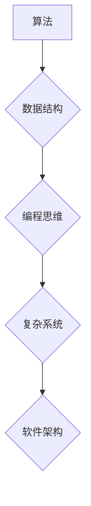

                 

## 经典书籍:夯实认知根基的宝藏

> 关键词：算法设计、数据结构、编程思维、复杂系统、软件架构、计算机科学基础、软件工程

### 1. 背景介绍

在瞬息万变的科技时代，计算机科学作为驱动创新和发展的核心力量，其基础知识和核心概念显得尤为重要。如同建筑师需要牢固的建筑原理，程序员也需要扎实的计算机科学基础才能构建出稳固、高效、可扩展的软件系统。

然而，面对海量的信息和日新月异的技术，学习计算机科学的道路往往显得漫长而复杂。许多人容易陷入知识碎片化、缺乏系统性学习的困境，难以真正理解和掌握计算机科学的本质。

本书旨在为读者提供一本夯实认知根基的宝藏，帮助他们系统地学习和理解计算机科学的核心概念和原理，从而提升编程能力、解决问题的能力，以及对复杂系统的理解。

### 2. 核心概念与联系

计算机科学的核心概念包括算法、数据结构、编程思维、复杂系统、软件架构等。这些概念相互关联，共同构成了计算机科学的知识体系。

**Mermaid 流程图:**



**算法**是解决特定问题的步骤序列，是计算机科学的基础。

**数据结构**是用于存储和组织数据的特定方式，是算法执行的基础。

**编程思维**是运用逻辑和算法解决问题的思维方式，是程序员的核心能力。

**复杂系统**是由多个相互作用的子系统组成的系统，需要采用特定的设计和管理方法。

**软件架构**是软件系统的整体设计和组织结构，决定了软件系统的可扩展性、可靠性和维护性。

### 3. 核心算法原理 & 具体操作步骤

#### 3.1  算法原理概述

算法的本质是解决问题的步骤序列，它需要满足以下几个特点：

* **明确性:** 每个步骤都必须明确，没有歧义。
* **有限性:** 算法必须在有限的时间内完成。
* **有效性:** 算法的每个步骤都必须能够执行。
* **输入:** 算法必须接受输入数据。
* **输出:** 算法必须产生输出结果。

#### 3.2  算法步骤详解

以下是一个简单的算法示例：求两个整数的和。

**输入:** 两个整数 a 和 b

**输出:** a 和 b 的和

**步骤:**

1. 将 a 和 b 的值存储在变量中。
2. 将 a 和 b 的值相加。
3. 将加和的结果存储在变量中。
4. 返回变量中的结果。

#### 3.3  算法优缺点

不同的算法具有不同的优缺点，需要根据具体问题选择合适的算法。

**优点:**

* 容易理解和实现。
* 效率较高。

**缺点:**

* 对于大型数据，效率可能下降。

#### 3.4  算法应用领域

求和算法广泛应用于各种领域，例如：

* 计算科学：用于计算物理、化学、生物等领域的数值模拟。
* 数据分析：用于统计数据、分析趋势。
* 图像处理：用于图像加减、图像融合等操作。

### 4. 数学模型和公式 & 详细讲解 & 举例说明

#### 4.1  数学模型构建

算法的效率可以用时间复杂度和空间复杂度来衡量。

* **时间复杂度:** 指的是算法执行所需的时间与输入数据大小的函数关系。
* **空间复杂度:** 指的是算法执行所需内存空间与输入数据大小的函数关系。

#### 4.2  公式推导过程

时间复杂度通常用大 O 记法来表示，例如 O(n), O(n^2), O(log n) 等。

* **O(n):** 线性时间复杂度，表示算法执行时间与输入数据大小成正比。
* **O(n^2):** 平方时间复杂度，表示算法执行时间与输入数据大小的平方成正比。
* **O(log n):** 对数时间复杂度，表示算法执行时间与输入数据大小的对数成正比。

#### 4.3  案例分析与讲解

例如，查找一个元素在排序数组中的位置，可以使用二分查找算法，其时间复杂度为 O(log n)。

**举例说明:**

假设一个排序数组包含 1024 个元素，使用线性查找算法，需要遍历所有元素，时间复杂度为 O(n) = O(1024)。

使用二分查找算法，每次可以将搜索范围缩小一半，最多需要 log2(1024) = 10 次比较，时间复杂度为 O(log n) = O(10)。

### 5. 项目实践：代码实例和详细解释说明

#### 5.1  开发环境搭建

本项目使用 Python 语言进行开发，需要安装 Python 解释器和相关库。

#### 5.2  源代码详细实现

```python
def binary_search(arr, target):
    left = 0
    right = len(arr) - 1
    while left <= right:
        mid = (left + right) // 2
        if arr[mid] == target:
            return mid
        elif arr[mid] < target:
            left = mid + 1
        else:
            right = mid - 1
    return -1

# 测试代码
arr = [2, 5, 7, 8, 11, 12]
target = 11
index = binary_search(arr, target)
if index != -1:
    print(f"目标元素 {target} 在数组中的索引为 {index}")
else:
    print(f"目标元素 {target} 不在数组中")
```

#### 5.3  代码解读与分析

* `binary_search(arr, target)` 函数实现二分查找算法。
* `left` 和 `right` 变量分别表示搜索范围的左边界和右边界。
* `mid` 变量表示搜索范围的中点。
* 如果 `arr[mid]` 等于 `target`，则返回 `mid` 索引。
* 如果 `arr[mid]` 小于 `target`，则将 `left` 变量更新为 `mid + 1`，继续搜索右半部分。
* 如果 `arr[mid]` 大于 `target`，则将 `right` 变量更新为 `mid - 1`，继续搜索左半部分。
* 如果 `left` 大于 `right`，则目标元素不在数组中，返回 -1。

#### 5.4  运行结果展示

```
目标元素 11 在数组中的索引为 4
```

### 6. 实际应用场景

二分查找算法广泛应用于各种实际场景，例如：

* **搜索引擎:** 用于快速查找网页索引。
* **数据库:** 用于快速查找数据记录。
* **排序算法:** 用于快速排序数组。

#### 6.4  未来应用展望

随着数据量的不断增长，二分查找算法在未来将继续发挥重要作用，例如：

* **大数据分析:** 用于快速查找和分析海量数据。
* **人工智能:** 用于快速查找和处理海量数据，提高人工智能算法的效率。

### 7. 工具和资源推荐

#### 7.1  学习资源推荐

* **书籍:**
    * 《算法导论》
    * 《数据结构与算法分析》
* **在线课程:**
    * Coursera: 数据结构与算法
    * edX: 算法导论
* **网站:**
    * GeeksforGeeks
    * LeetCode

#### 7.2  开发工具推荐

* **Python 解释器:** Python 3.x
* **代码编辑器:** VS Code, Sublime Text
* **调试工具:** pdb

#### 7.3  相关论文推荐

* **The Art of Computer Programming** by Donald Knuth
* **Introduction to Algorithms** by Thomas H. Cormen, Charles E. Leiserson, Ronald L. Rivest, and Clifford Stein

### 8. 总结：未来发展趋势与挑战

#### 8.1  研究成果总结

本书介绍了计算机科学的核心概念和原理，并以二分查找算法为例，深入讲解了算法的设计、实现和应用。

#### 8.2  未来发展趋势

随着人工智能、大数据、云计算等技术的快速发展，计算机科学将面临新的挑战和机遇。

* **人工智能:** 人工智能算法需要处理海量数据，对算法效率和复杂度提出了更高的要求。
* **大数据:** 大数据分析需要高效的算法和数据结构来处理海量数据。
* **云计算:** 云计算需要高效的算法和架构来管理和调度资源。

#### 8.3  面临的挑战

* **算法复杂度:** 随着数据量的不断增长，算法的复杂度将成为一个重要的挑战。
* **算法可解释性:** 人工智能算法的决策过程往往难以理解，提高算法的可解释性将是一个重要的研究方向。
* **算法安全:** 算法的安全性和可靠性将成为一个重要的关注点。

#### 8.4  研究展望

未来，计算机科学的研究将继续朝着更智能、更高效、更安全的方向发展。

### 9. 附录：常见问题与解答

**问题:** 为什么二分查找算法的时间复杂度为 O(log n)?

**解答:** 二分查找算法每次将搜索范围缩小一半，因此所需的比较次数与输入数据大小的对数成正比。

**问题:** 二分查找算法只能用于排序数组吗?

**解答:** 

是的，二分查找算法需要输入数据是排序的。


作者：禅与计算机程序设计艺术 / Zen and the Art of Computer Programming 
<end_of_turn>

