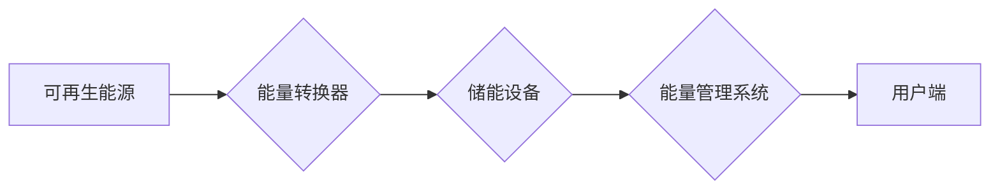

                 

## 能源存储创业：清洁能源革命的关键

> 关键词：能源存储、电池技术、储能系统、可再生能源、智能电网、人工智能、数据分析

## 1. 背景介绍

全球能源结构正在经历深刻变革，清洁能源正逐渐成为主流。太阳能、风能等可再生能源的利用日益广泛，但其间歇性发电特性带来了巨大的挑战。如何有效存储清洁能源，并将其稳定输送到用户端，是实现清洁能源革命的关键。

能源存储技术作为解决这一问题的关键技术，近年来发展迅速。从传统的铅酸电池到新型的锂离子电池、钠离子电池、固态电池等，各种储能技术层出不穷。随着技术的进步和成本的降低，能源存储市场规模不断扩大，并逐渐成为一个充满机遇的创业领域。

## 2. 核心概念与联系

### 2.1 能源存储概述

能源存储是指将电能、热能、化学能等形式的能量储存起来，并在需要时释放出来，以满足不同时间和地点的能源需求。

### 2.2 储能系统架构

储能系统通常由以下几个主要部分组成：

* **能量转换器:** 将不同形式的能量转换为可存储的形式，例如太阳能电池板将光能转换为电能。
* **储能设备:** 负责存储能量，例如电池、压缩空气储能系统、 pumped hydro storage 等。
* **能量管理系统:** 控制能量的存储和释放，并根据需求进行优化调度。

**Mermaid 流程图:**



### 2.3 能源存储与清洁能源的关联

清洁能源的间歇性发电特性使得能源存储成为其不可或缺的组成部分。通过将清洁能源存储起来，可以有效解决其供需不匹配的问题，提高能源利用效率，并促进清洁能源的普及应用。

## 3. 核心算法原理 & 具体操作步骤

### 3.1 算法原理概述

能源存储系统的优化调度算法是确保其高效运行的关键。这些算法通常基于预测模型，预测未来能源需求和可再生能源发电量，并根据预测结果进行能量的存储和释放调度。常见的算法包括：

* **最优控制算法:** 通过数学模型和优化算法，寻找最优的能量存储和释放策略，以最小化成本或最大化效益。
* **强化学习算法:** 通过训练模型，让其学习最佳的调度策略，并根据环境变化进行动态调整。
* **预测模型:** 利用历史数据和天气预报等信息，预测未来能源需求和可再生能源发电量，为调度算法提供决策依据。

### 3.2 算法步骤详解

以最优控制算法为例，其具体步骤如下：

1. **建立数学模型:** 建立描述能源存储系统动力学行为的数学模型，包括能量转换、存储和释放过程。
2. **定义目标函数:** 根据实际需求，定义优化目标，例如最小化成本、最大化效益或最小化碳排放。
3. **求解最优控制策略:** 利用优化算法，例如动态规划、梯度下降等，求解最优的能量存储和释放策略，使目标函数达到最小值或最大值。
4. **实施控制策略:** 将求解出的最优控制策略应用于实际系统，控制能量的存储和释放。

### 3.3 算法优缺点

**优点:**

* 理论上可以找到最优的调度策略。
* 可以根据不同的目标函数进行优化。

**缺点:**

* 模型建立复杂，需要大量的系统数据和专业知识。
* 计算量大，实时性较差。

### 3.4 算法应用领域

最优控制算法广泛应用于能源存储系统的优化调度，例如：

* 电力系统稳定性控制
* 可再生能源消纳优化
* 电力市场交易

## 4. 数学模型和公式 & 详细讲解 & 举例说明

### 4.1 数学模型构建

一个简单的能源存储系统数学模型可以描述如下：

* **能量平衡方程:**

$$
\frac{dE}{dt} = P_{in} - P_{out} - P_{loss}
$$

其中：

* $E$ 是储能设备的能量
* $t$ 是时间
* $P_{in}$ 是输入功率
* $P_{out}$ 是输出功率
* $P_{loss}$ 是能量损耗功率

* **能量存储容量限制:**

$$
E_{min} \leq E \leq E_{max}
$$

其中：

* $E_{min}$ 是最小能量存储容量
* $E_{max}$ 是最大能量存储容量

### 4.2 公式推导过程

通过上述方程，可以推导得出能量存储系统的动态行为方程，并根据不同的目标函数和约束条件，利用优化算法求解最优的控制策略。

### 4.3 案例分析与讲解

例如，假设一个太阳能发电系统与电池组组成的储能系统，目标是最大化利用太阳能发电，并满足用户端负荷需求。

通过建立能量平衡方程和能量存储容量限制，并利用最优控制算法，可以求解出最佳的电池充电和放电策略，以最大化太阳能利用率，并满足用户负荷需求。

## 5. 项目实践：代码实例和详细解释说明

### 5.1 开发环境搭建

* 操作系统：Linux
* 编程语言：Python
* 库依赖：NumPy, SciPy, Matplotlib

### 5.2 源代码详细实现

```python
import numpy as np
from scipy.optimize import minimize

# 定义能量平衡方程
def energy_balance(E, P_in, P_out, P_loss):
  return dE/dt = P_in - P_out - P_loss

# 定义目标函数
def objective_function(x):
  # 计算目标函数值
  return ...

# 定义约束条件
def constraints(x):
  # 定义约束条件
  return ...

# 设置初始值
initial_guess = ...

# 使用优化算法求解
result = minimize(objective_function, initial_guess, constraints=constraints)

# 获取最优控制策略
optimal_control = result.x

# ...
```

### 5.3 代码解读与分析

* 该代码示例展示了如何使用Python和SciPy库实现能源存储系统的优化调度算法。
* `energy_balance`函数定义了能量平衡方程，`objective_function`函数定义了目标函数，`constraints`函数定义了约束条件。
* `minimize`函数使用优化算法求解最优控制策略。

### 5.4 运行结果展示

运行结果将显示最优的能量存储和释放策略，例如电池充电和放电时间，以及能量存储和释放量。

## 6. 实际应用场景

### 6.1 电力系统稳定性控制

能源存储系统可以帮助电力系统稳定运行，并应对可再生能源的间歇性发电。

### 6.2 可再生能源消纳优化

能源存储系统可以有效消纳可再生能源，提高其利用率，并降低对传统能源的依赖。

### 6.3 电力市场交易

能源存储系统可以参与电力市场交易，根据市场价格波动进行能量存储和释放，提高收益。

### 6.4 未来应用展望

随着技术的进步和成本的降低，能源存储系统将在更多领域得到应用，例如：

* **电动汽车充电:** 构建智能充电网络，优化充电时间和地点，提高充电效率。
* **微电网:** 构建分布式能源系统，提高能源可靠性和安全性。
* **数据中心:** 提供备用电源，保障数据中心稳定运行。

## 7. 工具和资源推荐

### 7.1 学习资源推荐

* **书籍:**

* "Energy Storage Systems" by Thomas Ackermann
* "Battery Management Systems" by John Goodenough

* **在线课程:**

* Coursera: "Energy Storage"
* edX: "Renewable Energy Systems"

### 7.2 开发工具推荐

* **Python:** 广泛用于能源存储系统开发，拥有丰富的库和工具。
* **MATLAB:** 用于建模和仿真，可以帮助理解能源存储系统的动态行为。
* **Simulink:** 用于构建和模拟复杂系统，可以用于能源存储系统的仿真和测试。

### 7.3 相关论文推荐

* "A Review of Energy Storage Technologies" by A. K. Sharma et al.
* "Energy Storage for Renewable Energy Systems" by M. A. Hossain et al.

## 8. 总结：未来发展趋势与挑战

### 8.1 研究成果总结

能源存储技术发展迅速，各种储能技术不断涌现，并取得了显著的成果。

### 8.2 未来发展趋势

* **成本降低:** 随着技术的进步和规模化生产，能源存储系统的成本将进一步降低。
* **技术创新:** 新型储能技术将不断涌现，例如固态电池、金属空气电池等。
* **智能化:** 结合人工智能和数据分析，实现能源存储系统的智能化管理和优化调度。

### 8.3 面临的挑战

* **安全性:** 确保能源存储系统的安全运行，防止电池过充、过放等安全事故。
* **寿命:** 提高能源存储系统的寿命，降低维护成本。
* **可持续性:** 采用可持续的材料和制造工艺，减少对环境的影响。

### 8.4 研究展望

未来，能源存储技术将继续朝着更高效、更安全、更可持续的方向发展，并将在清洁能源革命中发挥越来越重要的作用。

## 9. 附录：常见问题与解答

* **Q1: 什么是能源存储？**

* **A1:** 能源存储是指将能量存储起来，并在需要时释放出来，以满足不同时间和地点的能源需求。

* **Q2: 能源存储有哪些类型？**

* **A2:** 常规的能源存储类型包括电池存储、压缩空气储能、 pumped hydro storage 等。

* **Q3: 能源存储的应用场景有哪些？**

* **A3:** 能源存储的应用场景广泛，包括电力系统稳定性控制、可再生能源消纳优化、电动汽车充电等。


作者：禅与计算机程序设计艺术 / Zen and the Art of Computer Programming 
<end_of_turn>

