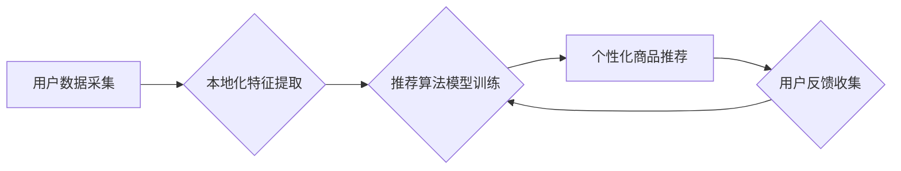

                 

## AI推荐算法在跨境电商中的本地化应用

> 关键词：跨境电商、推荐算法、本地化、个性化、机器学习、深度学习、用户画像

## 1. 背景介绍

跨境电商的蓬勃发展为全球消费者提供了便捷的购物体验，但也带来了新的挑战。其中，如何精准推荐符合用户需求的商品，提升用户粘性和转化率，是跨境电商平台亟需解决的关键问题。传统的推荐算法往往依赖于用户历史行为和商品标签信息，缺乏对用户个性化需求和文化背景的考虑，难以满足跨境电商平台的多样化用户群体。

本地化推荐算法应运而生，旨在根据用户的地理位置、语言、文化偏好等信息，提供更精准、更符合用户期望的商品推荐。这对于跨境电商平台来说至关重要，因为它可以帮助平台更好地理解用户的需求，提供更个性化的购物体验，从而提高用户满意度和复购率。

## 2. 核心概念与联系

### 2.1 跨境电商本地化

跨境电商本地化是指根据目标市场的文化、语言、法律法规等差异，对电商平台、商品信息、营销策略等进行调整，以满足目标市场用户的需求。本地化可以提升用户体验，提高转化率，并帮助跨境电商平台更好地融入目标市场。

### 2.2 推荐算法

推荐算法是一种利用数据挖掘和机器学习技术，根据用户的历史行为、偏好和上下文信息，预测用户可能感兴趣的商品或内容的算法。推荐算法可以分为基于内容的推荐、基于协同过滤的推荐和基于深度学习的推荐等多种类型。

### 2.3 融合

本地化推荐算法将跨境电商本地化理念与推荐算法相结合，通过对用户数据的深度挖掘和分析，识别用户的文化背景、语言偏好、消费习惯等信息，并根据这些信息对商品进行个性化推荐。

**Mermaid 流程图**



## 3. 核心算法原理 & 具体操作步骤

### 3.1 算法原理概述

本地化推荐算法的核心原理是利用机器学习技术，构建一个能够根据用户本地化特征进行商品推荐的模型。该模型需要学习用户与商品之间的关系，并根据用户的地理位置、语言、文化偏好等信息，预测用户可能感兴趣的商品。

### 3.2 算法步骤详解

1. **用户数据采集:** 收集用户的基本信息、浏览历史、购买记录、评价信息等数据。
2. **本地化特征提取:** 从用户数据中提取用户的地理位置、语言、文化偏好等本地化特征。
3. **商品信息处理:** 对商品信息进行标准化处理，提取商品的类别、属性、价格、评价等信息。
4. **特征融合:** 将用户的本地化特征与商品信息进行融合，构建用户-商品交互特征向量。
5. **模型训练:** 利用机器学习算法，例如协同过滤、深度学习等，训练推荐模型。
6. **个性化商品推荐:** 根据用户的本地化特征和交互特征向量，预测用户可能感兴趣的商品，并进行排序推荐。
7. **用户反馈收集:** 收集用户的点击、购买、评价等反馈信息，用于模型的持续优化和改进。

### 3.3 算法优缺点

**优点:**

* **个性化推荐:** 能够根据用户的本地化特征提供更精准、更个性化的商品推荐。
* **提升用户体验:** 提供更符合用户需求的商品推荐，提升用户购物体验。
* **提高转化率:** 精准的推荐能够提高用户购买意愿，从而提升转化率。

**缺点:**

* **数据依赖:** 需要大量的用户数据进行模型训练，数据质量直接影响推荐效果。
* **模型复杂度:** 本地化推荐算法模型相对复杂，需要专业的技术人员进行开发和维护。
* **隐私保护:** 需要谨慎处理用户隐私信息，确保数据安全和用户隐私保护。

### 3.4 算法应用领域

本地化推荐算法广泛应用于跨境电商、旅游、教育、金融等领域，可以帮助企业更好地理解用户的需求，提供更个性化的服务，提升用户满意度和忠诚度。

## 4. 数学模型和公式 & 详细讲解 & 举例说明

### 4.1 数学模型构建

本地化推荐算法通常采用协同过滤或深度学习模型。协同过滤模型基于用户的历史行为和商品的相似性进行推荐，而深度学习模型则能够学习用户和商品之间的复杂关系。

**协同过滤模型:**

假设用户集合为U，商品集合为I，用户对商品的评分矩阵为R，其中R(u,i)表示用户u对商品i的评分。协同过滤模型的目标是预测用户u对商品i的评分R(u,i)。

**深度学习模型:**

深度学习模型通常采用神经网络结构，例如多层感知机（MLP）、卷积神经网络（CNN）或循环神经网络（RNN）。这些模型能够学习用户和商品之间的复杂关系，并进行更精准的推荐。

### 4.2 公式推导过程

**协同过滤模型:**

常用的协同过滤算法包括基于用户的协同过滤和基于物品的协同过滤。

* **基于用户的协同过滤:**

预测用户u对商品i的评分R(u,i) =  平均(R(u,j) | j∈N(i))，其中N(i)表示与商品i相似度高的商品集合。

* **基于物品的协同过滤:**

预测用户u对商品i的评分R(u,i) =  平均(R(v,i) | v∈N(u))，其中N(u)表示与用户u兴趣相似的用户集合。

**深度学习模型:**

深度学习模型的公式推导过程较为复杂，涉及到激活函数、损失函数、反向传播算法等多个方面。

### 4.3 案例分析与讲解

**案例:**

假设一个跨境电商平台想要推荐服装商品给用户。

**协同过滤模型:**

平台可以根据用户的历史购买记录和商品的相似性，推荐用户可能感兴趣的服装商品。例如，如果用户之前购买过牛仔裤，平台可以推荐其他类型的牛仔裤、休闲裤或运动裤等。

**深度学习模型:**

平台可以利用用户的浏览历史、购买记录、评价信息等数据，训练一个深度学习模型，学习用户和商品之间的复杂关系。模型可以识别用户的风格偏好、尺寸需求、价格敏感度等信息，并根据这些信息进行更精准的推荐。

## 5. 项目实践：代码实例和详细解释说明

### 5.1 开发环境搭建

本地化推荐算法的开发环境通常包括以下软件：

* **编程语言:** Python
* **机器学习库:** scikit-learn, TensorFlow, PyTorch
* **数据处理库:** Pandas, NumPy
* **数据库:** MySQL, MongoDB

### 5.2 源代码详细实现

以下是一个基于协同过滤的本地化推荐算法的简单代码示例：

```python
import pandas as pd
from sklearn.metrics.pairwise import cosine_similarity

# 加载用户-商品评分数据
ratings = pd.read_csv('ratings.csv')

# 提取用户本地化特征
user_features = pd.read_csv('user_features.csv')

# 将用户本地化特征与评分数据合并
ratings = pd.merge(ratings, user_features, on='user_id')

# 计算商品之间的相似度
item_similarity = cosine_similarity(ratings.pivot_table(index='item_id', columns='user_id', values='rating').fillna(0))

# 根据用户本地化特征和商品相似度进行推荐
def recommend_items(user_id, top_n=5):
    user_ratings = ratings[ratings['user_id'] == user_id]['rating']
    similar_items = item_similarity[ratings['item_id'].unique().tolist().index(user_ratings.index[0])]
    recommended_items = similar_items.argsort()[-top_n:][::-1]
    return recommended_items

# 获取用户id
user_id = 123

# 获取推荐商品列表
recommended_items = recommend_items(user_id)

# 打印推荐商品列表
print(f'推荐给用户 {user_id} 的商品：{recommended_items}')
```

### 5.3 代码解读与分析

该代码首先加载用户-商品评分数据和用户本地化特征数据，然后将两者合并。接着，计算商品之间的相似度，并根据用户本地化特征和商品相似度进行推荐。

### 5.4 运行结果展示

运行该代码后，将输出用户id为123的推荐商品列表。

## 6. 实际应用场景

### 6.1 跨境电商平台

跨境电商平台可以利用本地化推荐算法，根据用户的地理位置、语言、文化偏好等信息，推荐更符合用户需求的商品，提升用户购物体验和转化率。

### 6.2 旅游平台

旅游平台可以根据用户的旅行偏好、预算、时间等信息，推荐个性化的旅游路线、酒店、景点等，提升用户旅行体验。

### 6.3 教育平台

教育平台可以根据用户的学习目标、兴趣、学习进度等信息，推荐个性化的学习资源、课程、辅导等，提升用户学习效率。

### 6.4 未来应用展望

随着人工智能技术的不断发展，本地化推荐算法将应用于更多领域，为用户提供更个性化、更智能化的服务。

## 7. 工具和资源推荐

### 7.1 学习资源推荐

* **书籍:**

    * 《推荐系统实践》
    * 《深度学习》
    * 《机器学习》

* **在线课程:**

    * Coursera: 机器学习
    * Udacity: 深度学习
    * edX: 数据科学

### 7.2 开发工具推荐

* **Python:** 

    * scikit-learn
    * TensorFlow
    * PyTorch

* **数据库:**

    * MySQL
    * MongoDB

### 7.3 相关论文推荐

* **协同过滤:**

    * "Collaborative Filtering for Implicit Feedback Datasets"
    * "Matrix Factorization Techniques for Recommender Systems"

* **深度学习:**

    * "Deep Learning Recommender Systems"
    * "Neural Collaborative Filtering"

## 8. 总结：未来发展趋势与挑战

### 8.1 研究成果总结

本地化推荐算法在跨境电商、旅游、教育等领域取得了显著的成果，能够提升用户体验和转化率。

### 8.2 未来发展趋势

* **更精准的个性化推荐:** 利用更丰富的用户数据和更先进的机器学习算法，实现更精准的个性化推荐。
* **跨平台推荐:** 将本地化推荐算法应用于多个平台，提供更全面的用户体验。
* **多模态推荐:** 结合文本、图像、视频等多模态数据，进行更丰富的商品推荐。

### 8.3 面临的挑战

* **数据质量:** 本地化推荐算法依赖于高质量的用户数据，数据质量直接影响推荐效果。
* **模型复杂度:** 本地化推荐算法模型相对复杂，需要专业的技术人员进行开发和维护。
* **隐私保护:** 需要谨慎处理用户隐私信息，确保数据安全和用户隐私保护。

### 8.4 研究展望

未来，本地化推荐算法将继续朝着更精准、更智能、更安全的方向发展，为用户提供更个性化、更便捷的体验。


## 9. 附录：常见问题与解答

**Q1: 本地化推荐算法与传统推荐算法有什么区别？**

**A1:** 传统推荐算法往往依赖于用户历史行为和商品标签信息，缺乏对用户个性化需求和文化背景的考虑。而本地化推荐算法则将用户的地理位置、语言、文化偏好等信息融入到推荐模型中，能够提供更精准、更符合用户期望的商品推荐。

**Q2: 如何收集用户本地化特征数据？**

**A2:** 可以通过用户注册信息、用户行为数据、用户反馈等方式收集用户本地化特征数据。例如，用户注册时可以填写其国家、语言、文化背景等信息；用户浏览商品时可以记录其访问的页面、点击的商品等行为数据；用户对商品进行评价时可以收集其对商品的评价内容等反馈信息。

**Q3: 如何评估本地化推荐算法的性能？**

**A3:** 可以使用准确率、召回率、F1-score等指标评估本地化推荐算法的性能。此外，还可以通过用户点击率、转化率等指标来衡量推荐算法的实际效果。


作者：禅与计算机程序设计艺术 / Zen and the Art of Computer Programming 
<end_of_turn>

