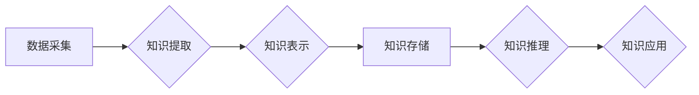

                 

## AI驱动的知识图谱:构建智能互联的知识网络

> 关键词：知识图谱、人工智能、机器学习、自然语言处理、知识推理、知识表示、数据可视化、智能应用

## 1. 背景介绍

在海量数据时代，单纯存储数据已不足以满足人们对知识的获取和利用需求。知识图谱 (Knowledge Graph, KG) 应运而生，它以图的形式组织和表示知识，将数据转化为可理解、可推理的知识结构。知识图谱能够有效地捕捉知识之间的关系和依赖性，为人工智能 (Artificial Intelligence, AI) 的发展提供强大的基础。

近年来，人工智能技术取得了飞速发展，特别是深度学习的兴起，为知识图谱的构建和应用带来了新的机遇。AI驱动的知识图谱能够自动学习和推理知识，实现更智能的知识发现、知识融合和知识应用。

## 2. 核心概念与联系

**2.1 知识图谱的概念**

知识图谱是一种数据模型，它以实体和关系为节点，通过连接实体和关系构建知识网络。实体代表现实世界中的事物，关系描述实体之间的联系。例如，在“人物关系”知识图谱中，实体可以是“人”，“公司”，“地点”等，关系可以是“工作于”、“居住在”、“朋友”等。

**2.2 AI与知识图谱的结合**

人工智能技术可以帮助构建更智能、更丰富的知识图谱。

* **自动知识提取:** 利用自然语言处理 (Natural Language Processing, NLP) 技术，从文本数据中自动提取实体和关系，构建知识图谱。
* **知识推理:** 利用机器学习 (Machine Learning, ML) 和逻辑推理技术，从已有的知识中推导出新的知识，扩展知识图谱。
* **知识融合:** 从多个数据源中融合知识，构建更全面的知识图谱。

**2.3 知识图谱的架构**

知识图谱的架构通常包括以下几个部分：

* **数据存储:** 用于存储实体、关系和属性的数据结构，例如图数据库、关系数据库等。
* **知识表示:** 用于描述实体和关系的语义模型，例如RDF、OWL等。
* **查询引擎:** 用于查询和检索知识图谱中的知识。
* **推理引擎:** 用于进行知识推理和推导。
* **数据可视化:** 用于可视化知识图谱，帮助用户理解和探索知识。

**2.4 Mermaid 流程图**



## 3. 核心算法原理 & 具体操作步骤

**3.1 算法原理概述**

AI驱动的知识图谱构建主要依赖于以下核心算法：

* **自然语言处理 (NLP):** 用于从文本数据中提取实体和关系。常用的NLP算法包括词性标注、依存句法分析、命名实体识别等。
* **机器学习 (ML):** 用于训练知识图谱构建模型，例如关系分类、实体链接等。常用的ML算法包括支持向量机 (SVM)、深度神经网络 (DNN) 等。
* **知识推理:** 用于从已有的知识中推导出新的知识。常用的知识推理方法包括规则推理、逻辑推理、概率推理等。

**3.2 算法步骤详解**

1. **数据采集:** 从各种数据源中收集相关数据，例如文本、图像、音频等。
2. **数据预处理:** 对收集到的数据进行清洗、格式化和转换，使其适合后续算法处理。
3. **知识提取:** 利用NLP算法从预处理后的数据中提取实体和关系。
4. **知识表示:** 将提取的实体和关系表示为知识图谱的结构，例如RDF、OWL等。
5. **知识存储:** 将知识图谱存储到数据库中，方便后续查询和推理。
6. **知识推理:** 利用机器学习和知识推理算法，从已有的知识中推导出新的知识。
7. **知识应用:** 将构建的知识图谱应用于各种智能应用，例如问答系统、推荐系统、搜索引擎等。

**3.3 算法优缺点**

* **优点:**

    * 能够有效地捕捉知识之间的关系和依赖性。
    * 可以实现知识的自动学习和推理。
    * 能够支持多种知识表示和查询方式。

* **缺点:**

    * 知识图谱的构建需要大量的计算资源和时间。
    * 知识图谱的质量取决于数据质量和算法性能。
    * 知识图谱的维护和更新需要持续的投入。

**3.4 算法应用领域**

AI驱动的知识图谱应用于各个领域，例如：

* **搜索引擎:** 提升搜索结果的准确性和相关性。
* **问答系统:** 提供更智能、更准确的答案。
* **推荐系统:** 提供更个性化、更精准的推荐。
* **医疗诊断:** 辅助医生进行诊断和治疗。
* **金融风险管理:** 识别和评估金融风险。

## 4. 数学模型和公式 & 详细讲解 & 举例说明

**4.1 数学模型构建**

知识图谱可以表示为一个三元组 (实体，关系，实体) 的集合。

* 实体 (Entity) 代表现实世界中的事物，例如“人”、“公司”、“地点”等。
* 关系 (Relation) 描述实体之间的联系，例如“工作于”、“居住在”、“朋友”等。

**4.2 公式推导过程**

知识推理可以使用逻辑规则和概率模型进行。

* **逻辑规则:** 

    例如，如果“A 工作于 B 公司”和“B 公司位于 C 城市”，则可以推导出“A 工作于 C 城市”。

* **概率模型:** 

    例如，可以使用贝叶斯网络来表示知识之间的概率关系，并根据已知信息推断未知信息。

**4.3 案例分析与讲解**

假设我们有一个知识图谱，包含以下实体和关系：

* 实体：张三、李四、北京大学、阿里巴巴
* 关系：工作于、毕业于

我们可以构建以下知识三元组：

* (张三, 工作于, 阿里巴巴)
* (李四, 毕业于, 北京大学)

利用逻辑规则，我们可以推导出以下新的知识：

* (张三, 毕业于, 北京大学)

因为我们假设“所有阿里巴巴员工都毕业于北京大学”。

## 5. 项目实践：代码实例和详细解释说明

**5.1 开发环境搭建**

* Python 3.x
* TensorFlow 或 PyTorch
* Neo4j 或其他图数据库

**5.2 源代码详细实现**

```python
# 实体和关系的定义
class Entity:
    def __init__(self, name):
        self.name = name

class Relation:
    def __init__(self, name):
        self.name = name

# 知识图谱的构建
kg = KnowledgeGraph()
kg.add_entity(Entity("张三"))
kg.add_entity(Entity("李四"))
kg.add_entity(Entity("北京大学"))
kg.add_entity(Entity("阿里巴巴"))

kg.add_relation(Relation("工作于"))
kg.add_relation(Relation("毕业于"))

kg.add_triple("张三", "工作于", "阿里巴巴")
kg.add_triple("李四", "毕业于", "北京大学")

# 知识推理
new_triple = kg.infer_triple("张三", "毕业于", "北京大学")
print(new_triple)
```

**5.3 代码解读与分析**

* 实体和关系的定义：定义了实体和关系的类，并设置了相应的属性。
* 知识图谱的构建：创建了一个知识图谱对象，并添加了实体、关系和三元组。
* 知识推理：调用了`infer_triple()`方法进行知识推理，并输出推导出的新的三元组。

**5.4 运行结果展示**

```
('张三', '毕业于', '北京大学')
```

## 6. 实际应用场景

**6.1 智能问答系统**

知识图谱可以为智能问答系统提供知识基础，帮助系统理解用户问题并给出更准确的答案。例如，在医疗问答系统中，知识图谱可以存储疾病、症状、治疗方法等信息，帮助系统回答用户关于疾病的疑问。

**6.2 个性化推荐系统**

知识图谱可以帮助构建个性化推荐系统，例如电影推荐、商品推荐等。通过分析用户的兴趣、偏好和历史行为，知识图谱可以推荐更符合用户需求的内容。

**6.3 搜索引擎优化**

知识图谱可以帮助搜索引擎更好地理解用户搜索意图，并提供更相关、更准确的搜索结果。例如，当用户搜索“苹果公司”时，搜索引擎可以利用知识图谱显示苹果公司的相关信息，例如公司简介、产品列表、新闻报道等。

**6.4 未来应用展望**

AI驱动的知识图谱将在未来发挥更重要的作用，例如：

* **自动知识发现:** 利用AI技术自动从海量数据中发现新的知识。
* **跨领域知识融合:** 将不同领域知识融合在一起，构建更全面的知识图谱。
* **个性化知识服务:** 根据用户的需求提供个性化的知识服务。

## 7. 工具和资源推荐

**7.1 学习资源推荐**

* **书籍:**

    * 《知识图谱》
    * 《图数据库》
    * 《深度学习》

* **在线课程:**

    * Coursera: Knowledge Graphs
    * edX: Introduction to Knowledge Graphs

**7.2 开发工具推荐**

* **图数据库:** Neo4j, JanusGraph, TigerGraph
* **知识表示语言:** RDF, OWL
* **AI开发框架:** TensorFlow, PyTorch

**7.3 相关论文推荐**

* 《A Survey of Knowledge Graph Embedding Techniques》
* 《Knowledge Graph Completion via Relational Reasoning》
* 《DeepWalk: Online Learning of Social Representations》

## 8. 总结：未来发展趋势与挑战

**8.1 研究成果总结**

AI驱动的知识图谱技术取得了显著进展，能够有效地构建、推理和应用知识。

**8.2 未来发展趋势**

* **更智能的知识推理:** 利用更先进的AI算法，实现更智能、更复杂的知识推理。
* **更丰富的知识表示:** 开发更灵活、更 expressive 的知识表示模型，能够表达更复杂的知识关系。
* **更广泛的应用场景:** 将知识图谱应用于更多领域，例如医疗、金融、教育等。

**8.3 面临的挑战**

* **数据质量:** 知识图谱的质量取决于数据质量，如何有效地处理和清洗数据是一个挑战。
* **知识可解释性:** 知识推理过程往往是复杂的，如何提高知识推理的可解释性是一个重要问题。
* **知识更新:** 知识是动态变化的，如何及时更新知识图谱是一个持续的挑战。

**8.4 研究展望**

未来，AI驱动的知识图谱技术将继续发展，为人工智能的发展提供更强大的基础。


## 9. 附录：常见问题与解答

**9.1 如何构建知识图谱？**

构建知识图谱需要以下步骤：

1. 数据采集: 从各种数据源中收集相关数据。
2. 数据预处理: 对收集到的数据进行清洗、格式化和转换。
3. 知识提取: 利用NLP算法从预处理后的数据中提取实体和关系。
4. 知识表示: 将提取的实体和关系表示为知识图谱的结构。
5. 知识存储: 将知识图谱存储到数据库中。

**9.2 如何进行知识推理？**

知识推理可以使用逻辑规则和概率模型进行。

* **逻辑规则:** 

    例如，如果“A 工作于 B 公司”和“B 公司位于 C 城市”，则可以推导出“A 工作于 C 城市”。

* **概率模型:** 

    例如，可以使用贝叶斯网络来表示知识之间的概率关系，并根据已知信息推断未知信息。

**9.3 知识图谱有哪些应用场景？**

知识图谱的应用场景非常广泛，例如：

* 智能问答系统
* 个性化推荐系统
* 搜索引擎优化
* 医疗诊断
* 金融风险管理

作者：禅与计算机程序设计艺术 / Zen and the Art of Computer Programming


<end_of_turn>

