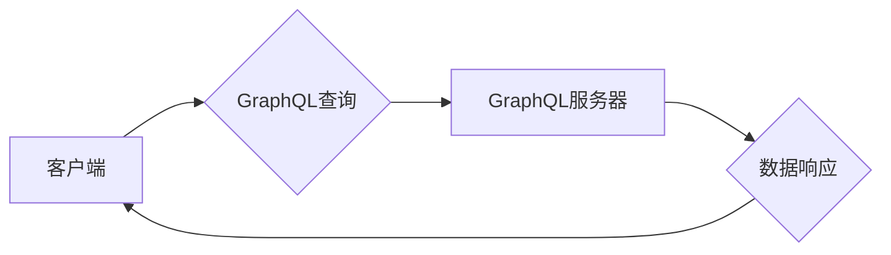

                 

## GraphQL：新一代API查询语言

> 关键词：GraphQL, API, 查询语言, 数据获取, 性能优化, 类型系统, 客户端控制

## 1. 背景介绍

随着互联网应用的日益复杂化，API（Application Programming Interface）作为软件系统之间通信的桥梁，扮演着越来越重要的角色。传统的RESTful API，虽然在过去十年中取得了广泛应用，但随着数据需求的增长和应用程序架构的演变，也逐渐暴露了一些弊端。

* **过量的数据返回：**RESTful API通常返回所有请求的数据，即使客户端只需要一部分。这会导致数据传输量过大，影响性能和带宽消耗。
* **多次请求：**获取多个相关数据时，需要发出多个独立的请求，增加了网络开销和代码复杂度。
* **版本控制问题：**随着API的不断更新，版本控制问题日益突出，客户端需要不断更新以适应新的API版本。

为了解决这些问题，Facebook于2015年开源了GraphQL，一种新的API查询语言和运行时。GraphQL提供了一种更灵活、更高效的数据获取方式，能够满足现代应用程序对数据访问的需求。

## 2. 核心概念与联系

GraphQL的核心概念是**查询语言**和**类型系统**。

* **查询语言：**GraphQL提供了一种声明式查询语言，允许客户端明确指定需要获取的数据字段。服务器根据客户端的查询请求，返回精确所需的数据，无需返回过量的数据。
* **类型系统：**GraphQL拥有强大的类型系统，定义了数据结构和字段类型。这使得API更加清晰、可维护和易于理解。

**GraphQL架构流程图：**



## 3. 核心算法原理 & 具体操作步骤

### 3.1  算法原理概述

GraphQL的查询处理流程主要基于以下算法：

1. **解析查询语句：**GraphQL服务器首先解析客户端发送的查询语句，识别出需要获取的数据字段和关系。
2. **构建执行计划：**根据解析结果，服务器构建一个执行计划，确定如何从数据源中获取所需数据。
3. **执行查询：**服务器根据执行计划，访问数据源并获取数据。
4. **格式化响应：**服务器将获取的数据格式化为JSON或其他格式，返回给客户端。

### 3.2  算法步骤详解

1. **解析查询语句：**GraphQL解析器会分析查询语句的语法结构，识别出查询操作符（如`query`、`mutation`、`subscription`）、字段名称、参数和关系操作符（如`...`）。
2. **构建执行计划：**服务器根据解析结果，构建一个执行计划，确定如何从数据源中获取所需数据。执行计划通常是一个树形结构，表示数据获取的层次关系。
3. **执行查询：**服务器根据执行计划，访问数据源并获取数据。数据源可以是数据库、缓存、API等。
4. **格式化响应：**服务器将获取的数据格式化为JSON或其他格式，返回给客户端。响应中包含查询结果和可选的错误信息。

### 3.3  算法优缺点

**优点：**

* **精确的数据获取：**客户端可以明确指定需要获取的数据字段，避免过量数据返回。
* **高效的数据传输：**只返回所需数据，减少数据传输量和带宽消耗。
* **灵活的数据结构：**GraphQL支持嵌套查询和关联查询，可以获取复杂的数据结构。
* **强类型的安全性：**GraphQL的类型系统可以确保数据类型一致性，减少错误和安全漏洞。

**缺点：**

* **学习曲线：**GraphQL的语法和概念相对复杂，需要一定的学习成本。
* **服务器端实现复杂度：**GraphQL服务器需要处理复杂的查询解析和执行计划，实现难度相对较高。
* **生态系统相对较小：**与RESTful API相比，GraphQL的生态系统相对较小，工具和资源相对较少。

### 3.4  算法应用领域

GraphQL广泛应用于各种领域，例如：

* **移动应用开发：**GraphQL可以帮助移动应用高效获取所需数据，减少网络开销和电池消耗。
* **电商平台：**GraphQL可以帮助电商平台快速获取商品信息、用户数据和订单信息，提高用户体验。
* **社交媒体：**GraphQL可以帮助社交媒体平台高效获取用户数据、帖子信息和评论信息，提高数据获取效率。
* **数据可视化：**GraphQL可以帮助数据可视化平台获取和展示复杂的数据结构，提供更直观的分析结果。

## 4. 数学模型和公式 & 详细讲解 & 举例说明

GraphQL的查询语言和类型系统可以抽象为数学模型，其中：

* **查询语句：**可以表示为一个树形结构，每个节点代表一个数据字段或操作符。
* **数据源：**可以表示为一个图结构，其中节点代表数据实体，边代表数据关系。
* **执行计划：**可以表示为一个路径图，其中路径代表数据获取的顺序。

**4.1  数学模型构建**

我们可以使用图论和树形结构来构建GraphQL的数学模型。

* **图论：**用于表示数据源和数据关系。
* **树形结构：**用于表示查询语句和执行计划。

**4.2  公式推导过程**

GraphQL的查询处理过程可以抽象为以下公式：

```
响应 = 函数(查询语句, 数据源, 执行计划)
```

其中：

* **响应：**返回给客户端的数据。
* **查询语句：**客户端发送的GraphQL查询语句。
* **数据源：**GraphQL服务器访问的数据源。
* **执行计划：**服务器根据查询语句构建的执行计划。

**4.3  案例分析与讲解**

假设我们有一个数据源，包含用户和帖子信息。用户和帖子之间存在一对多关系，即一个用户可以发布多个帖子。

**查询语句：**

```graphql
query {
  user(id: 1) {
    name
    posts {
      title
      content
    }
  }
}
```

**执行计划：**

1. 访问用户数据源，获取用户ID为1的用户数据。
2. 从用户数据中获取用户发布的帖子信息。
3. 返回用户姓名和帖子标题和内容。

**响应：**

```json
{
  "data": {
    "user": {
      "name": "John Doe",
      "posts": [
        {
          "title": "My First Post",
          "content": "This is my first post."
        },
        {
          "title": "Another Post",
          "content": "This is another post."
        }
      ]
    }
  }
}
```

## 5. 项目实践：代码实例和详细解释说明

### 5.1  开发环境搭建

* **语言：**Python
* **框架：**Django
* **GraphQL库：**Graphene

### 5.2  源代码详细实现

```python
# models.py
from django.db import models

class User(models.Model):
    name = models.CharField(max_length=255)

class Post(models.Model):
    title = models.CharField(max_length=255)
    content = models.TextField()
    user = models.ForeignKey(User, on_delete=models.CASCADE)

# schema.py
from graphene import ObjectType, String, Field, List
from graphene_django import DjangoObjectType
from .models import User, Post

class UserType(DjangoObjectType):
    class Meta:
        model = User

class PostType(DjangoObjectType):
    class Meta:
        model = Post

class Query(ObjectType):
    user = Field(UserType, id=String())
    posts = List(PostType)

    def resolve_user(self, info, id):
        return User.objects.get(pk=id)

    def resolve_posts(self, info):
        return Post.objects.all()

schema = Schema(query=Query)

# views.py
from django.http import HttpResponse
from graphene_django.views import GraphQLView

urlpatterns = [
    path('graphql/', GraphQLView.as_view(graphiql=True)),
]
```

### 5.3  代码解读与分析

* **models.py:** 定义了用户和帖子模型，以及它们之间的关系。
* **schema.py:** 定义了GraphQL的类型系统和查询操作。
* **views.py:** 配置了GraphQL视图，允许客户端通过GraphQL API访问数据。

### 5.4  运行结果展示

运行上述代码后，可以在浏览器中访问`/graphql/`，使用GraphQL查询语言获取数据。

## 6. 实际应用场景

GraphQL在各种实际应用场景中都取得了成功，例如：

* **Facebook：**GraphQL被Facebook广泛应用于其内部系统和产品，例如News Feed、Messenger等。
* **GitHub：**GitHub使用GraphQL来提供其API，允许开发者访问代码库、用户数据和项目信息。
* **Shopify：**Shopify使用GraphQL来构建其电商平台，允许商家和开发者访问产品数据、订单信息和客户数据。

### 6.4  未来应用展望

GraphQL的未来应用前景广阔，随着其生态系统的不断发展，GraphQL将被应用于更多领域，例如：

* **物联网：**GraphQL可以帮助物联网设备高效获取和共享数据。
* **区块链：**GraphQL可以帮助区块链应用提供更灵活的数据访问方式。
* **人工智能：**GraphQL可以帮助人工智能模型获取和处理数据。

## 7. 工具和资源推荐

### 7.1  学习资源推荐

* **GraphQL官方文档：**https://graphql.org/
* **GraphQL学习指南：**https://graphql.org/learn/
* **GraphQL教程：**https://www.apollographql.com/docs/tutorial/

### 7.2  开发工具推荐

* **Apollo Client：**https://www.apollographql.com/
* **GraphiQL：**https://www.apollographql.com/docs/apollo-client/data/queries/graphiql/
* **GraphQL Playground：**https://graphql-playground.apollographql.com/

### 7.3  相关论文推荐

* **GraphQL: A Data Query Language：**https://arxiv.org/abs/1509.07472

## 8. 总结：未来发展趋势与挑战

### 8.1  研究成果总结

GraphQL作为一种新一代API查询语言，已经取得了显著的成果，为数据获取和API设计提供了更灵活、更高效的解决方案。

### 8.2  未来发展趋势

GraphQL的未来发展趋势包括：

* **更强大的类型系统：**GraphQL的类型系统将更加强大，支持更复杂的类型定义和数据验证。
* **更好的性能优化：**GraphQL的性能优化将更加完善，例如缓存机制和数据分片。
* **更广泛的应用场景：**GraphQL将被应用于更多领域，例如物联网、区块链和人工智能。

### 8.3  面临的挑战

GraphQL也面临一些挑战，例如：

* **生态系统发展：**GraphQL的生态系统相对较小，需要更多的工具和资源支持。
* **标准化问题：**GraphQL标准化工作仍在进行中，需要更多的参与和贡献。
* **学习成本：**GraphQL的语法和概念相对复杂，需要一定的学习成本。

### 8.4  研究展望

未来，我们将继续研究GraphQL的理论基础和应用实践，探索其在不同领域中的应用潜力，并推动GraphQL生态系统的发展。

## 9. 附录：常见问题与解答

**Q1：GraphQL和RESTful API有什么区别？**

**A1：**GraphQL和RESTful API都是用于数据交换的协议，但它们在数据获取方式和架构上有所不同。RESTful API通常返回所有请求的数据，而GraphQL允许客户端明确指定需要获取的数据字段，避免过量数据返回。

**Q2：GraphQL的学习成本高吗？**

**A2：**GraphQL的学习成本相对较高，因为它需要学习新的语法和概念。但是，随着GraphQL生态系统的不断发展，学习资源也越来越多，学习难度也在逐渐降低。

**Q3：GraphQL的性能如何？**

**A3：**GraphQL的性能通常优于RESTful API，因为它可以避免过量数据返回，提高数据传输效率。

**Q4：GraphQL的安全性如何？**

**A4：**GraphQL的类型系统可以确保数据类型一致性，减少错误和安全漏洞。

**Q5：GraphQL的未来发展趋势如何？**

**A5：**GraphQL的未来发展趋势包括更强大的类型系统、更好的性能优化和更广泛的应用场景。


作者：禅与计算机程序设计艺术 / Zen and the Art of Computer Programming<end_of_turn>

