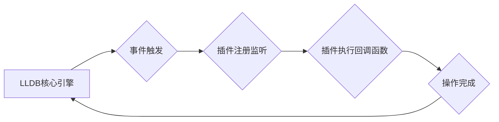

                 

## LLDB调试器插件开发

> 关键词：LLDB, 调试器插件, C++, LLVM, 调试, 反汇编, 扩展功能

## 1. 背景介绍

在现代软件开发中，调试器扮演着至关重要的角色。它帮助开发人员深入了解程序的执行流程，定位和修复错误。LLDB（Low Level Debugger）是苹果公司开发的开源调试器，它以其强大的功能和灵活的插件架构而闻名。LLDB插件允许开发者扩展调试器的功能，定制调试体验，并针对特定场景开发专用工具。

本文将深入探讨LLDB调试器插件的开发，涵盖核心概念、算法原理、代码实现以及实际应用场景。

## 2. 核心概念与联系

LLDB插件本质上是C++程序，通过与LLDB核心引擎的接口进行交互，实现扩展功能。LLDB插件架构基于事件驱动模型，插件可以注册监听特定事件，并在事件发生时执行相应的代码。

**LLDB插件架构流程图:**



**核心概念:**

* **LLDB API:** LLDB提供了一套丰富的API，用于访问调试器状态、控制程序执行、获取符号信息、操作内存等。
* **事件驱动模型:** LLDB插件通过注册监听器，响应特定事件的发生，例如程序断点、函数调用、变量修改等。
* **插件加载机制:** LLDB支持动态加载插件，开发者可以将插件打包成共享库，并在调试时加载到LLDB中。

## 3. 核心算法原理 & 具体操作步骤

LLDB插件的开发主要涉及以下核心算法和操作步骤：

### 3.1  算法原理概述

LLDB插件的核心算法原理是基于事件驱动模型和LLDB API的交互。开发者需要根据需要实现特定的事件监听器，并在事件发生时执行相应的代码逻辑。

### 3.2  算法步骤详解

1. **选择目标事件:** 确定需要监听的LLDB事件，例如断点、函数调用、变量修改等。
2. **编写事件监听器:** 使用LLDB API编写事件监听器函数，该函数将在目标事件发生时被调用。
3. **注册事件监听器:** 将事件监听器函数注册到LLDB中，指定监听的事件类型。
4. **实现事件处理逻辑:** 在事件监听器函数中实现所需的调试逻辑，例如打印变量值、修改程序执行流程、反汇编代码等。
5. **测试和调试插件:** 使用LLDB调试器测试插件的正确性，并进行必要的调试和优化。

### 3.3  算法优缺点

**优点:**

* **灵活扩展:** LLDB插件允许开发者根据需求定制调试体验，扩展调试器功能。
* **代码可复用:** 插件可以独立开发和维护，并可用于多个项目。
* **社区支持:** LLDB拥有活跃的社区，开发者可以获得丰富的资源和支持。

**缺点:**

* **开发复杂度:** LLDB API较为复杂，需要一定的C++编程经验和调试器知识。
* **性能影响:** 插件的执行可能会影响调试器的性能。

### 3.4  算法应用领域

LLDB插件的应用领域非常广泛，例如:

* **代码分析:** 开发插件进行代码分析，例如查找循环语句、识别潜在的错误代码等。
* **内存调试:** 开发插件进行内存调试，例如检测内存泄漏、分析内存分配情况等。
* **性能优化:** 开发插件进行性能优化，例如分析程序执行时间、识别性能瓶颈等。
* **定制化调试:** 开发插件针对特定场景定制调试体验，例如调试嵌入式系统、调试网络程序等。

## 4. 数学模型和公式 & 详细讲解 & 举例说明

LLDB插件的开发并不直接依赖于复杂的数学模型和公式。然而，在某些特定场景下，例如性能分析、内存管理等，可能会用到一些数学模型和算法。

### 4.1  数学模型构建

例如，在分析程序执行时间时，可以使用时间复杂度模型来评估算法的效率。时间复杂度模型通常使用大O符号来表示算法运行时间随输入规模变化的趋势。

### 4.2  公式推导过程

例如，查找算法的时间复杂度可以推导如下：

* **线性查找:** 在无序列表中查找元素，时间复杂度为 O(n)，其中n为列表长度。
* **二分查找:** 在有序列表中查找元素，时间复杂度为 O(log n)。

### 4.3  案例分析与讲解

例如，在分析内存泄漏时，可以使用堆内存分析工具来追踪内存分配和释放情况。这些工具通常会使用一些数学模型和算法来分析内存使用情况，并识别潜在的内存泄漏。

## 5. 项目实践：代码实例和详细解释说明

以下是一个简单的LLDB插件示例，用于打印当前断点处的函数名和行号:

### 5.1  开发环境搭建

* 安装LLDB调试器
* 安装C++编译器
* 安装LLDB插件开发工具

### 5.2  源代码详细实现

```c++
#include <lldb/Core/Debugger.h>
#include <lldb/Core/PluginManager.h>
#include <lldb/Symbol/Function.h>
#include <lldb/Target/Process.h>

class MyBreakpointListener : public lldb::BreakpointListener {
public:
    MyBreakpointListener() {}

    virtual void BreakpointHit(const lldb::BreakpointHitInfo &hit_info) override {
        lldb::Function *function = hit_info.GetFrame().GetFunction();
        if (function) {
            std::string function_name = function->GetFunctionName();
            int line_number = hit_info.GetFrame().GetLineEntry().GetLine();
            std::cout << "Breakpoint hit in function: " << function_name << " at line: " << line_number << std::endl;
        }
    }
};

class MyPlugin : public lldb::Plugin {
public:
    MyPlugin() : Plugin("MyPlugin", "My Plugin Description") {}

    virtual ~MyPlugin() {}

    virtual lldb::Plugin::Status Initialize() override {
        lldb::Debugger *debugger = lldb::Debugger::GetDebugger();
        MyBreakpointListener *listener = new MyBreakpointListener();
        debugger->GetBreakpointManager().AddBreakpointListener(listener);
        return lldb::Plugin::Status::Success;
    }
};

// Register the plugin
static MyPlugin plugin;
```

### 5.3  代码解读与分析

* **MyBreakpointListener:** 继承自lldb::BreakpointListener，实现BreakpointHit方法，在断点触发时打印函数名和行号。
* **MyPlugin:** 继承自lldb::Plugin，实现Initialize方法，注册MyBreakpointListener监听器。
* **PluginManager:** LLDB的插件管理器，负责加载和管理插件。

### 5.4  运行结果展示

当调试程序并设置断点时，插件将打印出断点处的函数名和行号。

## 6. 实际应用场景

LLDB插件可以应用于各种实际场景，例如:

* **代码分析:** 开发插件自动分析代码，识别潜在的错误或性能瓶颈。
* **内存调试:** 开发插件帮助调试内存泄漏、内存访问错误等问题。
* **性能优化:** 开发插件分析程序执行时间，识别性能瓶颈并提供优化建议。
* **定制化调试:** 开发插件针对特定场景定制调试体验，例如调试嵌入式系统、调试网络程序等。

### 6.4  未来应用展望

随着LLDB的不断发展，LLDB插件的应用场景将会更加广泛。未来，我们可以期待看到更多创新性的LLDB插件，例如:

* **人工智能驱动的调试:** 利用人工智能技术自动分析代码，识别潜在的错误和性能瓶颈，并提供更智能的调试建议。
* **云原生调试:** 支持云原生应用的调试，例如容器化应用、微服务架构等。
* **跨平台调试:** 支持跨平台的调试，例如iOS、macOS、Linux等。

## 7. 工具和资源推荐

### 7.1  学习资源推荐

* **LLDB官方文档:** https://lldb.llvm.org/
* **LLDB插件开发指南:** https://lldb.llvm.org/docs/Plugins.html
* **LLDB社区论坛:** https://forums.llvm.org/

### 7.2  开发工具推荐

* **C++编译器:** clang, g++
* **LLDB调试器:** https://lldb.llvm.org/

### 7.3  相关论文推荐

* **LLDB: A Powerful and Flexible Debugger:** https://www.usenix.org/system/files/conference/usenixsecurity14/sec14-paper-keller.pdf

## 8. 总结：未来发展趋势与挑战

LLDB插件开发是一个充满挑战和机遇的领域。随着LLDB的不断发展和社区的支持，LLDB插件将会成为调试器功能扩展的重要手段，为开发者提供更强大的调试工具和更灵活的调试体验。

### 8.1  研究成果总结

本文介绍了LLDB调试器插件的开发基础知识，包括核心概念、算法原理、代码实现以及实际应用场景。

### 8.2  未来发展趋势

未来，LLDB插件将会朝着以下方向发展:

* **更智能的调试:** 利用人工智能技术，自动分析代码，识别潜在的错误和性能瓶颈，并提供更智能的调试建议。
* **更强大的功能:** 开发更多功能强大的LLDB插件，例如代码分析、内存调试、性能优化等。
* **更广泛的应用场景:** LLDB插件将会应用于更多场景，例如云原生应用、跨平台调试等。

### 8.3  面临的挑战

LLDB插件开发也面临一些挑战:

* **开发复杂度:** LLDB API较为复杂，需要一定的C++编程经验和调试器知识。
* **性能影响:** 插件的执行可能会影响调试器的性能。
* **插件生态建设:** 需要更多的开发者参与到LLDB插件开发中，构建更加丰富的插件生态。

### 8.4  研究展望

未来，我们将继续深入研究LLDB插件开发，探索更智能、更强大的LLDB插件，为开发者提供更便捷、更高效的调试体验。

## 9. 附录：常见问题与解答

* **如何注册LLDB插件?**

LLDB插件需要通过动态链接库的形式加载到LLDB中。可以使用LLDB的`plugin load`命令加载插件。

* **LLDB插件的开发语言是什么?**

LLDB插件主要使用C++语言开发。

* **LLDB插件的性能如何?**

LLDB插件的性能取决于插件的实现和使用的场景。合理的插件设计和优化可以有效地避免性能问题。


作者：禅与计算机程序设计艺术 / Zen and the Art of Computer Programming 
<end_of_turn>

