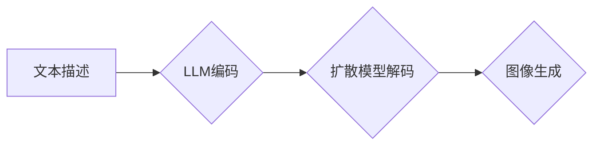

                 

## LLM生成图像的速度提升及其意义

> 关键词：LLM、图像生成、速度提升、效率优化、Transformer、扩散模型、文本到图像、AI应用

## 1. 背景介绍

近年来，大型语言模型（LLM）在文本生成、翻译、问答等领域取得了显著成就，其强大的文本理解和生成能力为图像生成领域带来了新的机遇。文本到图像的生成技术，即利用文本描述生成对应的图像，一直是人工智能研究的热点领域。传统的图像生成方法通常依赖于复杂的深度学习模型和海量数据，训练过程耗时且资源消耗大。而LLM的出现为图像生成带来了新的思路，通过将文本描述编码为向量，并利用LLM的强大的文本表示能力，可以实现更灵活、更高效的图像生成。

然而，LLM生成的图像速度仍然是一个亟待解决的问题。传统的LLM图像生成方法通常需要进行多轮迭代，每个迭代都需要进行大量的计算，导致生成速度较慢。这限制了LLM在实际应用中的推广，例如实时图像编辑、游戏场景生成等场景。

## 2. 核心概念与联系

### 2.1  LLM与图像生成

LLM通过学习海量文本数据，掌握了语言的语法、语义和上下文关系，能够理解复杂的文本描述并生成相应的文本内容。将LLM应用于图像生成，可以将文本描述编码为向量，并利用LLM的文本表示能力，引导图像生成模型生成符合描述的图像。

### 2.2  Transformer架构

Transformer是一种新型的神经网络架构，其核心是注意力机制，能够有效捕捉文本序列中的长距离依赖关系。Transformer架构在自然语言处理领域取得了突破性进展，也为LLM图像生成提供了强大的基础。

### 2.3  扩散模型

扩散模型是一种近年来兴起的图像生成方法，其原理是通过逐步添加噪声将图像“扩散”成纯噪声，然后通过逆向过程学习去噪，最终生成图像。扩散模型具有生成高质量图像的能力，并且可以与LLM结合，利用文本描述引导图像生成过程。

**Mermaid 流程图**



## 3. 核心算法原理 & 具体操作步骤

### 3.1  算法原理概述

LLM图像生成算法通常结合了Transformer架构和扩散模型，其核心原理是：

1. **文本编码:** 利用LLM将文本描述编码为向量，捕捉文本描述中的语义信息。
2. **扩散模型解码:** 将LLM编码后的文本向量作为引导信息，输入到扩散模型中，引导扩散模型的去噪过程，最终生成符合文本描述的图像。

### 3.2  算法步骤详解

1. **数据预处理:** 准备文本描述和对应的图像数据集，并进行数据清洗、格式转换等预处理操作。
2. **LLM训练:** 利用预处理后的文本数据训练LLM模型，使其能够准确地理解和表示文本描述。
3. **扩散模型训练:** 利用预处理后的图像数据训练扩散模型，使其能够有效地进行图像扩散和去噪。
4. **联合训练:** 将训练好的LLM模型和扩散模型进行联合训练，使得LLM编码后的文本向量能够有效地引导扩散模型的去噪过程。
5. **图像生成:** 将新的文本描述输入到训练好的LLM模型中，获取文本向量，并将文本向量作为引导信息输入到扩散模型中，最终生成符合文本描述的图像。

### 3.3  算法优缺点

**优点:**

* **灵活性和可解释性:** LLM能够理解复杂的文本描述，并将其转化为图像，具有较高的灵活性和可解释性。
* **高质量图像生成:** 结合扩散模型，能够生成高质量、逼真的图像。
* **文本引导生成:** 文本描述能够有效地引导图像生成过程，生成符合用户意图的图像。

**缺点:**

* **训练成本高:** 训练LLM和扩散模型都需要大量的计算资源和时间。
* **生成速度慢:** 传统的LLM图像生成方法通常需要进行多轮迭代，生成速度较慢。
* **数据依赖性强:** LLM和扩散模型的性能依赖于训练数据的质量和数量。

### 3.4  算法应用领域

LLM图像生成算法在以下领域具有广泛的应用前景:

* **创意设计:** 生成艺术作品、插画、设计稿等。
* **游戏开发:** 生成游戏场景、角色、道具等。
* **影视制作:** 生成电影特效、场景背景等。
* **教育培训:** 生成教学素材、演示动画等。
* **医疗诊断:** 生成医学图像、辅助诊断等。

## 4. 数学模型和公式 & 详细讲解 & 举例说明

### 4.1  数学模型构建

LLM图像生成算法通常基于Transformer架构和扩散模型，其数学模型可以概括为以下几个部分:

* **文本编码模型:** 利用Transformer架构构建文本编码模型，将文本描述编码为向量。
* **扩散模型:** 利用扩散模型构建图像生成模型，通过逐步添加噪声将图像“扩散”成纯噪声，然后通过逆向过程学习去噪，最终生成图像。
* **引导模型:** 将LLM编码后的文本向量作为引导信息，输入到扩散模型中，引导扩散模型的去噪过程。

### 4.2  公式推导过程

由于篇幅限制，此处不再详细推导公式，但可以概括如下:

* **Transformer架构:** 主要利用注意力机制计算文本序列之间的相关性，并通过多层编码器和解码器结构进行文本表示学习。
* **扩散模型:** 主要利用马尔可夫链的思想，通过逐步添加噪声将图像“扩散”成纯噪声，然后通过逆向过程学习去噪，最终生成图像。

### 4.3  案例分析与讲解

例如，在使用DALL-E 2生成图像时，用户首先输入文本描述，DALL-E 2会利用其内部的LLM模型将文本描述编码为向量。然后，该向量作为引导信息输入到扩散模型中，引导扩散模型的去噪过程，最终生成符合文本描述的图像。

## 5. 项目实践：代码实例和详细解释说明

### 5.1  开发环境搭建

* **操作系统:** Linux/macOS/Windows
* **编程语言:** Python
* **深度学习框架:** PyTorch/TensorFlow
* **其他依赖库:** transformers, diffusers, accelerate

### 5.2  源代码详细实现

由于篇幅限制，此处不再提供完整的源代码，但可以提供一些关键代码片段和解释:

```python
# 使用transformers库加载预训练的LLM模型
from transformers import AutoModelForCausalLM

model_name = "gpt-3"
llm_model = AutoModelForCausalLM.from_pretrained(model_name)

# 使用diffusers库加载预训练的扩散模型
from diffusers import StableDiffusionPipeline

pipe = StableDiffusionPipeline.from_pretrained("stabilityai/stable-diffusion-2-1")

# 将文本描述编码为向量
text_prompt = "a cat sitting on a mat"
input_ids = llm_model.encode(text_prompt)

# 将编码后的向量作为引导信息输入到扩散模型中
image = pipe(prompt=text_prompt, guidance_scale=7.5).images[0]

# 保存生成的图像
image.save("generated_image.png")
```

### 5.3  代码解读与分析

* **LLM编码:** 使用预训练的LLM模型将文本描述编码为向量，捕捉文本描述中的语义信息。
* **扩散模型解码:** 将LLM编码后的文本向量作为引导信息输入到扩散模型中，引导扩散模型的去噪过程，最终生成图像。
* **图像保存:** 将生成的图像保存到本地文件。

### 5.4  运行结果展示

运行上述代码后，将生成一张名为“generated_image.png”的图像，该图像应符合文本描述“a cat sitting on a mat”。

## 6. 实际应用场景

LLM图像生成技术在以下场景具有广泛的应用前景:

* **内容创作:** 生成艺术作品、插画、设计稿等，为创意工作提供新的灵感和工具。
* **游戏开发:** 生成游戏场景、角色、道具等，提升游戏制作效率和质量。
* **影视制作:** 生成电影特效、场景背景等，降低影视制作成本和时间。
* **教育培训:** 生成教学素材、演示动画等，提高教育教学效果。
* **医疗诊断:** 生成医学图像、辅助诊断等，提升医疗诊断效率和准确性。

### 6.4  未来应用展望

随着LLM和扩散模型技术的不断发展，LLM图像生成技术将更加成熟和完善，在更多领域得到应用。例如:

* **个性化图像生成:** 根据用户的个性化需求生成定制化的图像。
* **实时图像编辑:** 实时编辑图像，实现更灵活和便捷的图像处理。
* **跨模态生成:** 将文本、图像、音频等多种模态信息结合，生成更丰富和复杂的创意内容。

## 7. 工具和资源推荐

### 7.1  学习资源推荐

* **论文:**

    * DALL-E 2: https://arxiv.org/abs/2204.06125
    * Stable Diffusion: https://arxiv.org/abs/2112.10752

* **博客:**

    * OpenAI Blog: https://openai.com/blog/
    * Stability AI Blog: https://stability.ai/blog/

### 7.2  开发工具推荐

* **Hugging Face Transformers:** https://huggingface.co/docs/transformers/index
* **Diffusers:** https://huggingface.co/docs/diffusers/index

### 7.3  相关论文推荐

* **Attention Is All You Need:** https://arxiv.org/abs/1706.03762
* **Generative Modeling by Estimating Gradients of the Data Distribution:** https://arxiv.org/abs/1606.03657

## 8. 总结：未来发展趋势与挑战

### 8.1  研究成果总结

LLM图像生成技术取得了显著进展，能够生成高质量、逼真的图像，并具有灵活性和可解释性。

### 8.2  未来发展趋势

* **更高效的算法:** 研究更快的图像生成算法，降低生成时间和计算成本。
* **更强大的模型:** 训练更大、更强大的LLM和扩散模型，提升图像生成质量和多样性。
* **更丰富的应用场景:** 将LLM图像生成技术应用到更多领域，例如虚拟现实、增强现实、机器人等。

### 8.3  面临的挑战

* **数据安全和隐私:** LLM图像生成技术依赖于大量数据训练，如何保证数据安全和隐私是一个重要挑战。
* **伦理问题:** LLM图像生成技术可能被用于生成虚假信息或进行恶意攻击，如何解决伦理问题是一个需要认真思考的问题。
* **可解释性:** LLM图像生成过程较为复杂，如何提高模型的可解释性是一个需要进一步研究的问题。

### 8.4  研究展望

未来，LLM图像生成技术将继续发展，并与其他人工智能技术融合，为人类社会带来更多创新和价值。


## 9. 附录：常见问题与解答

* **Q1: LLM图像生成技术与传统图像生成技术相比有什么优势？**

* **A1:** LLM图像生成技术能够理解复杂的文本描述，并将其转化为图像，具有更高的灵活性和可解释性。

* **Q2: 如何提高LLM图像生成技术的生成速度？**

* **A2:** 可以研究更快的图像生成算法，例如使用并行计算、模型压缩等技术。

* **Q3: 如何解决LLM图像生成技术的伦理问题？**

* **A3:** 需要制定相应的伦理规范和法律法规，并加强对模型的监督和控制。

作者：禅与计算机程序设计艺术 / Zen and the Art of Computer Programming 


<end_of_turn>

