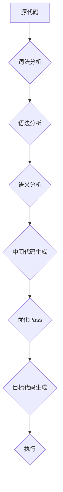

                 

## LLVM中间代码优化Pass

> 关键词：LLVM,中间代码,优化Pass,代码优化,编译器设计,程序性能

## 1. 背景介绍

在现代软件开发中，程序性能一直是至关重要的考量因素。为了提高程序的执行效率，编译器通常会对源代码进行一系列的优化操作。LLVM（Low Level Virtual Machine）是一个开源的编译器框架，它提供了一套强大的中间代码表示和优化工具，使得程序员可以方便地进行代码优化。

LLVM的中间代码，也称为LLVM IR（Intermediate Representation），是一种抽象的代码表示，它独立于任何特定的硬件架构。LLVM IR 提供了丰富的指令集和数据类型，可以方便地进行各种类型的优化操作。LLVM 的优化框架基于一系列的优化Pass（Pass是LLVM中用于处理代码的独立模块），每个Pass都针对特定的优化目标，例如消除冗余代码、简化控制流、提高数据利用率等。

## 2. 核心概念与联系

### 2.1 LLVM IR

LLVM IR是一种基于静态单赋值（SSA）的中间代码表示，它将程序抽象成一系列的指令和数据。每个指令都具有明确的语义，并且操作的数据都是明确定义的。LLVM IR 的优势在于：

* **平台无关性:** LLVM IR 独立于任何特定的硬件架构，可以方便地移植到不同的平台。
* **可分析性:** LLVM IR 的结构清晰，易于分析和理解，这使得编译器可以方便地进行各种类型的优化操作。
* **可扩展性:** LLVM IR 的指令集和数据类型可以根据需要进行扩展，以支持新的编程语言和硬件架构。

### 2.2 优化Pass

LLVM 的优化框架基于一系列的优化Pass。每个 Pass 都针对特定的优化目标，例如消除冗余代码、简化控制流、提高数据利用率等。优化Pass 的执行顺序可以根据需要进行调整，以实现不同的优化效果。

**LLVM IR 处理流程图:**



## 3. 核心算法原理 & 具体操作步骤

### 3.1 算法原理概述

LLVM 的优化Pass 通常基于静态分析和代码重写技术。静态分析是指在不执行代码的情况下，通过分析代码结构和语义来获取信息。代码重写是指根据静态分析的结果，修改代码结构以达到优化目标。

LLVM 的优化Pass 通常遵循以下步骤：

1. **分析:** 对 LLVM IR 进行静态分析，识别出需要优化的代码片段。
2. **转换:** 根据优化目标，将需要优化的代码片段进行转换，例如消除冗余代码、简化控制流等。
3. **验证:** 验证转换后的代码是否满足语义要求，并确保不会引入新的错误。

### 3.2 算法步骤详解

以下是一个具体的 LLVM 优化Pass 的例子：

**Dead Code Elimination (DCE)**

DCE Pass 的目标是消除程序中不再使用的代码，例如被注释掉的代码、永远不会执行的代码等。

**步骤:**

1. **分析:** 遍历 LLVM IR，识别出所有变量和函数的使用情况。
2. **标记:** 标记出所有不再使用的变量和函数。
3. **删除:** 删除所有标记的变量和函数。

### 3.3 算法优缺点

**优点:**

* 提高代码执行效率。
* 减少代码大小。
* 提高代码可读性。

**缺点:**

* 可能会增加编译器复杂度。
* 可能会导致代码难以理解。

### 3.4 算法应用领域

DCE Pass 是一种常见的 LLVM 优化Pass，它可以应用于各种类型的程序，例如：

* **Web 应用:** 移除不必要的代码可以提高网页加载速度。
* **游戏:** 移除不必要的代码可以提高游戏帧率。
* **嵌入式系统:** 移除不必要的代码可以节省内存空间。

## 4. 数学模型和公式 & 详细讲解 & 举例说明

### 4.1 数学模型构建

DCE Pass 可以用一个简单的数学模型来表示：

**D(V, F) = V' ∪ F'**

其中：

* D(V, F) 表示 DCE Pass 对代码片段 (V, F) 的处理结果。
* V 表示所有变量。
* F 表示所有函数。
* V' 表示所有未被使用的变量。
* F' 表示所有未被调用的函数。

### 4.2 公式推导过程

DCE Pass 的核心算法是基于变量和函数的使用情况进行分析。

**步骤:**

1. 遍历所有变量和函数，记录它们的引用次数。
2. 如果一个变量或函数的引用次数为 0，则将其标记为未使用。
3. 删除所有标记为未使用的变量和函数。

### 4.3 案例分析与讲解

**例子:**

```llvm
; 定义一个变量 x
%x = alloca i32

; 将 10 赋值给 x
store i32 10, i32* %x

; 从 x 中读取值
%y = load i32, i32* %x

; 打印 y 的值
print i32 %y
```

在这个例子中，变量 x 和函数 print 都会被使用，所以它们不会被 DCE Pass 删除。

## 5. 项目实践：代码实例和详细解释说明

### 5.1 开发环境搭建

为了实现一个简单的 DCE Pass，需要搭建一个 LLVM 开发环境。

**步骤:**

1. 安装 LLVM 工具链。
2. 安装一个 C++ 编译器。
3. 创建一个新的 LLVM 项目。

### 5.2 源代码详细实现

```c++
#include "llvm/Pass.h"
#include "llvm/IR/Function.h"
#include "llvm/IR/BasicBlock.h"
#include "llvm/IR/Instruction.h"
#include "llvm/IR/Instructions.h"
#include "llvm/Support/raw_ostream.h"

namespace {

class DeadCodeElimination : public llvm::Pass {
public:
  static char ID; // Pass identification

  DeadCodeElimination() : llvm::Pass(ID) {}

  bool runOnFunction(llvm::Function &F) override {
    // 遍历所有 BasicBlock
    for (auto &BB : F) {
      // 遍历所有 Instruction
      for (auto &I : BB) {
        // 如果 Instruction 是一个 Load 或 Store 指令，则检查其是否被使用
        if (auto *LI = dyn_cast<llvm::LoadInst>(&I)) {
          // 如果 Load 指令的值没有被使用，则删除该指令
          if (LI->use_empty()) {
            LI->eraseFromParent();
          }
        } else if (auto *SI = dyn_cast<llvm::StoreInst>(&I)) {
          // 如果 Store 指令的值没有被使用，则删除该指令
          if (SI->use_empty()) {
            SI->eraseFromParent();
          }
        }
      }
    }
    return false;
  }
};

} // namespace

char DeadCodeElimination::ID = 0;
static llvm::RegisterPass<DeadCodeElimination> X("dead-code-elimination",
                                                "Dead Code Elimination Pass");

```

### 5.3 代码解读与分析

* **Pass 类:** 继承自 `llvm::Pass`，定义了一个新的 LLVM 优化 Pass。
* **runOnFunction 函数:** 在每个函数上运行的函数，负责执行 DCE Pass 的逻辑。
* **遍历 BasicBlock 和 Instruction:** 遍历函数中的所有 BasicBlock 和 Instruction，检查每个指令是否被使用。
* **LoadInst 和 StoreInst:** 检查 Load 和 Store 指令是否被使用，如果未被使用，则删除该指令。

### 5.4 运行结果展示

运行 DCE Pass 后，可以观察到代码中被删除的冗余代码。

## 6. 实际应用场景

DCE Pass 是一种常见的 LLVM 优化Pass，它可以应用于各种类型的程序，例如：

### 6.1 Web 应用

移除不必要的代码可以提高网页加载速度。

### 6.2 游戏

移除不必要的代码可以提高游戏帧率。

### 6.3 嵌入式系统

移除不必要的代码可以节省内存空间。

### 6.4 未来应用展望

随着 LLVM 的不断发展，DCE Pass 也将不断改进和完善。未来，DCE Pass 可能能够支持更复杂的代码分析和优化策略，例如：

* **基于数据流分析的 DCE:** 通过分析变量的数据流，更准确地识别出不再使用的代码。
* **基于程序控制流分析的 DCE:** 通过分析程序的控制流，识别出永远不会执行的代码。
* **结合其他优化 Pass 的 DCE:** 与其他优化 Pass 结合使用，例如常量折叠、函数合并等，实现更全面的代码优化。

## 7. 工具和资源推荐

### 7.1 学习资源推荐

* **LLVM 官方文档:** https://llvm.org/docs/
* **LLVM 编程指南:** https://llvm.org/docs/LangRef.html
* **LLVM 优化指南:** https://llvm.org/docs/Passes.html

### 7.2 开发工具推荐

* **LLVM 工具链:** https://llvm.org/releases/
* **Clang:** https://clang.llvm.org/

### 7.3 相关论文推荐

* **LLVM: A Compilation Framework for Lifelong Software Projects:** https://llvm.org/docs/LangRef.html
* **The LLVM Compiler Infrastructure:** https://llvm.org/docs/TheLLVMCompilerInfrastructure.html

## 8. 总结：未来发展趋势与挑战

### 8.1 研究成果总结

LLVM 的优化框架已经取得了显著的成果，DCE Pass 作为其中一个重要组成部分，为程序性能的提升做出了贡献。

### 8.2 未来发展趋势

未来，LLVM 的优化框架将继续朝着以下方向发展：

* **更智能的代码分析:** 利用机器学习等技术，实现更智能的代码分析，识别出更多类型的冗余代码。
* **更强大的优化策略:** 开发更强大的优化策略，例如基于程序行为的优化、基于硬件特性的优化等。
* **更易于使用的优化工具:** 提供更易于使用的优化工具，方便程序员进行代码优化。

### 8.3 面临的挑战

LLVM 的优化框架也面临着一些挑战：

* **优化复杂度:** LLVM 的优化框架非常复杂，需要大量的代码和资源来维护。
* **性能开销:** 一些优化操作可能会增加编译器和程序的运行开销。
* **代码可读性:** 一些优化操作可能会降低代码的可读性。

### 8.4 研究展望

未来，LLVM 的优化框架将继续是一个重要的研究方向，需要不断探索新的优化技术和方法，以提高程序性能和效率。

## 9. 附录：常见问题与解答

**Q1: DCE Pass 会删除所有未使用的代码吗？**

**A1:** 不，DCE Pass 不会删除所有未使用的代码。例如，一些未使用的代码可能在程序的某些分支中是必要的。

**Q2: DCE Pass 会影响程序的正确性吗？**

**A2:** 如果正确地使用 DCE Pass，它不会影响程序的正确性。但是，如果 DCE Pass 删除了程序中必要的代码，则可能会导致程序错误。

**Q3: 如何使用 DCE Pass？**

**A3:** 可以通过 LLVM 的命令行工具或 API 来使用 DCE Pass。

**Q4: DCE Pass 的性能开销是多少？**

**A4:** DCE Pass 的性能开销相对较小，通常不会显著影响程序的执行速度。


作者：禅与计算机程序设计艺术 / Zen and the Art of Computer Programming<end_of_turn>

