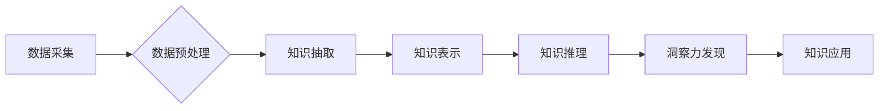

                 

## 人类知识的未来展望：洞察力引领知识革命

> 关键词：人工智能、知识图谱、洞察力、机器学习、深度学习、自然语言处理、数据可视化

### 1. 背景介绍

人类文明的进步离不开对知识的不断积累和探索。从古至今，人类一直在寻找更有效、更便捷的方式来获取、组织和利用知识。随着信息技术的飞速发展，特别是人工智能技术的突破，我们正站在一个新的知识革命的门口。

传统的信息检索方式主要依赖于关键词匹配和文本搜索，效率低下，难以捕捉知识之间的复杂关系。而人工智能，特别是深度学习和自然语言处理技术的进步，为我们提供了全新的视角和工具，让我们能够更深入地理解和挖掘知识。

### 2. 核心概念与联系

**2.1 知识图谱**

知识图谱是一种基于知识表示的数据库，它将知识表示为实体和关系的网络结构。知识图谱能够捕捉知识之间的语义关系，从而实现更智能的知识检索、推理和分析。

**2.2 人工智能**

人工智能是指模拟人类智能行为的计算机系统。人工智能技术包括机器学习、深度学习、自然语言处理、计算机视觉等多个领域。

**2.3 洞察力**

洞察力是指从数据中发现隐藏的模式、趋势和规律的能力。洞察力是知识革命的关键驱动力，它能够帮助我们更好地理解世界，做出更明智的决策。

**2.4 流程图**



### 3. 核心算法原理 & 具体操作步骤

**3.1 算法原理概述**

知识图谱构建的核心算法包括知识抽取、知识表示和知识推理。

* **知识抽取:** 从文本数据中提取实体和关系，构建知识图谱的基本单元。
* **知识表示:** 将提取的实体和关系表示为计算机可理解的格式，例如 RDF 或 OWL。
* **知识推理:** 利用知识图谱中的关系进行逻辑推理，发现新的知识或推断未知信息。

**3.2 算法步骤详解**

1. **数据采集:** 从各种数据源收集相关数据，例如文本、图像、音频等。
2. **数据预处理:** 对收集到的数据进行清洗、格式化和转换，使其适合后续算法处理。
3. **知识抽取:** 使用自然语言处理技术，例如命名实体识别、关系抽取等，从预处理后的数据中提取实体和关系。
4. **知识表示:** 将提取的实体和关系表示为知识图谱的格式，例如 RDF 或 OWL。
5. **知识推理:** 利用知识图谱中的关系进行逻辑推理，发现新的知识或推断未知信息。

**3.3 算法优缺点**

* **优点:** 能够捕捉知识之间的语义关系，实现更智能的知识检索、推理和分析。
* **缺点:** 知识抽取和知识表示仍然是一个技术难题，需要大量的训练数据和复杂的算法。

**3.4 算法应用领域**

* **搜索引擎:** 构建知识图谱可以帮助搜索引擎更准确地理解用户查询意图，提供更相关的结果。
* **问答系统:** 知识图谱可以为问答系统提供丰富的知识背景，提高其回答准确率。
* **推荐系统:** 知识图谱可以帮助推荐系统理解用户兴趣，提供更个性化的推荐。
* **医疗诊断:** 知识图谱可以帮助医生更快、更准确地诊断疾病。

### 4. 数学模型和公式 & 详细讲解 & 举例说明

**4.1 数学模型构建**

知识图谱可以表示为一个三元组的集合： (实体1, 关系, 实体2)。 

* 实体可以是任何事物，例如人、地点、事件等。
* 关系描述实体之间的连接，例如“出生于”、“工作于”等。

**4.2 公式推导过程**

我们可以使用图论中的概念来描述知识图谱。 

* 实体可以看作图中的节点。
* 关系可以看作图中的边。

知识推理可以利用图论中的算法，例如路径查找、拓扑排序等，来发现新的知识或推断未知信息。

**4.3 案例分析与讲解**

例如，假设我们有一个知识图谱，其中包含以下三元组：

* (张三, 出生于, 北京)
* (李四, 工作于, 北京)
* (北京, 位于, 中国)

我们可以利用知识图谱中的关系进行推理，得出以下结论：

* 张三和李四都出生或工作在北京。
* 北京位于中国。

**5. 项目实践：代码实例和详细解释说明**

**5.1 开发环境搭建**

* Python 3.x
* Jupyter Notebook
* 必要的库，例如：

    * rdflib: 用于处理 RDF 数据
    * networkx: 用于构建和分析图

**5.2 源代码详细实现**

```python
from rdflib import Graph, Literal, URIRef
from rdflib.namespace import FOAF, RDF

# 创建知识图谱
g = Graph()

# 添加实体和关系
g.add((URIRef("http://example.org/person/zhangsan"), FOAF.name, Literal("张三")))
g.add((URIRef("http://example.org/person/zhangsan"), FOAF.born, Literal("北京")))
g.add((URIRef("http://example.org/person/lisi"), FOAF.name, Literal("李四")))
g.add((URIRef("http://example.org/person/lisi"), FOAF.worksAt, Literal("北京")))

# 查询知识图谱
for s, p, o in g.triples((URIRef("http://example.org/person/zhangsan"), None, None)):
    print(f"{s} {p} {o}")
```

**5.3 代码解读与分析**

* 代码首先创建了一个 RDF 图，并添加了实体和关系。
* 然后，代码使用查询语句从知识图谱中提取信息。

**5.4 运行结果展示**

```
http://example.org/person/zhangsan FOAF:name '张三'
http://example.org/person/zhangsan FOAF:born '北京'
```

### 6. 实际应用场景

**6.1 搜索引擎优化**

知识图谱可以帮助搜索引擎更好地理解网站内容，提高网站的排名。

**6.2 个性化推荐**

知识图谱可以帮助电商平台根据用户的兴趣和购买历史提供个性化的商品推荐。

**6.3 智能客服**

知识图谱可以帮助企业构建智能客服系统，自动回答用户常见问题。

**6.4 未来应用展望**

随着人工智能技术的不断发展，知识图谱将在更多领域得到应用，例如医疗诊断、教育培训、金融风险管理等。

### 7. 工具和资源推荐

**7.1 学习资源推荐**

* **书籍:**

    * 《知识图谱》
    * 《深度学习》

* **在线课程:**

    * Coursera: 知识图谱课程
    * edX: 深度学习课程

**7.2 开发工具推荐**

* **Protégé:** 知识表示和推理工具
* **Apache Jena:** Java 知识图谱框架
* **GraphDB:** 商业知识图谱数据库

**7.3 相关论文推荐**

* **《知识图谱：概念、构建和应用》**
* **《深度学习在知识图谱构建中的应用》**

### 8. 总结：未来发展趋势与挑战

**8.1 研究成果总结**

近年来，人工智能和知识图谱领域取得了显著进展，为人类知识的未来发展提供了新的机遇。

**8.2 未来发展趋势**

* **知识图谱规模和复杂度将不断提升。**
* **知识图谱的推理能力将更加强大。**
* **知识图谱将与其他人工智能技术更加紧密地结合。**

**8.3 面临的挑战**

* **知识抽取和知识表示仍然是一个技术难题。**
* **知识图谱的维护和更新是一个挑战。**
* **如何确保知识图谱的准确性和可靠性是一个重要问题。**

**8.4 研究展望**

未来，我们需要继续探索新的知识表示和推理方法，提高知识图谱的规模、复杂度和推理能力。同时，我们还需要关注知识图谱的维护、更新和可靠性问题，确保知识图谱能够真正为人类社会服务。

### 9. 附录：常见问题与解答

**9.1 如何构建知识图谱？**

构建知识图谱需要以下步骤：

1. 数据采集
2. 数据预处理
3. 知识抽取
4. 知识表示
5. 知识推理

**9.2 知识图谱有什么应用场景？**

知识图谱的应用场景非常广泛，例如：

* 搜索引擎优化
* 个性化推荐
* 智能客服
* 医疗诊断
* 教育培训

**9.3 如何评估知识图谱的质量？**

评估知识图谱的质量可以从以下几个方面考虑：

* 准确性
*完整性
*一致性
*可解释性

作者：禅与计算机程序设计艺术 / Zen and the Art of Computer Programming


<end_of_turn>

