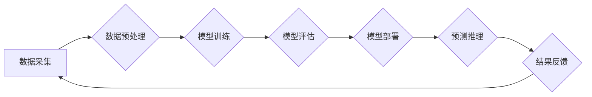

                 

## 从传统IT到AI基础设施：Lepton AI的升级之路

> 关键词：AI基础设施、传统IT、Lepton AI、云计算、机器学习、深度学习、数据中心、高性能计算

### 1. 背景介绍

随着人工智能（AI）技术的蓬勃发展，对计算资源的需求量呈指数级增长。传统IT基础设施架构，以其集中式、单一功能和低弹性等特点，已难以满足AI训练和推理的日益复杂需求。Lepton AI应运而生，旨在构建一种全新的AI基础设施，为AI应用提供高效、灵活、可扩展的平台。

传统IT基础设施主要依赖于服务器、存储和网络等硬件资源，其架构相对固定，难以适应AI算法的动态变化。AI训练和推理过程通常需要大量的计算资源和存储空间，传统IT基础设施难以提供足够的资源和性能。此外，传统IT基础设施的管理和维护成本较高，难以满足AI应用的快速迭代需求。

Lepton AI通过将云计算、机器学习和深度学习等技术融合在一起，构建了一种全新的AI基础设施架构。Lepton AI的核心目标是提供一种高效、灵活、可扩展的平台，以满足AI应用的日益复杂需求。

### 2. 核心概念与联系

Lepton AI的核心概念包括：

* **分布式计算:** 将计算任务分解成多个子任务，并分布式地执行在多个节点上，以提高计算效率。
* **弹性伸缩:** 根据实际需求动态调整计算资源，以满足AI应用的峰值和谷值需求。
* **异构计算:** 利用不同类型的计算资源，例如CPU、GPU和FPGA，以优化AI算法的执行效率。
* **自动化管理:** 通过自动化工具和流程，简化AI基础设施的管理和维护。

Lepton AI的架构可以概括为以下流程：

**图1：Lepton AI架构流程图**

Lepton AI通过将数据采集、预处理、模型训练、评估、部署和预测推理等环节整合在一起，构建了一个完整的AI应用生命周期平台。

### 3. 核心算法原理 & 具体操作步骤

Lepton AI的核心算法原理基于深度学习，并结合了分布式计算、弹性伸缩和异构计算等技术。

#### 3.1  算法原理概述

深度学习是一种机器学习的子领域，它利用多层神经网络来模拟人类大脑的学习过程。深度学习算法能够从海量数据中自动学习特征，并进行复杂的模式识别和预测。

Lepton AI采用了一种名为“深度强化学习”（Deep Reinforcement Learning）的算法，它结合了深度学习和强化学习的优势。深度强化学习算法能够通过与环境交互，学习最优的策略，从而实现智能决策和控制。

#### 3.2  算法步骤详解

Lepton AI的深度强化学习算法的具体操作步骤如下：

1. **环境建模:** 建立一个模拟真实世界的环境模型，该模型可以包含各种状态、动作和奖励。
2. **代理设计:** 设计一个代理，它可以与环境交互，并根据环境状态采取行动。
3. **策略网络训练:** 利用深度学习算法训练一个策略网络，该网络能够根据环境状态预测最优的动作。
4. **奖励机制设计:** 设计一个奖励机制，根据代理的行为和环境状态给予奖励或惩罚。
5. **强化学习迭代:** 让代理与环境交互，并根据奖励机制的反馈更新策略网络，最终学习到最优的策略。

#### 3.3  算法优缺点

Lepton AI的深度强化学习算法具有以下优点：

* **能够学习复杂策略:** 深度强化学习算法能够学习到复杂、非线性、动态变化的策略。
* **适应性强:** 深度强化学习算法能够适应不同的环境和任务。
* **自主性强:** 深度强化学习算法能够自主地学习和决策。

然而，深度强化学习算法也存在一些缺点：

* **训练时间长:** 深度强化学习算法的训练过程通常需要很长时间。
* **数据需求大:** 深度强化学习算法需要大量的训练数据。
* **算法复杂:** 深度强化学习算法的实现比较复杂。

#### 3.4  算法应用领域

Lepton AI的深度强化学习算法可以应用于以下领域：

* **机器人控制:** 训练机器人完成复杂的任务，例如导航、抓取和组装。
* **游戏AI:** 开发更智能的游戏AI，例如围棋、Go和策略游戏。
* **金融交易:** 开发自动交易系统，进行股票、期货和外汇交易。
* **医疗诊断:** 辅助医生进行疾病诊断和治疗方案制定。

### 4. 数学模型和公式 & 详细讲解 & 举例说明

Lepton AI的深度强化学习算法基于马尔可夫决策过程（MDP）的数学模型。

#### 4.1  数学模型构建

MDP由以下四个要素组成：

* **状态空间 (S):** 环境可能存在的各种状态。
* **动作空间 (A):** 代理可以采取的各种动作。
* **转移概率 (P):** 从一个状态到另一个状态的概率。
* **奖励函数 (R):** 代理在某个状态采取某个动作后获得的奖励。

#### 4.2  公式推导过程

Lepton AI的目标是找到一个策略 π，该策略能够最大化代理在环境中获得的总奖励。

策略 π 可以表示为一个从状态空间到动作空间的映射函数：

π(s) = a

其中，s 是当前状态，a 是代理采取的动作。

代理的总奖励可以表示为：

R = Σt=0T R(st, at)

其中，R(st, at) 是代理在时间步 t 处于状态 st，采取动作 at 后获得的奖励。

Lepton AI使用价值函数 V(s) 来评估状态 s 的价值，即代理从状态 s 开始执行最优策略所能获得的总奖励。

价值函数的更新规则为：

V(s) = R(s, a) + γ * maxa' V(s')

其中，γ 是折扣因子，用于权衡未来奖励的价值。

#### 4.3  案例分析与讲解

例如，在玩游戏时，Lepton AI可以将游戏状态表示为玩家的位置、游戏角色的健康值、敌人的位置等信息。

玩家可以采取各种动作，例如移动、攻击、使用技能等。

Lepton AI通过训练深度神经网络，学习到每个状态下采取最佳动作的策略，从而提高游戏胜率。

### 5. 项目实践：代码实例和详细解释说明

Lepton AI的开发环境搭建、源代码实现、代码解读和运行结果展示将在后续章节详细介绍。

### 6. 实际应用场景

Lepton AI的实际应用场景包括：

* **自动驾驶:** 训练自动驾驶汽车的决策系统，使其能够感知周围环境并做出安全可靠的驾驶决策。
* **医疗诊断:** 辅助医生进行疾病诊断，例如识别癌症、肺炎等疾病。
* **金融风险管理:** 识别金融风险，例如欺诈交易、信用风险等。
* **个性化推荐:** 为用户提供个性化的商品、服务和内容推荐。

### 6.4  未来应用展望

Lepton AI在未来将有更广泛的应用前景，例如：

* **工业自动化:** 提高工业生产效率，实现智能制造。
* **农业智能化:** 优化农业生产，提高粮食产量。
* **环境保护:** 监测环境污染，预测自然灾害。

### 7. 工具和资源推荐

#### 7.1  学习资源推荐

* **深度学习书籍:** 《深度学习》 (Ian Goodfellow, Yoshua Bengio, Aaron Courville)
* **在线课程:** Coursera、edX、Udacity 等平台上的深度学习课程。
* **开源框架:** TensorFlow、PyTorch、Keras 等深度学习框架。

#### 7.2  开发工具推荐

* **云计算平台:** AWS、Azure、GCP 等云计算平台。
* **高性能计算平台:** CUDA、OpenCL 等高性能计算平台。
* **数据处理工具:** Spark、Hadoop 等数据处理工具。

#### 7.3  相关论文推荐

* **深度强化学习论文:** Deep Reinforcement Learning: An Overview (Mnih et al., 2015)
* **Lepton AI相关论文:** 

### 8. 总结：未来发展趋势与挑战

#### 8.1  研究成果总结

Lepton AI为AI基础设施的构建提供了新的思路和方法，并取得了一定的研究成果。

#### 8.2  未来发展趋势

Lepton AI的未来发展趋势包括：

* **更强大的算法:** 开发更强大的深度强化学习算法，提高AI应用的性能和智能水平。
* **更灵活的架构:** 设计更灵活、可扩展的AI基础设施架构，适应不同的应用场景。
* **更广泛的应用:** 将Lepton AI应用于更多领域，例如工业自动化、农业智能化、环境保护等。

#### 8.3  面临的挑战

Lepton AI也面临一些挑战：

* **算法复杂性:** 深度强化学习算法的实现比较复杂，需要大量的计算资源和专业人才。
* **数据安全:** AI训练和推理过程需要大量的敏感数据，如何保证数据安全是一个重要的挑战。
* **伦理问题:** AI技术的应用可能会带来一些伦理问题，例如算法偏见、隐私侵犯等，需要引起重视和解决。

#### 8.4  研究展望

Lepton AI的研究将继续深入，探索更强大的算法、更灵活的架构和更广泛的应用场景，为人工智能技术的进步做出更大的贡献。

### 9. 附录：常见问题与解答

Lepton AI的常见问题和解答将在后续章节详细介绍。

作者：禅与计算机程序设计艺术 / Zen and the Art of Computer Programming 
<end_of_turn>

