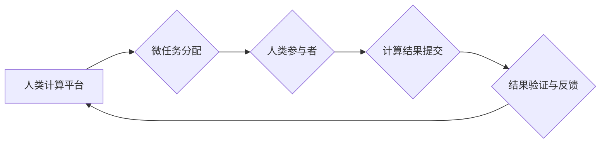

                 

## 从验证码到科学发现：人类计算的广泛应用

> 关键词：人类计算、计算任务、分布式计算、微任务、验证码、科学发现、机器学习、数据标注

### 1. 背景介绍

人类计算，顾名思义，是指利用人类的智慧和认知能力来完成计算任务。从古至今，人类一直以其独特的思维方式和灵活的判断能力，在解决各种复杂问题方面发挥着不可替代的作用。随着计算机技术的飞速发展，人类计算的概念也逐渐被人们所认识和重视。

早期，人类计算主要体现在手工计算、数据录入等领域。随着互联网的普及和移动设备的兴起，人类计算进入了新的发展阶段。如今，人类计算已广泛应用于各个领域，例如：

* **数据标注:** 人工标注数据是机器学习模型训练的基础，而人类的视觉、听觉、语言理解能力使得他们在标注复杂数据方面具有优势。
* **验证码破解:** 验证码旨在防止机器人自动访问网站，而人类可以通过识别图像中的文字或图案来完成验证。
* **创意设计:** 人类在艺术、设计等领域拥有独特的创造力，可以利用人类计算平台进行协作创作，生成新的创意内容。
* **科学研究:** 人类计算可以帮助科学家分析海量数据、发现新的规律、进行科学实验，加速科学发现进程。

### 2. 核心概念与联系

人类计算的核心概念是将人类的智慧和计算能力相结合，通过构建平台和工具，将分散的人类计算资源整合起来，形成一个强大的计算网络。

**人类计算的架构**



**核心概念解释:**

* **人类计算平台:**  提供任务分配、结果提交、验证和反馈等功能的平台。
* **微任务分配:** 将大型计算任务分解成一个个小的、易于理解和完成的微任务。
* **人类参与者:**  通过平台接取微任务，完成计算并提交结果。
* **计算结果提交:**  参与者将完成的计算结果上传到平台。
* **结果验证与反馈:** 平台对提交的结果进行验证，并反馈给参与者，以确保结果的准确性和质量。

### 3. 核心算法原理 & 具体操作步骤

人类计算的核心算法原理是基于微任务的分布式计算模型。

#### 3.1 算法原理概述

微任务分配和结果验证是人类计算的核心算法。

* **微任务分配:**  将大型计算任务分解成多个独立的微任务，每个微任务可以由不同的参与者独立完成。
* **结果验证:**  平台采用多种方法验证参与者提交的结果，例如人工审核、算法校验等，确保结果的准确性和可靠性。

#### 3.2 算法步骤详解

1. **任务分解:** 将大型计算任务分解成多个独立的微任务。
2. **微任务分配:** 将微任务分配给不同的参与者。
3. **参与者计算:** 参与者接取微任务，并根据任务要求进行计算。
4. **结果提交:** 参与者将计算结果提交到平台。
5. **结果验证:** 平台对提交的结果进行验证，并反馈给参与者。
6. **结果汇总:** 将所有验证通过的结果汇总，形成最终的计算结果。

#### 3.3 算法优缺点

**优点:**

* **利用人类优势:** 人类计算可以充分利用人类的智慧、创造力和灵活的判断能力，解决计算机难以处理的复杂问题。
* **成本效益高:** 相比于传统计算方式，人类计算可以降低计算成本，尤其是在需要大量人力参与的场景下。
* **可扩展性强:** 人类计算平台可以灵活扩展，根据任务需求增加参与者数量，提高计算效率。

**缺点:**

* **结果质量受限:** 人类计算结果的质量取决于参与者的水平和注意力，存在一定的误差率。
* **效率受限:** 人类计算的速度相对较慢，难以处理需要高速度计算的任务。
* **数据安全问题:** 人类计算平台需要妥善处理参与者的个人信息和计算结果，防止数据泄露。

#### 3.4 算法应用领域

人类计算已广泛应用于以下领域:

* **数据标注:**  图像识别、自然语言处理、语音识别等机器学习模型训练需要大量标注数据，人类计算可以有效解决这一问题。
* **搜索引擎优化:**  人类计算可以用于评估网页质量、识别垃圾信息、改进搜索结果排名。
* **创意设计:**  人类计算可以用于协作创作、生成新的创意内容，例如音乐、绘画、写作等。
* **科学研究:**  人类计算可以帮助科学家分析海量数据、发现新的规律、进行科学实验，加速科学发现进程。

### 4. 数学模型和公式 & 详细讲解 & 举例说明

#### 4.1 数学模型构建

人类计算可以抽象为一个图论模型，其中：

* **节点:** 代表参与者或微任务。
* **边:** 代表参与者之间的交互关系或微任务之间的依赖关系。

#### 4.2 公式推导过程

我们可以使用图论中的度数、路径长度等指标来衡量人类计算平台的效率和性能。

* **参与者度数:**  表示参与者接取的微任务数量。
* **平均路径长度:**  表示参与者完成一个微任务所需的平均路径长度。

#### 4.3 案例分析与讲解

假设一个人类计算平台用于标注图像数据，平台上有100个参与者，每个参与者可以接取10个微任务。

* 参与者度数：100个参与者 * 10个微任务/参与者 = 1000个微任务
* 平均路径长度：假设每个微任务需要经过3个参与者才能完成，则平均路径长度为3。

### 5. 项目实践：代码实例和详细解释说明

#### 5.1 开发环境搭建

* **操作系统:** Linux/macOS/Windows
* **编程语言:** Python
* **框架:** Flask/Django
* **数据库:** MySQL/PostgreSQL

#### 5.2 源代码详细实现

```python
# 微任务分配模块
def distribute_task(task):
    # 根据任务类型和参与者能力分配任务
    # ...

# 结果验证模块
def verify_result(result):
    # 根据任务要求验证结果的准确性
    # ...

# 参与者管理模块
def manage_participant(participant):
    # 注册、登录、管理参与者信息
    # ...
```

#### 5.3 代码解读与分析

* **微任务分配模块:**  根据任务类型和参与者能力，将任务分配给合适的参与者。
* **结果验证模块:**  根据任务要求，验证参与者提交的结果的准确性。
* **参与者管理模块:**  负责注册、登录、管理参与者信息。

#### 5.4 运行结果展示

* **任务管理界面:**  显示任务列表、参与者信息、结果统计等。
* **参与者界面:**  显示可接取的任务列表、任务详情、结果提交等功能。

### 6. 实际应用场景

#### 6.1 数据标注

* **图像识别:**  标注图像中的物体、场景、人物等信息，用于训练图像识别模型。
* **自然语言处理:**  标注文本中的情感、主题、实体等信息，用于训练自然语言处理模型。
* **语音识别:**  标注语音中的文字内容，用于训练语音识别模型。

#### 6.2 验证码破解

* **机器人防范:**  利用人类计算平台破解验证码，防止机器人自动访问网站。
* **安全验证:**  将验证码破解作为一种安全验证手段，提高网站安全性。

#### 6.3 创意设计

* **音乐创作:**  利用人类计算平台进行音乐协作创作，生成新的音乐作品。
* **绘画设计:**  利用人类计算平台进行绘画协作创作，生成新的绘画作品。
* **写作辅助:**  利用人类计算平台进行写作辅助，例如生成文章标题、段落开头等。

#### 6.4 未来应用展望

* **科学发现:**  利用人类计算平台分析海量数据，加速科学发现进程。
* **医疗诊断:**  利用人类计算平台辅助医生进行医疗诊断，提高诊断准确率。
* **教育教学:**  利用人类计算平台进行个性化教育教学，提高学习效率。

### 7. 工具和资源推荐

#### 7.1 学习资源推荐

* **书籍:**  《人类计算：从验证码到科学发现》
* **在线课程:**  Coursera、edX等平台上的相关课程
* **技术博客:**  AIcrowd、Kaggle等平台上的技术博客

#### 7.2 开发工具推荐

* **人类计算平台:**  Amazon Mechanical Turk、Figure Eight等平台
* **编程语言:**  Python、Java等
* **框架:**  Flask、Django等

#### 7.3 相关论文推荐

* **人类计算的理论基础:**  "Human Computation: A New Paradigm for Distributed Problem Solving"
* **人类计算的应用案例:**  "Human Computation for Scientific Discovery"
* **人类计算的未来发展趋势:**  "The Future of Human Computation"

### 8. 总结：未来发展趋势与挑战

#### 8.1 研究成果总结

人类计算已成为一个重要的研究领域，取得了一系列成果，例如：

* **微任务分配算法的优化:**  提高了任务分配效率和结果质量。
* **结果验证方法的创新:**  降低了结果验证成本和时间。
* **人类计算平台的构建:**  为人类计算提供了基础设施支持。

#### 8.2 未来发展趋势

* **人工智能与人类计算的融合:**  利用人工智能技术辅助人类计算，提高效率和准确性。
* **人类计算的规模化应用:**  将人类计算应用于更广泛的领域，例如科学研究、医疗诊断、教育教学等。
* **人类计算的伦理问题研究:**  探讨人类计算的伦理问题，例如数据隐私、公平性、责任等。

#### 8.3 面临的挑战

* **结果质量控制:**  确保人类计算结果的准确性和可靠性。
* **参与者激励机制:**  设计有效的激励机制，吸引更多参与者参与人类计算。
* **数据安全问题:**  妥善处理参与者的个人信息和计算结果，防止数据泄露。

#### 8.4 研究展望

未来，人类计算将继续发展壮大，成为人工智能发展的重要组成部分。

### 9. 附录：常见问题与解答

* **什么是人类计算？**

人类计算是指利用人类的智慧和认知能力来完成计算任务。

* **人类计算有哪些应用场景？**

人类计算已广泛应用于数据标注、验证码破解、创意设计、科学研究等领域。

* **人类计算的优势和劣势是什么？**

人类计算的优势在于可以充分利用人类的智慧和灵活的判断能力，解决计算机难以处理的复杂问题。劣势在于结果质量受限、效率受限、数据安全问题等。

* **如何参与人类计算？**

可以通过一些人类计算平台，例如Amazon Mechanical Turk、Figure Eight等平台参与人类计算任务。

* **人类计算的未来发展趋势是什么？**

未来，人类计算将与人工智能技术融合，规模化应用于更广泛的领域。


作者：禅与计算机程序设计艺术 / Zen and the Art of Computer Programming 
<end_of_turn>

