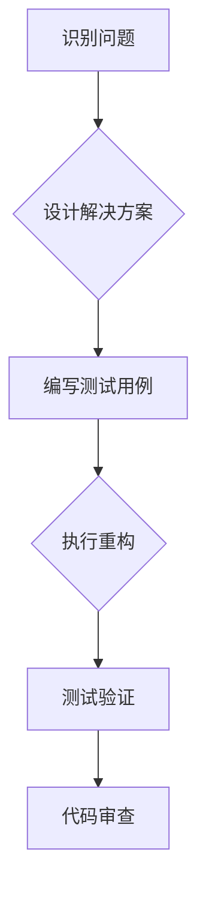

                 

## 代码重构技术：改善既有代码的设计

> 关键词：代码重构、软件设计、代码质量、代码可读性、代码维护、代码复用、设计模式

### 1. 背景介绍

在软件开发领域，代码重构技术扮演着至关重要的角色。随着软件项目的不断发展和迭代，代码库往往会积累大量的技术债务，导致代码结构混乱、可读性差、维护成本高。代码重构旨在通过一系列的局部修改，改善代码的设计和结构，提升代码的质量、可读性和可维护性，从而降低软件开发的风险和成本。

### 2. 核心概念与联系

**2.1 代码重构的本质**

代码重构并非简单的代码修改，它是一种系统性的代码改进过程。其核心目标是**保持软件功能不变**的前提下，**提升代码的内部结构和设计质量**。

**2.2 代码重构与软件设计**

代码重构与软件设计密切相关。良好的软件设计为代码重构提供了基础，而代码重构则可以进一步优化软件设计，使其更加完善和高效。

**2.3 代码重构的原则**

代码重构遵循以下原则：

* **保持功能不变:** 重构过程中必须确保软件功能保持不变。
* **一次性解决一个问题:**  每次重构只针对一个特定的问题进行改进，避免一次性修改过多代码，导致难以追踪和管理。
* **小步迭代:** 重构应该采用小步迭代的方式进行，每次修改量要小，以便于测试和验证。
* **测试驱动:** 重构前应编写相应的测试用例，确保重构后的代码仍然能够正常工作。
* **代码可读性:** 重构过程中应注重代码的可读性和可维护性，使用清晰的命名、结构化代码和注释等方式提高代码的可理解性。

**2.4 代码重构的流程**

代码重构的流程通常包括以下步骤：

1. **识别问题:** 分析代码，找出需要重构的代码片段。
2. **设计解决方案:** 针对问题设计相应的重构方案。
3. **编写测试用例:** 为重构后的代码编写测试用例。
4. **执行重构:** 根据设计方案进行代码修改。
5. **测试验证:** 执行测试用例，确保重构后的代码能够正常工作。
6. **代码审查:** 邀请其他开发人员对重构后的代码进行审查，确保代码质量和可维护性。

**2.5 Mermaid 流程图**



### 3. 核心算法原理 & 具体操作步骤

**3.1 算法原理概述**

代码重构的核心算法原理是基于**局部修改**和**渐进式改进**的思想。通过一系列的局部修改，逐步改善代码的结构和设计，最终达到提升代码质量的目的。

**3.2 算法步骤详解**

1. **代码分析:** 对目标代码进行分析，识别需要重构的代码片段。
2. **重构方案设计:** 针对识别出的问题，设计相应的重构方案。
3. **测试用例编写:** 为重构后的代码编写测试用例，确保重构过程不会引入新的错误。
4. **代码修改:** 根据设计方案进行代码修改，并进行必要的代码格式化和注释。
5. **测试验证:** 执行测试用例，验证重构后的代码能够正常工作。
6. **代码审查:** 邀请其他开发人员对重构后的代码进行审查，确保代码质量和可维护性。

**3.3 算法优缺点**

**优点:**

* **可控性强:** 代码重构采用局部修改的方式，可以更好地控制修改范围，降低引入错误的风险。
* **渐进式改进:** 通过一系列的局部修改，可以逐步提升代码的质量，避免一次性修改过多代码导致难以管理。
* **提高代码可读性和可维护性:** 代码重构可以使代码结构更加清晰，更容易理解和维护。

**缺点:**

* **需要一定的经验和技巧:** 代码重构需要开发人员有一定的经验和技巧，才能设计出合理的重构方案。
* **需要投入时间和精力:** 代码重构需要投入一定的代码分析、设计和测试时间和精力。

**3.4 算法应用领域**

代码重构技术广泛应用于各种软件开发领域，例如：

* **维护老旧代码:** 对老旧代码进行重构，可以提升代码的可读性和可维护性，降低维护成本。
* **代码复用:** 通过重构代码，可以提取出通用的代码模块，提高代码复用率。
* **代码优化:** 通过重构代码，可以优化代码的性能和效率。

### 4. 数学模型和公式 & 详细讲解 & 举例说明

**4.1 数学模型构建**

代码重构可以抽象为一个数学模型，其中：

* **输入:** 源代码
* **输出:** 重构后的代码
* **操作:** 一系列的代码修改操作

**4.2 公式推导过程**

由于代码重构是一个复杂的非线性过程，很难用数学公式精确描述。

**4.3 案例分析与讲解**

例如，代码提取重构模式可以抽象为一个数学模型：

* **输入:** 包含多个重复代码块的源代码
* **输出:** 提取出重复代码块的函数或类，以及对源代码的修改
* **操作:** 识别重复代码块，提取代码块，修改调用代码

### 5. 项目实践：代码实例和详细解释说明

**5.1 开发环境搭建**

* 使用 Java 开发环境，例如 JDK 11 或更高版本。
* 使用 IDE 工具，例如 Eclipse 或 IntelliJ IDEA。

**5.2 源代码详细实现**

```java
// 源代码示例
public class Calculator {
    public int add(int a, int b) {
        return a + b;
    }

    public int subtract(int a, int b) {
        return a - b;
    }

    public int multiply(int a, int b) {
        return a * b;
    }

    public int divide(int a, int b) {
        return a / b;
    }
}
```

**5.3 代码解读与分析**

上述代码示例定义了一个 `Calculator` 类，包含了四种基本的算术运算方法：`add`、`subtract`、`multiply` 和 `divide`。

**5.4 运行结果展示**

```
Calculator calculator = new Calculator();
int sum = calculator.add(2, 3);
System.out.println("Sum: " + sum); // 输出: Sum: 5
```

**5.5 重构后的代码**

```java
// 重构后的代码示例
public class Calculator {
    public int add(int a, int b) {
        return a + b;
    }

    public int subtract(int a, int b) {
        return a - b;
    }

    public int multiply(int a, int b) {
        return a * b;
    }

    public int divide(int a, int b) {
        return a / b;
    }
}

public class ArithmeticOperations {
    public static int add(int a, int b) {
        return a + b;
    }

    public static int subtract(int a, int b) {
        return a - b;
    }

    public static int multiply(int a, int b) {
        return a * b;
    }

    public static int divide(int a, int b) {
        return a / b;
    }
}
```

### 6. 实际应用场景

**6.1 代码维护场景**

在维护老旧代码时，代码重构可以帮助我们清理代码结构，提高代码的可读性和可维护性。例如，我们可以将冗余代码提取到单独的函数中，或者将复杂的逻辑拆分成更小的模块，从而使代码更容易理解和修改。

**6.2 代码复用场景**

当我们需要在多个地方使用相同的代码逻辑时，我们可以通过代码重构将这些代码提取到单独的函数或类中，从而提高代码复用率。

**6.3 代码优化场景**

代码重构可以帮助我们优化代码的性能和效率。例如，我们可以使用更优的算法或数据结构，或者消除代码中的冗余操作，从而提高代码的运行速度。

**6.4 未来应用展望**

随着软件开发技术的不断发展，代码重构技术将会更加成熟和完善。未来，代码重构技术可能会与人工智能技术相结合，实现自动化的代码重构，从而进一步提高代码质量和开发效率。

### 7. 工具和资源推荐

**7.1 学习资源推荐**

* **书籍:**
    * 《代码重构》 by Martin Fowler
    * 《Refactoring to Patterns》 by Joshua Kerievsky
* **在线课程:**
    * Udemy: Refactoring: Improve Your Code Design
    * Coursera: Software Design Principles

**7.2 开发工具推荐**

* **IDE:**
    * Eclipse
    * IntelliJ IDEA
    * Visual Studio Code
* **代码重构工具:**
    * IntelliJ IDEA 重构工具
    * Eclipse 重构工具
    * SonarQube

**7.3 相关论文推荐**

* **Refactoring: Improving the Design of Existing Code** by Martin Fowler
* **Refactoring to Patterns** by Joshua Kerievsky

### 8. 总结：未来发展趋势与挑战

**8.1 研究成果总结**

代码重构技术已经取得了显著的成果，它帮助开发人员提高了代码质量、可读性和可维护性，降低了软件开发的风险和成本。

**8.2 未来发展趋势**

未来，代码重构技术将会更加智能化和自动化，例如：

* **自动代码重构:** 利用人工智能技术自动识别代码中的问题并进行重构。
* **基于机器学习的代码重构建议:** 利用机器学习算法分析代码并提供重构建议。

**8.3 面临的挑战**

代码重构技术也面临着一些挑战，例如：

* **代码复杂度:** 对于非常复杂的代码，重构难度较大。
* **测试覆盖率:** 重构过程中需要保证测试覆盖率，否则可能会引入新的错误。
* **团队协作:** 代码重构需要团队成员的协作，需要建立良好的沟通机制。

**8.4 研究展望**

未来，代码重构技术的研究方向包括：

* **开发更智能的代码重构工具:** 利用人工智能技术开发更智能的代码重构工具，能够自动识别代码中的问题并进行重构。
* **提高代码重构的自动化程度:** 研究更有效的自动化代码重构方法，降低人工成本。
* **建立更完善的代码重构规范:** 制定更完善的代码重构规范，指导开发人员进行代码重构。

### 9. 附录：常见问题与解答

**9.1 代码重构需要花费多少时间？**

代码重构的时间取决于代码的复杂度、重构的范围以及开发人员的经验。一般来说，代码重构需要投入一定的时间和精力，但它可以带来长期的收益。

**9.2 代码重构会影响软件功能吗？**

代码重构的目标是保持软件功能不变，因此，如果按照正确的重构原则进行操作，代码重构不会影响软件功能。

**9.3 代码重构需要哪些工具？**

代码重构可以使用各种工具，例如 IDE 的重构工具、代码分析工具和代码格式化工具等。

**9.4 代码重构的最佳实践是什么？**

代码重构的最佳实践包括：

* **保持功能不变:** 重构过程中必须确保软件功能不变。
* **一次性解决一个问题:**  每次重构只针对一个特定的问题进行改进，避免一次性修改过多代码，导致难以追踪和管理。
* **小步迭代:** 重构应该采用小步迭代的方式进行，每次修改量要小，以便于测试和验证。
* **测试驱动:** 重构前应编写相应的测试用例，确保重构后的代码仍然能够正常工作。
* **代码可读性:** 重构过程中应注重代码的可读性和可维护性，使用清晰的命名、结构化代码和注释等方式提高代码的可理解性。


作者：禅与计算机程序设计艺术 / Zen and the Art of Computer Programming<end_of_turn>

