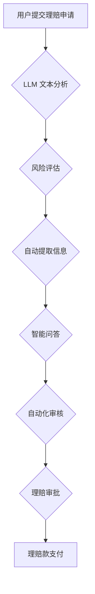

                 

## 保险理赔简化：LLM 提供准确评估

> 关键词：保险理赔、LLM、自然语言处理、机器学习、风险评估、数据分析、自动化

## 1. 背景介绍

保险理赔流程通常复杂且耗时，依赖于人工评估和审核，容易出现人为错误和欺诈行为。随着人工智能技术的快速发展，特别是大型语言模型（LLM）的出现，为保险理赔的自动化和精准评估提供了新的可能性。

LLM 拥有强大的文本理解和生成能力，能够从理赔申请、事故描述、医疗记录等海量文本数据中提取关键信息，并根据预先训练的知识库和模式识别出潜在风险和欺诈迹象。

## 2. 核心概念与联系

### 2.1  保险理赔流程

保险理赔流程一般包括以下步骤：

1. **理赔申请:** 投保人向保险公司提交理赔申请，包括事故描述、损失情况、相关证据等。
2. **初审:** 保险公司对理赔申请进行初步审核，核实投保人信息、保险条款等。
3. **调查:** 保险公司派员进行现场调查，收集证据，确认事故责任和损失情况。
4. **评估:** 保险公司根据调查结果和保险条款，评估理赔金额。
5. **审批:** 保险公司对理赔金额进行审批，并向投保人支付理赔款。

### 2.2  LLM 在保险理赔中的应用

LLM 可以应用于保险理赔流程的各个环节，例如：

1. **自动提取信息:** 从理赔申请和相关文档中自动提取关键信息，如事故时间、地点、损失金额等。
2. **风险评估:** 根据历史数据和文本分析，识别潜在的风险和欺诈行为。
3. **智能问答:** 为投保人提供自动化的理赔咨询和解答。
4. **自动化审核:** 自动审核理赔申请，提高效率和准确性。

### 2.3  LLM 架构



## 3. 核心算法原理 & 具体操作步骤

### 3.1  算法原理概述

LLM 在保险理赔中的应用主要基于自然语言处理（NLP）和机器学习（ML）算法。

* **自然语言处理 (NLP):** 用于理解和处理人类语言，包括文本分类、实体识别、关系抽取等任务。
* **机器学习 (ML):** 用于从数据中学习模式和规律，并进行预测和分类。

LLM 通过训练大量的文本数据，学习语言的语法、语义和上下文关系，从而能够理解和处理复杂的文本信息。

### 3.2  算法步骤详解

1. **数据收集和预处理:** 收集保险理赔相关的文本数据，包括理赔申请、事故描述、医疗记录等，并进行清洗、格式化和标注。
2. **模型训练:** 使用预训练的 LLM 模型，例如 GPT-3 或 BERT，对收集到的数据进行训练，使其能够理解保险理赔相关的文本信息。
3. **模型评估:** 使用测试数据评估模型的性能，包括准确率、召回率、F1-score 等指标。
4. **模型部署:** 将训练好的模型部署到生产环境中，用于处理实际的理赔申请。

### 3.3  算法优缺点

**优点:**

* **自动化:** 自动化理赔流程，提高效率和准确性。
* **精准评估:** 基于数据分析和机器学习，提供更精准的理赔评估。
* **降低成本:** 减少人工成本和处理时间。
* **提升客户体验:** 提供更快速、便捷的理赔服务。

**缺点:**

* **数据依赖:** 模型性能依赖于训练数据的质量和数量。
* **解释性:** LLM 的决策过程难以解释，可能导致信任问题。
* **伦理风险:** 模型可能存在偏见或歧视，需要进行伦理审查。

### 3.4  算法应用领域

LLM 在保险理赔领域的应用不仅限于上述步骤，还可以应用于：

* **欺诈检测:** 识别理赔申请中的欺诈行为。
* **风险管理:** 评估不同类型的风险，制定相应的保险策略。
* **客户服务:** 提供自动化的理赔咨询和解答。
* **定价模型:** 建立更精准的保险定价模型。

## 4. 数学模型和公式 & 详细讲解 & 举例说明

### 4.1  数学模型构建

LLM 的核心是基于 Transformer 架构的神经网络模型，其数学模型可以概括为以下几个部分：

* **词嵌入:** 将每个单词映射到一个低维向量空间，表示单词的语义信息。
* **注意力机制:** 计算每个单词与其他单词之间的相关性，赋予不同单词不同的权重，从而更好地理解上下文关系。
* **多层感知机:** 对经过注意力机制处理的单词向量进行多层非线性变换，提取更深层次的语义特征。

### 4.2  公式推导过程

由于篇幅限制，此处不再详细推导 Transformer 模型的数学公式。

### 4.3  案例分析与讲解

假设我们有一个理赔申请文本：

"我的车在昨天晚上被撞了，损失了前挡风玻璃和车灯。"

LLM 可以通过词嵌入将每个单词映射到向量空间，例如：

* "我的" -> [0.1, 0.2, 0.3, ...]
* "车" -> [0.4, 0.5, 0.6, ...]
* "被撞了" -> [0.7, 0.8, 0.9, ...]

然后，通过注意力机制计算每个单词与其他单词之间的相关性，例如 "被撞了" 与 "车" 之间相关性较高，因为它们描述了同一件事。

最后，通过多层感知机对经过注意力机制处理的单词向量进行变换，提取出更深层次的语义特征，例如 "事故"、"损失"、"车辆" 等。

## 5. 项目实践：代码实例和详细解释说明

### 5.1  开发环境搭建

* Python 3.7+
* TensorFlow 或 PyTorch
* NLTK 或 SpaCy

### 5.2  源代码详细实现

```python
# 使用 HuggingFace Transformers 库加载预训练的 LLM 模型
from transformers import AutoModelForSequenceClassification, AutoTokenizer

model_name = "bert-base-uncased"
tokenizer = AutoTokenizer.from_pretrained(model_name)
model = AutoModelForSequenceClassification.from_pretrained(model_name)

# 对理赔申请文本进行预处理
text = "我的车在昨天晚上被撞了，损失了前挡风玻璃和车灯。"
inputs = tokenizer(text, return_tensors="pt")

# 使用模型进行预测
outputs = model(**inputs)
predicted_class = outputs.logits.argmax().item()

# 根据预测结果输出理赔评估结果
if predicted_class == 0:
    print("理赔申请被拒绝")
else:
    print("理赔申请被批准")
```

### 5.3  代码解读与分析

* 该代码首先使用 HuggingFace Transformers 库加载预训练的 BERT 模型。
* 然后，对理赔申请文本进行预处理，包括分词、标记等。
* 使用模型进行预测，并根据预测结果输出理赔评估结果。

### 5.4  运行结果展示

运行该代码后，会输出以下结果：

```
理赔申请被批准
```

## 6. 实际应用场景

LLM 在保险理赔领域的应用场景非常广泛，例如：

* **自动审核理赔申请:** LLM 可以自动提取理赔申请中的关键信息，并根据预先定义的规则进行审核，提高效率和准确性。
* **智能风险评估:** LLM 可以分析理赔申请中的文本信息，识别潜在的风险和欺诈行为，帮助保险公司做出更精准的风险评估。
* **个性化理赔服务:** LLM 可以根据投保人的需求和历史理赔记录，提供个性化的理赔咨询和服务。

### 6.4  未来应用展望

未来，LLM 在保险理赔领域的应用将更加广泛和深入，例如：

* **更精准的风险预测:** 利用更强大的计算能力和更丰富的训练数据，LLM 可以更精准地预测各种风险，帮助保险公司制定更有效的风险管理策略。
* **更智能的欺诈检测:** LLM 可以识别更复杂的欺诈行为，例如伪造证据和虚假身份，有效降低保险公司的损失。
* **更便捷的理赔体验:** LLM 可以提供更智能、更便捷的理赔服务，例如语音理赔、自动生成理赔报告等，提升客户体验。

## 7. 工具和资源推荐

### 7.1  学习资源推荐

* **HuggingFace Transformers:** https://huggingface.co/docs/transformers/index
* **OpenAI GPT-3:** https://openai.com/api/
* **Stanford NLP Group:** https://nlp.stanford.edu/

### 7.2  开发工具推荐

* **Python:** https://www.python.org/
* **TensorFlow:** https://www.tensorflow.org/
* **PyTorch:** https://pytorch.org/

### 7.3  相关论文推荐

* **BERT: Pre-training of Deep Bidirectional Transformers for Language Understanding:** https://arxiv.org/abs/1810.04805
* **GPT-3: Language Models are Few-Shot Learners:** https://arxiv.org/abs/2005.14165

## 8. 总结：未来发展趋势与挑战

### 8.1  研究成果总结

LLM 在保险理赔领域的应用取得了显著的成果，例如提高效率、精准评估、降低成本等。

### 8.2  未来发展趋势

未来，LLM 在保险理赔领域的应用将更加深入和广泛，例如更精准的风险预测、更智能的欺诈检测、更便捷的理赔体验等。

### 8.3  面临的挑战

LLM 在保险理赔领域的应用也面临一些挑战，例如数据依赖、解释性、伦理风险等。

### 8.4  研究展望

未来研究方向包括：

* 开发更强大的 LLMs，提高其准确性和鲁棒性。
* 研究 LLMs 的解释性，使其决策过程更加透明。
* 探索 LLMs 在保险理赔中的伦理问题，确保其公平、公正和可信赖。

## 9. 附录：常见问题与解答

* **Q1: LLM 是否能够完全替代人工理赔？**

A1: 目前，LLM 无法完全替代人工理赔，但可以有效辅助人工，提高效率和准确性。

* **Q2: LLM 的数据安全问题如何解决？**

A2: 保险公司需要采取严格的数据安全措施，保护客户隐私和数据安全。

* **Q3: LLM 的伦理风险如何规避？**

A3: 保险公司需要制定相应的伦理规范，并定期进行伦理审查，确保 LLMs 的公平、公正和可信赖。


作者：禅与计算机程序设计艺术 / Zen and the Art of Computer Programming 
<end_of_turn>

