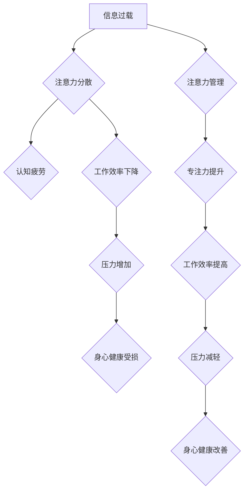

                 

## 信息时代的注意力管理实践与指南：在干扰和信息过载中航行

> 关键词：注意力管理、信息过载、干扰、认知科学、效率提升、专注力、深度工作、数字素养

### 1. 背景介绍

在当今信息爆炸的时代，我们被无休止的数字信息淹没。电子邮件、社交媒体、即时通讯、新闻推送等各种信息源源不断地涌入，争夺着我们的注意力。这种信息过载和干扰不仅影响着我们的工作效率和学习成果，也损害着我们的身心健康。如何有效地管理注意力，在信息洪流中保持专注，已成为当今社会面临的重大挑战。

### 2. 核心概念与联系

**2.1 注意力机制**

注意力是认知过程的核心，它指我们选择性地关注某些信息，而忽略其他信息的能力。注意力机制可以分为两种主要类型：

* **定向注意力:**  是指将注意力集中在特定目标或信息上。
* **分散注意力:** 指将注意力分散在多个目标或信息上。

**2.2 干扰与信息过载**

干扰是指任何阻碍我们集中注意力的事物，包括外部噪音、内部杂念、多任务处理等。信息过载是指我们接收的信息量超过了处理能力，导致注意力分散、认知疲劳。

**2.3 影响因素**

注意力管理受到多种因素的影响，包括：

* **生物因素:**  年龄、基因、睡眠质量等。
* **环境因素:**  噪音、光线、温度等。
* **心理因素:**  情绪、压力、焦虑等。
* **技术因素:**  手机、社交媒体、电子邮件等。

**2.4  注意力管理的必要性**

在信息时代，有效地管理注意力至关重要，因为它直接影响着我们的：

* **工作效率:**  专注力强的人可以更快地完成任务，并做出更准确的决策。
* **学习成果:**  注意力集中可以帮助我们更好地理解和记忆信息。
* **身心健康:**  注意力过载会导致认知疲劳、焦虑、抑郁等问题。

**2.5  注意力管理的原则**

* **专注:**  尽量减少干扰，集中精力于当前的任务。
* **计划:**  合理安排时间，优先处理重要任务。
* **休息:**  定期休息，让大脑得到放松和恢复。
* **冥想:**  练习冥想，增强专注力和自我意识。
* **断舍离:**  减少不必要的电子设备和信息来源。

**2.6  Mermaid 流程图**

### 3. 核心算法原理 & 具体操作步骤

**3.1 算法原理概述**

注意力管理算法旨在通过分析用户行为和环境信息，预测用户注意力状态，并提供个性化的建议和干预措施，帮助用户提高专注力，减少干扰。这些算法通常基于以下核心原理：

* **用户行为分析:**  通过分析用户的鼠标点击、键盘输入、页面浏览等行为数据，识别用户注意力集中和分散的模式。
* **环境因素识别:**  通过监测用户的环境信息，例如噪音、光线、温度等，识别可能影响用户注意力的因素。
* **注意力预测模型:**  利用机器学习算法，构建注意力预测模型，预测用户未来注意力状态。
* **干预策略:**  根据注意力预测结果，提供个性化的干预策略，例如提醒用户休息、屏蔽干扰信息、调整工作环境等。

**3.2 算法步骤详解**

1. **数据收集:**  收集用户行为数据、环境信息数据等。
2. **数据预处理:**  对收集到的数据进行清洗、转换、特征提取等预处理操作。
3. **模型训练:**  利用机器学习算法，训练注意力预测模型。
4. **注意力预测:**  将用户行为和环境信息输入到训练好的模型中，预测用户未来注意力状态。
5. **干预策略推荐:**  根据注意力预测结果，推荐个性化的干预策略。
6. **策略执行:**  用户根据推荐的策略进行操作，例如调整工作环境、屏蔽干扰信息等。
7. **效果评估:**  评估干预策略的效果，并根据评估结果不断优化模型和策略。

**3.3 算法优缺点**

**优点:**

* **个性化:**  根据用户的行为和环境信息，提供个性化的干预策略。
* **主动性:**  提前预测用户注意力状态，并主动提供干预措施。
* **可量化:**  可以通过数据分析和模型评估，量化注意力管理的效果。

**缺点:**

* **数据依赖:**  需要大量用户行为和环境信息数据进行训练。
* **模型复杂:**  注意力预测模型的构建和训练需要一定的技术难度。
* **隐私问题:**  收集和使用用户行为数据需要考虑隐私保护问题。

**3.4 算法应用领域**

注意力管理算法在以下领域具有广泛的应用前景：

* **教育:**  帮助学生提高学习效率，专注于课堂内容。
* **工作:**  帮助员工提高工作效率，减少干扰，提高专注力。
* **健康:**  帮助用户缓解压力，改善睡眠质量，提高身心健康。
* **游戏:**  增强游戏沉浸感，提高玩家体验。

### 4. 数学模型和公式 & 详细讲解 & 举例说明

**4.1 数学模型构建**

注意力管理算法通常采用基于贝叶斯网络或深度学习的数学模型。

* **贝叶斯网络:**  贝叶斯网络是一种概率图模型，可以表示变量之间的依赖关系。在注意力管理中，可以构建一个贝叶斯网络，其中节点代表用户行为、环境因素、注意力状态等变量，边表示变量之间的依赖关系。

* **深度学习:**  深度学习算法，例如循环神经网络（RNN）和长短期记忆网络（LSTM），可以学习用户行为和环境信息之间的复杂关系，并预测用户注意力状态。

**4.2 公式推导过程**

由于篇幅限制，此处不再详细推导注意力管理算法的数学公式。

**4.3 案例分析与讲解**

假设我们构建了一个基于贝叶斯网络的注意力管理模型，该模型包含以下节点：

* **用户行为:**  鼠标点击次数、键盘输入次数、页面浏览时间等。
* **环境因素:**  噪音水平、光线强度、温度等。
* **注意力状态:**  集中、分散、疲劳等。

我们可以根据用户行为和环境因素的概率分布，以及节点之间的依赖关系，计算出用户注意力状态的概率分布。例如，如果用户在安静的环境中，鼠标点击次数较少，键盘输入次数较多，那么该用户的注意力状态可能是集中状态。

### 5. 项目实践：代码实例和详细解释说明

**5.1 开发环境搭建**

* **操作系统:**  Windows、macOS、Linux
* **编程语言:**  Python
* **开发工具:**  VS Code、PyCharm
* **库依赖:**  NumPy、Pandas、Scikit-learn、TensorFlow/PyTorch

**5.2 源代码详细实现**

由于篇幅限制，此处不再提供完整的源代码。

**5.3 代码解读与分析**

* **数据预处理:**  对收集到的用户行为和环境信息数据进行清洗、转换、特征提取等操作。
* **模型训练:**  利用机器学习算法，训练注意力预测模型。
* **注意力预测:**  将用户行为和环境信息输入到训练好的模型中，预测用户未来注意力状态。
* **干预策略推荐:**  根据注意力预测结果，推荐个性化的干预策略。

**5.4 运行结果展示**

* **注意力预测准确率:**  模型预测用户注意力状态的准确率。
* **干预策略效果:**  干预策略对用户注意力和工作效率的影响。

### 6. 实际应用场景

**6.1 教育领域**

* **智能学习平台:**  根据学生的注意力状态，提供个性化的学习内容和学习方式。
* **课堂注意力监测:**  实时监测学生的注意力状态，帮助老师及时调整教学方法。

**6.2 工作领域**

* **深度工作工具:**  帮助员工集中注意力，减少干扰，提高工作效率。
* **项目管理系统:**  根据团队成员的注意力状态，优化任务分配和进度安排。

**6.3 健康领域**

* **压力管理应用:**  监测用户的注意力状态，提供放松和减压的建议。
* **睡眠质量监测:**  分析用户的注意力状态，评估睡眠质量。

**6.4 未来应用展望**

* **增强现实/虚拟现实:**  利用注意力管理技术，增强用户在虚拟环境中的沉浸感和体验。
* **自动驾驶:**  帮助驾驶员集中注意力，提高驾驶安全。
* **人机交互:**  开发更智能、更人性化的交互系统。

### 7. 工具和资源推荐

**7.1 学习资源推荐**

* **书籍:**  《注意力经济》、《深度工作》、《刻意练习》
* **在线课程:**  Coursera、edX、Udacity

**7.2 开发工具推荐**

* **Python:**  NumPy、Pandas、Scikit-learn、TensorFlow/PyTorch
* **数据可视化工具:**  Matplotlib、Seaborn

**7.3 相关论文推荐**

* **Attention Is All You Need:**  https://arxiv.org/abs/1706.03762
* **BERT: Pre-training of Deep Bidirectional Transformers for Language Understanding:**  https://arxiv.org/abs/1810.04805

### 8. 总结：未来发展趋势与挑战

**8.1 研究成果总结**

注意力管理算法取得了显著的进展，在教育、工作、健康等领域展现出巨大的应用潜力。

**8.2 未来发展趋势**

* **模型精度提升:**  开发更准确、更鲁棒的注意力预测模型。
* **个性化干预:**  提供更个性化的干预策略，满足不同用户的需求。
* **跨平台应用:**  将注意力管理技术应用于更多平台和设备。

**8.3 面临的挑战**

* **数据隐私:**  如何保护用户数据隐私，确保数据安全使用。
* **算法解释性:**  提高注意力管理算法的解释性，帮助用户理解模型的决策过程。
* **伦理问题:**  关注注意力管理技术的伦理问题，避免被滥用。

**8.4 研究展望**

未来，注意力管理技术将继续发展，为人们提供更有效的注意力管理工具和解决方案，帮助人们在信息时代更好地集中注意力，提高效率，提升生活质量。

### 9. 附录：常见问题与解答

* **Q1: 如何提高注意力集中能力？**

* **A1:**  可以通过以下方法提高注意力集中能力：
    * **冥想:**  练习冥想可以增强专注力和自我意识。
    * **番茄工作法:**  将工作时间分成25分钟的间隔，每间隔后休息5分钟。
    * **断舍离:**  减少不必要的电子设备和信息来源。
    * **规律作息:**  保证充足的睡眠，保持规律的作息时间。

* **Q2: 注意力管理算法是否会侵犯用户隐私？**

* **A2:**  注意力管理算法确实会收集用户行为和环境信息数据，因此需要谨慎处理用户数据，确保数据安全使用，并获得用户的知情同意。

* **Q3: 注意力管理技术有哪些伦理问题？**

* **A3:**  注意力管理技术可能被滥用，例如用于监控员工工作时间，或用于操纵用户的行为。因此，需要关注注意力管理技术的伦理问题，并制定相应的规范和制度。

作者：禅与计算机程序设计艺术 / Zen and the Art of Computer Programming 
<end_of_turn>

