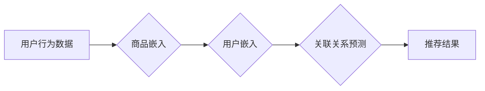

                 

## 大模型驱动的商品关联分析技术

> 关键词：大模型、商品关联分析、推荐系统、Transformer、BERT、图神经网络、自然语言处理

## 1. 背景介绍

商品关联分析是推荐系统领域的核心技术之一，旨在挖掘用户购买行为中的潜在关联关系，从而为用户推荐相关的商品。传统的关联分析方法主要依赖于频繁项集挖掘和关联规则挖掘等统计学方法，例如Apriori算法和FP-Growth算法。这些方法虽然有效，但存在一些局限性：

* **离散特征难以捕捉语义信息:** 传统的关联分析方法主要处理离散特征，难以捕捉商品之间的语义关系和用户偏好。
* **数据稀疏性问题:**  商品关联关系往往存在数据稀疏性问题，传统的关联分析方法难以有效挖掘稀疏数据中的关联模式。
* **静态分析无法反映动态变化:** 传统的关联分析方法通常是静态分析，无法反映商品关联关系的动态变化趋势。

近年来，随着深度学习技术的快速发展，大模型在商品关联分析领域展现出巨大的潜力。大模型，例如Transformer、BERT等，能够有效学习商品之间的语义关系和用户偏好，并克服传统方法的局限性。

## 2. 核心概念与联系

大模型驱动的商品关联分析技术主要基于以下核心概念：

* **大模型:** 指的是参数量巨大、训练数据量庞大的深度学习模型，例如GPT-3、BERT、T5等。
* **商品嵌入:** 将商品转化为低维向量表示，以便于模型学习商品之间的语义关系。
* **用户嵌入:** 将用户转化为低维向量表示，以便于模型学习用户偏好。
* **关联关系预测:** 利用大模型学习到的商品和用户嵌入，预测用户对特定商品的兴趣或购买可能性。

**核心架构流程图:**



## 3. 核心算法原理 & 具体操作步骤

### 3.1  算法原理概述

大模型驱动的商品关联分析技术主要利用Transformer模型的注意力机制和自编码器结构，学习商品之间的语义关系和用户偏好。

* **Transformer模型:** Transformer模型是一种基于注意力机制的深度学习模型，能够有效捕捉序列数据中的长距离依赖关系。
* **注意力机制:** 注意力机制能够学习到输入序列中不同元素之间的重要程度，并赋予它们不同的权重，从而提高模型对语义信息的理解能力。
* **自编码器结构:** 自编码器结构由编码器和解码器组成，编码器将输入数据压缩为低维表示，解码器将低维表示恢复为原始数据。

### 3.2  算法步骤详解

1. **数据预处理:** 将用户行为数据进行清洗、格式化和特征提取，例如将商品ID转化为商品嵌入向量。
2. **模型训练:** 利用Transformer模型训练，输入商品嵌入向量和用户嵌入向量，输出关联关系预测结果。
3. **关联关系预测:** 利用训练好的模型，输入新的用户和商品信息，预测用户对特定商品的兴趣或购买可能性。
4. **推荐结果生成:** 根据关联关系预测结果，生成推荐商品列表。

### 3.3  算法优缺点

**优点:**

* **能够捕捉语义信息:** Transformer模型的注意力机制能够有效捕捉商品之间的语义关系和用户偏好。
* **克服数据稀疏性问题:** 大模型能够从海量数据中学习到隐含的关联模式，即使数据稀疏也能有效挖掘关联关系。
* **动态分析:** 大模型能够不断学习新的数据，并更新关联关系预测结果，能够反映商品关联关系的动态变化趋势。

**缺点:**

* **计算资源需求高:** 大模型训练和推理需要大量的计算资源。
* **模型参数量大:** 大模型参数量巨大，需要大量的存储空间。
* **训练数据依赖性强:** 大模型的性能依赖于训练数据的质量和数量。

### 3.4  算法应用领域

大模型驱动的商品关联分析技术广泛应用于以下领域:

* **电商推荐:** 为用户推荐相关的商品，提高用户购买转化率。
* **内容推荐:** 为用户推荐相关的文章、视频、音乐等内容。
* **搜索引擎优化:** 挖掘商品之间的关联关系，提高搜索结果的准确性和相关性。
* **市场营销分析:** 分析用户购买行为，挖掘潜在的市场机会。

## 4. 数学模型和公式 & 详细讲解 & 举例说明

### 4.1  数学模型构建

大模型驱动的商品关联分析技术通常采用基于图神经网络的数学模型，将商品和用户表示为图节点，商品之间的关联关系表示为图边。

* **商品节点:**  每个商品对应一个节点，节点的特征向量包含商品的属性信息，例如商品名称、类别、价格等。
* **用户节点:** 每个用户对应一个节点，节点的特征向量包含用户的属性信息，例如用户的年龄、性别、购买历史等。
* **关联关系边:** 商品之间存在关联关系，例如“经常一起购买”，“属于同一类别”等，这些关系表示为图边。

### 4.2  公式推导过程

图神经网络的学习过程主要通过以下公式进行：

* **节点嵌入:** 利用图卷积网络（GCN）或Graph Attention Network（GAT）等算法，将节点特征向量映射到低维嵌入空间。
* **关联关系预测:** 利用嵌入空间中的节点表示，计算商品之间的关联关系得分，例如使用余弦相似度或点积运算。

### 4.3  案例分析与讲解

假设有两个商品A和B，它们之间的关联关系得分是0.8，表示它们经常一起购买。

* **节点嵌入:**  将商品A和B的属性信息转化为低维嵌入向量，例如商品A的嵌入向量为[0.2, 0.5, 0.1]，商品B的嵌入向量为[0.3, 0.4, 0.2]。
* **关联关系预测:** 使用余弦相似度计算商品A和B之间的关联关系得分：

```
cosine_similarity(A, B) = (A ⋅ B) / (||A|| * ||B||)
```

其中，A ⋅ B表示商品A和B的嵌入向量的点积，||A||和||B||分别表示商品A和B嵌入向量的模长。

## 5. 项目实践：代码实例和详细解释说明

### 5.1  开发环境搭建

* **Python:** Python 3.6+
* **深度学习框架:** TensorFlow或PyTorch
* **图神经网络库:** DGL或PyTorch Geometric

### 5.2  源代码详细实现

```python
import torch
import torch.nn as nn
from dgl import DGLGraph

# 定义商品嵌入层
class ItemEmbedding(nn.Module):
    def __init__(self, num_items, embedding_dim):
        super(ItemEmbedding, self).__init__()
        self.embedding = nn.Embedding(num_items, embedding_dim)

    def forward(self, item_ids):
        return self.embedding(item_ids)

# 定义图卷积层
class GCNLayer(nn.Module):
    def __init__(self, in_features, out_features):
        super(GCNLayer, self).__init__()
        self.linear = nn.Linear(in_features, out_features)

    def forward(self, graph, features):
        # 计算图卷积
        h = graph.ndata['h']
        A = graph.adj_matrix()
        h = torch.matmul(A, h)
        h = self.linear(h)
        return h

# 定义关联关系预测层
class RelationPrediction(nn.Module):
    def __init__(self, embedding_dim):
        super(RelationPrediction, self).__init__()
        self.linear = nn.Linear(embedding_dim, 1)

    def forward(self, item_embeddings):
        # 计算关联关系得分
        scores = self.linear(item_embeddings)
        return scores

# 实例化模型
num_items = 10000
embedding_dim = 64
item_embedding = ItemEmbedding(num_items, embedding_dim)
gcn_layer = GCNLayer(embedding_dim, embedding_dim)
relation_prediction = RelationPrediction(embedding_dim)

# 训练模型
# ...

```

### 5.3  代码解读与分析

* **商品嵌入层:** 将商品ID转化为低维嵌入向量。
* **图卷积层:** 利用图卷积网络学习商品之间的关联关系。
* **关联关系预测层:** 利用嵌入空间中的商品表示，预测商品之间的关联关系得分。

### 5.4  运行结果展示

训练好的模型可以用于预测新的商品之间的关联关系，并生成推荐商品列表。

## 6. 实际应用场景

大模型驱动的商品关联分析技术在电商平台、内容平台、搜索引擎等领域有着广泛的应用场景。

* **电商平台:** 为用户推荐相关的商品，提高用户购买转化率。例如，当用户购买了某款手机后，系统可以推荐相关的手机壳、充电器等配件。
* **内容平台:** 为用户推荐相关的文章、视频、音乐等内容。例如，当用户观看了一部电影后，系统可以推荐相关的电影评论、幕后花絮等内容。
* **搜索引擎:** 挖掘商品之间的关联关系，提高搜索结果的准确性和相关性。例如，当用户搜索“笔记本电脑”时，系统可以推荐相关的配件、软件、学习资源等内容。

### 6.4  未来应用展望

随着大模型技术的不断发展，大模型驱动的商品关联分析技术将有更广泛的应用场景和更强大的功能。例如：

* **个性化推荐:** 利用用户画像和行为数据，为每个用户提供个性化的商品推荐。
* **跨平台推荐:** 将不同平台的用户行为数据整合，实现跨平台的商品推荐。
* **场景化推荐:** 根据用户的场景和需求，提供更精准的商品推荐。

## 7. 工具和资源推荐

### 7.1  学习资源推荐

* **书籍:**
    * 《深度学习》 - Ian Goodfellow
    * 《自然语言处理》 - Steven Bird
* **在线课程:**
    * Coursera: Deep Learning Specialization
    * Udacity: Deep Learning Nanodegree
* **博客和论坛:**
    * Towards Data Science
    * Reddit: r/MachineLearning

### 7.2  开发工具推荐

* **深度学习框架:** TensorFlow, PyTorch
* **图神经网络库:** DGL, PyTorch Geometric
* **数据处理工具:** Pandas, NumPy

### 7.3  相关论文推荐

* **BERT:** Devlin, J., Chang, M. W., Lee, K., & Toutanova, K. (2018). BERT: Pre-training of deep bidirectional transformers for language understanding. arXiv preprint arXiv:1810.04805.
* **Transformer:** Vaswani, A., Shazeer, N., Parmar, N., Uszkoreit, J., Jones, L., Gomez, A. N., ... & Polosukhin, I. (2017). Attention is all you need. In Advances in neural information processing systems (pp. 5998-6008).

## 8. 总结：未来发展趋势与挑战

### 8.1  研究成果总结

大模型驱动的商品关联分析技术取得了显著的成果，能够有效挖掘商品之间的关联关系，并为用户提供更精准的商品推荐。

### 8.2  未来发展趋势

* **模型规模和能力提升:** 大模型的规模和能力将不断提升，能够学习到更丰富的商品关联知识。
* **多模态融合:** 将文本、图像、视频等多模态数据融合到商品关联分析模型中，提升推荐效果。
* **解释性增强:** 研究大模型的决策机制，提高推荐结果的可解释性。

### 8.3  面临的挑战

* **计算资源需求:** 大模型训练和推理需要大量的计算资源，成本较高。
* **数据质量和隐私:** 大模型的性能依赖于训练数据的质量和数量，同时需要解决数据隐私问题。
* **模型可解释性:** 大模型的决策机制复杂，难以解释，需要提高模型的可解释性。

### 8.4  研究展望

未来，大模型驱动的商品关联分析技术将继续朝着更智能、更精准、更可解释的方向发展，为用户提供更个性化、更丰富的商品体验。

## 9. 附录：常见问题与解答

* **Q1: 大模型驱动的商品关联分析技术与传统的关联分析技术相比有哪些优势？**

**A1:** 大模型驱动的商品关联分析技术能够捕捉语义信息，克服数据稀疏性问题，并动态分析商品关联关系，相比传统的关联分析技术具有更强的能力和更精准的推荐效果。

* **Q2: 如何选择合适的图神经网络模型？**

**A2:** 选择合适的图神经网络模型需要根据具体应用场景和数据特点进行选择。例如，对于稀疏图数据，可以使用GCN模型；对于有向图数据，可以使用GAT模型。

* **Q3: 如何解决大模型训练和推理的计算资源问题？**

**A3:** 可以利用云计算平台的GPU资源进行大模型训练和推理，也可以采用模型压缩和量化技术降低模型参数量和计算复杂度。


作者：禅与计算机程序设计艺术 / Zen and the Art of Computer Programming<end_of_turn>

