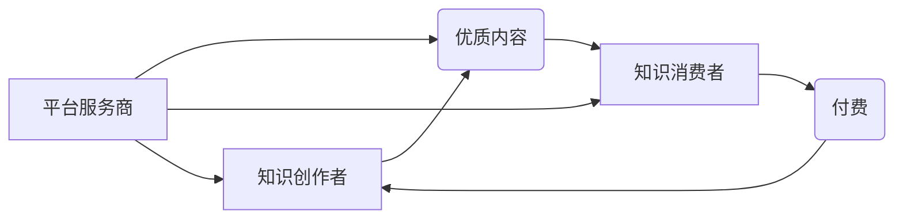

                 

## 如何打造个人知识付费生态圈

> 关键词：知识付费、个人品牌、内容生态、社区运营、技术架构、数据分析、商业模式

### 1. 背景介绍

在互联网时代，知识已成为最宝贵的资源。个人知识付费生态圈的兴起，为知识创作者提供了新的商业模式，也为知识渴求者提供了便捷的学习途径。 

随着互联网技术的不断发展，人们对知识的需求日益增长，而传统教育模式的局限性也越来越明显。个人知识付费生态圈的出现，填补了这一空白，为知识创作者和学习者提供了新的平台和机会。

### 2. 核心概念与联系

**2.1 知识付费生态圈**

知识付费生态圈是指围绕知识创作者、知识消费者和平台服务商构建的闭环系统。在这个生态圈中，知识创作者通过创作优质内容，获取收益；知识消费者通过付费学习，获得知识和技能提升；平台服务商提供技术支持、运营服务和推广渠道，连接知识创作者和知识消费者。

**2.2 核心概念关系图**



**2.3 核心概念原理**

知识付费生态圈的核心原理是价值交换。知识创作者通过创作和分享知识，为知识消费者提供价值，而知识消费者通过付费，获得知识和技能的提升，实现个人价值的增长。

平台服务商扮演着连接和撮合的角色，通过提供技术支持、运营服务和推广渠道，帮助知识创作者和知识消费者建立连接，促进价值交换。

### 3. 核心算法原理 & 具体操作步骤

**3.1 算法原理概述**

知识付费生态圈的运营需要依靠一系列算法来实现内容推荐、用户匹配、付费转化等功能。这些算法通常基于机器学习和数据分析技术，通过分析用户行为数据、内容特征数据和市场趋势数据，为用户提供个性化推荐，提高用户粘性和付费转化率。

**3.2 算法步骤详解**

1. **数据采集:** 收集用户行为数据、内容特征数据和市场趋势数据。
2. **数据预处理:** 对收集到的数据进行清洗、转换和特征提取。
3. **模型训练:** 利用机器学习算法对预处理后的数据进行训练，构建推荐模型、用户匹配模型和付费转化模型。
4. **模型评估:** 对训练好的模型进行评估，调整模型参数，提高模型精度。
5. **模型部署:** 将训练好的模型部署到线上环境，为用户提供个性化服务。

**3.3 算法优缺点**

**优点:**

* **个性化推荐:** 算法可以根据用户的兴趣和需求，推荐个性化的内容，提高用户体验。
* **用户匹配:** 算法可以根据用户的兴趣和需求，匹配合适的知识创作者，提高付费转化率。
* **数据驱动:** 算法可以根据数据分析结果，优化运营策略，提高生态圈的整体效率。

**缺点:**

* **数据依赖:** 算法的性能取决于数据的质量和数量。
* **算法黑盒:** 一些复杂的算法难以解释，难以理解其推荐机制。
* **隐私安全:** 数据采集和分析需要考虑用户隐私安全问题。

**3.4 算法应用领域**

* 内容推荐系统
* 用户匹配系统
* 付费转化系统
* 内容分发系统
* 社区运营系统

### 4. 数学模型和公式 & 详细讲解 & 举例说明

**4.1 数学模型构建**

知识付费生态圈的运营可以抽象为一个多主体博弈模型。

* **知识创作者:** 试图通过创作优质内容，吸引用户付费。
* **知识消费者:** 试图通过付费学习，获得知识和技能的提升。
* **平台服务商:** 试图通过提供技术支持、运营服务和推广渠道，连接知识创作者和知识消费者，获得平台收益。

**4.2 公式推导过程**

* **知识创作者收益:**  收益 = 付费用户数量 * 平均付费金额
* **知识消费者收益:** 收益 = 知识和技能提升带来的价值
* **平台服务商收益:** 收益 = 平台服务费 + 广告收入

**4.3 案例分析与讲解**

假设一个知识付费平台，平台上有100个知识创作者，每个知识创作者发布10个课程，平均每门课程有100个付费用户，平均付费金额为100元。

* **知识创作者总收益:** 100个创作者 * 10个课程 * 100个付费用户 * 100元/用户 = 100万元
* **平台服务商收益:** 假设平台服务费为每门课程10元，广告收入为10万元。则平台服务商总收益为 100个创作者 * 10个课程 * 10元/课程 + 10万元 = 110万元。

### 5. 项目实践：代码实例和详细解释说明

**5.1 开发环境搭建**

* **操作系统:** Linux/macOS/Windows
* **编程语言:** Python
* **框架:** Django/Flask
* **数据库:** MySQL/PostgreSQL
* **云服务:** AWS/Azure/GCP

**5.2 源代码详细实现**

```python
# 用户模型
class User(models.Model):
    username = models.CharField(max_length=255)
    password = models.CharField(max_length=255)
    email = models.EmailField()

# 课程模型
class Course(models.Model):
    title = models.CharField(max_length=255)
    description = models.TextField()
    price = models.DecimalField(max_digits=10, decimal_places=2)
    creator = models.ForeignKey(User, on_delete=models.CASCADE)

# 付费记录模型
class Payment(models.Model):
    user = models.ForeignKey(User, on_delete=models.CASCADE)
    course = models.ForeignKey(Course, on_delete=models.CASCADE)
    amount = models.DecimalField(max_digits=10, decimal_places=2)
    created_at = models.DateTimeField(auto_now_add=True)
```

**5.3 代码解读与分析**

* 用户模型定义了用户的基本信息，包括用户名、密码和邮箱地址。
* 课程模型定义了课程的基本信息，包括课程标题、描述、价格和创建者。
* 付费记录模型记录了用户的付费信息，包括用户、课程、金额和支付时间。

**5.4 运行结果展示**

通过运行上述代码，可以搭建一个基本的知识付费平台，用户可以注册账号、浏览课程、购买课程和查看付费记录。

### 6. 实际应用场景

**6.1 在线教育平台**

知识付费生态圈可以应用于在线教育平台，帮助平台提供个性化课程推荐、用户匹配和付费转化服务。

**6.2 内容创作平台**

知识付费生态圈可以应用于内容创作平台，帮助创作者 monetize their content，并与用户建立更紧密的连接。

**6.3 社区运营平台**

知识付费生态圈可以应用于社区运营平台，帮助平台构建知识共享和付费学习的生态系统。

**6.4 未来应用展望**

随着人工智能、大数据和云计算技术的不断发展，知识付费生态圈将更加智能化、个性化和多元化。

* **人工智能驱动的个性化推荐:** 利用人工智能算法，为用户提供更加精准的课程推荐，提高用户体验和付费转化率。
* **虚拟现实和增强现实技术的应用:** 利用虚拟现实和增强现实技术，打造更加沉浸式的学习体验，提升学习效果。
* **区块链技术的应用:** 利用区块链技术，保障知识产权和交易安全，构建更加透明和可信赖的知识付费生态圈。

### 7. 工具和资源推荐

**7.1 学习资源推荐**

* **书籍:** 《知识经济》、《互联网思维》、《数据驱动》
* **课程:** Coursera、edX、Udemy
* **博客:** Hacker News、Medium、TechCrunch

**7.2 开发工具推荐**

* **编程语言:** Python、Java、JavaScript
* **框架:** Django、Flask、React、Angular
* **数据库:** MySQL、PostgreSQL、MongoDB

**7.3 相关论文推荐**

* **知识付费生态圈的构建与发展**
* **人工智能在知识付费生态圈中的应用**
* **区块链技术在知识付费生态圈中的应用**

### 8. 总结：未来发展趋势与挑战

**8.1 研究成果总结**

知识付费生态圈是一个充满机遇和挑战的领域。通过分析核心概念、算法原理和实际应用场景，我们了解到知识付费生态圈的构建需要考虑多方面的因素，包括用户需求、内容质量、平台运营和技术支持。

**8.2 未来发展趋势**

未来，知识付费生态圈将朝着更加智能化、个性化和多元化的方向发展。人工智能、大数据和云计算技术将推动知识付费生态圈的创新发展，为用户提供更加便捷、高效和个性化的学习体验。

**8.3 面临的挑战**

知识付费生态圈也面临着一些挑战，例如知识产权保护、用户隐私安全和平台监管等。

**8.4 研究展望**

未来，我们需要继续深入研究知识付费生态圈的运作机制，探索新的技术应用场景，并制定相应的政策法规，促进知识付费生态圈的健康发展。

### 9. 附录：常见问题与解答

**9.1 如何选择合适的知识付费平台？**

选择知识付费平台时，需要考虑平台的口碑、课程质量、用户评价和服务体系等因素。

**9.2 如何保护知识产权？**

知识创作者可以采取以下措施保护知识产权：

* 申请知识产权专利
* 使用版权声明和水印
* 与平台合作，建立知识产权保护机制

**9.3 如何提高付费转化率？**

提高付费转化率需要从以下几个方面入手：

* 创作优质内容
* 提供优惠活动
* 建立用户信任
* 提供良好的用户体验


作者：禅与计算机程序设计艺术 / Zen and the Art of Computer Programming 
<end_of_turn>

