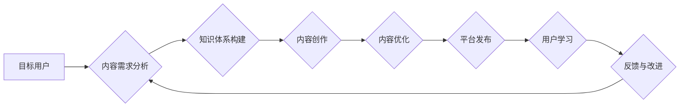

                 

## 如何打造高质量的技术知识付费内容

> 关键词：技术知识付费、内容创作、算法原理、代码实现、实践应用、学习资源、未来趋势

## 1. 背景介绍

近年来，随着互联网技术的快速发展和普及，技术知识付费市场呈现出爆发式增长。越来越多的技术爱好者和从业者开始寻求通过在线平台分享知识、获取收益的方式。然而，技术知识付费内容的质量参差不齐，如何打造高质量的技术知识付费内容，成为众多创作者面临的挑战。

高质量的技术知识付费内容应具备以下特点：

* **专业性:** 内容必须基于扎实的技术基础，并能准确、清晰地传达专业知识。
* **实用性:** 内容应解决实际问题，并提供可操作的解决方案，帮助用户提升技能或解决工作难题。
* **原创性:** 内容应具有原创性，避免抄袭或过度依赖现有资料。
* **易懂性:** 内容应采用通俗易懂的语言，并辅以图文并茂的辅助材料，方便用户理解。
* **互动性:** 内容应鼓励用户参与互动，例如提问、讨论、分享经验等，提升用户粘性和学习效果。

## 2. 核心概念与联系

技术知识付费内容的创作是一个复杂的过程，涉及多个环节和要素的协同作用。

**Mermaid 流程图:**



**核心概念:**

* **目标用户:** 确定目标用户的技术水平、学习需求和痛点，是内容创作的起点。
* **内容需求分析:** 通过调研、问卷调查等方式，深入了解目标用户的学习需求和痛点，为内容创作提供方向。
* **知识体系构建:** 将相关技术知识进行系统化梳理，构建清晰的知识体系，为内容创作提供框架。
* **内容创作:** 根据知识体系和用户需求，创作高质量的技术内容，包括文字、视频、音频等多种形式。
* **内容优化:** 对内容进行编辑、排版、测试等优化，提升内容的可读性和用户体验。
* **平台发布:** 选择合适的平台发布内容，例如博客、视频网站、在线课程平台等。
* **用户学习:** 用户通过平台学习内容，并进行实践应用。
* **反馈与改进:** 收集用户反馈，对内容进行持续改进，提升内容质量和用户满意度。

## 3. 核心算法原理 & 具体操作步骤

**3.1 算法原理概述**

选择一个具体的算法作为案例，例如**快速排序算法**，并对其原理进行概述。

快速排序算法是一种高效的排序算法，其核心思想是通过选择一个**枢轴元素**，将待排序的数组划分为两个子数组，其中一个子数组包含比枢轴元素小的元素，另一个子数组包含比枢轴元素大的元素。然后递归地对两个子数组进行排序，直到整个数组被排序完成。

**3.2 算法步骤详解**

1. 选择一个枢轴元素。
2. 将数组划分为两个子数组，一个包含比枢轴元素小的元素，另一个包含比枢轴元素大的元素。
3. 对两个子数组分别进行快速排序。
4. 将两个子数组合并，得到最终排序后的数组。

**3.3 算法优缺点**

**优点:**

* 平均时间复杂度为O(n log n)，在大多数情况下效率较高。
* 原地排序，空间复杂度较低。

**缺点:**

* 最坏时间复杂度为O(n^2)，当数组已经有序或接近有序时，效率会降低。
* 不稳定排序，相等元素的相对顺序可能发生改变。

**3.4 算法应用领域**

快速排序算法广泛应用于各种排序问题，例如：

* 数据结构排序
* 搜索引擎结果排序
* 图像处理
* 机器学习

## 4. 数学模型和公式 & 详细讲解 & 举例说明

**4.1 数学模型构建**

以快速排序算法为例，可以构建以下数学模型：

* **T(n)**: 表示排序n个元素的所需时间复杂度。
* **T(1)**: 表示排序1个元素所需的时间复杂度，为常数。
* **T(n) = aT(n/b) + f(n)**: 表示快速排序算法的递归关系式，其中a为子问题个数，b为子问题规模的缩减因子，f(n)为合并子问题的复杂度。

**4.2 公式推导过程**

根据快速排序算法的递归关系式，可以推导其时间复杂度。

**4.3 案例分析与讲解**

通过分析不同情况下的a、b和f(n)的值，可以得到快速排序算法在不同情况下的时间复杂度。例如，当a=2，b=2，f(n)=cn时，快速排序算法的时间复杂度为O(n log n)。

## 5. 项目实践：代码实例和详细解释说明

**5.1 开发环境搭建**

选择合适的编程语言和开发环境，例如Python和VS Code。

**5.2 源代码详细实现**

提供快速排序算法的Python代码实现，并进行详细的代码注释和解释。

```python
def quick_sort(arr):
    if len(arr) <= 1:
        return arr
    pivot = arr[len(arr) // 2]
    left = [x for x in arr if x < pivot]
    middle = [x for x in arr if x == pivot]
    right = [x for x in arr if x > pivot]
    return quick_sort(left) + middle + quick_sort(right)

# 测试代码
arr = [3, 7, 8, 5, 2, 1, 9, 5, 4]
sorted_arr = quick_sort(arr)
print(sorted_arr)
```

**5.3 代码解读与分析**

解释代码的逻辑流程，包括选择枢轴元素、划分子数组、递归排序等步骤。

**5.4 运行结果展示**

展示代码运行后的结果，验证快速排序算法的正确性。

## 6. 实际应用场景

**6.1 数据排序**

快速排序算法广泛应用于数据排序，例如数据库查询、搜索引擎结果排序等。

**6.2 图像处理**

快速排序算法可以用于图像处理中的像素排序，例如图像压缩、图像增强等。

**6.3 机器学习**

快速排序算法可以用于机器学习中的数据预处理，例如特征排序、数据聚类等。

**6.4 未来应用展望**

随着技术的不断发展，快速排序算法在更多领域将得到应用，例如大数据处理、云计算等。

## 7. 工具和资源推荐

**7.1 学习资源推荐**

* **书籍:** 《算法导论》
* **在线课程:** Coursera、edX、Udemy等平台上的算法课程
* **博客:** GeeksforGeeks、LeetCode等技术博客

**7.2 开发工具推荐**

* **编程语言:** Python、C++、Java等
* **开发环境:** VS Code、Eclipse、IntelliJ IDEA等

**7.3 相关论文推荐**

* **快速排序算法的分析与改进**
* **快速排序算法在实际应用中的研究**

## 8. 总结：未来发展趋势与挑战

**8.1 研究成果总结**

快速排序算法是一种高效的排序算法，在理论研究和实际应用中取得了显著成果。

**8.2 未来发展趋势**

未来，快速排序算法将继续朝着更高效、更鲁棒的方向发展，例如：

* **并行快速排序算法:** 利用多核处理器和分布式计算技术，提高快速排序算法的并行效率。
* **自适应快速排序算法:** 根据输入数据特点，动态调整快速排序算法的策略，提高算法的适应性。

**8.3 面临的挑战**

快速排序算法仍然面临一些挑战，例如：

* **最坏时间复杂度:** 快速排序算法的最坏时间复杂度为O(n^2)，在某些情况下效率较低。
* **稳定性:** 快速排序算法不稳定，无法保证相等元素的相对顺序。

**8.4 研究展望**

未来研究将继续探索快速排序算法的改进方法，以提高其效率和鲁棒性，并将其应用于更多领域。

## 9. 附录：常见问题与解答

**常见问题:**

* **快速排序算法的时间复杂度是多少？**
* **快速排序算法的优缺点是什么？**
* **如何选择快速排序算法的枢轴元素？**

**解答:**

* 快速排序算法的平均时间复杂度为O(n log n)，最坏时间复杂度为O(n^2)。
* 快速排序算法的优点是效率高，缺点是不稳定。
* 枢轴元素的选择对算法效率有影响，常用的选择方法包括随机选择、中位数选择等。


作者：禅与计算机程序设计艺术 / Zen and the Art of Computer Programming 
<end_of_turn>

