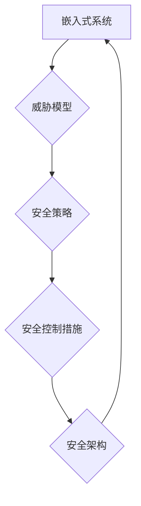

                 

## 嵌入式系统安全策略：保护设备和数据完整性

> 关键词：嵌入式系统、安全策略、设备完整性、数据完整性、威胁模型、安全认证、代码安全、漏洞检测、安全更新、硬件安全、软件安全、安全架构

### 1. 背景介绍

嵌入式系统无处不在，从智能家居设备到工业控制系统，再到医疗设备，它们控制着我们生活的方方面面。然而，嵌入式系统的开放性和资源受限性也使其成为攻击者的目标。数据泄露、设备劫持和功能破坏等安全威胁日益严重，对个人隐私、财产安全和社会稳定构成重大挑战。

随着物联网（IoT）的快速发展，嵌入式系统的连接性不断增强，安全风险也随之扩大。攻击者可以利用网络漏洞入侵嵌入式系统，窃取敏感数据、控制设备行为，甚至造成物理危害。因此，建立有效的嵌入式系统安全策略至关重要，以保护设备和数据完整性。

### 2. 核心概念与联系

**2.1 嵌入式系统安全策略**

嵌入式系统安全策略是指针对嵌入式系统潜在安全威胁，制定的一系列安全措施和控制机制。其目标是确保嵌入式系统的可靠性、可用性和安全性，防止未经授权的访问、数据泄露和功能破坏。

**2.2 威胁模型**

威胁模型是识别和分析潜在安全威胁的一种方法。它通过描述攻击者的动机、能力和目标，以及系统自身的弱点，来构建一个潜在攻击场景。威胁模型有助于制定针对性的安全策略，并评估其有效性。

**2.3 安全控制措施**

安全控制措施是实现嵌入式系统安全策略的关键手段。常见的安全控制措施包括：

* **身份验证和授权:** 确保只有授权用户才能访问嵌入式系统和数据。
* **数据加密:** 对敏感数据进行加密，防止未经授权的访问和窃取。
* **代码安全:** 通过代码审查、静态分析和动态分析等手段，检测和修复代码中的安全漏洞。
* **漏洞检测和修复:** 定期进行漏洞扫描和安全测试，及时发现和修复系统中的安全漏洞。
* **安全更新:** 及时发布安全补丁，修复已知的漏洞。
* **硬件安全:** 利用硬件安全机制，例如安全芯片和加密模块，增强系统的安全性。

**2.4 安全架构**

安全架构是指嵌入式系统安全策略的总体设计和实现方案。它定义了安全控制措施的部署方式、数据流的控制机制以及安全事件的处理流程。

**Mermaid 流程图**



### 3. 核心算法原理 & 具体操作步骤

**3.1 算法原理概述**

嵌入式系统安全策略的实施需要多种算法和技术支持，例如：

* **哈希算法:** 用于数据完整性验证，确保数据未被篡改。
* **加密算法:** 用于保护敏感数据，防止未经授权的访问。
* **数字签名算法:** 用于身份验证和数据源验证，确保数据的真实性和完整性。
* **密码学协议:** 用于安全通信，防止数据在传输过程中被窃取或篡改。

**3.2 算法步骤详解**

以哈希算法为例，其具体操作步骤如下：

1. **数据输入:** 将需要验证的数据输入到哈希算法中。
2. **哈希计算:** 算法对数据进行一系列复杂的数学运算，生成一个唯一的哈希值。
3. **哈希值存储:** 将生成的哈希值存储在安全的地方，例如数据库或存储芯片。
4. **数据验证:** 当需要验证数据完整性时，将数据再次输入到哈希算法中，计算新的哈希值。
5. **比较哈希值:** 将新计算的哈希值与存储的哈希值进行比较，如果一致则表明数据未被篡改。

**3.3 算法优缺点**

哈希算法具有以下优点：

* **不可逆性:** 难以从哈希值恢复原始数据，保证数据安全。
* **唯一性:** 即使数据仅有一点点变化，生成的哈希值也会完全不同，保证数据完整性。
* **效率高:** 哈希算法计算速度快，适合用于大量数据的验证。

但哈希算法也存在一些缺点：

* **碰撞风险:** 虽然哈希算法具有唯一性，但碰撞风险仍然存在，即不同的数据可能生成相同的哈希值。
* **不可撤销性:** 一旦数据被哈希，无法恢复原始数据，需要谨慎使用。

**3.4 算法应用领域**

哈希算法广泛应用于以下领域：

* **数据完整性验证:** 用于确保文件、数据库和软件代码的完整性。
* **密码学:** 用于密码散列、数字签名和加密算法。
* **网络安全:** 用于数据传输安全、身份验证和访问控制。

### 4. 数学模型和公式 & 详细讲解 & 举例说明

**4.1 数学模型构建**

嵌入式系统安全策略可以抽象为一个数学模型，其中：

* **状态空间:** 包含所有可能的系统状态，例如设备运行状态、数据状态和安全状态。
* **转移函数:** 描述系统状态如何随时间推移而变化，受外部事件和内部逻辑的影响。
* **观察函数:** 描述系统如何向外部提供信息，例如设备状态、数据输出和安全事件。
* **控制策略:** 描述如何根据系统状态和观察信息，采取相应的控制措施来维护系统安全。

**4.2 公式推导过程**

可以利用概率论和统计学方法，推导系统安全性的数学公式，例如：

* **安全概率:** 描述系统在特定时间段内保持安全状态的概率。
* **攻击成功率:** 描述攻击者成功入侵系统的概率。
* **安全成本:** 描述维护系统安全所需的成本，包括硬件、软件、人员和运营成本。

**4.3 案例分析与讲解**

例如，可以利用数学模型分析一个嵌入式设备的网络安全风险。通过构建状态空间、转移函数和观察函数，可以模拟不同攻击场景，并计算攻击成功率和安全成本。根据分析结果，可以制定相应的安全策略，例如加强网络防火墙、加密数据传输和定期更新安全补丁。

### 5. 项目实践：代码实例和详细解释说明

**5.1 开发环境搭建**

嵌入式系统安全策略的开发环境通常包括：

* **嵌入式开发板:** 用于运行和测试嵌入式系统代码。
* **交叉编译工具链:** 用于将高层语言代码编译成嵌入式系统可执行文件。
* **调试工具:** 用于调试嵌入式系统代码。
* **安全测试工具:** 用于检测和修复嵌入式系统安全漏洞。

**5.2 源代码详细实现**

以下是一个简单的嵌入式系统代码示例，演示了如何使用哈希算法验证数据完整性：

```c
#include <stdio.h>
#include <string.h>
#include <openssl/sha.h>

int main() {
    char data[] = "This is a test message.";
    unsigned char hash[SHA256_DIGEST_LENGTH];

    // 计算哈希值
    SHA256_CTX sha256;
    SHA256_Init(&sha256);
    SHA256_Update(&sha256, data, strlen(data));
    SHA256_Final(hash, &sha256);

    // 打印哈希值
    printf("Hash value: ");
    for (int i = 0; i < SHA256_DIGEST_LENGTH; i++) {
        printf("%02x", hash[i]);
    }
    printf("\n");

    return 0;
}
```

**5.3 代码解读与分析**

这段代码使用 OpenSSL 库中的 SHA256 算法计算数据哈希值。

1. `SHA256_Init(&sha256)` 初始化 SHA256 算法上下文。
2. `SHA256_Update(&sha256, data, strlen(data))` 将数据更新到算法上下文。
3. `SHA256_Final(hash, &sha256)` 计算哈希值并存储到 `hash` 数组中。
4. 最后，代码打印出哈希值。

**5.4 运行结果展示**

运行这段代码后，会输出一个 32 位的十六进制哈希值，代表数据 `This is a test message.` 的哈希值。

### 6. 实际应用场景

嵌入式系统安全策略在各个领域都有广泛的应用场景：

* **工业控制系统:** 保护工业控制系统的安全性和可靠性，防止恶意攻击导致设备故障或安全事故。
* **医疗设备:** 保护患者数据安全和医疗设备功能完整性，防止医疗事故发生。
* **汽车电子系统:** 保护汽车电子系统的安全性和可靠性，防止车辆被劫持或功能被破坏。
* **智能家居设备:** 保护智能家居设备的数据安全和隐私，防止设备被黑客入侵或控制。

**6.4 未来应用展望**

随着物联网和人工智能技术的快速发展，嵌入式系统安全策略将面临新的挑战和机遇。未来，嵌入式系统安全策略将更加注重：

* **人工智能驱动的安全:** 利用人工智能技术，实现更加智能和主动的安全防御。
* **边缘计算的安全:** 保护边缘计算设备的安全性和数据隐私。
* **量子计算的安全:** 研究量子计算对嵌入式系统安全的影响，并开发相应的安全解决方案。

### 7. 工具和资源推荐

**7.1 学习资源推荐**

* **书籍:**
    * 《嵌入式系统安全》
    * 《网络安全基础》
    * 《密码学原理与实践》
* **在线课程:**
    * Coursera: 嵌入式系统安全
    * edX: 网络安全
    * Udemy: 密码学

**7.2 开发工具推荐**

* **嵌入式开发板:** STM32、ESP32、Raspberry Pi
* **交叉编译工具链:** GCC、Clang
* **调试工具:** GDB、JTAG
* **安全测试工具:** OWASP ZAP、Metasploit

**7.3 相关论文推荐**

* **IEEE Transactions on Dependable and Secure Computing:** 发表嵌入式系统安全领域的最新研究成果。
* **ACM Transactions on Information and System Security:** 发表网络安全和密码学领域的最新研究成果。

### 8. 总结：未来发展趋势与挑战

**8.1 研究成果总结**

近年来，嵌入式系统安全策略研究取得了显著进展，包括：

* **安全架构设计:** 提出了一系列安全架构设计方案，例如微内核架构、分层安全架构和可信计算架构。
* **安全算法研究:** 开发了多种新的安全算法，例如轻量级加密算法、高效的哈希算法和基于生物特征的认证算法。
* **安全测试技术:** 发展了多种安全测试技术，例如代码静态分析、动态分析和漏洞扫描。

**8.2 未来发展趋势**

未来，嵌入式系统安全策略将朝着以下方向发展：

* **更加智能化:** 利用人工智能技术，实现更加智能和主动的安全防御。
* **更加可信赖:** 基于可信计算技术，构建更加可信赖的嵌入式系统安全体系。
* **更加协同化:** 促进嵌入式系统安全策略与其他安全领域之间的协同发展。

**8.3 面临的挑战**

嵌入式系统安全策略也面临着一些挑战：

* **资源受限:** 嵌入式系统资源有限，需要开发更加轻量级的安全算法和解决方案。
* **复杂性增加:** 随着嵌入式系统的复杂性不断增加，安全策略的制定和实施也更加复杂。
* **安全威胁不断演变:** 攻击者不断开发新的攻击手段，需要不断更新和改进安全策略。

**8.4 研究展望**

未来，需要进一步研究以下问题：

* 如何开发更加高效、安全且轻量级的嵌入式系统安全算法？
* 如何构建更加智能、可信赖和协同的嵌入式系统安全体系？
* 如何应对不断演变的安全威胁，并及时更新和改进安全策略？


### 9. 附录：常见问题与解答

**9.1 如何选择合适的嵌入式系统安全策略？**

选择合适的嵌入式系统安全策略需要根据系统的具体需求和环境进行评估。需要考虑以下因素：

* **系统的安全等级:** 不同的系统对安全等级的要求不同，需要选择相应的安全策略。
* **系统的资源限制:** 嵌入式系统资源有限，需要选择轻量级的安全策略。
* **系统的功能需求:** 不同的系统功能需求不同，需要选择相应的安全策略。

**9.2 如何评估嵌入式系统安全策略的有效性？**

评估嵌入式系统安全策略的有效性需要进行安全测试和评估。常见的安全测试方法包括：

* **代码静态分析:** 分析代码中的安全漏洞。
* **动态分析:** 运行代码并观察其行为，检测安全漏洞。
* **漏洞扫描:** 使用工具扫描系统中的漏洞。

**9.3 如何维护嵌入式系统安全策略的有效性？**

维护嵌入式系统安全策略的有效性需要定期进行以下工作：

* **更新安全补丁:** 及时发布安全补丁，修复已知的漏洞。
* **进行安全测试:** 定期进行安全测试，评估系统安全状况。
* **更新安全策略:** 根据最新的安全威胁和技术发展，更新安全策略。


作者：禅与计算机程序设计艺术 / Zen and the Art of Computer Programming<end_of_turn>

