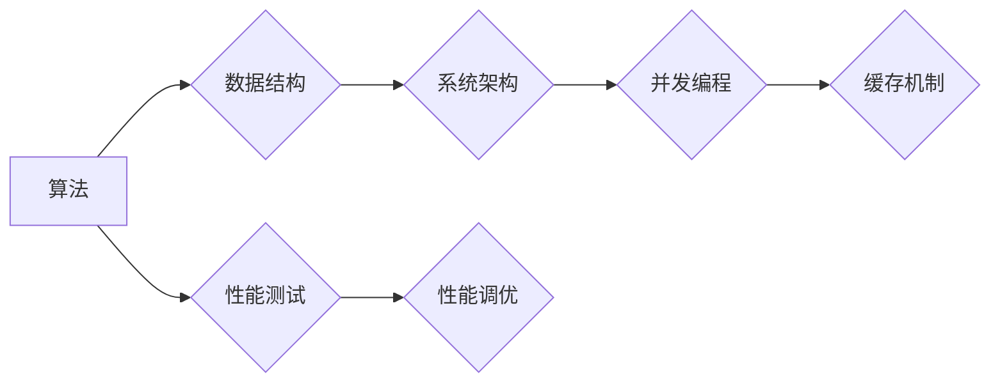

                 

## 性能优化技术：从算法到系统层面

> 关键词：性能优化、算法分析、数据结构、系统架构、并发编程、缓存机制、性能测试、性能调优

## 1. 背景介绍

在当今以数据为中心的时代，软件系统面临着日益增长的性能需求。用户期望应用程序能够快速响应，流畅运行，并能够处理海量数据。性能优化已成为软件开发中不可或缺的一部分，它直接影响着用户体验、业务效率和系统稳定性。

传统的软件开发模式往往侧重于功能实现，而忽略了性能方面的考虑。随着应用程序规模和复杂度的不断增加，性能问题逐渐凸显，成为制约软件发展的重要瓶颈。因此，深入理解性能优化技术，掌握从算法到系统层面的优化方法，对于构建高性能、可靠的软件系统至关重要。

## 2. 核心概念与联系

性能优化涉及多个层次和领域，包括算法、数据结构、系统架构、并发编程、缓存机制等。这些概念相互关联，共同影响着软件系统的整体性能。

**Mermaid 流程图：**

**核心概念原理和架构：**

* **算法：** 算法是解决特定问题的步骤或规则，其效率直接影响着程序的运行速度。选择合适的算法可以显著提高性能。
* **数据结构：** 数据结构是用于存储和组织数据的特定方式，不同的数据结构具有不同的时间复杂度和空间复杂度，选择合适的结构可以优化数据访问和操作效率。
* **系统架构：** 系统架构决定了软件系统的整体结构和组件之间的关系，合理的架构设计可以提高系统的可扩展性和性能。
* **并发编程：** 并发编程是指多个任务同时执行，可以有效利用多核处理器，提高系统的吞吐量和响应速度。
* **缓存机制：** 缓存机制将经常访问的数据存储在高速缓存中，减少数据访问时间，提高程序性能。
* **性能测试：** 性能测试是评估软件系统性能的关键环节，通过模拟真实负载，可以发现性能瓶颈并进行优化。
* **性能调优：** 性能调优是指根据性能测试结果，对软件系统进行调整和优化，以提高其性能。

## 3. 核心算法原理 & 具体操作步骤

### 3.1  算法原理概述

算法分析是性能优化的基础，它通过时间复杂度和空间复杂度来衡量算法的效率。时间复杂度表示算法执行所需的时间与输入数据规模的关系，空间复杂度表示算法执行所需内存空间与输入数据规模的关系。

常见的算法时间复杂度包括：

* **O(1)：** 常数时间复杂度，执行时间与输入数据规模无关。
* **O(log n)：** 对数时间复杂度，执行时间随输入数据规模的增加而增长缓慢。
* **O(n)：** 线性时间复杂度，执行时间与输入数据规模成正比。
* **O(n log n)：** 对数线性时间复杂度，例如快速排序算法。
* **O(n^2)：** 平方时间复杂度，例如冒泡排序算法。
* **O(2^n)：** 指数时间复杂度，例如暴力破解算法。

### 3.2  算法步骤详解

选择合适的算法取决于具体问题和数据规模。例如，对于小规模数据，暴力破解算法可能足够高效，但对于大规模数据，则需要选择时间复杂度更低的算法，例如快速排序算法。

### 3.3  算法优缺点

每个算法都有其优缺点，需要根据实际情况进行权衡。例如，快速排序算法的时间复杂度为O(n log n)，但其空间复杂度较高，而冒泡排序算法的时间复杂度为O(n^2)，但其空间复杂度较低。

### 3.4  算法应用领域

不同的算法适用于不同的应用领域。例如，深度学习算法广泛应用于图像识别、自然语言处理等领域，而搜索算法则应用于搜索引擎、数据库等领域。

## 4. 数学模型和公式 & 详细讲解 & 举例说明

### 4.1  数学模型构建

数学模型可以用来描述算法的性能特征，例如时间复杂度和空间复杂度。

### 4.2  公式推导过程

时间复杂度和空间复杂度通常用大O符号表示，例如O(n)表示时间复杂度为线性时间复杂度。

### 4.3  案例分析与讲解

通过分析具体的算法例子，可以更深入地理解时间复杂度和空间复杂度的含义。例如，冒泡排序算法的时间复杂度为O(n^2)，因为其需要进行n-1次循环，每次循环都需要比较n-i个元素，其中i为循环次数。

## 5. 项目实践：代码实例和详细解释说明

### 5.1  开发环境搭建

选择合适的开发环境，例如Java、Python、C++等，并安装必要的工具和库。

### 5.2  源代码详细实现

根据具体的算法和需求，编写源代码实现算法的功能。

### 5.3  代码解读与分析

对代码进行详细解读，分析其逻辑结构、时间复杂度和空间复杂度。

### 5.4  运行结果展示

运行代码并观察其性能表现，例如执行时间、内存占用等。

## 6. 实际应用场景

### 6.1  搜索引擎

搜索引擎需要快速检索海量数据，因此需要使用高效的算法，例如二分查找算法、倒排索引算法等。

### 6.2  数据库

数据库需要高效地存储、检索和更新数据，因此需要使用高效的数据结构，例如B树、哈希表等。

### 6.3  电商平台

电商平台需要处理大量的商品信息和用户订单，因此需要使用高效的算法和数据结构，例如商品推荐算法、订单处理算法等。

### 6.4  未来应用展望

随着人工智能、大数据等技术的不断发展，性能优化技术将面临新的挑战和机遇。例如，需要开发更有效的算法和数据结构，以应对海量数据和复杂计算的需求。

## 7. 工具和资源推荐

### 7.1  学习资源推荐

* 《算法导论》
* 《深入理解计算机系统》
* 《性能优化》

### 7.2  开发工具推荐

* JProfiler
* YourKit
* VisualVM

### 7.3  相关论文推荐

* 《The Art of Computer Programming》
* 《Introduction to Algorithms》

## 8. 总结：未来发展趋势与挑战

### 8.1  研究成果总结

性能优化技术已经取得了显著的成果，例如高效的算法、数据结构和系统架构设计。

### 8.2  未来发展趋势

未来性能优化技术将朝着以下方向发展：

* **自动化性能优化：** 利用人工智能和机器学习技术，自动识别和解决性能瓶颈。
* **云原生性能优化：** 针对云计算环境，开发新的性能优化方法和工具。
* **边缘计算性能优化：** 针对边缘计算场景，优化算法和数据结构，以适应有限的资源约束。

### 8.3  面临的挑战

性能优化技术面临着以下挑战：

* **复杂性不断增加：** 软件系统越来越复杂，性能优化变得更加困难。
* **资源约束越来越严格：** 随着移动设备和物联网的普及，资源约束越来越严格。
* **用户需求不断变化：** 用户对性能的要求越来越高。

### 8.4  研究展望

未来需要继续深入研究性能优化技术，开发更有效的算法、数据结构和系统架构设计，以应对不断变化的软件开发环境和用户需求。

## 9. 附录：常见问题与解答

### 9.1  常见问题

* 如何选择合适的算法？
* 如何进行性能测试？
* 如何进行性能调优？

### 9.2  解答

* 选择合适的算法取决于具体问题和数据规模。
* 性能测试可以利用工具模拟真实负载，发现性能瓶颈。
* 性能调优可以根据测试结果，对代码进行优化，例如选择更合适的算法、数据结构和系统架构。

作者：禅与计算机程序设计艺术 / Zen and the Art of Computer Programming 
<end_of_turn>

