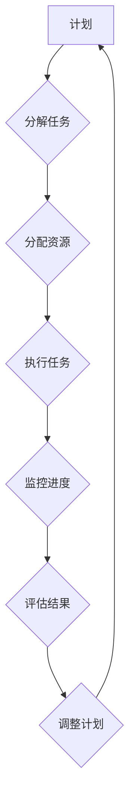

                 

## 执行力：从计划到结果的桥梁

> 关键词：执行力、软件开发、项目管理、算法、流程优化、效率提升、敏捷开发、代码质量

## 1. 背景介绍

在瞬息万变的科技时代，拥有雄心壮志的计划和构思已经远远不够。真正能够将想法转化为现实成果的关键在于执行力。对于软件开发领域而言，执行力尤为重要。一个完美的软件设计方案，如果没有有效的执行，最终只能沦为纸上谈兵。

软件开发项目复杂多变，涉及到团队协作、技术难题、时间压力等诸多因素。如何有效地管理这些因素，确保项目按计划顺利推进，最终交付高质量的软件产品，这正是执行力所要解决的关键问题。

## 2. 核心概念与联系

执行力可以理解为将计划转化为实际行动并取得预期的结果的能力。它是一个多维度的概念，包含了以下几个关键要素：

* **目标设定:** 明确、可衡量、可实现、相关和有时间限制的目标是执行力的基础。
* **计划制定:** 将目标分解成可执行的步骤，并制定相应的计划和时间表。
* **行动执行:** 按照计划，高效地完成每一个步骤，并及时调整计划以应对突发情况。
* **结果评估:** 定期评估执行情况，分析成功和失败的原因，并不断改进执行方法。

**Mermaid 流程图:**



## 3. 核心算法原理 & 具体操作步骤

### 3.1  算法原理概述

在软件开发领域，执行力可以看作是一个复杂的算法，它需要根据不同的项目情况，选择合适的算法策略和执行步骤。

常见的执行力算法包括：

* **敏捷开发:** 强调迭代开发、快速反馈和持续改进，适合快速变化的项目环境。
* **看板方法:** 通过看板来可视化工作流程，帮助团队成员了解项目进度和瓶颈，提高执行效率。
* **番茄工作法:** 将工作时间划分为25分钟的间隔，并进行短时间的休息，提高专注力和效率。

### 3.2  算法步骤详解

**以敏捷开发为例，其核心步骤如下:**

1. **需求分析:** 团队与客户共同分析需求，并将其分解成可管理的 User Story。
2. **迭代规划:** 根据需求，团队制定迭代计划，确定每个迭代的目标和任务。
3. **开发和测试:** 团队成员按照计划进行开发和测试，并定期进行代码审查和测试演示。
4. **回顾和改进:** 每个迭代结束后，团队进行回顾，分析成功和失败的原因，并改进后续迭代的计划和执行方法。

### 3.3  算法优缺点

**敏捷开发算法的优点:**

* 适应性强，能够快速应对项目需求的变化。
* 提高了团队协作和沟通效率。
* 能够更快地获得用户反馈，并进行迭代改进。

**敏捷开发算法的缺点:**

* 需要团队成员具备较高的自律性和沟通能力。
* 对于大型复杂项目，可能需要更复杂的管理机制。

### 3.4  算法应用领域

敏捷开发算法广泛应用于软件开发领域，尤其适合于快速迭代、需求变化频繁的项目。

## 4. 数学模型和公式 & 详细讲解 & 举例说明

### 4.1  数学模型构建

执行力可以抽象为一个数学模型，其中涉及到时间、资源、效率等多个变量。

**时间:** 项目完成所需的时间，可以表示为 T。

**资源:** 项目所需的资源，可以表示为 R。

**效率:** 团队执行任务的效率，可以表示为 E。

**执行力:** 可以表示为执行力 = T/R * E。

### 4.2  公式推导过程

该公式的推导过程如下:

* **时间:** 项目完成所需的时间 T 是一个固定的值，取决于项目复杂度和任务数量。
* **资源:** 项目所需的资源 R 包括人力、物力、财力等，这些资源的数量和质量都会影响执行效率。
* **效率:** 团队执行任务的效率 E 是一个动态变化的变量，受团队成员能力、沟通协作、工具支持等因素影响。

### 4.3  案例分析与讲解

假设一个软件开发项目需要 100 个工作日完成，所需资源包括 5 名开发人员、2 名测试人员和一定的硬件设备。

如果团队的效率为 80%，则执行力为：

执行力 = 100 / (5 + 2) * 0.8 = 100 / 7 * 0.8 = 11.43

这个数值代表了团队在该项目中的执行力水平。

## 5. 项目实践：代码实例和详细解释说明

### 5.1  开发环境搭建

为了更好地展示执行力算法的应用，我们可以使用一个简单的项目案例进行实践。

假设我们要开发一个简单的任务管理应用程序，该应用程序可以帮助用户创建、管理和完成任务。

为了搭建开发环境，我们可以使用以下工具：

* **编程语言:** Python
* **框架:** Django
* **数据库:** PostgreSQL

### 5.2  源代码详细实现

以下是一些简单的代码示例，展示了如何使用 Django 框架开发任务管理应用程序：

```python
# models.py
from django.db import models

class Task(models.Model):
    title = models.CharField(max_length=200)
    description = models.TextField()
    completed = models.BooleanField(default=False)

# views.py
from django.shortcuts import render
from .models import Task

def task_list(request):
    tasks = Task.objects.all()
    return render(request, 'task_list.html', {'tasks': tasks})

# urls.py
from django.urls import path
from . import views

urlpatterns = [
    path('', views.task_list, name='task_list'),
]
```

### 5.3  代码解读与分析

* **models.py:** 定义了任务模型，包含任务标题、描述和完成状态等字段。
* **views.py:** 定义了任务列表视图，用于展示所有任务。
* **urls.py:** 定义了 URL 路由，将 URL 请求映射到相应的视图函数。

### 5.4  运行结果展示

运行上述代码后，我们可以访问 http://127.0.0.1:8000/，看到一个简单的任务列表页面。

## 6. 实际应用场景

### 6.1  软件开发项目

在软件开发项目中，执行力是决定项目成功与否的关键因素。

* **需求管理:** 明确需求，并将其分解成可执行的任务。
* **任务分配:** 将任务分配给合适的团队成员。
* **进度跟踪:** 定期跟踪任务进度，并及时发现和解决问题。
* **代码质量:** 确保代码质量，并进行定期代码审查。

### 6.2  产品迭代

对于产品迭代项目，执行力可以帮助团队更快地获得用户反馈，并进行迭代改进。

* **快速原型:** 快速开发原型，并进行用户测试。
* **迭代开发:** 将产品开发分成多个迭代周期，并在每个周期结束后进行用户反馈和改进。
* **持续发布:** 定期发布新版本，并收集用户反馈。

### 6.3  个人效率提升

即使是个人工作，执行力也是提高效率的关键。

* **目标设定:** 明确个人目标，并将其分解成可执行的步骤。
* **时间管理:** 合理安排时间，并避免拖延。
* **专注力:** 提高专注力，避免分心。
* **习惯养成:** 养成良好的工作习惯，例如每天制定计划、定期回顾等。

### 6.4  未来应用展望

随着人工智能技术的不断发展，执行力算法将会更加智能化和自动化。

* **智能任务分配:** 基于人工智能算法，智能分配任务，提高资源利用率。
* **自动代码审查:** 使用人工智能技术自动审查代码，提高代码质量。
* **预测风险:** 利用机器学习算法预测项目风险，并采取相应的措施。

## 7. 工具和资源推荐

### 7.1  学习资源推荐

* **书籍:** 《执行力：从计划到结果的桥梁》
* **网站:** 
    * https://www.atlassian.com/agile/agile-methodologies
    * https://www.kanbanize.com/
    * https://www.pomodorotechnique.com/

### 7.2  开发工具推荐

* **版本控制系统:** Git
* **项目管理工具:** Jira, Trello
* **代码编辑器:** VS Code, Sublime Text

### 7.3  相关论文推荐

* **The Agile Manifesto**
* **Kanban: Successful Evolutionary Change for Your Technology Business**
* **The Pomodoro Technique: The Acclaimed Time-Management System**

## 8. 总结：未来发展趋势与挑战

### 8.1  研究成果总结

本文探讨了执行力在软件开发领域的应用，并介绍了常见的执行力算法、数学模型和实践案例。

### 8.2  未来发展趋势

未来，执行力算法将会更加智能化和自动化，并与人工智能技术深度融合。

### 8.3  面临的挑战

* **数据获取和分析:** 构建有效的执行力算法需要大量的数据支持，如何获取和分析这些数据是一个挑战。
* **算法复杂度:** 复杂的项目环境需要更加复杂的执行力算法，如何设计和实现这些算法是一个技术难题。
* **团队协作:** 执行力算法的应用需要团队成员的积极参与和配合，如何提高团队协作效率是一个关键问题。

### 8.4  研究展望

未来，我们将继续研究执行力算法的优化和改进，并将其应用于更广泛的领域，例如项目管理、产品开发、个人效率提升等。

## 9. 附录：常见问题与解答

**Q1: 如何提高团队的执行力？**

**A1:** 提高团队执行力需要从多个方面入手，例如：

* 明确目标和任务
* 优化沟通协作机制
* 提高团队成员的技能水平
* 建立有效的激励机制

**Q2: 如何评估执行力的水平？**

**A2:** 执行力的评估可以从多个维度进行，例如：

* 项目进度完成率
* 任务完成效率
* 代码质量
* 用户满意度

**Q3: 执行力算法的应用范围有哪些？**

**A3:** 执行力算法的应用范围非常广泛，包括：

* 软件开发项目
* 产品迭代
* 个人效率提升
* 项目管理
* 等等

作者：禅与计算机程序设计艺术 / Zen and the Art of Computer Programming


<end_of_turn>

