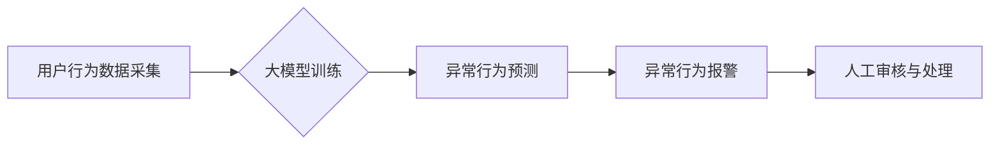

                 

## 关键词：大模型，电商平台，用户行为序列，异常检测，推荐系统，自然语言处理，深度学习

## 1. 背景介绍

在当今数据爆炸的时代，电商平台积累了海量用户行为数据，这些数据蕴含着丰富的商业价值。用户行为序列分析，即对用户在电商平台上进行的浏览、搜索、购买等一系列行为进行分析，已成为电商平台优化用户体验、提高转化率、精准营销的重要手段之一。然而，随着用户行为的复杂性和多样性不断增加，传统的基于规则或统计模型的用户行为异常检测方法逐渐难以满足需求。

大模型，作为近年来人工智能领域取得突破性进展的代表，凭借其强大的学习能力和泛化能力，在自然语言处理、图像识别等领域展现出巨大的潜力。本文将探讨大模型在电商平台用户行为序列异常检测中的应用潜力，分析其优势、挑战以及未来发展趋势。

## 2. 核心概念与联系

### 2.1 用户行为序列

用户行为序列是指用户在电商平台上进行的一系列交互行为，例如：

* **浏览行为**: 用户访问商品页面、分类页面等。
* **搜索行为**: 用户在搜索框中输入关键词进行商品搜索。
* **加入购物车行为**: 用户将商品添加到购物车中。
* **购买行为**: 用户完成商品购买。
* **评价行为**: 用户对商品进行评价和评分。

这些行为序列通常具有时间依赖性，即用户在特定时间段内进行的行为会影响其后续的行为。

### 2.2 异常检测

异常检测是指从正常数据集中识别出与众不同的数据点，这些数据点可能代表着异常事件或潜在风险。在电商平台中，异常检测可以用于识别以下类型的问题：

* **欺诈行为**: 虚假账户、刷单、恶意评论等。
* **恶意攻击**: DDoS攻击、SQL注入等。
* **用户异常**: 账号被盗用、用户行为异常等。

### 2.3 大模型

大模型是指参数量巨大、训练数据量庞大的深度学习模型。近年来，随着计算能力和训练数据的不断提升，大模型在自然语言处理、计算机视觉、语音识别等领域取得了突破性进展。

大模型的优势在于：

* **强大的学习能力**: 大模型可以学习到更复杂的模式和关系。
* **良好的泛化能力**: 大模型可以应用于不同的任务和领域。
* **可解释性提升**: 随着大模型研究的深入，其可解释性也在不断提升。

**大模型在电商平台用户行为序列异常检测中的应用流程:**



## 3. 核心算法原理 & 具体操作步骤

### 3.1 算法原理概述

大模型在用户行为序列异常检测中的应用主要基于以下算法原理：

* **序列建模**: 利用循环神经网络（RNN）或Transformer等模型，学习用户行为序列的潜在结构和规律。
* **异常值识别**: 通过训练好的模型，对用户的行为序列进行预测，并将预测结果与实际行为进行比较，识别出与预测结果相差较大的行为序列，即异常行为。

### 3.2 算法步骤详解

1. **数据预处理**: 收集用户行为数据，进行清洗、格式化和特征提取。
2. **模型选择**: 根据具体应用场景选择合适的序列建模模型，例如LSTM、GRU或BERT等。
3. **模型训练**: 使用训练数据训练模型，并通过交叉验证等方法进行模型评估和调参。
4. **异常行为预测**: 将训练好的模型应用于新的用户行为序列，预测其未来行为。
5. **异常值识别**: 将预测结果与实际行为进行比较，识别出异常行为。
6. **结果分析**: 对识别出的异常行为进行分析，并采取相应的措施。

### 3.3 算法优缺点

**优点**:

* **高准确率**: 大模型可以学习到更复杂的模式和关系，提高异常行为检测的准确率。
* **自动化程度高**: 大模型可以自动识别异常行为，减少人工干预。
* **可扩展性强**: 大模型可以应用于海量用户行为数据，满足电商平台的规模化需求。

**缺点**:

* **训练成本高**: 大模型的训练需要大量的计算资源和训练数据。
* **可解释性差**: 大模型的决策过程较为复杂，难以解释其识别异常行为的依据。
* **数据依赖性强**: 大模型的性能取决于训练数据的质量和数量。

### 3.4 算法应用领域

大模型在电商平台用户行为序列异常检测中的应用领域广泛，例如：

* **欺诈检测**: 识别虚假账户、刷单、恶意评论等欺诈行为。
* **风险控制**: 识别用户账号被盗用、交易风险等潜在风险。
* **用户画像**: 建立用户行为画像，为个性化推荐和精准营销提供支持。
* **运营优化**: 分析用户行为趋势，优化电商平台运营策略。

## 4. 数学模型和公式 & 详细讲解 & 举例说明

### 4.1 数学模型构建

大模型在用户行为序列异常检测中的应用通常基于以下数学模型：

* **循环神经网络 (RNN)**: RNN是一种能够处理序列数据的深度学习模型，其核心结构是循环单元，能够捕捉序列中的时间依赖性。

* **Transformer**: Transformer是一种基于注意力机制的序列建模模型，能够更有效地处理长序列数据，并具有更好的并行化能力。

### 4.2 公式推导过程

由于篇幅限制，此处不再详细推导RNN和Transformer的数学公式。

### 4.3 案例分析与讲解

假设我们想要检测用户在电商平台上进行刷单行为。我们可以使用RNN模型训练一个分类器，将用户行为序列分为“正常”和“刷单”两类。

训练数据包括用户的浏览、搜索、加入购物车和购买行为序列，以及对应的标签（正常或刷单）。模型通过学习用户行为序列的特征，并根据这些特征预测用户行为的类别。

当模型训练完成后，我们可以将其应用于新的用户行为序列，预测其是否属于刷单行为。如果模型预测结果为“刷单”，则可以将该用户行为序列标记为异常行为，并采取相应的措施。

## 5. 项目实践：代码实例和详细解释说明

### 5.1 开发环境搭建

* Python 3.6+
* TensorFlow/PyTorch
* Jupyter Notebook

### 5.2 源代码详细实现

```python
# 使用TensorFlow构建一个简单的RNN模型
import tensorflow as tf

# 定义模型结构
model = tf.keras.Sequential([
    tf.keras.layers.Embedding(input_dim=vocab_size, output_dim=embedding_dim),
    tf.keras.layers.LSTM(units=128),
    tf.keras.layers.Dense(units=1, activation='sigmoid')
])

# 编译模型
model.compile(optimizer='adam', loss='binary_crossentropy', metrics=['accuracy'])

# 训练模型
model.fit(x_train, y_train, epochs=10, batch_size=32)

# 预测异常行为
predictions = model.predict(x_test)
```

### 5.3 代码解读与分析

* **Embedding层**: 将用户行为序列中的每个词转换为稠密的向量表示。
* **LSTM层**: 学习用户行为序列的潜在结构和规律。
* **Dense层**: 将LSTM层的输出映射到0到1之间的概率值，表示用户行为序列是否属于异常行为。

### 5.4 运行结果展示

训练完成后，我们可以使用测试数据评估模型的性能，例如计算准确率、召回率等指标。

## 6. 实际应用场景

大模型在电商平台用户行为序列异常检测中的应用场景广泛，例如：

* **欺诈检测**: 识别虚假账户、刷单、恶意评论等欺诈行为。
* **风险控制**: 识别用户账号被盗用、交易风险等潜在风险。
* **用户画像**: 建立用户行为画像，为个性化推荐和精准营销提供支持。
* **运营优化**: 分析用户行为趋势，优化电商平台运营策略。

## 7. 工具和资源推荐

### 7.1 学习资源推荐

* **书籍**:
    * 深度学习
    * 自然语言处理
* **在线课程**:
    * Coursera
    * edX
    * fast.ai

### 7.2 开发工具推荐

* **TensorFlow**: 开源深度学习框架
* **PyTorch**: 开源深度学习框架
* **Jupyter Notebook**: 交互式编程环境

### 7.3 相关论文推荐

* **BERT**: Pre-training of Deep Bidirectional Transformers for Language Understanding
* **GPT-3**: Language Models are Few-Shot Learners
* **Transformer**: Attention Is All You Need

## 8. 总结：未来发展趋势与挑战

### 8.1 研究成果总结

大模型在电商平台用户行为序列异常检测领域展现出巨大的潜力，能够提高异常行为检测的准确率和自动化程度。

### 8.2 未来发展趋势

* **模型架构创新**: 研究更强大的序列建模模型，例如基于Transformer的改进型模型。
* **数据增强**: 开发新的数据增强技术，提高训练数据的质量和数量。
* **解释性增强**: 研究大模型的可解释性，提高其决策过程的透明度。
* **跨模态融合**: 将文本、图像、音频等多模态数据融合到用户行为序列异常检测模型中，提高检测的准确性和鲁棒性。

### 8.3 面临的挑战

* **计算资源**: 大模型的训练需要大量的计算资源，这对于中小企业来说是一个挑战。
* **数据隐私**: 大模型的训练需要使用大量用户数据，如何保护用户隐私是一个重要的伦理问题。
* **可解释性**: 大模型的决策过程较为复杂，难以解释其识别异常行为的依据，这可能会导致模型的信任度降低。

### 8.4 研究展望

未来，大模型在电商平台用户行为序列异常检测领域将继续发挥重要作用，并推动该领域的进一步发展。


## 9. 附录：常见问题与解答

### 9.1 如何选择合适的序列建模模型？

选择合适的序列建模模型需要根据具体应用场景和数据特点进行考虑。例如，对于短序列数据，RNN模型可能是一个不错的选择；而对于长序列数据，Transformer模型可能更适合。

### 9.2 如何处理用户行为序列中的缺失数据？

缺失数据处理是序列建模模型训练中的一个重要问题。常用的处理方法包括：

* 使用平均值或众数填充缺失值。
* 使用机器学习模型预测缺失值。
* 使用特殊的标记表示缺失值。

### 9.3 如何评估大模型在用户行为序列异常检测中的性能？

常用的评估指标包括：

* **准确率**: 正确识别异常行为的比例。
* **召回率**: 识别出所有异常行为的比例。
* **F1-score**: 准确率和召回率的调和平均值。

作者：禅与计算机程序设计艺术 / Zen and the Art of Computer Programming


<end_of_turn>

