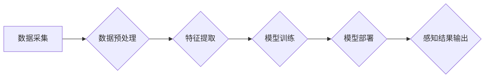

                 

##  数字化第六感开发包设计师：AI辅助的超感知能力培养专家

> 关键词：数字化第六感、AI辅助、超感知能力、开发包、感知模型、数据分析、机器学习、深度学习、应用场景

### 1. 背景介绍

在当今数据爆炸的时代，人类面临着信息过载的挑战。传统感知方式已经难以有效地处理海量数据，并从中提取有价值的信息。因此，开发一种新的感知方式，帮助人类突破信息获取和处理的瓶颈，显得尤为重要。

数字化第六感，作为一种新兴的概念，旨在通过人工智能技术，赋予人类超越传统感知能力的超感知能力。它利用机器学习、深度学习等算法，对海量数据进行分析和处理，并将其转化为人类能够理解的洞察和知识。

### 2. 核心概念与联系

数字化第六感开发包的设计，旨在提供一套完整的工具和框架，帮助开发者构建和部署AI辅助的超感知能力系统。

**核心概念：**

* **数字化第六感：** 指通过人工智能技术，扩展人类感知能力，使其能够感知和理解超越传统五感的信息。
* **AI辅助：** 指利用人工智能算法，辅助人类进行感知、分析和决策。
* **超感知能力：** 指超越人类传统感知能力，能够感知更细微、更复杂的信息。
* **开发包：** 指提供一组预先构建的工具、组件和接口，方便开发者快速构建和部署数字化第六感系统。

**核心架构：**



**核心联系：**

数字化第六感开发包的设计，将数据采集、预处理、特征提取、模型训练、模型部署和感知结果输出等环节紧密结合，形成一个完整的闭环系统。

### 3. 核心算法原理 & 具体操作步骤

#### 3.1  算法原理概述

数字化第六感开发包的核心算法原理基于机器学习和深度学习技术。

* **机器学习：** 通过训练模型，使模型能够从数据中学习规律，并对新的数据进行预测或分类。
* **深度学习：** 是一种更高级的机器学习方法，利用多层神经网络，能够学习更复杂的特征和模式。

#### 3.2  算法步骤详解

1. **数据采集：** 收集与目标感知任务相关的原始数据。
2. **数据预处理：** 对采集到的数据进行清洗、转换和格式化，使其适合模型训练。
3. **特征提取：** 从原始数据中提取有价值的特征，这些特征能够反映目标感知任务的关键信息。
4. **模型训练：** 利用机器学习或深度学习算法，训练模型，使其能够将特征映射到感知结果。
5. **模型评估：** 使用测试数据评估模型的性能，并根据评估结果进行模型调优。
6. **模型部署：** 将训练好的模型部署到实际应用环境中，使其能够实时处理新的数据。
7. **感知结果输出：** 模型对新数据进行处理后，输出感知结果，并将其转化为人类能够理解的形式。

#### 3.3  算法优缺点

**优点：**

* **高精度：** 深度学习算法能够学习更复杂的特征，从而提高感知精度。
* **自动化：** 模型训练和部署过程可以自动化，降低人工成本。
* **可扩展性：** 数字化第六感开发包可以根据需要扩展，支持多种感知任务。

**缺点：**

* **数据依赖：** 模型性能取决于训练数据的质量和数量。
* **计算资源需求：** 深度学习模型训练需要大量的计算资源。
* **解释性：** 深度学习模型的决策过程难以解释，这可能会导致信任问题。

#### 3.4  算法应用领域

数字化第六感开发包可以应用于多个领域，例如：

* **医疗诊断：** 利用图像识别技术，辅助医生诊断疾病。
* **金融风险控制：** 利用异常检测技术，识别金融风险。
* **智能制造：** 利用传感器数据分析，优化生产流程。
* **智能家居：** 利用语音识别和图像识别技术，实现智能家居控制。

### 4. 数学模型和公式 & 详细讲解 & 举例说明

#### 4.1  数学模型构建

数字化第六感开发包的核心数学模型通常基于神经网络架构。

* **感知层：** 接收原始数据，并将其转换为神经元激活值。
* **隐藏层：** 对神经元激活值进行非线性变换，学习数据中的特征。
* **输出层：** 将隐藏层输出结果映射到感知结果。

#### 4.2  公式推导过程

神经网络的训练过程基于梯度下降算法，其目标是最小化模型预测结果与真实结果之间的误差。

* **损失函数：** 用于衡量模型预测结果与真实结果之间的误差。常见的损失函数包括均方误差（MSE）和交叉熵损失（Cross-Entropy Loss）。
* **梯度下降：** 通过迭代更新模型参数，逐步减小损失函数的值。

#### 4.3  案例分析与讲解

例如，在图像识别任务中，可以使用卷积神经网络（CNN）作为核心模型。CNN能够学习图像中的特征，并将其映射到不同的类别标签。

* **卷积层：** 用于提取图像的局部特征。
* **池化层：** 用于降低图像尺寸，并提取图像的全局特征。
* **全连接层：** 用于将提取的特征映射到类别标签。

### 5. 项目实践：代码实例和详细解释说明

#### 5.1  开发环境搭建

* **操作系统：** Linux或macOS
* **编程语言：** Python
* **深度学习框架：** TensorFlow或PyTorch
* **其他工具：** Jupyter Notebook、Git

#### 5.2  源代码详细实现

以下是一个简单的图像分类示例代码，使用TensorFlow框架实现：

```python
import tensorflow as tf

# 定义模型结构
model = tf.keras.models.Sequential([
    tf.keras.layers.Conv2D(32, (3, 3), activation='relu', input_shape=(28, 28, 1)),
    tf.keras.layers.MaxPooling2D((2, 2)),
    tf.keras.layers.Conv2D(64, (3, 3), activation='relu'),
    tf.keras.layers.MaxPooling2D((2, 2)),
    tf.keras.layers.Flatten(),
    tf.keras.layers.Dense(10, activation='softmax')
])

# 编译模型
model.compile(optimizer='adam',
              loss='sparse_categorical_crossentropy',
              metrics=['accuracy'])

# 训练模型
model.fit(x_train, y_train, epochs=5)

# 评估模型
loss, accuracy = model.evaluate(x_test, y_test)
print('Test loss:', loss)
print('Test accuracy:', accuracy)
```

#### 5.3  代码解读与分析

* **模型结构：** 该代码定义了一个简单的卷积神经网络模型，包含两层卷积层、两层池化层、一层全连接层和一层输出层。
* **模型编译：** 使用Adam优化器、稀疏类别交叉熵损失函数和准确率作为评估指标，编译模型。
* **模型训练：** 使用训练数据训练模型，训练epochs设置为5。
* **模型评估：** 使用测试数据评估模型的性能，输出测试损失和测试准确率。

#### 5.4  运行结果展示

运行该代码后，会输出模型的训练过程和测试结果。

### 6. 实际应用场景

数字化第六感开发包可以应用于多个实际场景，例如：

* **医疗诊断辅助：** 利用图像识别技术，辅助医生诊断疾病，例如癌症、心血管疾病等。
* **金融风险控制：** 利用异常检测技术，识别金融风险，例如欺诈交易、洗钱等。
* **智能制造：** 利用传感器数据分析，优化生产流程，例如预测设备故障、控制生产质量等。
* **智能家居：** 利用语音识别和图像识别技术，实现智能家居控制，例如控制灯光、空调、家电等。

#### 6.4  未来应用展望

随着人工智能技术的不断发展，数字化第六感开发包的应用场景将更加广泛。

* **个性化医疗：** 根据患者的基因信息、生活习惯等数据，提供个性化的医疗建议和治疗方案。
* **精准农业：** 利用传感器数据分析，优化农业生产，例如精准施肥、精准灌溉等。
* **智慧城市：** 利用传感器数据分析，优化城市管理，例如交通管理、环境监测等。

### 7. 工具和资源推荐

#### 7.1  学习资源推荐

* **书籍：**
    * 深度学习
    * 人工智能：一种现代方法
* **在线课程：**
    * Coursera深度学习课程
    * Udacity人工智能工程师课程

#### 7.2  开发工具推荐

* **深度学习框架：** TensorFlow、PyTorch
* **数据处理工具：** Pandas、NumPy
* **可视化工具：** Matplotlib、Seaborn

#### 7.3  相关论文推荐

* **深度学习论文：**
    * ImageNet Classification with Deep Convolutional Neural Networks
    * Attention Is All You Need
* **数字化第六感论文：**
    * Towards a Framework for Digital Sixth Sense

### 8. 总结：未来发展趋势与挑战

#### 8.1  研究成果总结

数字化第六感开发包的设计，为人类赋予了超越传统感知能力的超感知能力，并为多个领域带来了新的应用场景。

#### 8.2  未来发展趋势

* **模型精度提升：** 通过更复杂的模型架构和更丰富的训练数据，进一步提升模型精度。
* **跨模态感知：** 将不同模态的数据融合，实现跨模态感知，例如图像、语音、文本等。
* **边缘计算：** 将模型部署到边缘设备，实现实时感知和决策。

#### 8.3  面临的挑战

* **数据安全和隐私：** 数字化第六感系统需要处理大量敏感数据，因此数据安全和隐私保护是一个重要的挑战。
* **模型解释性：** 深度学习模型的决策过程难以解释，这可能会导致信任问题。
* **伦理问题：** 数字化第六感技术的应用可能会带来一些伦理问题，例如算法偏见、就业影响等。

#### 8.4  研究展望

未来，数字化第六感开发包的研究将继续深入，探索更先进的算法、更广泛的应用场景和更完善的伦理规范。


### 9. 附录：常见问题与解答

* **Q：数字化第六感开发包需要哪些技术基础？**

A：开发数字化第六感系统需要一定的编程基础，以及对机器学习和深度学习算法的了解。

* **Q：数字化第六感开发包的成本如何？**

A：数字化第六感开发包的成本取决于其功能和复杂度，以及所使用的硬件和软件资源。

* **Q：数字化第六感开发包的安全性如何？**

A：数字化第六感开发包的安全性取决于其设计和部署方式，需要采取相应的安全措施，例如数据加密、身份验证等。


作者：禅与计算机程序设计艺术 / Zen and the Art of Computer Programming 
<end_of_turn>

