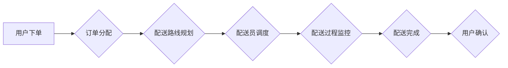

                 

## 末端配送创业：解决最后一公里难题

> 关键词：末端配送、最后一公里、物流优化、算法设计、人工智能、机器学习、配送机器人

### 1. 背景介绍

末端配送，即从配送中心到最终消费者的最后一公里，是整个物流链条中最为复杂、成本最高的环节。随着电商和外卖行业的快速发展，末端配送的需求量呈指数级增长，如何高效、便捷、经济地解决最后一公里难题成为了摆在物流企业面前的重大挑战。

传统末端配送模式主要依靠人力配送，存在效率低、成本高、服务质量不稳定等问题。随着科技的进步，人工智能、机器学习、自动驾驶等新技术逐渐应用于末端配送领域，为解决最后一公里难题提供了新的思路和解决方案。

### 2. 核心概念与联系

末端配送的核心在于优化配送路线和配送方式，提高配送效率和用户体验。

**2.1 核心概念**

* **配送路线优化:**  根据订单信息、配送员位置、道路状况等因素，计算出最优的配送路线，以缩短配送时间和距离，降低配送成本。
* **配送方式选择:**  根据订单类型、配送距离、用户需求等因素，选择合适的配送方式，例如步行配送、骑车配送、汽车配送、无人机配送等。
* **智能调度:**  利用人工智能算法，实时监控配送员状态、订单情况、交通状况等信息，动态调整配送计划，提高配送效率和灵活性。

**2.2 架构图**



### 3. 核心算法原理 & 具体操作步骤

**3.1 算法原理概述**

末端配送路线优化算法通常采用启发式算法或混合算法，例如：

* **遗传算法:**  模拟自然选择机制，通过迭代优化路线，找到最优解。
* **模拟退火算法:**  从一个初始解出发，随机改变路线，接受更优解，接受劣解的概率随温度降低而降低，最终收敛到局部最优解。
* **蚁群算法:**  模拟蚂蚁寻找食物的路径选择机制，通过蚂蚁在路径上的信息素留下和更新，找到最优路径。

**3.2 算法步骤详解**

以遗传算法为例，其具体步骤如下：

1. **编码:** 将配送路线编码为染色体，例如使用整数表示每个节点的顺序。
2. **初始化种群:** 生成初始种群，每个个体代表一个可能的配送路线。
3. **适应度评估:** 计算每个个体的适应度，例如配送时间、配送距离、配送成本等。
4. **选择:** 根据适应度选择部分个体进行交叉和变异。
5. **交叉:** 将两个父代个体进行交叉操作，生成两个子代个体。
6. **变异:** 对子代个体进行随机变异操作，增加算法的探索能力。
7. **更新种群:** 将新生成的子代个体加入种群，淘汰部分低适应度个体。
8. **重复步骤3-7:** 重复上述步骤，直到达到终止条件，例如最大迭代次数或最佳适应度达到目标值。

**3.3 算法优缺点**

* **优点:** 能够找到较好的解，并具有较强的鲁棒性。
* **缺点:** 算法复杂度较高，计算时间较长，难以保证找到全局最优解。

**3.4 算法应用领域**

* **物流配送:**  优化配送路线，提高配送效率和降低成本。
* **城市交通:**  规划公交线路，优化交通流量。
* **资源分配:**  分配资源到不同地点，例如医疗资源、消防资源等。

### 4. 数学模型和公式 & 详细讲解 & 举例说明

**4.1 数学模型构建**

末端配送路线优化问题可以建模为一个图论问题，其中：

* 节点代表配送地点，例如配送中心、用户地址等。
* 边代表配送路径，边权代表路径长度或时间。

目标是找到从配送中心到所有用户地址的最小路径总长度或时间。

**4.2 公式推导过程**

常用的算法，例如 Dijkstra 算法，可以用来求解最小路径问题。Dijkstra 算法的核心思想是：

1. 从起点开始，逐步探索所有可达节点。
2. 对于每个节点，记录其到起点的最短路径长度。
3. 选择距离起点最短的节点，并将其标记为已访问。
4. 重复步骤2-3，直到所有节点都被访问。

**4.3 案例分析与讲解**

假设有三个配送地点 A、B、C，以及两个用户地址 D、E，路径长度如下：

* A到B: 5
* A到C: 3
* B到D: 2
* B到E: 4
* C到D: 1
* C到E: 3

使用 Dijkstra 算法，可以找到从配送中心 A 到所有用户地址的最小路径总长度：

* A到D: A->C->D (3+1=4)
* A到E: A->C->E (3+3=6)

### 5. 项目实践：代码实例和详细解释说明

**5.1 开发环境搭建**

* 操作系统: Ubuntu 20.04
* 编程语言: Python 3.8
* 库依赖: NetworkX, matplotlib

**5.2 源代码详细实现**

```python
import networkx as nx
import matplotlib.pyplot as plt

# 定义图的节点和边
graph = nx.Graph()
graph.add_edge('A', 'B', weight=5)
graph.add_edge('A', 'C', weight=3)
graph.add_edge('B', 'D', weight=2)
graph.add_edge('B', 'E', weight=4)
graph.add_edge('C', 'D', weight=1)
graph.add_edge('C', 'E', weight=3)

# 使用 Dijkstra 算法求解最短路径
shortest_paths = nx.dijkstra_path(graph, source='A', target='D')
print(f"最短路径: {shortest_paths}")

# 绘制图
nx.draw(graph, with_labels=True, node_color='skyblue', node_size=500, font_size=10)
plt.show()
```

**5.3 代码解读与分析**

* 使用 NetworkX 库构建图模型，定义节点和边的关系。
* 使用 Dijkstra 算法求解从节点 A 到节点 D 的最短路径。
* 使用 matplotlib 库绘制图，可视化配送路线。

**5.4 运行结果展示**

运行代码后，将输出最短路径信息，并绘制出配送路线图。

### 6. 实际应用场景

末端配送创业公司可以利用上述算法和技术，解决实际的配送难题，例如：

* **快速配送:**  优化配送路线，缩短配送时间，满足用户对快速配送的需求。
* **智能调度:**  利用人工智能算法，动态调整配送计划，提高配送效率和灵活性。
* **成本控制:**  优化配送路线和配送方式，降低配送成本，提高盈利能力。

**6.4 未来应用展望**

随着人工智能、机器学习、自动驾驶等技术的不断发展，末端配送将更加智能化、自动化。未来，末端配送场景可能出现以下趋势：

* **无人配送:**  无人机、无人车等自动驾驶车辆将承担部分配送任务，提高配送效率和安全性。
* **个性化配送:**  根据用户的需求和偏好，提供个性化的配送服务，例如指定配送时间、配送地点等。
* **绿色配送:**  利用电动车、自行车等绿色交通工具，减少碳排放，实现绿色配送。

### 7. 工具和资源推荐

**7.1 学习资源推荐**

* **书籍:**
    * 《物流优化算法》
    * 《人工智能算法导论》
* **在线课程:**
    * Coursera:  机器学习
    * edX:  物流管理

**7.2 开发工具推荐**

* **编程语言:** Python
* **库依赖:** NetworkX, matplotlib, TensorFlow, PyTorch

**7.3 相关论文推荐**

* **论文:**
    * 《基于遗传算法的末端配送路线优化研究》
    * 《深度强化学习在末端配送中的应用》

### 8. 总结：未来发展趋势与挑战

**8.1 研究成果总结**

末端配送创业领域的研究成果表明，利用人工智能、机器学习等技术，可以有效解决末端配送的难题，提高配送效率和用户体验。

**8.2 未来发展趋势**

末端配送将朝着智能化、自动化、个性化、绿色化方向发展，无人配送、个性化配送、绿色配送将成为未来发展趋势。

**8.3 面临的挑战**

末端配送创业还面临着一些挑战，例如：

* **技术复杂性:**  末端配送涉及多个领域的技术，例如人工智能、机器学习、自动驾驶等，技术复杂性较高。
* **数据安全:**  末端配送需要收集和处理大量用户数据，数据安全问题需要得到重视。
* **政策法规:**  末端配送的政策法规尚不完善，需要政府部门进一步完善相关政策法规。

**8.4 研究展望**

未来，末端配送创业领域的研究方向将包括：

* **更先进的算法:**  开发更先进的算法，例如深度强化学习算法，提高配送效率和智能化水平。
* **更安全的技术:**  研究更安全的技术，例如数据加密技术、身份验证技术，保障用户数据安全。
* **更完善的政策法规:**  推动政府部门完善相关政策法规，为末端配送创业提供更好的发展环境。

### 9. 附录：常见问题与解答

**9.1 如何选择合适的配送方式？**

配送方式的选择需要根据订单类型、配送距离、用户需求等因素综合考虑。例如，对于短距离配送，可以选择步行配送或骑车配送；对于长距离配送，可以选择汽车配送或无人机配送。

**9.2 如何提高配送效率？**

可以通过优化配送路线、智能调度、使用自动化技术等方式提高配送效率。

**9.3 如何保障用户数据安全？**

可以通过数据加密技术、身份验证技术等方式保障用户数据安全。


作者：禅与计算机程序设计艺术 / Zen and the Art of Computer Programming 
<end_of_turn>

