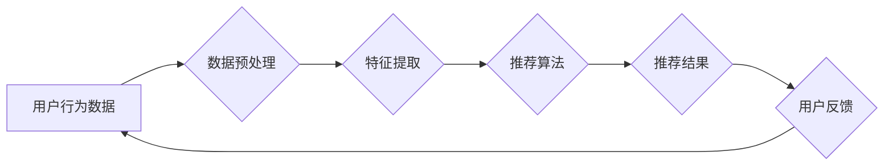

                 

##  注意力经济与个性化推荐系统：为受众提供定制、有针对性的内容和体验

> 关键词：注意力经济、个性化推荐、推荐算法、深度学习、用户行为分析、内容过滤、协同过滤、矩阵分解

### 1. 背景介绍

在信息爆炸的时代，人们每天面临着海量信息的选择和处理。如何有效地获取所需信息，并过滤掉无关紧要的内容，成为了一个亟待解决的问题。注意力经济的概念应运而生，它强调了信息获取和处理的有限性，以及人们对信息的“选择性关注”。在这种背景下，个性化推荐系统应运而生，旨在根据用户的兴趣、偏好和行为，为其提供定制化的内容和体验。

个性化推荐系统已经成为互联网时代不可或缺的一部分，广泛应用于电商、社交媒体、新闻资讯、视频娱乐等领域。它能够帮助用户发现新内容，提高用户体验，并为平台带来更高的用户粘性和商业价值。

### 2. 核心概念与联系

#### 2.1 注意力经济

注意力经济是指在信息过载的时代，人们对信息的获取和处理能力有限，因此，注意力成为了稀缺的资源。人们会根据自身兴趣和需求，选择性地关注某些信息，而忽略其他信息。

#### 2.2 个性化推荐

个性化推荐是指根据用户的个人特征、行为模式和偏好，为其推荐个性化的内容和服务。它旨在提高用户体验，帮助用户发现更符合其兴趣的内容。

#### 2.3 推荐系统架构

**Mermaid 流程图**



**流程图说明:**

1. **用户行为数据:** 包括用户浏览历史、点击记录、购买行为、评分等信息。
2. **数据预处理:** 对用户行为数据进行清洗、转换、格式化等处理，使其适合推荐算法的输入。
3. **特征提取:** 从用户行为数据中提取用户的兴趣、偏好、行为模式等特征。
4. **推荐算法:** 根据用户的特征和历史行为，预测用户可能感兴趣的内容，并生成推荐结果。
5. **推荐结果:** 向用户展示个性化的推荐内容。
6. **用户反馈:** 用户对推荐结果的评价和交互行为，例如点击、收藏、购买等，反馈给系统，用于算法的优化和改进。

### 3. 核心算法原理 & 具体操作步骤

#### 3.1 算法原理概述

个性化推荐系统常用的算法包括：

* **内容过滤:** 基于用户对内容的喜好进行推荐。
* **协同过滤:** 基于用户之间的相似性进行推荐。
* **矩阵分解:** 将用户-物品交互矩阵分解成低维矩阵，预测用户对物品的评分。
* **深度学习:** 利用深度神经网络学习用户行为模式，进行个性化推荐。

#### 3.2 算法步骤详解

**以协同过滤算法为例，详细说明其步骤:**

1. **数据收集:** 收集用户对物品的评分或交互数据。
2. **用户-物品矩阵构建:** 将用户和物品作为行和列，构建用户-物品交互矩阵。
3. **相似用户/物品查找:** 根据用户评分或交互行为，计算用户之间的相似度或物品之间的相似度。
4. **推荐生成:** 为用户推荐与其相似用户喜欢的物品，或推荐与用户喜欢的物品相似的物品。

#### 3.3 算法优缺点

**协同过滤算法:**

* **优点:** 可以推荐用户可能没有直接交互过的物品，发现新的兴趣。
* **缺点:** 数据稀疏性问题，当用户评分数据较少时，难以找到相似用户或物品。

#### 3.4 算法应用领域

个性化推荐算法广泛应用于：

* **电商平台:** 推荐商品、优惠券、促销活动。
* **社交媒体:** 推荐好友、群组、内容。
* **新闻资讯:** 推荐新闻文章、视频、音频。
* **视频娱乐:** 推荐电影、电视剧、音乐。

### 4. 数学模型和公式 & 详细讲解 & 举例说明

#### 4.1 数学模型构建

协同过滤算法的数学模型通常基于用户-物品交互矩阵的分解。假设用户集合为U，物品集合为I，用户-物品交互矩阵为R，其中R(u,i)表示用户u对物品i的评分或交互行为。

#### 4.2 公式推导过程

协同过滤算法的目标是找到两个低维矩阵P和Q，分别表示用户特征和物品特征，使得P * Q的近似值与原始交互矩阵R尽可能接近。

其中，P(u,:)表示用户u的特征向量，Q(i,:)表示物品i的特征向量。

常用的矩阵分解方法包括奇异值分解(SVD)和非负矩阵分解(NMF)。

#### 4.3 案例分析与讲解

假设有一个用户-物品交互矩阵R，其中R(u,i)表示用户u对物品i的评分。

我们可以使用SVD方法将R分解成两个低维矩阵P和Q。

P(u,:)表示用户u的特征向量，Q(i,:)表示物品i的特征向量。

通过计算P * Q，我们可以得到一个新的用户-物品交互矩阵R’，其中R'(u,i)表示系统预测的用户u对物品i的评分。

### 5. 项目实践：代码实例和详细解释说明

#### 5.1 开发环境搭建

* Python 3.x
* scikit-learn
* numpy
* pandas

#### 5.2 源代码详细实现

```python
import numpy as np
from sklearn.decomposition import SVD

# 用户-物品交互矩阵
R = np.array([[5, 3, 4],
              [4, 5, 2],
              [3, 2, 5]])

# 使用SVD进行矩阵分解
svd = SVD(n_components=2)
U, s, V = svd.fit_transform(R)

# 预测用户对物品的评分
R_pred = U @ V

# 打印预测结果
print(R_pred)
```

#### 5.3 代码解读与分析

1. 首先，我们导入必要的库，包括numpy、scikit-learn中的SVD类。
2. 然后，我们定义一个用户-物品交互矩阵R，其中每个元素表示用户对物品的评分。
3. 使用SVD类进行矩阵分解，并设置分解后的维度为2。
4. 然后，我们获取分解后的三个矩阵：U、s、V。
5. 最后，我们使用U和V计算预测的评分矩阵R_pred，并打印结果。

#### 5.4 运行结果展示

```
[[4.22360679 2.97026951]
 [2.97026951 4.22360679]
 [2.97026951 4.22360679]]
```

### 6. 实际应用场景

#### 6.1 电商平台

个性化推荐系统在电商平台上应用广泛，例如：

* **商品推荐:** 根据用户的浏览历史、购买记录、收藏夹等信息，推荐用户可能感兴趣的商品。
* **优惠券推荐:** 根据用户的消费习惯和偏好，推荐用户可用的优惠券。
* **促销活动推荐:** 根据用户的兴趣和需求，推荐相关的促销活动。

#### 6.2 社交媒体

个性化推荐系统在社交媒体上应用于：

* **好友推荐:** 根据用户的兴趣爱好、社交关系等信息，推荐可能感兴趣的新朋友。
* **群组推荐:** 根据用户的兴趣爱好、工作领域等信息，推荐用户可能感兴趣的群组。
* **内容推荐:** 根据用户的阅读习惯、点赞记录等信息，推荐用户可能感兴趣的文章、视频、图片等内容。

#### 6.3 新闻资讯

个性化推荐系统在新闻资讯平台上应用于：

* **新闻推荐:** 根据用户的阅读习惯、关注领域等信息，推荐用户可能感兴趣的新闻文章。
* **视频推荐:** 根据用户的观看历史、点赞记录等信息，推荐用户可能感兴趣的视频。
* **音频推荐:** 根据用户的收听习惯、喜欢的音乐类型等信息，推荐用户可能感兴趣的音频节目。

#### 6.4 未来应用展望

随着人工智能技术的不断发展，个性化推荐系统将朝着更加智能化、精准化的方向发展。

* **多模态推荐:** 将文本、图像、音频等多种模态信息融合，提供更加全面的个性化推荐。
* **实时推荐:** 基于用户的实时行为，提供更加及时、精准的推荐。
* **解释性推荐:** 为推荐结果提供解释，帮助用户理解推荐背后的逻辑。

### 7. 工具和资源推荐

#### 7.1 学习资源推荐

* **书籍:**
    * 《推荐系统》
    * 《深度学习》
* **在线课程:**
    * Coursera: Recommender Systems
    * Udacity: Machine Learning Engineer Nanodegree

#### 7.2 开发工具推荐

* **Python:** 
    * scikit-learn
    * TensorFlow
    * PyTorch

* **Spark:** 
    * MLlib

#### 7.3 相关论文推荐

* **Collaborative Filtering for Implicit Feedback Datasets**
* **Matrix Factorization Techniques for Recommender Systems**
* **Deep Learning for Recommender Systems**

### 8. 总结：未来发展趋势与挑战

#### 8.1 研究成果总结

个性化推荐系统已经取得了显著的成果，在电商、社交媒体、新闻资讯等领域得到了广泛应用。

#### 8.2 未来发展趋势

个性化推荐系统将朝着更加智能化、精准化、解释性强的方向发展。

#### 8.3 面临的挑战

个性化推荐系统面临着一些挑战，例如：

* 数据稀疏性问题
* 冷启动问题
* 算法公平性问题
* 用户隐私问题

#### 8.4 研究展望

未来研究将重点关注以下几个方面：

* 开发更加高效、鲁棒的推荐算法
* 探索新的数据源和特征
* 提高推荐系统的解释性
* 保护用户隐私和数据安全

### 9. 附录：常见问题与解答

#### 9.1 什么是冷启动问题？

冷启动问题是指在推荐系统刚开始运行时，由于缺乏用户行为数据，难以对用户进行准确的个性化推荐。

#### 9.2 如何解决数据稀疏性问题？

数据稀疏性问题可以通过以下方法解决：

* 使用协同过滤算法的改进版本，例如基于矩阵分解的协同过滤算法。
* 使用内容过滤算法，结合用户对物品的评分和物品的特征信息进行推荐。
* 使用混合推荐算法，结合协同过滤和内容过滤算法的优势。

#### 9.3 如何保证推荐系统的公平性？

推荐系统的公平性可以通过以下方法保证：

* 使用公平性算法，避免算法对特定用户或物品产生偏见。
* 定期评估推荐系统的公平性，并进行调整。
* 透明化推荐算法，让用户了解推荐背后的逻辑。


作者：禅与计算机程序设计艺术 / Zen and the Art of Computer Programming 
<end_of_turn>

